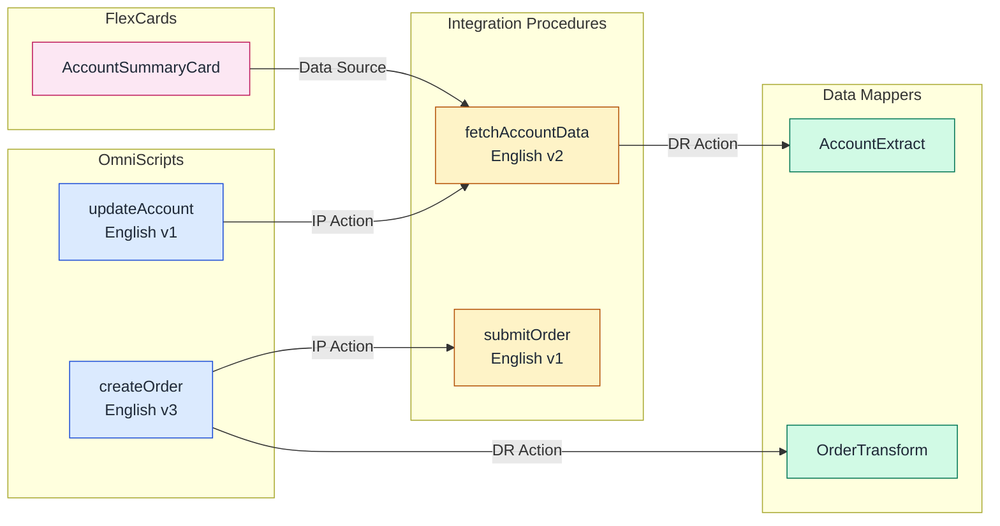

# activating-datacloud

---
name: activating-datacloud
description: "Salesforce Data Cloud Act phase. Use this skill when the user manages activations, activation targets, data actions, or downstream delivery of Data Cloud audiences and data. TRIGGER when: user manages activations, activation targets, data actions, or downstream delivery of Data Cloud audiences and data. DO NOT TRIGGER when: the task is segment creation (use segmenting-datacloud), data retrieval/search work (use retrieving-datacloud), or STDM/session tracing (use observing-agentforce)."
license: MIT
compatibility: "Requires an external community sf data360 CLI plugin and a Data Cloud-enabled org"
metadata:
  version: "1.0"
---

# activating-datacloud: Data Cloud Act Phase

Use this skill when the user needs **downstream delivery work**: activations, activation targets, data actions, or pushing Data Cloud outputs into other systems.

## When This Skill Owns the Task

Use `activating-datacloud` when the work involves:
- `sf data360 activation *`
- `sf data360 activation-target *`
- `sf data360 data-action *`
- `sf data360 data-action-target *`
- verifying downstream delivery setup

Delegate elsewhere when the user is:
- still building the audience or insight → [segmenting-datacloud](../segmenting-datacloud/SKILL.md)
- exploring query/search or search indexes → [retrieving-datacloud](../retrieving-datacloud/SKILL.md)
- setting up base connections or ingestion → [connecting-datacloud](../connecting-datacloud/SKILL.md), [preparing-datacloud](../preparing-datacloud/SKILL.md)

---

## Required Context to Gather First

Ask for or infer:
- target org alias
- destination platform or downstream system
- whether the segment already exists and is published
- whether the user needs create, inspect, update, or delete
- whether the task is activation-focused or data-action-focused

---

## Core Operating Rules

- Verify the upstream segment or insight is healthy before creating downstream delivery assets.
- Run the shared readiness classifier before mutating activation assets: `node ~/.claude/skills/orchestrating-datacloud/scripts/diagnose-org.mjs -o <org> --phase act --json`.
- Inspect available platforms and targets before mutating activation setup.
- Keep destination definitions deterministic and reusable where possible.
- Treat downstream credential and platform constraints as separate validation concerns.
- Prefer read-only inspection first when the destination state is unclear.

---

## Recommended Workflow

### 1. Classify readiness for act work
```bash
node ~/.claude/skills/orchestrating-datacloud/scripts/diagnose-org.mjs -o <org> --phase act --json
```

### 2. Inspect destinations first
```bash
sf data360 activation platforms -o <org> 2>/dev/null
sf data360 activation-target list -o <org> 2>/dev/null
sf data360 data-action-target list -o <org> 2>/dev/null
```

### 3. Create the destination before the activation
```bash
sf data360 activation-target create -o <org> -f target.json 2>/dev/null
sf data360 data-action-target create -o <org> -f target.json 2>/dev/null
```

### 4. Create the activation or data action
```bash
sf data360 activation create -o <org> -f activation.json 2>/dev/null
sf data360 data-action create -o <org> -f action.json 2>/dev/null
```

### 5. Verify downstream readiness
```bash
sf data360 activation list -o <org> 2>/dev/null
sf data360 activation data -o <org> --name <activation> 2>/dev/null
```

---

## High-Signal Gotchas

- Activation design depends on a healthy published upstream segment.
- Destination configuration usually comes before activation creation.
- Downstream credential and platform constraints may live outside the Data Cloud CLI alone.
- Read-only inspection is the safest first move when the destination setup is unclear.
- `CdpActivationTarget` or `CdpActivationExternalPlatform` means the activation surface is gated for the current org/user; guide the user toward activation setup, permissions, and destination configuration instead of retrying blindly.

---

## Output Format

```text
Act task: <activation / activation-target / data-action / data-action-target>
Destination: <platform or target>
Target org: <alias>
Artifacts: <definition files / commands>
Verification: <listed / created / blocked>
Next step: <destination validation or downstream testing>
```

---

## References

- [README.md](README.md)
- [../orchestrating-datacloud/assets/definitions/activation-target.template.json](../orchestrating-datacloud/assets/definitions/activation-target.template.json)
- [../orchestrating-datacloud/assets/definitions/activation.template.json](../orchestrating-datacloud/assets/definitions/activation.template.json)
- [../orchestrating-datacloud/assets/definitions/data-action-target.template.json](../orchestrating-datacloud/assets/definitions/data-action-target.template.json)
- [../orchestrating-datacloud/assets/definitions/data-action.template.json](../orchestrating-datacloud/assets/definitions/data-action.template.json)
- [../orchestrating-datacloud/UPSTREAM.md](../orchestrating-datacloud/UPSTREAM.md)
- [../orchestrating-datacloud/references/plugin-setup.md](../orchestrating-datacloud/references/plugin-setup.md)
- [../orchestrating-datacloud/references/feature-readiness.md](../orchestrating-datacloud/references/feature-readiness.md)

---

# analyzing-omnistudio-dependencies

---
name: analyzing-omnistudio-dependencies
description: "Cross-cutting OmniStudio analysis skill for namespace detection, dependency visualization, and impact analysis across OmniScripts, FlexCards, Integration Procedures, and Data Mappers. Use this skill to detect which OmniStudio namespace an org uses, build directed dependency graphs, perform impact analysis, and generate Mermaid diagrams of component relationships. TRIGGER when: user asks about OmniStudio dependencies, wants namespace detection (Core vs vlocity_cmt vs vlocity_ins), needs impact analysis, requests dependency diagrams, or asks which components are affected by a change. DO NOT TRIGGER when: authoring OmniScripts (use building-omnistudio-omniscript), building FlexCards (use building-omnistudio-flexcard), creating Integration Procedures (use building-omnistudio-integration-procedure), or configuring Data Mappers (use building-omnistudio-datamapper)."
license: MIT
metadata:
  version: "1.0"
---

# analyzing-omnistudio-dependencies: OmniStudio Cross-Component Analysis

Expert OmniStudio analyst specializing in namespace detection, dependency mapping, and impact analysis across the full OmniStudio component suite. Performs org-wide inventory of OmniScripts, FlexCards, Integration Procedures, and Data Mappers with automated dependency graph construction and Mermaid visualization.

---

## Scope

- **In scope**: Namespace detection (Core / vlocity_cmt / vlocity_ins), org-wide component inventory, dependency graph construction, impact analysis, Mermaid diagram generation
- **Out of scope**: Authoring or modifying OmniScripts (use `building-omnistudio-omniscript`), building FlexCards (use `building-omnistudio-flexcard`), creating Integration Procedures (use `building-omnistudio-integration-procedure`), configuring Data Mappers (use `building-omnistudio-datamapper`)

---

## Required Inputs

Ask for or infer before starting:

| Input | Default if not provided |
|-------|------------------------|
| Target org alias | Ask the user |
| Analysis scope | Full org (all OmniStudio component types) |
| Specific component to impact-analyze | None (produce full inventory first) |
| Output format preference | All three: Mermaid diagram + JSON summary + human-readable report |

---

## Output Expectations

Each analysis run produces one or more of:

1. **Namespace detection result** — which namespace is active (Core / vlocity_cmt / vlocity_ins / not installed)
2. **Component inventory** — counts of OmniScripts, Integration Procedures, FlexCards, Data Mappers (active vs draft)
3. **Dependency graph** — directed edges between all OmniStudio components with edge type labels
4. **Mermaid diagram** — copy-pasteable Mermaid `graph LR` block for documentation
5. **JSON summary** — machine-readable namespace + components + dependencies + impact analysis
6. **Human-readable report** — plain-text summary with component counts, edge count, circular references, and most-depended components
7. **Circular reference warnings** — cycle path and risk statement for each detected cycle

---

## Core Responsibilities

1. **Namespace Detection**: Identify whether an org uses Core (Industries), vlocity_cmt (Communications, Media & Energy), or vlocity_ins (Insurance & Health) namespace
2. **Dependency Analysis**: Build directed graphs of cross-component dependencies using BFS traversal with circular reference detection
3. **Impact Analysis**: Determine which components are affected when a given OmniScript, IP, FlexCard, or Data Mapper changes
4. **Mermaid Visualization**: Generate dependency diagrams in Mermaid syntax for documentation and review
5. **Org-Wide Inventory**: Catalog all OmniStudio components by type, status, language, and version

---

> **CRITICAL: Orchestration Order**
>
> When multiple OmniStudio skills are involved, follow this dependency chain:
>
> `analyzing-omnistudio-dependencies` → `building-omnistudio-datamapper` → `building-omnistudio-integration-procedure` → `building-omnistudio-omniscript` → `building-omnistudio-flexcard`
>
> This skill runs first to establish namespace context and dependency maps that downstream skills consume.

---

## Key Insights

| Insight | Detail |
|---------|--------|
| Three namespaces coexist | Core (OmniProcess), vlocity_cmt (vlocity_cmt__OmniScript__c), vlocity_ins (vlocity_ins__OmniScript__c) |
| Dependencies are stored in JSON | PropertySetConfig (elements), Definition (FlexCards), InputObjectName/OutputObjectName (Data Mappers) |
| Circular references are possible | OmniScript A → IP B → OmniScript A via embedded call |
| FlexCard data sources are typed | `dataSource.type === 'IntegrationProcedures'` (plural) in DataSourceConfig JSON |
| Active vs Draft matters | Only active components participate in runtime dependency chains |

---

## Workflow (4-Phase Pattern)

### Phase 1: Namespace Detection

**Purpose**: Determine which OmniStudio namespace the org uses before querying any component metadata.

**Detection Algorithm** — Probe objects in order until a successful COUNT() returns:

1. **Core (Industries namespace)**:
   ```soql
   SELECT COUNT() FROM OmniProcess
   ```
   If this succeeds, the org uses the Core namespace (API 234.0+ / Spring '22+).

2. **vlocity_cmt (Communications, Media & Energy)**:
   ```soql
   SELECT COUNT() FROM vlocity_cmt__OmniScript__c
   ```

3. **vlocity_ins (Insurance & Health)**:
   ```soql
   SELECT COUNT() FROM vlocity_ins__OmniScript__c
   ```

If none succeed, OmniStudio is not installed in the org.

**CLI Commands for namespace detection**:
```bash
# Core namespace probe
sf data query --query "SELECT COUNT() FROM OmniProcess" --target-org myorg --json 2>/dev/null

# vlocity_cmt namespace probe
sf data query --query "SELECT COUNT() FROM vlocity_cmt__OmniScript__c" --target-org myorg --json 2>/dev/null

# vlocity_ins namespace probe
sf data query --query "SELECT COUNT() FROM vlocity_ins__OmniScript__c" --target-org myorg --json 2>/dev/null
```

**Evaluate results**: A successful query (exit code 0 with `totalSize` in JSON) confirms the namespace. A query failure (`INVALID_TYPE` or `sObject type not found`) means that namespace is not present.

**See**: [references/namespace-guide.md](references/namespace-guide.md) for complete object/field mapping across all three namespaces.

---

### Phase 2: Component Discovery

**Purpose**: Build an inventory of all OmniStudio components in the org.

Using the detected namespace, query each component type:

**OmniScripts** (Core example — paginate with LIMIT/OFFSET for large orgs):
```soql
SELECT Id, Type, SubType, Language, IsActive, VersionNumber,
       PropertySetConfig, LastModifiedDate
FROM OmniProcess
WHERE IsIntegrationProcedure = false
ORDER BY Type, SubType, Language, VersionNumber DESC
LIMIT 200
```

**Integration Procedures** (Core example):
```soql
SELECT Id, Type, SubType, Language, IsActive, VersionNumber,
       PropertySetConfig, LastModifiedDate
FROM OmniProcess
WHERE IsIntegrationProcedure = true
ORDER BY Type, SubType, Language, VersionNumber DESC
LIMIT 200
```

**FlexCards** (Core example):
```soql
SELECT Id, Name, IsActive, DataSourceConfig, PropertySetConfig,
       AuthorName, LastModifiedDate
FROM OmniUiCard
ORDER BY Name
LIMIT 200
```

> **IMPORTANT**: The `OmniUiCard` object does NOT have a `Definition` field. Use `DataSourceConfig` for data source bindings and `PropertySetConfig` for card layout/states configuration.

**Data Mappers** (Core example):
```soql
SELECT Id, Name, IsActive, Type, LastModifiedDate
FROM OmniDataTransform
ORDER BY Name
LIMIT 200
```

**Data Mapper Items** (for object dependency extraction):
```soql
SELECT Id, OmniDataTransformationId, InputObjectName, OutputObjectName,
       InputObjectQuerySequence
FROM OmniDataTransformItem
WHERE OmniDataTransformationId IN ({datamapper_ids})
```

> **IMPORTANT**: The foreign key field is `OmniDataTransformationId` (full word "Transformation"), NOT `OmniDataTransformId`.

**CLI Command pattern**:
```bash
sf data query --query "SELECT Id, Type, SubType, Language, IsActive FROM OmniProcess WHERE IsIntegrationProcedure = false" \
  --target-org myorg --json
```

---

### Phase 3: Dependency Analysis

**Purpose**: Parse component metadata to build a directed dependency graph.

#### Algorithm: BFS with Circular Detection

```
1. Initialize empty graph G and visited set V
2. For each root component C:
   a. Enqueue C into work queue Q
   b. While Q is not empty:
      i.   Dequeue component X from Q
      ii.  If X is in V, record circular reference and skip
      iii. Add X to V
      iv.  Parse X's metadata for dependency references
      v.   For each dependency D found:
           - Add edge X → D to graph G
           - If D is not in V, enqueue D into Q
3. Return graph G and any circular references detected
```

#### Element Type → Dependency Extraction

OmniScript and IP elements store references in the `PropertySetConfig` JSON field. Parse each element to extract dependencies:

| Element Type | JSON Path in PropertySetConfig | Dependency Target |
|-------------|-------------------------------|-------------------|
| DataRaptor Transform Action | `bundle`, `bundleName` | Data Mapper (by name) |
| DataRaptor Turbo Action | `bundle`, `bundleName` | Data Mapper (by name) |
| Remote Action | `remoteClass`, `remoteMethod` | Apex Class.Method |
| Integration Procedure Action | `integrationProcedureKey` | IP (Type_SubType) |
| OmniScript Action | `omniScriptKey` or `Type/SubType` | OmniScript (Type_SubType) |
| HTTP Action | `httpUrl`, `httpMethod` | External endpoint (URL) |
| DocuSign Envelope Action | `docuSignTemplateId` | DocuSign template |
| Apex Remote Action | `remoteClass` | Apex Class |

**Parsing PropertySetConfig**:
```
For each OmniProcessElement:
  1. Read PropertySetConfig (JSON string)
  2. Parse JSON
  3. Check element.Type against extraction table
  4. Extract referenced component name/key
  5. Resolve reference to an OmniProcess/OmniDataTransform record
  6. Add edge: parent component → referenced component
```

#### FlexCard Data Source Parsing

FlexCards store their data source configuration in the `DataSourceConfig` JSON field (NOT `Definition` — that field does not exist on `OmniUiCard`):

```
Parse DataSourceConfig JSON:
  1. Access dataSource object (singular, not array)
  2. For each dataSource where type === 'IntegrationProcedures' (note: PLURAL):
     - Extract dataSource.value.ipMethod (IP Type_SubType)
     - Add edge: FlexCard → Integration Procedure
  3. For each dataSource where type === 'ApexRemote':
     - Extract dataSource.value.className
     - Add edge: FlexCard → Apex Class
  4. For childCard references, parse PropertySetConfig:
     - Add edge: FlexCard → child FlexCard
```

> **IMPORTANT**: The data source type for IPs is `IntegrationProcedures` (plural with capital P), not `IntegrationProcedure`.

#### Data Mapper Object Dependencies

Data Mappers reference Salesforce objects via their items:

```
For each OmniDataTransformItem:
  1. Read InputObjectName → source sObject
  2. Read OutputObjectName → target sObject
  3. Add edge: Data Mapper → sObject (read from InputObjectName)
  4. Add edge: Data Mapper → sObject (write to OutputObjectName)
```

**See**: [references/dependency-patterns.md](references/dependency-patterns.md) for complete dependency extraction rules and examples.

---

### Phase 4: Visualization & Reporting

**Purpose**: Generate human-readable output from the dependency graph.

#### Output Format 1: Mermaid Dependency Diagram



**Color scheme**:

| Component Type | Fill | Stroke |
|---------------|------|--------|
| OmniScript | `#dbeafe` (blue-100) | `#1d4ed8` (blue-700) |
| Integration Procedure | `#fef3c7` (amber-100) | `#b45309` (amber-700) |
| Data Mapper | `#d1fae5` (green-100) | `#047857` (green-700) |
| FlexCard | `#fce7f3` (pink-100) | `#be185d` (pink-700) |
| Apex Class | `#e9d5ff` (purple-100) | `#7c3aed` (purple-700) |
| External (HTTP) | `#f1f5f9` (slate-100) | `#475569` (slate-600) |

#### Output Format 2: JSON Summary

```json
{
  "namespace": "Core",
  "components": {
    "omniScripts": 12,
    "integrationProcedures": 8,
    "flexCards": 5,
    "dataMappers": 15
  },
  "dependencies": [
    { "from": "OS:createOrder", "to": "IP:submitOrder", "type": "IPAction" },
    { "from": "IP:fetchAccountData", "to": "DM:AccountExtract", "type": "DataRaptorAction" }
  ],
  "circularReferences": [],
  "impactAnalysis": {
    "DM:AccountExtract": {
      "directDependents": ["IP:fetchAccountData"],
      "transitiveDependents": ["OS:updateAccount", "FC:AccountSummaryCard"]
    }
  }
}
```

#### Output Format 3: Human-Readable Report

```
OmniStudio Dependency Report
=============================
Org Namespace: Core (Industries)
Scan Date: 2026-03-06

Component Inventory:
  OmniScripts:              12 (8 active, 4 draft)
  Integration Procedures:    8 (6 active, 2 draft)
  FlexCards:                  5 (5 active)
  Data Mappers:             15 (12 active, 3 draft)

Dependency Summary:
  Total edges:              23
  Circular references:       0
  Orphaned components:       2 (no inbound/outbound deps)

Impact Analysis (most-depended components):
  1. DM:AccountExtract       → 5 dependents
  2. IP:fetchAccountData     → 3 dependents
  3. DM:OrderTransform       → 2 dependents
```

---

## Namespace Object/Field Mapping

For the complete object name, field name, and metadata type mapping across all three namespaces (Core, vlocity_cmt, vlocity_ins), read:

**[references/namespace-guide.md](references/namespace-guide.md)**

Key discriminators to keep in mind:
- Core uses `OmniProcess` / `OmniUiCard` / `OmniDataTransform`
- vlocity_cmt uses `vlocity_cmt__OmniScript__c` / `vlocity_cmt__VlocityUITemplate__c` / `vlocity_cmt__DRBundle__c`
- vlocity_ins uses `vlocity_ins__OmniScript__c` / `vlocity_ins__VlocityUITemplate__c` / `vlocity_ins__DRBundle__c`
- The `IsIntegrationProcedure` boolean and `DataSourceConfig` (not `Definition`) field names are Core-only

---

## CLI Commands Reference

### Namespace Detection
```bash
# Probe all three namespaces (run sequentially, first success wins)
sf data query --query "SELECT COUNT() FROM OmniProcess" --target-org myorg --json 2>/dev/null && echo "CORE" || \
sf data query --query "SELECT COUNT() FROM vlocity_cmt__OmniScript__c" --target-org myorg --json 2>/dev/null && echo "VLOCITY_CMT" || \
sf data query --query "SELECT COUNT() FROM vlocity_ins__OmniScript__c" --target-org myorg --json 2>/dev/null && echo "VLOCITY_INS" || \
echo "NOT_INSTALLED"
```

### Component Inventory (Core Namespace)
```bash
# Count OmniScripts
sf data query --query "SELECT COUNT() FROM OmniProcess WHERE IsIntegrationProcedure = false" \
  --target-org myorg --json

# Count Integration Procedures
sf data query --query "SELECT COUNT() FROM OmniProcess WHERE IsIntegrationProcedure = true" \
  --target-org myorg --json

# Count FlexCards
sf data query --query "SELECT COUNT() FROM OmniUiCard" --target-org myorg --json

# Count Data Mappers
sf data query --query "SELECT COUNT() FROM OmniDataTransform" --target-org myorg --json
```

### Dependency Data Extraction (Core Namespace)
```bash
# Get OmniScript elements with their config
sf data query --query "SELECT Id, OmniProcessId, Name, Type, PropertySetConfig FROM OmniProcessElement WHERE OmniProcessId = '{process_id}'" \
  --target-org myorg --json

# Get FlexCard data sources (for dependency parsing)
sf data query --query "SELECT Id, Name, DataSourceConfig FROM OmniUiCard WHERE IsActive = true" \
  --target-org myorg --json

# Get Data Mapper items (for object dependencies)
sf data query --query "SELECT Id, OmniDataTransformationId, InputObjectName, OutputObjectName FROM OmniDataTransformItem" \
  --target-org myorg --json
```

---

## Cross-Skill Integration

| Skill | Relationship | How This Skill Helps |
|-------|-------------|---------------------|
| building-omnistudio-datamapper | Provides namespace and object dependency data | Data Mapper authoring uses detected namespace for correct API names |
| building-omnistudio-integration-procedure | Provides namespace and IP dependency map | IP authoring uses dependency graph to avoid circular references |
| building-omnistudio-omniscript | Provides namespace and element dependency data | OmniScript authoring uses namespace-correct field names |
| building-omnistudio-flexcard | Provides namespace and data source dependency map | FlexCard authoring uses detected IP references for validation |
| generating-mermaid-diagrams | Consumes dependency graph for visualization | This skill generates Mermaid output compatible with generating-mermaid-diagrams styling |
| generating-custom-object / generating-custom-field | Provides sObject metadata for Data Mapper analysis | Object field validation during dependency extraction |
| deploying-metadata | Deployment uses namespace-correct metadata types | This skill provides the correct metadata type names per namespace |

---

## Gotchas

| Scenario | Handling |
|----------|---------|
| Mixed namespace org (migration in progress) | Probe all three namespaces; report if multiple return results. Components may exist under both old and migrated namespaces. |
| Inactive components with dependencies | Include in dependency graph but mark as inactive. Warn if active component depends on inactive one. |
| Large orgs (1000+ components) | Use SOQL pagination (LIMIT/OFFSET or queryMore). Process in batches of 200. |
| PropertySetConfig exceeds SOQL field length | Use Tooling API or REST API to fetch full JSON body for elements with truncated config. |
| Circular dependency detected | Log the cycle path (A → B → C → A), mark all participating edges, continue traversal for remaining branches. |
| Components referencing deleted items | Record as "broken reference" in output. Flag for cleanup. |
| Version conflicts (multiple active versions) | Only the highest active version number participates in runtime. Warn if lower versions have unique dependencies. |

---

## Notes

- **Dependencies**: Requires `sf` CLI with org authentication. Optional: generating-mermaid-diagrams for styled visualization.
- **Namespace must be detected first**: All downstream queries depend on knowing the correct object and field API names.
- **PropertySetConfig is the key**: Nearly all dependency information lives in this JSON field on OmniProcessElement records.
- **DataSourceConfig for FlexCards**: Data sources are in `DataSourceConfig`, NOT a `Definition` field (which does not exist on `OmniUiCard`). Card layout/states are in `PropertySetConfig`.
- **Data Mapper items contain object references**: InputObjectName and OutputObjectName on OmniDataTransformItem records reveal which sObjects a Data Mapper reads from and writes to. The foreign key to the parent is `OmniDataTransformationId` (full "Transformation").
- **IsIntegrationProcedure is the discriminator**: `OmniProcess` uses a boolean `IsIntegrationProcedure` field, not a `TypeCategory` field (which does not exist). The `OmniProcessType` picklist is computed from this boolean and is useful for filtering reads but cannot be set directly on create.
- **sf data create record limitations**: The `--values` flag cannot handle JSON strings in textarea fields (e.g., PropertySetConfig). Use `sf api request rest --method POST --body @file.json` instead for records with JSON configuration.
- **Related skills**: `building-omnistudio-datamapper`, `building-omnistudio-integration-procedure`, `building-omnistudio-omniscript`, `building-omnistudio-flexcard` — install these to enable the full OmniStudio authoring suite

---

## Reference File Index

| File | When to read |
|------|-------------|
| `references/namespace-guide.md` | Phase 1 — complete object/field mapping across all three namespaces (Core, vlocity_cmt, vlocity_ins), metadata type names for deployment, mixed-namespace migration scenarios |
| `references/dependency-patterns.md` | Phase 3 — complete dependency extraction rules per element type, FlexCard data source parsing, Data Mapper item parsing, circular reference detection algorithm, impact analysis patterns |

---

# applying-cms-brand

---
name: applying-cms-brand
description: "Extracts, retrieves, and applies CMS brand guidelines (voice, tone, style, colors, typography) to generated content. Use this skill ANY TIME a user request involves branding, brand voice, brand tone, brand guidelines, brand identity, brand styling, or applying a brand to content. Triggers for requests like \"apply my brand\", \"use our brand voice\", \"match our brand guidelines\", \"find my brand\", \"search for brand\", \"get brand instructions\", \"apply brand tone\". Handles the full workflow: searching for brands in Salesforce CMS, extracting brand instructions, and applying brand voice/tone/guidelines to generated content. Does not apply to media/image search (use searching-media skill), logo search, or creating new brand definitions."
compatibility: "Requires get_brand_instructions and/or search_brands MCP tools"
metadata:
  version: "1.0"
---

# Applying CMS Brand

Universal skill for searching, extracting, and applying CMS brand guidelines to generated content.

## Scope

**This skill is for APPLYING existing brand guidelines from Salesforce CMS to content you generate.**

**Use this skill when the user wants to:**
- Apply their brand voice/tone to generated content
- Find and use brand guidelines stored in Salesforce CMS
- Search for an existing brand in their org
- Get brand instructions for content generation
- Ensure generated content matches their brand identity
- Apply brand styling, tone, or voice to a page, component, or app

**DO NOT use this skill when the user wants to:**
- Search for images or media (use searching-media skill)
- Create a new brand from scratch
- Edit brand definitions in CMS
- Generate logos or visual brand assets

## Before You Start

**CRITICAL: You must retrieve brand instructions BEFORE generating or modifying any brand.**

When a user requests branded content:

1. **Search for available brands** (if brand is not already identified)
2. **Extract brand instructions** for the selected brand
3. **Apply brand guidelines** to all content you generate

**Never generate content first and retrofit branding later.** Brand instructions must inform content generation from the start.

## Workflow Overview

Copy this checklist and track your progress:

```
CMS Branding Progress:
- [ ] Step 1: Determine if brand is already identified or needs search
- [ ] Step 2: Search for brands (if needed) and present options to user
- [ ] Step 3: Extract brand instructions for the selected brand
```

## Step 1: Determine Brand Context

Check if the user has already specified which brand to use:

**Brand is known** (user named it, or only one brand exists):
- Skip to Step 3 (Extract Brand Instructions)

**Brand is unknown** (user says "apply my brand" without specifying which):
- Proceed to Step 2 (Search for Brands)

## Step 2: Search for Brands

**Tool:** `search_brands`

**Process:**

1. **Determine search query** — Use the user's description, company name, or a general keyword
2. **Build the request:**

```json
{
  "inputs": [{
    "searchQuery": "keyword or brand name"
  }]
}
```

3. **Call `search_brands`** with the query
4. **Parse the response** — Extract brand results:
   - `managedContentId` — Unique ID (use this for extraction in Step 3)
   - `managedContentKey` — Content key identifier
   - `title` — Brand display name
   - `contentUrl` — URL to the brand content
   - `totalResults` — Number of brands found

### Presenting Brand Results

**If multiple brands found**, use `ask_followup_question` to present options:

```
I found [N] brands in your CMS. Which one should I apply?

1. [Brand Title 1]
2. [Brand Title 2]
3. [Brand Title 3]

Which brand would you like to use?
```

**If one brand found**, confirm with the user:

```
I found the brand "[Brand Title]". Should I apply this brand's guidelines to the content?
```

**If no brands found:**

```
No brands found in Salesforce CMS. To use branding:
1. Create a brand in Salesforce CMS (Content Type: sfdc_cms__brand)
2. Provide brand guidelines directly in this conversation

Would you like to proceed without CMS branding, or provide guidelines manually?
```

**Never auto-select a brand without confirmation.** Always wait for user choice.

## Step 3: Extract Brand Instructions

**Tool:** `get_brand_instructions`

**Process:**

1. **Call `get_brand_instructions`** — This retrieves the branding extraction prompt template
2. **Parse the response:**
   - `promptBody` — Contains the full brand instruction prompt with extraction and application rules

3. **Follow the instructions in `promptBody`** — The prompt template contains specific guidance on:
   - How to extract brand properties from the brand content
   - Brand voice and tone rules
   - Typography and color guidelines
   - Content formatting rules
   - Guardrails and restrictions

### What Brand Instructions Contain

The extracted brand instructions typically include:

| Property | Description |
|---|---|
| Brand Voice | How the brand speaks (e.g., professional, friendly, authoritative) |
| Brand Tone | Emotional quality of communication (e.g., confident, warm, empathetic) |
| Key Messages | Core messaging pillars and value propositions |
| Content Rules | Dos and don'ts for content generation |
| Style Guidelines | Typography, color, spacing preferences |
| Guardrails | Hard restrictions on language, topics, or claims |

## Error Handling

| Error | Response |
|---|---|
| `search_brands` unavailable | "Brand search is unavailable. Please provide your brand name or guidelines directly." |
| `get_brand_instructions` unavailable | "Cannot retrieve brand instructions. Please share your brand guidelines in this conversation and I'll apply them manually." |
| Org lacks Vibes branding | "CMS branding is not enabled for this org. Contact your admin to enable the Agentforce Vibes branding feature." |
| Permission denied | "You don't have permission to access CMS brands. Ensure you have Managed Content Authoring permission." |
| Brand extraction returns empty | "The brand exists but has no configured guidelines. Please add brand properties in CMS or provide guidelines here." |

**Never silently fail.** Always inform the user and offer alternatives.

## Key Principles

1. **Brand first, content second** — Always extract brand instructions before generating content
2. **Never assume brand guidelines** — Only apply what was explicitly retrieved from CMS
3. **Respect guardrails absolutely** — Brand content rules are hard constraints, not suggestions
4. **Confirm brand selection** — Never auto-select a brand without user confirmation
5. **Show your work** — Tell the user which guidelines you applied and how
6. **Graceful degradation** — If tools are unavailable, ask for manual guidelines rather than proceeding without branding

---

# building-mobile-apps

---
name: building-mobile-apps
description: "The entry point for building any Salesforce native mobile app on iOS or Android. TRIGGER when the user says: \"build a Salesforce iOS app\", \"add Salesforce login to my Android app\", \"set up Mobile SDK\", \"add MobileSync / SmartStore offline storage\", \"embed an Agentforce agent in my mobile app\", \"add Agentforce chat to iOS/Android\", or otherwise asks to create, extend, or integrate a Salesforce mobile experience in Swift or Kotlin (MSDK, Agentforce SDK, or both). SKIP when the user is building a non-Salesforce mobile app, using React Native / Flutter / Ionic without Salesforce integration, asking about generic mobile UI design, or working on a Salesforce-adjacent web/desktop surface (LWC, Experience Cloud, Mobile Publisher branding-only)."
license: Apache-2.0
metadata:
  version: "1.0"
---

# Salesforce Mobile

Route the user to the right SDK-family skill for building Salesforce-connected mobile apps. Do not implement features here; child skills own scenario detection and step-by-step instructions.

## Before routing

Disambiguate on two dimensions: **SDK family** (Mobile SDK vs. Agentforce SDK) and **platform** (iOS vs. Android). They are not mutually exclusive — an app can use both SDKs.

If the user's intent could plausibly map to either SDK, ask before routing. Guessing wrong wastes the user's time because the child skills are platform- and SDK-specific.

## Routing — which SDK family?

| User's situation | SDK |
|---|---|
| Authenticating end users to Salesforce, syncing records (MobileSync), storing data offline (SmartStore), biometric login, push notifications, REST integration | **Mobile SDK** |
| Embedding an Agentforce agent — chat UI, agent conversations, conversational features as the primary surface | **Agentforce SDK** |
| Both (data-driven app with an embedded agent) | **Mobile SDK first**, then **Agentforce SDK** layered on top |

### Tiebreakers when both seem to apply

- Is the agent the *primary surface* (chat-first app), or a *feature inside* an otherwise data-driven app?
  - Primary → Agentforce SDK
  - Feature → Mobile SDK; embed the agent via Agentforce SDK alongside it
- Are end users authenticating into Salesforce data?
  - Yes → Mobile SDK is required (Agentforce SDK can be added on top).
  - No → Agentforce SDK alone is likely sufficient (it uses guest auth).
- Asking about offline storage, sync, REST, push, or biometrics? → Mobile SDK.
- Asking about agent conversations, chat UI, or streaming responses? → Agentforce SDK.

When still unclear, ask the user directly.

## Routing — which platform?

| Platform | Mobile SDK skill | Agentforce SDK skill |
|---|---|---|
| iOS (Swift) | `ios-mobile-sdk` | `integrate-agentforce-ios` |
| Android (Kotlin) | `android-mobile-sdk` | `integrate-agentforce-android` |

If the user wants both platforms, route to each child skill separately — they are independent.

## Combined workflows (Mobile SDK + Agentforce SDK)

When an app needs both:

1. Route to the Mobile SDK platform skill first to scaffold and authenticate.
2. Route to the Agentforce SDK platform skill to layer the agent surface.
3. Treat each child skill's instructions as authoritative for its SDK; do not merge their steps. Each SDK owns its own auth setup, dependency installation order, and initialization sequence — interleaving them produces conflicting config and broken init order.

This sequencing is the only multi-skill logic this skill owns. Everything else lives inside the child skills.

## Loading a child skill

Invoke the child skill by name through the harness. If it is not available locally, prompt the user to install it with `npx skills add <repo>`. If the user confirms (or has pre-authorized installs), run the command and load the child skill — do not make the user go figure out how to continue the workflow. If the user declines, stop and explain that the child skill owns the SDK's setup steps and the workflow cannot continue without it. Each child skill is published from a public repo:

| Skill | Repo | Install command |
|---|---|---|
| `ios-mobile-sdk` | [`forcedotcom/SalesforceMobileSDK-Templates`](https://github.com/forcedotcom/SalesforceMobileSDK-Templates) → `skills/ios-mobile-sdk/` | `npx --yes skills add forcedotcom/SalesforceMobileSDK-Templates --skill ios-mobile-sdk --yes` |
| `android-mobile-sdk` | [`forcedotcom/SalesforceMobileSDK-Templates`](https://github.com/forcedotcom/SalesforceMobileSDK-Templates) → `skills/android-mobile-sdk/` | `npx --yes skills add forcedotcom/SalesforceMobileSDK-Templates --skill android-mobile-sdk --yes` |
| `integrate-agentforce-ios` | [`salesforce/AgentforceMobileSDK-iOS`](https://github.com/salesforce/AgentforceMobileSDK-iOS) → `skills/integrate-agentforce-ios/` | `npx --yes skills add salesforce/AgentforceMobileSDK-iOS --skill integrate-agentforce-ios --yes` |
| `integrate-agentforce-android` | [`salesforce/AgentforceMobileSDK-Android`](https://github.com/salesforce/AgentforceMobileSDK-Android) → `skills/integrate-agentforce-android/` | `npx --yes skills add salesforce/AgentforceMobileSDK-Android --skill integrate-agentforce-android --yes` |

After install, load the child skill and let it take over. Do not inline the child skill's content — the child skill owns scenario detection, prerequisites, and step-by-step instructions.

---

# building-omnistudio-callable-apex

---
name: building-omnistudio-callable-apex
description: "Salesforce Industries Common Core (OmniStudio/Vlocity) Apex callable generation and review skill with 120-point scoring. Use when creating, reviewing, or migrating Industries callable Apex implementations. TRIGGER when: user creates or reviews System.Callable classes, migrates VlocityOpenInterface or VlocityOpenInterface2, or builds Industries callable extensions used by OmniStudio, Integration Procedures, or DataRaptors. DO NOT TRIGGER when: generic Apex classes or triggers (use generating-apex), building Integration Procedures (use building-omnistudio-integration-procedure), authoring OmniScripts (use building-omnistudio-omniscript), configuring Data Mappers (use building-omnistudio-datamapper), or analyzing namespace/dependency issues (use analyzing-omnistudio-dependencies)."
license: MIT
metadata:
  version: "1.0"
---

# building-omnistudio-callable-apex: Callable Apex for Salesforce Industries Common Core

Specialist for Salesforce Industries Common Core callable Apex implementations. Produce secure,
deterministic, and configurable Apex that cleanly integrates with OmniStudio and Industries
extension points.

## Scope

- **In scope**: Creating `System.Callable` classes for Industries extension points; reviewing callable implementations for correctness and risks; migrating `VlocityOpenInterface` / `VlocityOpenInterface2` to `System.Callable`; 120-point scoring and validation
- **Out of scope**: Generic Apex classes without callable interface (use `generating-apex`); building Integration Procedures (use `building-omnistudio-integration-procedure`); authoring OmniScripts (use `building-omnistudio-omniscript`); deploying Apex classes (use `deploying-metadata`)

---

## Core Responsibilities

1. **Callable Generation**: Build `System.Callable` classes with safe action dispatch
2. **Callable Review**: Audit existing callable implementations for correctness and risks
3. **Validation & Scoring**: Evaluate against the 120-point rubric
4. **Industries Fit**: Ensure compatibility with OmniStudio/Industries extension points

---

## Workflow (4-Phase Pattern)

### Phase 1: Requirements Gathering

Ask for:
- Entry point (OmniScript, Integration Procedure, DataRaptor, or other Industries hook)
- Action names (strings passed into `call`)
- Input/output contract (required keys, types, and response shape)
- Data access needs (objects/fields, CRUD/FLS (Create/Read/Update/Delete and Field-Level Security) rules)
- Side effects (DML, callouts, async requirements)

Then:
1. Scan for existing callable classes: `Glob: **/*Callable*.cls`
2. Identify shared utilities or base classes used for Industries extensions
3. Create a task list

---

### Phase 2: Design & Contract Definition

**Define the callable contract**:
- Action list (explicit, versioned strings)
- Input schema (required keys + types)
- Output schema (consistent response envelope)

**Recommended response envelope**:
```
{
  "success": true|false,
  "data": {...},
  "errors": [ { "code": "...", "message": "..." } ]
}
```

**Action dispatch rules**:
- Use `switch on action`
- Default case throws a typed exception
- No dynamic method invocation or reflection

**VlocityOpenInterface / VlocityOpenInterface2 contract mapping**:

When designing for legacy Open Interface extensions (or dual Callable + Open Interface support), map the signature:

```
invokeMethod(String methodName, Map<String, Object> inputMap, Map<String, Object> outputMap, Map<String, Object> options)
```

| Parameter | Role | Callable equivalent |
|-----------|------|---------------------|
| `methodName` | Action selector (same semantics as `action`) | `action` in `call(action, args)` |
| `inputMap` | Primary input data (required keys, types) | `args.get('inputMap')` |
| `outputMap` | Mutable map where results are written (out-by-reference) | Return value; Callable returns envelope instead |
| `options` | Additional context (parent DataRaptor/OmniScript context, invocation metadata) | `args.get('options')` |

Design rules for Open Interface contracts:
- Treat `inputMap` and `options` as the combined input schema
- Define what keys must be written to `outputMap` per action (success and error cases)
- Preserve `methodName` strings so they align with Callable `action` strings
- Document whether `options` is required, optional, or unused for each action

---

### Phase 3: Implementation Pattern

**Vanilla System.Callable** (flat args, no Open Interface coupling):

**Read `assets/pattern_callable_vanilla.cls`** before generating — use when callers pass flat args and no VlocityOpenInterface integration is required.

**Callable skeleton** (same inputs as VlocityOpenInterface):

**Read `assets/pattern_callable_openinterface.cls`** before generating — use `inputMap` and `options` keys in `args` when integrating with Open Interface or when callers pass that structure.

**Input format**: Callers pass `args` as `{ 'inputMap' => Map<String, Object>, 'options' => Map<String, Object> }`. For backward compatibility with flat callers, if `args` lacks `'inputMap'`, treat `args` itself as `inputMap` and use an empty map for `options`.

**Implementation rules**:
1. Keep `call()` thin; delegate to private methods or service classes
2. Validate and coerce input types early (null-safe)
3. Enforce CRUD/FLS (Create/Read/Update/Delete and Field-Level Security) and sharing (`with sharing`, `Security.stripInaccessible()`)
4. Bulkify when args include record collections
5. Use `WITH USER_MODE` for SOQL when appropriate
6. **Namespace handling**: `System.Callable` is a standard interface (no namespace prefix required); `omnistudio.VlocityOpenInterface2` uses the managed `omnistudio` package namespace — always qualify it. If the callable class will be deployed into a namespaced managed package, ask the user for the namespace prefix and apply it to custom class names (e.g., `myns__Industries_XxxCallable`)

**VlocityOpenInterface / VlocityOpenInterface2 implementation**:

When implementing `omnistudio.VlocityOpenInterface` or `omnistudio.VlocityOpenInterface2`, use the signature:

```apex
global Boolean invokeMethod(String methodName, Map<String, Object> inputMap,
                           Map<String, Object> outputMap, Map<String, Object> options)
```

**Read `assets/pattern_openinterface.cls`** before generating — complete `VlocityOpenInterface2` skeleton with `switch on` dispatch and `outputMap` contract.

Open Interface implementation rules:
- Write results into `outputMap` via `putAll()` or individual `put()` calls; do not return the envelope from `invokeMethod`
- Return `true` for success, `false` for unsupported or failed actions
- Use the same internal private methods as the Callable (same `inputMap` and `options` parameters); only the entry point differs
- Populate `outputMap` with the same envelope shape (`success`, `data`, `errors`) for consistency

Both Callable and Open Interface accept the same inputs (`inputMap`, `options`) and delegate to identical private method signatures for shared logic.

---

### Phase 4: Testing & Validation

Minimum tests:
- **Positive**: Supported action executes successfully
- **Negative**: Unsupported action throws expected exception
- **Contract**: Missing/invalid inputs return error envelope
- **Bulk**: Handles list inputs without hitting limits

**Read `assets/pattern_test_class.cls`** — complete test class skeleton (positive, negative, contract, bulk, and null-args cases) before generating tests.

---

## Migration: VlocityOpenInterface to System.Callable

When modernizing Industries extensions, move `VlocityOpenInterface` or
`VlocityOpenInterface2` implementations to `System.Callable` and keep the
action contract stable.

**Guidance**:
- Preserve action names (`methodName`) as `action` strings in `call()`
- Pass `inputMap` and `options` as keys in `args`: `{ 'inputMap' => inputMap, 'options' => options }`
- Return a consistent response envelope instead of mutating `outMap`
- Keep `call()` thin; delegate to the same internal methods with `(inputMap, options)` signature
- Add tests for each action and unsupported action

**Read `assets/pattern_migration.cls`** — annotated before/after migration example (VlocityOpenInterface2 → System.Callable) before starting migration work.

---

## Best Practices (120-Point Scoring)

| Category | Points | Key Rules |
|----------|--------|-----------|
| **Contract & Dispatch** | 20 | Explicit action list; `switch on`; versioned action strings |
| **Input Validation** | 20 | Required keys validated; types coerced safely; null guards |
| **Security** | 20 | `with sharing`; CRUD/FLS checks; `Security.stripInaccessible()` |
| **Error Handling** | 15 | Typed exceptions; consistent error envelope; no empty catch |
| **Bulkification & Limits** | 20 | No SOQL/DML in loops; supports list inputs |
| **Testing** | 15 | Positive/negative/contract/bulk tests |
| **Documentation** | 10 | ApexDoc (`/** ... */` block comments — Salesforce Apex documentation standard) for class and action methods |

**Thresholds**: ✅ 90+ (Ready) | ⚠️ 70-89 (Review) | ❌ <70 (Block)

---

## ⛔ Guardrails (Mandatory)

Stop and ask the user if any of these would be introduced:
- Dynamic method execution based on user input (no reflection)
- SOQL/DML inside loops
- `without sharing` on callable classes
- Silent failures (empty catch, swallowed exceptions)
- Inconsistent response shapes across actions

---

## Gotchas

| Issue | Resolution |
|-------|-----------|
| Caller passes flat args but code expects `inputMap` key | Guard defensively: if `args` lacks `'inputMap'` key, treat `args` itself as the input map |
| `call()` receives `null` for `args` | Always null-check `args` before accessing keys; initialize to empty map if null |
| Test class uses `(Map<String, Object>) svc.call(...)` but call returns a wrong type | Ensure every action returns the same envelope type (`Map<String, Object>`) — mixed return types break callers |
| VlocityOpenInterface2 migration breaks callers that read `outputMap` by reference | After migrating to Callable, callers must read the return value instead of reading `outputMap` — update all callers |
| `IndustriesCallableException` class missing in project | This custom exception must be deployed alongside the callable class — include it in every deployment package |
| Org has both legacy Open Interface and new Callable wired to same action | Only one entry point should be active at a time; disable the old interface after confirming the callable works |

---

## Common Anti-Patterns

- `call()` contains business logic instead of delegating
- Action names are unversioned or not documented
- Input maps assumed to have keys without checks
- Mixed response types (sometimes Map, sometimes String)
- No tests for unsupported actions

---

## Cross-Skill Integration

| Skill | When to Use | Example |
|-------|-------------|---------|
| generating-apex | General Apex work beyond callable implementations | "Create trigger for Account" |
| generating-custom-object / generating-custom-field | Verify object/field availability before coding | "Describe Product2 fields" |
| deploying-metadata | Validate/deploy callable classes | "Deploy to sandbox" |

---

## Reference Skill

Use the core Apex standards, testing patterns, and guardrails in:
- [skills/generating-apex/SKILL.md](../generating-apex/SKILL.md)

---

## Bundled Examples

- [examples/Test_QuoteByProductCallable/](examples/Test_QuoteByProductCallable/) — read-only query example with `WITH USER_MODE`
- [examples/Test_VlocityOpenInterfaceConversion/](examples/Test_VlocityOpenInterfaceConversion/) — migration from legacy `VlocityOpenInterface`
- [examples/Test_VlocityOpenInterface2Conversion/](examples/Test_VlocityOpenInterface2Conversion/) — migration from `VlocityOpenInterface2`

## Output Expectations

Deliverables produced by this skill:

- `<ClassName>.cls` — Callable class implementing `System.Callable` with `switch on action` dispatch
- `<ClassName>Test.cls` — Test class with positive, negative, contract, and bulk test methods
- `IndustriesCallableException.cls` — Custom exception class (if not already present in the project)

---

## Notes

- Prefer deterministic, side-effect-aware callable actions
- Keep action contracts stable; introduce new actions for breaking changes
- Avoid long-running work in synchronous callables; use async when needed

---

## Reference File Index

| File | When to read |
|------|-------------|
| `assets/pattern_callable_vanilla.cls` | Phase 3 — vanilla `System.Callable` skeleton (flat args, no Open Interface coupling) |
| `assets/pattern_callable_openinterface.cls` | Phase 3 — `System.Callable` skeleton with `inputMap`/`options` args (Open Interface-compatible) |
| `assets/pattern_openinterface.cls` | Phase 3 — `VlocityOpenInterface2` skeleton with `switch on` dispatch and `outputMap` contract |
| `assets/pattern_test_class.cls` | Phase 4 — test class skeleton (positive, negative, contract, bulk, and null-args cases) |
| `assets/pattern_migration.cls` | Migration — annotated before/after migration pattern (VlocityOpenInterface2 → System.Callable) |
| `examples/Test_QuoteByProductCallable/Industries_QuoteByProductCallable.cls` | Phase 3 — complete callable implementation with `WITH USER_MODE` SOQL and error envelope |
| `examples/Test_QuoteByProductCallable/Industries_QuoteByProductCallableTest.cls` | Phase 4 — full test class covering positive, contract, and unsupported-action cases |
| `examples/Test_QuoteByProductCallable/IndustriesCallableException.cls` | Phase 3 — custom exception pattern for unsupported actions |
| `examples/Test_QuoteByProductCallable/TRANSCRIPT.md` | Reference — reasoning transcript for the Quote-by-Product callable example |
| `examples/Test_VlocityOpenInterfaceConversion/MyCustomCallable.cls` | Phase 3 — migration pattern from legacy `VlocityOpenInterface` |
| `examples/Test_VlocityOpenInterfaceConversion/MyCustomCallableTest.cls` | Phase 4 — test class for VlocityOpenInterface migration example |
| `examples/Test_VlocityOpenInterfaceConversion/IndustriesCallableException.cls` | Phase 3 — custom exception class deployed alongside VlocityOpenInterface conversion |
| `examples/Test_VlocityOpenInterfaceConversion/MyCustomVlocityOpenInterface2.cls` | Phase 3 — the original legacy VlocityOpenInterface2 class before migration |
| `examples/Test_VlocityOpenInterfaceConversion/TRANSCRIPT.md` | Reference — reasoning transcript for VlocityOpenInterface conversion |
| `examples/Test_VlocityOpenInterface2Conversion/MyCustomCallable.cls` | Phase 3 — migration pattern from `VlocityOpenInterface2` |
| `examples/Test_VlocityOpenInterface2Conversion/MyCustomCallableTest.cls` | Phase 4 — test class for VlocityOpenInterface2 migration example |
| `examples/Test_VlocityOpenInterface2Conversion/IndustriesCallableException.cls` | Phase 3 — custom exception class deployed alongside VlocityOpenInterface2 conversion |
| `examples/Test_VlocityOpenInterface2Conversion/MyCustomRemoteClass.cls` | Phase 3 — remote class used by the VlocityOpenInterface2 migration example |
| `examples/Test_VlocityOpenInterface2Conversion/TRANSCRIPT.md` | Reference — reasoning transcript for VlocityOpenInterface2 conversion |

---

# building-omnistudio-datamapper

---
name: building-omnistudio-datamapper
description: "OmniStudio Data Mapper (formerly DataRaptor) creation and validation with 100-point scoring. Use when building Extract, Transform, Load, or Turbo Extract Data Mappers, mapping Salesforce object fields, or reviewing existing Data Mapper configurations. TRIGGER when: user creates Data Mappers, configures field mappings, works with OmniDataTransform metadata, or asks about DataRaptor/Data Mapper patterns. DO NOT TRIGGER when: building Integration Procedures (use building-omnistudio-integration-procedure), authoring OmniScripts (use building-omnistudio-omniscript), or analyzing cross-component dependencies (use analyzing-omnistudio-dependencies)."
license: MIT
metadata:
  version: "1.0"
---

# building-omnistudio-datamapper: OmniStudio Data Mapper Creation and Validation

Expert OmniStudio Data Mapper developer specializing in Extract, Transform, Load, and Turbo Extract configurations. Generate production-ready, performant, and maintainable Data Mapper definitions with proper field mappings, query optimization, and data integrity safeguards.

---

## Scope

- **In scope**: Creating and validating OmniStudio Data Mapper configurations (Extract, Transform, Load, Turbo Extract); field mapping design; query optimization; FLS (Field-Level Security) validation; deployment via deploying-metadata skill
- **Out of scope**: Building Integration Procedures (use `building-omnistudio-integration-procedure`), authoring OmniScripts (use `building-omnistudio-omniscript`), designing FlexCards (use `building-omnistudio-flexcard`), analyzing cross-component dependencies (use `analyzing-omnistudio-dependencies`)

---

## Core Responsibilities

1. **Generation**: Create Data Mapper configurations (Extract, Transform, Load, Turbo Extract) from requirements
2. **Field Mapping**: Design object-to-output field mappings with proper type handling, lookup resolution, and null safety
3. **Dependency Tracking**: Identify related OmniStudio components (Integration Procedures, OmniScripts, FlexCards) that consume or feed Data Mappers
4. **Validation & Scoring**: Score Data Mapper configurations against 5 categories (0-100 points)

---

## CRITICAL: Orchestration Order

**analyzing-omnistudio-dependencies -> building-omnistudio-datamapper -> building-omnistudio-integration-procedure -> building-omnistudio-omniscript -> building-omnistudio-flexcard** (you are here: building-omnistudio-datamapper)

Data Mappers are the data access layer of the OmniStudio stack. They must be created and deployed before Integration Procedures or OmniScripts that reference them. Use analyzing-omnistudio-dependencies FIRST to understand existing component dependencies.

---

## Key Insights

| Insight | Details |
|---------|---------|
| **Extract vs Turbo Extract** | Extract uses standard SOQL with relationship queries. Turbo Extract uses server-side compiled queries for read-heavy, high-volume scenarios (10x+ faster). Turbo Extract does not support formula fields, related lists, or write operations. |
| **Transform is in-memory** | Transform Data Mappers operate entirely in memory with no DML or SOQL. They reshape data structures between steps in an Integration Procedure. Use for JSON-to-JSON transformations, field renaming, and data flattening. |
| **Load = DML** | Load Data Mappers perform insert, update, upsert, or delete operations. They require proper FLS checks and error handling. Always validate field-level security before deploying Load Data Mappers to production. |
| **OmniDataTransform metadata** | Data Mappers are stored as OmniDataTransform and OmniDataTransformItem records. Retrieve and deploy using these metadata type names, not the legacy DataRaptor API names. |

---

## Workflow (5-Phase Pattern)

### Phase 1: Requirements Gathering

**Ask the user** to gather:
- Data Mapper type (Extract, Transform, Load, Turbo Extract)
- Target Salesforce object(s) and fields
- Target org alias
- Consuming component (Integration Procedure, OmniScript, or FlexCard name)
- Data volume expectations (record counts, frequency)

**Then**:
1. Check existing Data Mappers: `Glob: **/OmniDataTransform*`
2. Check existing OmniStudio metadata: `Glob: **/omnistudio/**`
3. Create a task list

---

### Phase 2: Design & Type Selection

| Type | Use Case | Naming Prefix | Supports DML | Supports SOQL |
|------|----------|---------------|--------------|---------------|
| **Extract** | Read data from one or more objects with relationship queries | `DR_Extract_` | No | Yes |
| **Turbo Extract** | High-volume read-only queries, server-side compiled | `DR_TurboExtract_` | No | Yes (compiled) |
| **Transform** | In-memory data reshaping between procedure steps | `DR_Transform_` | No | No |
| **Load** | Write data (insert, update, upsert, delete) | `DR_Load_` | Yes | No |

**Naming Format**: `[Prefix][Object]_[Purpose]` using PascalCase

**Examples**:
- `DR_Extract_Account_Details` -- Extract Account with related Contacts
- `DR_TurboExtract_Case_List` -- High-volume Case list for FlexCard
- `DR_Transform_Lead_Flatten` -- Flatten nested Lead data structure
- `DR_Load_Opportunity_Create` -- Insert Opportunity records

---

### Phase 3: Generation & Validation

**For Generation**:
1. Read `assets/omni-data-transform-extract.json` (Extract), `assets/omni-data-transform-transform.json` (Transform), or `assets/omni-data-transform-load.json` (Load) for the OmniDataTransform record template
2. Read `assets/omni-data-transform-item.json` for each field mapping (OmniDataTransformItem) template
3. Configure query filters, sort order, and limits for Extract types
4. Set up lookup mappings and default values for Load types
5. Validate field-level security for all mapped fields

**For Review**:
1. Read existing Data Mapper configuration
2. Run validation against best practices
3. Generate improvement report with specific fixes

**Run Validation**: Read `assets/completion-summary-template.md` for the scoring output format and thresholds.

---

### Generation Guardrails (MANDATORY)

**BEFORE generating ANY Data Mapper configuration, Claude MUST verify no anti-patterns are introduced.**

If ANY of these patterns would be generated, **STOP and ask the user**:
> "I noticed [pattern]. This will cause [problem]. Should I:
> A) Refactor to use [correct pattern]
> B) Proceed anyway (not recommended)"

| Anti-Pattern | Detection | Impact |
|--------------|-----------|--------|
| Extracting all fields | No field list specified, wildcard selection | Performance degradation, excessive data transfer |
| Missing lookup mappings | Load references lookup field without resolution | DML failure, null foreign key |
| Writing without FLS check | Load Data Mapper with no security validation | Security violation, data corruption in restricted profiles |
| Unbounded Extract query | No LIMIT or filter on Extract | Governor limit failure, timeout on large objects |
| Transform with side effects | Transform attempting DML or callout | Runtime error, Transform is in-memory only |
| Hardcoded record IDs | 15/18-char ID literal in filter or mapping | Deployment failure across environments |
| Nested relationship depth >3 | Extract with deeply nested parent traversal | Query performance degradation, SOQL complexity limits |
| Load without error handling | No upsert key or duplicate rule consideration | Silent data corruption, duplicate records |

**DO NOT generate anti-patterns even if explicitly requested.** Ask user to confirm the exception with documented justification.

**See**: [references/best-practices.md](references/best-practices.md) for detailed patterns
**See**: [references/naming-conventions.md](references/naming-conventions.md) for naming rules

---

### Phase 4: Deployment

**Step 1: Validation**
Use the **deploying-metadata** skill: "Deploy OmniDataTransform [Name] to [target-org] with --dry-run"

**Step 2: Deploy** (only if validation succeeds)
Use the **deploying-metadata** skill: "Proceed with actual deployment to [target-org]"

**Post-Deploy**: Activate the Data Mapper in the target org. Verify it appears in OmniStudio Designer.

**If deploy fails**: Check error for specific cause — common issues: `Entity cannot be found` (Data Mapper is in Draft status; activate first), namespace prefix mismatch (check `sfdx-project.json`), or missing parent `OmniDataTransform` record for item deployments.

**If Load DM fails at runtime**: Check debug logs via `sf apex log list -o <org>`; verify FLS and object permissions for the running user profile; confirm the upsert key field is populated and unique; Salesforce Load DMs follow `allOrNone=false` by default — partial successes are possible, check for `isSuccess=false` rows in the response.

---

### Phase 5: Testing & Documentation

**Completion Summary**: Read `assets/completion-summary-template.md` for the completion summary format.

**Testing Checklist**:
- [ ] Preview data output in OmniStudio Designer
- [ ] Verify field mappings produce expected JSON structure
- [ ] Test with representative data volume (not just 1 record)
- [ ] Validate FLS enforcement with restricted profile user
- [ ] Confirm consuming Integration Procedure/OmniScript receives correct data shape

---

## Best Practices (100-Point Scoring)

| Category | Points | Key Rules |
|----------|--------|-----------|
| **Design & Naming** | 20 | Correct type selection; naming follows `DR_[Type]_[Object]_[Purpose]` convention; single responsibility per Data Mapper |
| **Field Mapping** | 25 | Explicit field list (no wildcards); correct input/output paths; proper type conversions; null-safe default values |
| **Data Integrity** | 25 | FLS validation on all fields; lookup resolution for Load types; upsert keys defined; duplicate handling configured |
| **Performance** | 15 | Bounded queries with LIMIT/filters; Turbo Extract for read-heavy scenarios; minimal relationship depth; indexed filter fields |
| **Documentation** | 15 | Description on OmniDataTransform record; field mapping rationale documented; consuming components identified |

**Thresholds**: ✅ 90+ (Deploy) | ⚠️ 67-89 (Review) | ❌ <67 (Block - fix required)

---

## CLI Commands

### Query Existing Data Mappers

```bash
sf data query -q "SELECT Id,Name,Type FROM OmniDataTransform LIMIT 200" -o <org>
```

### Query Data Mapper Field Mappings

```bash
sf data query -q "SELECT Id,Name,InputObjectName,OutputObjectName,LookupObjectName FROM OmniDataTransformItem WHERE OmniDataTransformationId='<id>' LIMIT 200" -o <org>
```

### Retrieve Data Mapper Metadata

```bash
sf project retrieve start -m OmniDataTransform:<Name> -o <org>
```

### Deploy Data Mapper Metadata

```bash
sf project deploy start -m OmniDataTransform:<Name> -o <org>
```

---

## Output Expectations

Deliverables produced by this skill:

- **OmniDataTransform record** — main Data Mapper record built from `assets/omni-data-transform-*.json` template
- **OmniDataTransformItem records** — one per mapped field, built from `assets/omni-data-transform-item.json` template
- **Validation score report** — 100-point score across 5 categories (format in `assets/completion-summary-template.md`)
- **Deployment confirmation** — Data Mapper activated and visible in OmniStudio Designer

---

## Cross-Skill Integration

| From Skill | To building-omnistudio-datamapper | When |
|------------|------------------|------|
| analyzing-omnistudio-dependencies | -> building-omnistudio-datamapper | "Analyze dependencies before creating Data Mapper" |
| generating-custom-object / generating-custom-field | -> building-omnistudio-datamapper | "Describe target object fields before mapping" |
| querying-soql | -> building-omnistudio-datamapper | "Validate Extract query logic" |

| From building-omnistudio-datamapper | To Skill | When |
|--------------------|----------|------|
| building-omnistudio-datamapper | -> building-omnistudio-integration-procedure | "Create Integration Procedure that calls this Data Mapper" |
| building-omnistudio-datamapper | -> deploying-metadata | "Deploy Data Mapper to target org" |
| building-omnistudio-datamapper | -> building-omnistudio-omniscript | "Wire Data Mapper output into OmniScript" |
| building-omnistudio-datamapper | -> building-omnistudio-flexcard | "Display Data Mapper Extract results in FlexCard" |

---

## Gotchas

| Issue | Resolution |
|-------|-----------|
| Large data volume (>10K records) | Use Turbo Extract; add pagination via Integration Procedure; warn about heap limits |
| Polymorphic lookup fields | Specify the concrete object type in the mapping; test each type separately |
| Formula fields in Extract | Standard Extract supports formula fields; Turbo Extract does not — fall back to standard Extract |
| Cross-object Load (master-detail) | Insert parent records first, then child records in a separate Load step; use Integration Procedure to orchestrate sequence |
| Namespace-prefixed fields | Include namespace prefix in field paths (e.g., `ns__Field__c`); verify prefix matches target org |
| Multi-currency orgs | Map CurrencyIsoCode explicitly; do not rely on default currency assumption |
| RecordType-dependent mappings | Filter by RecordType in Extract; set RecordTypeId in Load; document which RecordTypes are supported |
| Draft Data Mapper not retrievable | `sf project retrieve start -m OmniDataTransform:<Name>` only works for active DMs; activate before retrieving |
| Foreign key field name wrong | The parent lookup on `OmniDataTransformItem` is `OmniDataTransformationId` (full word "Transformation"), not `OmniDataTransformId` |

---

## Notes

- **Metadata Type**: OmniDataTransform (not DataRaptor — legacy name deprecated)
- **API Version**: Requires OmniStudio managed package or Industries Cloud
- **Scoring**: Block deployment if score < 67; read `assets/completion-summary-template.md` for score format
- **Turbo Extract Limitations**: No formula fields, no related lists, no aggregate queries, no polymorphic fields
- **Activation**: Data Mappers must be activated after deployment to be callable from Integration Procedures (see Gotchas for draft retrieval behavior)
- **Creating via Data API**: Use `sf api request rest --method POST --body @file.json` to create OmniDataTransform and OmniDataTransformItem records. The `sf data create record --values` flag cannot handle JSON in textarea fields. Write the JSON body to a temp file first.

---

## Reference File Index

| File | When to Read |
|------|-------------|
| `assets/omni-data-transform-extract.json` | Phase 3 Generation — template for Extract type OmniDataTransform records |
| `assets/omni-data-transform-transform.json` | Phase 3 Generation — template for Transform type OmniDataTransform records |
| `assets/omni-data-transform-load.json` | Phase 3 Generation — template for Load type OmniDataTransform records |
| `assets/omni-data-transform-item.json` | Phase 3 Generation — template for each OmniDataTransformItem field mapping |
| `assets/completion-summary-template.md` | Phase 3 & 5 — scoring output format and completion summary template |
| `references/best-practices.md` | Phase 3 Guardrails — detailed patterns for field mapping, query optimization, null handling, and performance |
| `references/naming-conventions.md` | Phase 2 Design — full naming rules for all Data Mapper types and field mapping conventions |

---

---

# building-omnistudio-flexcard

---
name: building-omnistudio-flexcard
description: "OmniStudio FlexCard creation and validation with 130-point scoring. Use when building at-a-glance UI cards, configuring data source bindings to Integration Procedures, or reviewing existing FlexCard definitions for accessibility and performance. TRIGGER when: user creates FlexCards, configures data sources, designs card layouts, or asks about OmniUiCard metadata. DO NOT TRIGGER when: building OmniScripts (use building-omnistudio-omniscript), creating Integration Procedures (use building-omnistudio-integration-procedure), or analyzing dependencies (use analyzing-omnistudio-dependencies)."
license: MIT
metadata:
  version: "1.0"
---

# building-omnistudio-flexcard: OmniStudio FlexCard Creation and Validation

Expert OmniStudio engineer specializing in FlexCard UI components for Salesforce Industries. Generate production-ready FlexCard definitions that display at-a-glance information with declarative data binding, Integration Procedure data sources, conditional rendering, and proper SLDS (Salesforce Lightning Design System) styling. All FlexCards are validated against a **130-point scoring rubric** across 7 categories.

## Scope

- **In scope**: Creating and validating OmniStudio FlexCard definitions (`OmniUiCard`); configuring Integration Procedure data sources; designing card layouts, states, and action buttons; scoring against the 130-point rubric; deployment and activation
- **Out of scope**: Building OmniScripts (use `building-omnistudio-omniscript`), creating Integration Procedures (use `building-omnistudio-integration-procedure`), mapping full dependency trees (use `analyzing-omnistudio-dependencies`), deploying metadata to org (use `deploying-metadata`)

---

## Core Responsibilities

1. **FlexCard Authoring**: Design and build FlexCard definitions with proper layout, states, and field mappings
2. **Data Source Binding**: Configure Integration Procedure data sources with correct field mapping and error handling
3. **Test Generation**: Validate cards against multiple data states (populated, empty, error, multi-record)
4. **Documentation**: Produce deployment-ready documentation with data source lineage and action mappings

## Document Map

| Need | Document | Description |
|------|----------|-------------|
| **Best practices** | [references/best-practices.md](references/best-practices.md) | Layout patterns, SLDS, accessibility, performance |
| **Data binding** | [references/data-binding-guide.md](references/data-binding-guide.md) | IP sources, field mapping, conditional rendering |

---

## CRITICAL: Orchestration Order

FlexCards sit at the presentation layer of the OmniStudio stack. Ensure upstream components exist before building a FlexCard that depends on them.

```
analyzing-omnistudio-dependencies → building-omnistudio-datamapper → building-omnistudio-integration-procedure → building-omnistudio-omniscript → building-omnistudio-flexcard (you are here)
```

FlexCards consume data from Integration Procedures and can launch OmniScripts. Build the data layer first, then the presentation layer.

---

## Key Insights

| Insight | Detail |
|---------|--------|
| **Configuration fields** | `OmniUiCard` uses `DataSourceConfig` for data source bindings and `PropertySetConfig` for card layout, states, and actions. There is NO `Definition` field on `OmniUiCard` in Core namespace. |
| **Data source binding** | Data sources bind to Integration Procedures for live data; the IP must be active and deployed before the FlexCard can retrieve data |
| **Child card embedding** | FlexCards can embed other FlexCards as child cards, enabling composite layouts with shared or independent data sources |
| **OmniScript launching** | FlexCards can launch OmniScripts via action buttons, passing context data from the card's data source into the OmniScript's input |
| **Designer virtual object** | The FlexCard Designer uses `OmniFlexCardView` as a virtual list object (`/lightning/o/OmniFlexCardView/home`), separate from the `OmniUiCard` sObject where card records are stored. Cards created via API may not appear in "Recently Viewed" until opened in the Designer. |

---

## Workflow (5-Phase Pattern)

### Phase 1: Requirements Gathering

Before building, clarify these with the stakeholder:

| Question | Why It Matters |
|----------|---------------|
| What is the card's purpose? | Determines layout type and data density |
| Which data sources are needed? | Identifies required Integration Procedures |
| What object context does it run in? | Determines record-level vs. list-level display |
| What actions should the card expose? | Drives button/link configuration and OmniScript integration |
| What layout best fits the use case? | Single card, list, tabbed, or flyout |
| Are there conditional display rules? | Fields or sections that appear/hide based on data values |

### Phase 2: Design & Layout

Read `references/best-practices.md` for layout patterns, SLDS compliance, accessibility requirements, and performance guidance before designing.

#### Card Layout Options

| Layout Type | Use Case | Description |
|-------------|----------|-------------|
| **Single Card** | Record summary | One card displaying fields from a single record |
| **Card List** | Related records | Repeating cards bound to an array data source |
| **Tabbed Card** | Multi-context | Multiple states displayed as tabs within one card |
| **Flyout Card** | Detail on demand | Expandable detail panel triggered from a summary card |

#### Data Source Configuration

Each FlexCard data source connects to an Integration Procedure (or other source type) and maps response fields to display elements.

```
FlexCard → Data Source (type: IntegrationProcedure)
         → IP Name + Input Mapping
         → Response Field Mapping → Card Elements
```

- Map IP response fields to card display elements using `{datasource.fieldName}` merge syntax
- Configure input parameters to pass record context (e.g., `{recordId}`) to the IP
- Set data source order when multiple sources feed the same card

#### Action Button Design

| Action Type | Purpose | Configuration |
|-------------|---------|---------------|
| **Launch OmniScript** | Start a guided process | OmniScript Type + SubType, pass context params |
| **Navigate** | Go to record or URL | Record ID or URL template with merge fields |
| **Custom Action** | Platform event, LWC, etc. | Custom action handler with payload mapping |

#### Conditional Visibility

- Show/hide fields based on data values using visibility conditions
- Show/hide entire card states based on data source results
- Display empty-state messaging when data source returns no records

### Phase 3: Generation & Validation

Read `references/data-binding-guide.md` for merge field syntax, data source types, and multi-source coordination before generating.
Read `references/scoring-rubric.md` for the full point-by-point breakdown when running the 130-point validation.

1. Generate the FlexCard definition JSON
2. Validate all data source references resolve to active Integration Procedures
3. Run the 130-point scoring rubric (see Scoring section below)
4. Verify merge field syntax matches IP response structure
5. Check accessibility attributes on all interactive elements

### Phase 4: Deployment

1. Ensure all upstream Integration Procedures are deployed and active
2. Run a dry-run check: use the `deploying-metadata` skill with `--dry-run` before committing
3. Deploy the FlexCard metadata (`OmniUiCard`) — `sf project deploy start` is safe to re-run; it upserts existing records
4. Activate the FlexCard in the target org
5. Embed the FlexCard in the target Lightning page, OmniScript, or parent FlexCard
6. **If deploy fails**: check error output for specific cause — common issues: upstream IP not deployed (`Cannot find OmniIntegrationProcedure`), missing namespace prefix (`Entity not found`), or FlexCard still in Draft status (activate before retrieving)

### Phase 5: Testing

Test each FlexCard against multiple data scenarios:

| Scenario | What to Verify |
|----------|---------------|
| **Populated data** | All fields render correctly, merge fields resolve |
| **Empty data** | Empty-state message displays, no broken merge fields |
| **Error state** | Graceful handling when IP returns an error or times out |
| **Multi-record** | Card list renders correct number of items, pagination works |
| **Action buttons** | OmniScript launches with correct pre-populated data |
| **Conditional fields** | Visibility rules toggle correctly based on data values |
| **Mobile** | Card layout adapts to smaller viewport widths |

---

## Generation Guardrails

Avoid these patterns when generating FlexCard definitions:

| Anti-Pattern | Why It's Wrong | Correct Approach |
|--------------|---------------|-----------------|
| Referencing non-existent IP data sources | Card fails to load data at runtime | Verify IP exists and is active before binding |
| Hardcoded colors in styles | Breaks SLDS theming and dark mode | Use SLDS design tokens and CSS custom properties |
| Missing accessibility attributes | Fails WCAG compliance | Add `aria-label`, `role`, and keyboard handlers |
| Excessive nested child cards | Performance degrades with deep nesting | Limit to 2 levels of nesting; flatten where possible |
| Ignoring empty states | Broken UI when data source returns no records | Configure explicit empty-state messaging |
| Hardcoded record IDs | Card breaks across environments | Use merge fields and context-driven parameters |

---

## Scoring Rubric (130 Points)

All FlexCards are validated against 7 categories. **Thresholds**: ✅ 90+ (Deploy) | ⚠️ 67-89 (Review) | ❌ <67 (Block - fix required)

| Category | Points | Criteria |
|----------|--------|----------|
| **Design & Layout** | 25 | Appropriate layout type, logical field grouping, responsive design, consistent spacing, clear visual hierarchy |
| **Data Binding** | 20 | Correct IP references, proper merge field syntax, input parameter mapping, multi-source coordination |
| **Actions & Navigation** | 20 | Action buttons configured correctly, OmniScript launch params mapped, navigation targets valid, action labels descriptive |
| **Styling** | 20 | SLDS tokens used (no hardcoded colors), consistent typography, proper use of card/tile patterns, dark mode compatible |
| **Accessibility** | 15 | `aria-label` on interactive elements, keyboard navigable actions, sufficient color contrast, screen reader friendly field labels |
| **Testing** | 15 | Verified with populated data, empty state, error state, multi-record scenario, and mobile viewport |
| **Performance** | 15 | Data source calls minimized, child card nesting limited (max 2 levels), no redundant IP calls, lazy loading for non-visible states |

Read `references/scoring-rubric.md` for the full per-criterion breakdown of all 7 categories.

---

## CLI Commands

Read `scripts/flexcard-commands.sh` for all FlexCard CLI commands (query, retrieve, deploy). Replace `<org>` with your org alias and `<Name>` with the FlexCard API name.

---

## Data Source Binding

### FlexCard Data Source Configuration

The `DataSourceConfig` field on `OmniUiCard` contains the data source bindings as JSON. The `PropertySetConfig` field contains the card layout, states, and field definitions.

> **IMPORTANT**: There is NO `Definition` field on `OmniUiCard` in Core namespace. Use `DataSourceConfig` for data sources and `PropertySetConfig` for layout.

Read `assets/omni-ui-card.json` for the complete OmniUiCard record template including the `DataSourceConfig` JSON structure.

### Data Source Types

| Type | `dataSource.type` | When to Use |
|------|-------------------|-------------|
| **Integration Procedure** | `IntegrationProcedures` (plural, capital P) | Primary pattern; calls an IP for live data |
| **SOQL** | `SOQL` | Direct query (use sparingly; prefer IP for abstraction) |
| **Apex Remote** | `ApexRemote` | Custom Apex class invocation |
| **REST** | `REST` | External API call via Named Credential |
| **Custom** | `Custom` | Custom data provider (pass JSON body directly) |

### Field Mapping from IP Response

Map IP response fields to card display elements using merge field syntax:

```
IP Response:                    FlexCard Merge Field:
─────────────                   ─────────────────────
{ "Name": "Acme Corp" }   →    {Name}
{ "Account": {            →    {Account.Name}
    "Name": "Acme Corp"
  }
}
{ "records": [             →    {records[0].Name}  (single)
    { "Name": "Acme" }          or iterate with Card List layout
  ]
}
```

### Input Parameter Mapping

Pass context from the hosting page into the IP data source:

| Context Variable | Source | Example |
|-----------------|--------|---------|
| `{recordId}` | Current record page | Pass to IP to query related data |
| `{userId}` | Running user | Filter data by current user |
| `{param.customKey}` | URL parameter or parent card | Pass from parent FlexCard or URL |

---

## Cross-Skill Integration

| Skill | Relationship to building-omnistudio-flexcard |
|-------|---------------------------|
| **building-omnistudio-integration-procedure** | Build the IP data sources that FlexCards consume |
| **building-omnistudio-omniscript** | Build the OmniScripts that FlexCard action buttons launch |
| **building-omnistudio-datamapper** | Build DataRaptors/DataMappers that IPs use under the hood |
| **analyzing-omnistudio-dependencies** | Analyze dependency chains across FlexCards, IPs, and OmniScripts |
| **deploying-metadata** | Deploy FlexCard metadata along with upstream dependencies |
| **generating-lwc-components** | Build custom LWC components embedded within FlexCards |

---

## Gotchas

| Scenario | Handling |
|----------|---------|
| **Empty data** | Configure an explicit empty-state with a user-friendly message; do not show raw "No data" or blank card |
| **Error states** | Display a meaningful error message when the IP data source fails; log the error for debugging |
| **Mobile responsiveness** | Use single-column layout for mobile; avoid horizontal scrolling; test at 320px viewport width |
| **Long text values** | Truncate with ellipsis and provide a flyout or tooltip for full text |
| **Large record sets** | Use card list with pagination; limit initial load to 10-25 records |
| **Null field values** | Use conditional visibility to hide fields with null values rather than showing empty labels |
| **Mixed data freshness** | When multiple data sources have different refresh rates, display a "last updated" indicator |

---

## FlexCard vs LWC Decision Guide

| Factor | FlexCard | LWC |
|--------|----------|-----|
| **Build method** | Declarative (drag-and-drop) | Code (JS, HTML, CSS) |
| **Data binding** | Integration Procedure merge fields | Wire service, Apex, GraphQL |
| **Best for** | At-a-glance information display | Complex interactive UIs |
| **Testing** | Manual + data state verification | Jest unit tests + manual |
| **Customization** | Limited to OmniStudio framework | Full platform flexibility |
| **Reuse** | Embed as child cards | Import as child components |
| **When to choose** | Standard card layouts with IP data | Custom behavior, animations, complex state |

---

## Dependencies

**Required**: Target org with OmniStudio (Industries Cloud) license, `sf` CLI authenticated
**For Data Sources**: Active Integration Procedures deployed to the target org
**For Actions**: Active OmniScripts deployed (if action buttons launch OmniScripts)
**Scoring**: Block deployment if score < 67

**Idempotency**: `sf project deploy start` upserts metadata — safe to re-run without creating duplicates. Query first to confirm current state: see `scripts/flexcard-commands.sh`.

**Namespace handling**: In managed-package orgs, the metadata type may be prefixed (e.g., `omnistudio__OmniUiCard`). Check `sfdx-project.json` for the namespace. See `scripts/flexcard-commands.sh` for the namespaced deploy command.

**Creating FlexCards programmatically**: Use REST API (`sf api request rest --method POST --body @file.json`). Required fields: `Name`, `VersionNumber`, `OmniUiCardType` (e.g., `Child`). Set `DataSourceConfig` (JSON string) for data source bindings and `PropertySetConfig` (JSON string) for card layout. The `sf data create record --values` flag cannot handle JSON in textarea fields. Activate by updating `IsActive=true` after creation.

---

## Output Expectations

Deliverables produced by this skill:

- **FlexCard JSON definition** (`assets/omni-ui-card.json` template) — `OmniUiCard` record ready for REST API creation or metadata deployment
- **Data source binding block** — `DataSourceConfig` JSON mapping Integration Procedure inputs and response fields to card elements
- **Card layout config** — `PropertySetConfig` JSON defining card states, field display, conditional visibility, and action buttons
- **Validation report** — 130-point score across 7 categories with deploy/review/block threshold result
- **Deployment checklist** — confirms upstream IPs are active, FlexCard is activated, and embedded in target Lightning page or parent FlexCard

---

## External References

- **OmniStudio FlexCards** (Trailhead) — Official learning module for FlexCard fundamentals and guided setup
- **OmniStudio Developer Guide** — Technical reference for FlexCard metadata, data source configuration, and component properties
- **Salesforce Industries Documentation** — FlexCard configuration guide covering layout, states, and actions

---

## Reference File Index

| File | When to read |
|------|-------------|
| `assets/omni-ui-card.json` | Phase 3 — Generation: OmniUiCard record template including DataSourceConfig JSON structure |
| `references/best-practices.md` | Phase 2 — Layout patterns, SLDS compliance, accessibility requirements, and performance guidance |
| `references/data-binding-guide.md` | Phase 2-3 — Data source types, merge field syntax, input parameter mapping, and multi-source coordination |
| `references/scoring-rubric.md` | Phase 3 — Full per-criterion breakdown of all 7 scoring categories (130 points) |
| `scripts/flexcard-commands.sh` | Phase 4 — All CLI commands for querying, retrieving, and deploying FlexCard metadata |

---

# building-omnistudio-integration-procedure

---
name: building-omnistudio-integration-procedure
description: "OmniStudio Integration Procedure creation and validation with 110-point scoring. Use this skill when building server-side process orchestrations that combine Data Mapper actions, Apex Remote Actions, HTTP callouts, and conditional logic. TRIGGER when: user creates Integration Procedures, adds Data Mapper steps, configures Remote Actions, or reviews existing IP configurations. DO NOT TRIGGER when: building OmniScripts (use building-omnistudio-omniscript), creating Data Mappers directly (use building-omnistudio-datamapper), or analyzing cross-component dependencies (use analyzing-omnistudio-dependencies)."
license: MIT
metadata:
  version: "1.0"
---

# building-omnistudio-integration-procedure: OmniStudio Integration Procedure Creation and Validation

Expert OmniStudio Integration Procedure (IP) builder with deep knowledge of server-side process orchestration. Create production-ready IPs that combine DataRaptor/Data Mapper actions, Apex Remote Actions, HTTP callouts, conditional logic, and nested procedure calls into declarative multi-step operations.

## Scope

- **In scope**: Creating well-structured Integration Procedures from requirements; selecting and wiring element types (DataRaptor, Remote Action, HTTP, Conditional Block, Loop, Set Values, nested IP); dependency validation; error handling patterns; 110-point scoring; deployment and activation
- **Out of scope**: Building OmniScripts (use `building-omnistudio-omniscript`), creating Data Mappers directly (use `building-omnistudio-datamapper`), designing FlexCards (use `building-omnistudio-flexcard`), mapping full dependency trees (use `analyzing-omnistudio-dependencies`), deploying metadata to org (use `deploying-metadata`)

---

## Required Inputs

- **Purpose**: What business process is this IP orchestrating? (e.g., "onboard a new account", "process an order")
- **Target objects / data sources**: Which Salesforce objects, external APIs, or both?
- **Type / SubType naming**: PascalCase pair that uniquely identifies the IP (e.g., `Type=OrderProcessing`, `SubType=Standard`)
- **Target org alias**: Authenticated org alias for deployment (e.g., `myDevOrg`)

---

## Quick Reference

**Scoring**: 110 points across 6 categories. **Thresholds**: ✅ 90+ (Deploy) | ⚠️ 67-89 (Review) | ❌ <67 (Block - fix required)

---

## Core Responsibilities

1. **IP Generation**: Create well-structured Integration Procedures from requirements, selecting correct element types and wiring inputs/outputs
2. **Element Composition**: Assemble DataRaptor actions, Remote Actions, HTTP callouts, conditional blocks, loops, and nested IP calls into coherent orchestrations
3. **Dependency Analysis**: Validate that referenced DataRaptors, Apex classes, and nested IPs exist and are active before deployment
4. **Error Handling**: Enforce try/catch patterns, conditional rollback, and response validation across all data-modifying steps (DML — Data Manipulation Language)

---

## CRITICAL: Orchestration Order

**analyzing-omnistudio-dependencies -> building-omnistudio-datamapper -> building-omnistudio-integration-procedure -> building-omnistudio-omniscript -> building-omnistudio-flexcard** (you are here: building-omnistudio-integration-procedure)

Data Mappers referenced by the IP must exist FIRST. Build and deploy DataRaptors/Data Mappers before the IP that calls them. The IP must be active before any OmniScript or FlexCard can invoke it.

---

## Key Insights

| Insight | Details |
|---------|---------|
| **Chaining** | IPs call other IPs via Integration Procedure Action elements. Output of one step feeds input of the next via response mapping. Design data flow linearly where possible. |
| **Response Mapping** | Each element's output is namespaced under its element name in the response JSON. Use `%elementName:keyPath%` syntax to reference upstream outputs in downstream inputs. |
| **Caching** | IPs support platform cache for read-heavy orchestrations. Set `cacheType` and `cacheTTL` in the procedure's PropertySet. Avoid caching procedures that perform DML. |
| **Versioning** | Type/SubType pairs uniquely identify an IP. Use SubType for versioning (e.g., `Type=AccountOnboarding`, `SubType=v2`). Only one version can be active at a time per Type/SubType. |

**Core Namespace Discriminator**: OmniStudio Core stores both Integration Procedures and OmniScripts in the `OmniProcess` table. Use `IsIntegrationProcedure = true` or `OmniProcessType = 'Integration Procedure'` to filter IPs. Without a filter, queries return mixed results.

> **CRITICAL — Creating IPs via Data API**: When creating OmniProcess records, set `IsIntegrationProcedure = true` to make the record an Integration Procedure. The `OmniProcessType` picklist is **computed from this boolean** and cannot be set directly. Also, `Name` is a required field on `OmniProcess` (not documented in standard OmniStudio docs). Use `sf api request rest --method POST --body @file.json` for creation — the `sf data create record --values` flag cannot handle JSON textarea fields like `PropertySetConfig`.

---

## Workflow Design (5-Phase Pattern)

### Phase 1: Requirements Gathering

**Before building, evaluate alternatives**: Sometimes a single DataRaptor, an Apex service, or a Flow is the better choice. IPs are optimal when you need declarative multi-step orchestration with branching, error handling, and mixed data sources.

**Ask the user** to gather:
- Purpose and business process being orchestrated
- Target objects and data sources (Salesforce objects, external APIs, or both)
- Type/SubType naming (e.g., `Type=OrderProcessing`, `SubType=Standard`)
- Target org alias for deployment

**Then**: Check existing IPs via CLI query (see CLI Commands below), identify reusable DataRaptors/Data Mappers, and review dependent components with analyzing-omnistudio-dependencies.

### Phase 2: Design & Element Selection

| Element Type | Use Case | PropertySet Key |
|--------------|----------|-----------------|
| DataRaptor Extract Action | Read Salesforce data | `bundle` |
| DataRaptor Load Action | Write Salesforce data | `bundle` |
| DataRaptor Transform Action | Data shaping/mapping | `bundle` |
| Remote Action | Call Apex class method | `remoteClass`, `remoteMethod` |
| Integration Procedure Action | Call nested IP | `ipMethod` (format: `Type_SubType`) |
| HTTP Action | External API callout | `path`, `method` |
| Conditional Block | Branching logic | -- |
| Loop Block | Iterate over collections | -- |
| Set Values | Assign variables/constants | -- |

**Naming Convention**: `[Type]_[SubType]` using PascalCase. Element names within the IP should describe their action clearly (e.g., `GetAccountDetails`, `ValidateInput`, `CreateOrderRecord`).

**Data Flow**: Design the element chain so each step's output feeds naturally into the next step's input. Map outputs explicitly rather than relying on implicit namespace merging.

### Phase 3: Generation & Validation

Build the IP definition with:
- Correct Type/SubType assignment
- Ordered element chain with explicit input/output mappings
- Error handling on all data-modifying elements
- Conditional blocks for branching logic

**Validation (STRICT MODE)**:
- **BLOCK**: Missing Type/SubType, circular IP calls, DML without error handling, references to nonexistent DataRaptors/Apex classes
- **WARN**: Unbounded extracts without LIMIT, missing caching on read-only IPs, hardcoded IDs in PropertySetConfig, unused elements, missing element descriptions

**Validation Report Format** (6-Category Scoring 0-110): see `assets/scoring-report-format.txt` for the exact output layout.

### Generation Guardrails (MANDATORY)

| Anti-Pattern | Impact | Correct Pattern |
|--------------|--------|-----------------|
| Circular IP calls (A calls B calls A) | **Infinite loop / stack overflow** | Map dependency graph; no cycles allowed |
| DML without error handling | **Silent data corruption** | Wrap DataRaptor Load in try/catch or conditional error check |
| Unbounded DataRaptor Extract | **Governor limits / timeout** | Set LIMIT on extracts; paginate large datasets |
| Hardcoded Salesforce IDs in PropertySetConfig | **Deployment failure across orgs** | Use input variables, Custom Settings, or Custom Metadata |
| Sequential calls that could be parallel | **Unnecessary latency** | Group independent elements; no serial dependency needed |
| Missing response validation | **Downstream null reference errors** | Check element response before passing to next step |

**DO NOT generate anti-patterns even if explicitly requested.**

### Phase 4: Deployment

1. Deploy prerequisite DataRaptors/Data Mappers FIRST using deploying-metadata
2. Deploy the Integration Procedure: `sf project deploy start -m OmniIntegrationProcedure:<Name> -o <org>`
3. Activate the IP in the target org (set `IsActive=true`)
4. Verify activation via CLI query

### Phase 5: Testing

Test each element individually before testing the full chain:
1. **Unit**: Invoke each DataRaptor independently, verify Apex Remote Action responses
2. **Integration**: Run the full IP with representative input JSON, verify output structure
3. **Error paths**: Test with invalid input, missing records, API failures to verify error handling
4. **Bulk**: Test with collection inputs to verify loop and batch behavior
5. **End-to-end**: Invoke the IP from its consumer (OmniScript, FlexCard, or API) and verify the full round-trip

---

## Scoring Breakdown

110 points across 6 categories:

### Design & Structure (20 points)

| Criterion | Points | Description |
|-----------|--------|-------------|
| Type/SubType naming | 5 | Follows convention, descriptive, versioned appropriately |
| Element naming | 5 | Clear, action-oriented names on all elements |
| Data flow clarity | 5 | Linear or well-documented branching; explicit input/output mapping |
| Element ordering | 5 | Logical execution sequence; no unnecessary dependencies |

### Data Operations (25 points)

| Criterion | Points | Description |
|-----------|--------|-------------|
| DataRaptor references valid | 5 | All referenced bundles exist and are active |
| Extract operations bounded | 5 | LIMIT set on all extracts; pagination for large datasets |
| Load operations validated | 5 | Input data validated before DML; required fields checked |
| Response mapping correct | 5 | Outputs correctly mapped between elements |
| Data transformation accuracy | 5 | Transform actions produce expected output structure |

### Error Handling (20 points)

| Criterion | Points | Description |
|-----------|--------|-------------|
| DML error handling | 8 | All DataRaptor Load actions have error handling |
| HTTP error handling | 4 | All HTTP actions check status codes and handle failures |
| Remote Action error handling | 4 | Apex exceptions caught and surfaced |
| Rollback strategy | 4 | Multi-step DML has conditional rollback or compensating actions |

### Performance (20 points)

| Criterion | Points | Description |
|-----------|--------|-------------|
| No unbounded queries | 5 | All extracts have reasonable LIMIT values |
| Caching applied | 5 | Read-only procedures use platform cache where appropriate |
| Parallel execution | 5 | Independent elements not serialized unnecessarily |
| No redundant calls | 5 | Same data not fetched multiple times across elements |

### Security (15 points)

| Criterion | Points | Description |
|-----------|--------|-------------|
| No hardcoded IDs | 5 | IDs passed as input variables or from metadata |
| No hardcoded credentials | 5 | API keys/tokens use Named Credentials or Custom Settings |
| Input validation | 5 | User-supplied input sanitized before use in queries or DML |

### Documentation (10 points)

| Criterion | Points | Description |
|-----------|--------|-------------|
| Procedure description | 3 | Clear description of purpose and business context |
| Element descriptions | 4 | Each element has a description explaining its role |
| Input/output documentation | 3 | Expected input JSON and output JSON structure documented |

---

## CLI Commands

**Read `scripts/cli-commands.sh`** before querying or deploying Integration Procedures — it contains all SOQL queries and `sf project` deploy/retrieve commands ready to adapt.

**Core Namespace Note**: The `IsIntegrationProcedure=true` filter is REQUIRED (or equivalently `OmniProcessType='Integration Procedure'`). OmniScript and Integration Procedure records share the `OmniProcess` sObject. Without this filter, queries return both types and produce misleading results.

---

## Cross-Skill Integration

| From Skill | To building-omnistudio-integration-procedure | When |
|------------|----------------------------|------|
| analyzing-omnistudio-dependencies | -> building-omnistudio-integration-procedure | "Analyze dependencies before building IP" |
| building-omnistudio-datamapper | -> building-omnistudio-integration-procedure | "DataRaptor/Data Mapper is ready, wire it into IP" |
| generating-apex | -> building-omnistudio-integration-procedure | "Apex Remote Action class deployed, configure in IP" |

| From building-omnistudio-integration-procedure | To Skill | When |
|-------------------------------|----------|------|
| building-omnistudio-integration-procedure | -> deploying-metadata | "Deploy IP to target org" |
| building-omnistudio-integration-procedure | -> building-omnistudio-omniscript | "IP is active, build OmniScript that calls it" |
| building-omnistudio-integration-procedure | -> building-omnistudio-flexcard | "IP is active, build FlexCard data source" |
| building-omnistudio-integration-procedure | -> analyzing-omnistudio-dependencies | "Verify IP dependency graph before deployment" |

---

## Edge Cases

| Scenario | Solution |
|----------|----------|
| IP calls itself (direct recursion) | Block at design time; circular dependency check is mandatory |
| IP calls IP that calls original (indirect recursion) | Map full call graph; analyzing-omnistudio-dependencies detects cycles |
| DataRaptor not yet deployed | Deploy DataRaptors first; IP deployment will fail on missing references |
| External API timeout | Set timeout values on HTTP Action elements; implement retry logic or graceful degradation |
| Large collection input to Loop Block | Set batch size; test with realistic data volumes to avoid CPU timeout |
| Type/SubType collision with existing IP | Query existing IPs before creating; SubType versioning avoids collisions |
| Mixed namespace (Vlocity vs Core) | Confirm org namespace; element property names differ between packages |

**Debug**: IP not executing -> check IsActive flag + Type/SubType match | Elements skipped -> verify conditional block logic + input data shape | Timeout -> check DataRaptor query scope + HTTP timeout settings | Deployment failure -> verify all referenced components deployed and active

---

## Output Expectations

Deliverables produced by this skill:

- **Integration Procedure JSON** (`assets/omni-process-ip.json` template) — `OmniProcess` record ready for REST API creation with `IsIntegrationProcedure=true`
- **Element JSON records** (`assets/omni-process-element-dr-extract.json`, `assets/omni-process-element-set-values.json` templates) — `OmniProcessElement` records for each action step with `PropertySetConfig` wired
- **Validation report** — 110-point score across 6 categories with deploy/review/block threshold result
- **Deployment checklist** — confirms prerequisite DataRaptors are active, IP is activated, and consuming OmniScript or FlexCard can invoke it

---

## Notes

**API**: Latest (check current Salesforce release notes; was 66.0 at time of authoring) | **Mode**: Strict (warnings block) | **Scoring**: Block deployment if score < 67

**Dependencies** (optional): deploying-metadata, building-omnistudio-datamapper, analyzing-omnistudio-dependencies

**Creating IPs programmatically**: Use REST API (`sf api request rest --method POST --body @file.json`). Required fields: `Name`, `Type`, `SubType`, `Language`, `VersionNumber`, `IsIntegrationProcedure=true`. Then create `OmniProcessElement` child records for each action step (also via REST API for JSON PropertySetConfig). Activate by setting `IsActive=true` after all elements are created.

---

## Reference File Index

| File | When to read |
|------|-------------|
| `assets/omni-process-ip.json` | Phase 3 — Generation: use as the OmniProcess record template when creating the Integration Procedure via REST API |
| `assets/omni-process-element-dr-extract.json` | Phase 3 — Generation: use as the DataRaptor Extract Action element template; adapt for other DR action types |
| `assets/omni-process-element-set-values.json` | Phase 3 — Generation: use as the Set Values element template for variable assignment steps |
| `assets/scoring-report-format.txt` | Phase 3 — Validation: use as the output layout template when presenting the 110-point validation report |
| `references/best-practices.md` | Phase 2-5 — Design patterns: element composition, error handling, caching, parallel execution, and security guidance |
| `references/element-types.md` | Phase 2 — Element selection: read before configuring PropertySetConfig for any element type |
| `scripts/cli-commands.sh` | Phase 1 & 4 — CLI queries and deploy/retrieve commands; adapt by replacing `<Name>` and `<org>` placeholders |

---

# building-omnistudio-omniscript

---
name: building-omnistudio-omniscript
description: "OmniStudio OmniScript creation and validation with 120-point scoring. Use when building guided digital experiences, multi-step forms, or interactive processes that orchestrate Integration Procedures and Data Mappers. TRIGGER when: user creates OmniScripts, designs step flows, configures element types, or reviews existing OmniScript configurations. DO NOT TRIGGER when: building FlexCards (use building-omnistudio-flexcard), creating Integration Procedures directly (use building-omnistudio-integration-procedure), or analyzing dependencies (use analyzing-omnistudio-dependencies)."
license: MIT
metadata:
  version: "1.0"
---

# building-omnistudio-omniscript: OmniStudio OmniScript Creation and Validation

Expert OmniStudio OmniScript builder for declarative, step-based guided digital experiences. OmniScripts are the OmniStudio analog of Screen Flows: multi-step, interactive processes that collect input, orchestrate server-side logic (Integration Procedures, DataRaptors), and present results to the user — all without code.

## Quick Reference

**Scoring**: 120 points across 6 categories. **Thresholds**: ✅ 90+ (Deploy) | ⚠️ 67-89 (Review) | ❌ <67 (Block - fix required)

---

## Scope

- **In scope**: Creating OmniScripts from requirements, element selection and PropertySetConfig design, dependency analysis (Integration Procedures, DataRaptors), data flow tracing, 120-point validation scoring, deployment and activation
- **Out of scope**: Building FlexCards (use `building-omnistudio-flexcard`), creating Integration Procedures directly (use `building-omnistudio-integration-procedure`), mapping full dependency trees (use `analyzing-omnistudio-dependencies`), deploying metadata to org (use `deploying-metadata`)

---

## Required Inputs

Gather these before building:

| Input | Description | Default |
|-------|-------------|---------|
| **Type** | Process category (e.g., `ServiceRequest`, `Enrollment`) | None — required |
| **SubType** | Specific variation (e.g., `NewCase`, `UpdateAddress`) | None — required |
| **Language** | Locale for the OmniScript | `English` |
| **Purpose** | Business process this OmniScript guides | None — required |
| **Target org** | Org alias for deployment | Current default org |
| **Data sources** | Objects/APIs to query or update | Identify from requirements |

---

## Core Responsibilities

1. **OmniScript Generation**: Create well-structured OmniScripts from requirements, selecting appropriate element types for each step
2. **Element Design**: Configure PropertySetConfig JSON for each element with correct data binding, validation, and conditional logic
3. **Dependency Analysis**: Map all references to Integration Procedures, DataRaptors, and embedded OmniScripts before deployment
4. **Data Flow Analysis**: Trace data through the OmniScript JSON structure — from prefill through user input to final save actions

---

## CRITICAL: Orchestration Order

**analyzing-omnistudio-dependencies → building-omnistudio-datamapper → building-omnistudio-integration-procedure → building-omnistudio-omniscript → building-omnistudio-flexcard** (you are here: building-omnistudio-omniscript)

OmniScripts consume Integration Procedures and DataRaptors. Build those FIRST. FlexCards may launch OmniScripts — build FlexCards AFTER. Use analyzing-omnistudio-dependencies to map the full dependency tree before starting.

---

## Key Insights

| Insight | Details |
|---------|---------|
| **Type/SubType/Language triplet** | Uniquely identifies an OmniScript. All three values are required and form the composite key. Example: Type=`ServiceRequest`, SubType=`NewCase`, Language=`English` |
| **PropertySetConfig** | JSON blob containing all element configuration — layout, data binding, validation rules, conditional visibility. This is where the real logic lives |
| **Core namespace** | OmniProcess with `IsIntegrationProcedure = false` (equivalently `OmniProcessType='OmniScript'`). Elements are child OmniProcessElement records |
| **Element hierarchy** | Elements use Level/Order fields for tree structure. Level 0 = Steps, Level 1+ = elements within steps. Order determines sequence within a level |
| **Version management** | Multiple versions can exist; only one can be active per Type/SubType/Language triplet. Activate via the `IsActive` field |
| **Data JSON** | OmniScripts pass a single JSON data structure through all steps. Elements read from and write to this shared JSON via merge field syntax |

---

## Workflow Design (5-Phase Pattern)

### Phase 1: Requirements Gathering

**Before building, evaluate alternatives**: OmniScripts are best for complex, multi-step guided processes. For simple single-screen data entry, consider Screen Flows. For data display without interaction, consider FlexCards.

**Ask the user** to gather:
- **Type**: The process category (e.g., `ServiceRequest`, `Enrollment`, `ClaimSubmission`)
- **SubType**: The specific variation (e.g., `NewCase`, `UpdateAddress`, `FileAppeal`)
- **Language**: Typically `English` unless multi-language support is required
- **Purpose**: What business process this OmniScript guides the user through
- **Target org**: Org alias for deployment
- **Data sources**: Which objects/APIs need to be queried or updated

**Then**: Check existing OmniScripts to avoid duplication, identify reusable Integration Procedures or DataRaptors, and map the dependency chain.

### Phase 2: Design & Element Selection

Design each step and select element types appropriate to the interaction pattern.

#### Container Elements

| Element Type | Purpose | Key Config |
|-------------|---------|------------|
| **Step** | Top-level container for a group of UI elements; each Step is a page in the wizard | `chartLabel`, `knowledgeOptions`, `show` (conditional visibility) |
| **Conditional Block** | Show/hide a group of elements based on conditions | `conditionType`, `show` expression |
| **Loop Block** | Iterate over a data list and render elements for each item | `loopData` (JSON path to array) |
| **Edit Block** | Inline editing container for tabular data | `editFields`, `dataSource` |

#### Input Elements

| Element Type | Purpose | Key Config |
|-------------|---------|------------|
| **Text** | Single-line text input | `label`, `placeholder`, `pattern` (regex validation) |
| **Text Area** | Multi-line text input | `label`, `maxLength`, `rows` |
| **Number** | Numeric input with optional formatting | `label`, `min`, `max`, `step`, `format` |
| **Date** | Date picker | `label`, `dateFormat`, `minDate`, `maxDate` |
| **Date/Time** | Date and time picker | `label`, `dateFormat`, `timeFormat` |
| **Checkbox** | Boolean toggle | `label`, `defaultValue` |
| **Radio** | Radio button group for single selection | `label`, `options` (static or data-driven) |
| **Select** | Dropdown selection | `label`, `options`, `optionSource` (static/data) |
| **Multi-select** | Multiple item selection | `label`, `options`, `maxSelections` |
| **Type Ahead** | Search/autocomplete input | `label`, `dataSource`, `searchField`, `minCharacters` |
| **Signature** | Signature capture pad | `label`, `penColor`, `backgroundColor` |
| **File** | File upload | `label`, `maxFileSize`, `allowedExtensions` |
| **Currency** | Currency input with locale formatting | `label`, `currencyCode`, `min`, `max` |
| **Email** | Email input with format validation | `label`, `placeholder` |
| **Telephone** | Phone number input with masking | `label`, `mask`, `placeholder` |
| **URL** | URL input with format validation | `label`, `placeholder` |
| **Password** | Masked text input | `label`, `minLength` |
| **Range** | Slider input | `label`, `min`, `max`, `step` |
| **Time** | Time picker | `label`, `timeFormat` |

#### Display Elements

| Element Type | Purpose | Key Config |
|-------------|---------|------------|
| **Text Block** | Static content display (HTML supported) | `textContent`, `HTMLTemplateId` |
| **Headline** | Section heading | `text`, `level` (h1-h6) |
| **Aggregate** | Calculated summary display | `aggregateExpression`, `format` |
| **Disclosure** | Expandable/collapsible content | `label`, `defaultExpanded` |
| **Image** | Image display | `imageURL`, `altText` |
| **Chart** | Data visualization | `chartType`, `dataSource` |

#### Action Elements

| Element Type | Purpose | Key Config |
|-------------|---------|------------|
| **DataRaptor Extract Action** | Pull data from Salesforce | `bundle`, `inputMap`, `outputMap` |
| **DataRaptor Load Action** | Push data to Salesforce | `bundle`, `inputMap` |
| **Integration Procedure Action** | Call server-side Integration Procedure | `ipMethod` (Type_SubType), `inputMap`, `outputMap`, `remoteOptions` |
| **Remote Action** | Call Apex @RemoteAction or REST | `remoteClass`, `remoteMethod`, `inputMap` |
| **Navigate Action** | Page navigation or redirection | `targetType`, `targetId`, `URL` |
| **DocuSign Envelope Action** | Trigger DocuSign envelope | `templateId`, `recipientMap` |
| **Email Action** | Send email | `emailTemplateId`, `recipientMap` |

#### Logic Elements

| Element Type | Purpose | Key Config |
|-------------|---------|------------|
| **Set Values** | Variable assignment and data transformation | `elementValueMap` (key-value pairs) |
| **Validation** | Input validation rules with custom messages | `validationFormula`, `errorMessage` |
| **Formula** | Calculate values using formula expressions | `expression`, `dataType` |
| **Submit Action** | Final submission of collected data | `postMessage`, `preTransformBundle`, `postTransformBundle` |

### Phase 3: Generation & Validation

Run `scripts/check-duplicate-omniscript.sh <Type> <SubType> <Language> <org>` to verify no duplicate Type/SubType/Language exists.

**Build the OmniScript**:
1. Create the OmniProcess record with Type, SubType, Language, and OmniProcessType='OmniScript'
2. Create OmniProcessElement child records for each Step (Level=0)
3. Create OmniProcessElement child records for each element within Steps (Level=1+, ordered by Order field)
4. Configure PropertySetConfig JSON for each element
5. Wire action elements to their Integration Procedures / DataRaptors

**Validation (STRICT MODE)**:
- **BLOCK**: Missing Type/SubType/Language, circular OmniScript embedding, broken IP/DataRaptor references, missing required PropertySetConfig fields
- **WARN**: Steps with no elements, input elements without validation, missing error handling on actions, unused data paths, deeply nested elements (>4 levels)

**Validation Report Format** (6-Category Scoring 0-120):
```
Score: 102/120 ---- Very Good
-- Design & Structure: 22/25 (88%)
-- Data Integration: 18/20 (90%)
-- Error Handling: 17/20 (85%)
-- Performance: 18/20 (90%)
-- User Experience: 17/20 (85%)
-- Security: 10/15 (67%)
```

### Phase 4: Deployment

1. **Prerequisites**: Verify org auth (`sf org display -o <org>`). Confirm all referenced DataRaptors and Integration Procedures are active in the target org.
2. Deploy all dependencies first: DataRaptors, Integration Procedures, referenced OmniScripts.
3. Run `scripts/deploy-omniscript.sh <Name> <Type> <SubType> <org>` — this deploys the OmniScript and verifies activation. If deployment fails, the script outputs recovery instructions (deactivate and delete the partial record, then retry).
4. Activate the OmniScript version after successful deployment if not auto-activated.

### Phase 5: Testing

Walk through all paths with various data scenarios:
- **Happy path**: Complete all steps with valid data, verify submission
- **Validation testing**: Submit invalid data at each input, verify error messages
- **Conditional testing**: Exercise all conditional blocks and verify show/hide logic
- **Data prefill**: Verify DataRaptor Extract Actions populate elements correctly
- **Save for later**: Test resume functionality if enabled
- **Navigation**: Test back/forward/cancel behavior across all steps
- **Error scenarios**: Simulate IP/DataRaptor failures, verify error handling
- **Embedded OmniScripts**: Test data passing between parent and child OmniScripts
- **Bulk data**: Test with large datasets in Loop Blocks and Type Ahead elements

---

## Rules / Constraints

| Anti-Pattern | Impact | Correct Pattern |
|--------------|--------|-----------------|
| Circular OmniScript embedding | **Infinite rendering loop** | Map dependency tree; never embed A in B if B embeds A |
| Unbounded DataRaptor Extract | **Performance degradation** | Add filter conditions; limit returned records |
| Missing input validation | **Bad data entry** | Add Validation elements or `pattern`/`required` on inputs |
| Hardcoded Salesforce IDs | **Deployment failure across orgs** | Use merge fields or Custom Settings/Metadata |
| Integration Procedure (IP) Action without error handling | **Silent failures** | Configure `showError`, `errorMessage` in PropertySetConfig |
| Large images in Text Blocks | **Slow page load** | Use Image elements with optimized URLs |
| Too many elements per Step | **Poor user experience** | Limit to 7-10 input elements per Step |
| Missing conditional visibility | **Irrelevant fields shown** | Use `show` expressions to hide inapplicable elements |

Do not generate anti-patterns even if explicitly requested.

---

## Scoring: 120 Points Across 6 Categories

### Design & Structure (25 points)

| Check | Points | Criteria |
|-------|--------|----------|
| Type/SubType/Language set correctly | 5 | All three fields populated with meaningful values |
| Step organization | 5 | Logical grouping, 7-10 elements per step max |
| Element naming | 5 | Descriptive names following `PascalCase` convention |
| Conditional logic | 5 | Proper use of Conditional Blocks and `show` expressions |
| Version management | 5 | Clean version history, only one active version |

### Data Integration (20 points)

| Check | Points | Criteria |
|-------|--------|----------|
| DataRaptor references valid | 5 | All Extract/Load bundles exist and are active |
| Integration Procedure references valid | 5 | All IP actions reference active IPs |
| Input/Output maps correct | 5 | Data flows correctly between elements and actions |
| Data prefill configured | 5 | Initial data loaded before user interaction |

### Error Handling (20 points)

| Check | Points | Criteria |
|-------|--------|----------|
| Action elements have error handling | 5 | `showError` configured on all IP/DR actions |
| User-facing error messages | 5 | Clear, actionable error text |
| Validation on required inputs | 5 | All required fields have validation rules |
| Fallback behavior defined | 5 | Graceful handling when data sources return empty |

### Performance (20 points)

| Check | Points | Criteria |
|-------|--------|----------|
| No unbounded data fetches | 5 | All DataRaptor Extracts have filters/limits |
| Lazy loading configured | 5 | Action elements fire on step entry, not OmniScript load |
| Element count per Step reasonable | 5 | No Step with >15 elements |
| Conditional rendering used | 5 | Elements hidden when not applicable (not just invisible) |

### User Experience (20 points)

| Check | Points | Criteria |
|-------|--------|----------|
| Logical step flow | 5 | Steps follow natural task progression |
| Input labels and help text | 5 | All inputs have clear labels and contextual help |
| Navigation controls | 5 | Back, Next, Cancel, Save for Later configured appropriately |
| Responsive layout | 5 | Elements configured for mobile and desktop breakpoints |

### Security (15 points)

| Check | Points | Criteria |
|-------|--------|----------|
| No sensitive data in client-side JSON | 5 | Passwords, SSNs, tokens kept server-side |
| IP actions use server-side processing | 5 | Sensitive logic in Integration Procedures, not client OmniScript |
| Field-level access respected | 5 | Data access matches user profile/permission set |

---

## CLI Commands

See `scripts/cli-reference.sh` for the full command reference. Common commands:

```bash
# List active OmniScripts
sf data query -q "SELECT Id,Name,Type,SubType,Language,IsActive,VersionNumber FROM OmniProcess WHERE IsActive=true AND OmniProcessType='OmniScript' LIMIT 50" -o <org>

# Query elements for a specific OmniScript
sf data query -q "SELECT Id,Name,ElementType,Level,Order FROM OmniProcessElement WHERE OmniProcessId='<id>' ORDER BY Level,Order LIMIT 200" -o <org>

# Check OmniScript versions
sf data query -q "SELECT Id,VersionNumber,IsActive,LastModifiedDate FROM OmniProcess WHERE Type='<Type>' AND SubType='<SubType>' AND OmniProcessType='OmniScript' ORDER BY VersionNumber DESC LIMIT 10" -o <org>
```

---

## Cross-Skill Integration

| From Skill | To building-omnistudio-omniscript | When |
|------------|------------------|------|
| analyzing-omnistudio-dependencies | -> building-omnistudio-omniscript | "Analyze dependencies before building OmniScript" |
| building-omnistudio-datamapper | -> building-omnistudio-omniscript | "DataRaptor ready, build the OmniScript that uses it" |
| building-omnistudio-integration-procedure | -> building-omnistudio-omniscript | "IP ready, wire it into the OmniScript action" |

| From building-omnistudio-omniscript | To Skill | When |
|--------------------|----------|------|
| building-omnistudio-omniscript | -> building-omnistudio-flexcard | "Build FlexCard that launches this OmniScript" |
| building-omnistudio-omniscript | -> deploying-metadata | "Deploy OmniScript to target org" |
| building-omnistudio-omniscript | -> analyzing-omnistudio-dependencies | "Map full dependency tree before deployment" |
| building-omnistudio-omniscript | -> building-omnistudio-integration-procedure | "Need a new IP for this OmniScript action" |
| building-omnistudio-omniscript | -> building-omnistudio-datamapper | "Need a DataRaptor for data prefill" |

---

## Gotchas

| Issue | Resolution |
|-------|-----------|
| Multi-language OmniScript | Create separate versions per Language with shared Type/SubType; use translation workbench for labels |
| Embedded OmniScript data passing | Map parent data JSON keys to child OmniScript input via `prefillJSON`; test data round-trip |
| Large Loop Block datasets | Paginate or limit DataRaptor results; consider server-side filtering in Integration Procedure (IP) |
| OmniScript in FlexCard flyout | Ensure FlexCard passes required context data; test flyout sizing |
| Community/Experience Cloud deployment | Verify OmniScript component is available in Experience Builder; check guest user permissions |
| Save & Resume (Save for Later) | Configure `saveNameTemplate`, `saveExpireInDays`; test resume with partial data |
| Versioning conflicts | Deactivate old version before activating new; never have two active versions for same Type/SubType/Language triplet |
| Custom LWC in OmniScript | Register LWC as OmniScript-compatible; follow `omniscript-lwc` namespace conventions |
| Namespaced orgs | If deploying into a managed OmniStudio package org, prefix bundle names and API names with the appropriate namespace (e.g., `omnistudio__`) |
| `OmniProcessType` cannot be set on create | `OmniProcessType` is computed from `IsIntegrationProcedure` (false for OmniScripts); do not set it directly |

For common runtime troubleshooting (element not rendering, data not prefilling, IP action failing silently), see `references/best-practices.md` Section 8.

---

## Notes

**API**: 66.0 | **Mode**: Strict (warnings block) | **Scoring**: Block deployment if score < 67

**Required upstream skills**: `building-omnistudio-datamapper`, `building-omnistudio-integration-procedure`

**Optional skills**: `deploying-metadata`, `building-omnistudio-flexcard`, `analyzing-omnistudio-dependencies`

**Creating OmniScripts programmatically**: Use REST API (`sf api request rest --method POST --body @file.json`). Required fields: `Name`, `Type`, `SubType`, `Language`, `VersionNumber`. OmniScripts default to `IsIntegrationProcedure=false` — do NOT set `OmniProcessType` directly (it is computed). The `sf data create record --values` flag cannot handle JSON textarea fields like `PropertySetConfig`. Create child `OmniProcessElement` records via REST API for each Step and element.

---

## Output Expectations

Deliverables produced by this skill:

- **OmniScript JSON** (`assets/omni-process-omniscript.json` template) — OmniProcess record ready for REST API creation
- **Step element JSON** (`assets/omni-process-element-step.json` template) — OmniProcessElement record for each Step (Level=0)
- **Element JSON** (`assets/omni-process-element-text-block.json` and similar) — OmniProcessElement records for child elements (Level=1+)
- **Validation report** — 120-point score across 6 categories with pass/warn/block threshold result

---

## Reference File Index

| File | When to read |
|------|-------------|
| `references/element-types.md` | Phase 2 — Element selection: read before configuring PropertySetConfig for any element type |
| `references/best-practices.md` | Phase 2-5 — Design patterns: read for step design, data prefill, validation, navigation, performance, and troubleshooting guidance |
| `assets/omni-process-omniscript.json` | Phase 3 — Generation: use as the OmniProcess record template when building the OmniScript via REST API |
| `assets/omni-process-element-step.json` | Phase 3 — Generation: use as the Step (Level=0) OmniProcessElement record template |
| `assets/omni-process-element-text-block.json` | Phase 3 — Generation: use as the Text Block element template; adapt for other display element types |
| `scripts/check-duplicate-omniscript.sh` | Phase 3 — Run before creating a new OmniScript to verify no duplicate Type/SubType/Language exists |
| `scripts/deploy-omniscript.sh` | Phase 4 — Run to deploy OmniScript and verify activation; includes prerequisite checks and error recovery |
| `scripts/cli-reference.sh` | Any phase — Full CLI command reference for querying, retrieving, deploying, and verifying OmniScripts |

---

# building-sf-integrations

---
name: building-sf-integrations
description: "Salesforce integration architecture and runtime plumbing with 120-point scoring. Use this skill to set up Named Credentials, External Credentials, External Services, REST/SOAP callout patterns, Platform Events, and Change Data Capture. TRIGGER when: user sets up Named Credentials, External Services, REST/SOAP callouts, Platform Events, CDC, or touches .namedCredential-meta.xml files. DO NOT TRIGGER when: Connected App/OAuth config (use configuring-connected-apps), Apex-only logic (use generating-apex), or data import/export (use handling-sf-data)."
license: MIT
metadata:
  version: "1.1"
---

# building-sf-integrations: Salesforce Integration Patterns Expert

Use this skill when the user needs **integration architecture and runtime plumbing**: Named Credentials, External Credentials, External Services, REST/SOAP callout patterns, Platform Events, CDC, and event-driven integration design.

## When This Skill Owns the Task

Use `building-sf-integrations` when the work involves:
- `.namedCredential-meta.xml` or External Credential metadata
- outbound REST/SOAP callouts
- External Service registration from OpenAPI specs
- Platform Events, CDC, and event-driven architecture
- choosing sync vs async integration patterns

Delegate elsewhere when the user is:
- configuring the OAuth app itself → [configuring-connected-apps](../configuring-connected-apps/SKILL.md)
- writing Apex-only business logic → [generating-apex](../generating-apex/SKILL.md)
- deploying metadata → [deploying-metadata](../deploying-metadata/SKILL.md)
- importing/exporting data → [handling-sf-data](../handling-sf-data/SKILL.md)

---

## Required Context to Gather First

Ask for or infer:
- integration style: outbound callout, inbound event, External Service, CDC, platform event
- auth method
- sync vs async requirement
- system endpoint / spec details
- rate limits, retry expectations, and failure tolerance
- whether this is net-new design or repair of an existing integration

---

## Recommended Workflow

### 1. Choose the integration pattern
| Need | Default pattern |
|---|---|
| authenticated outbound API call | Named Credential / External Credential + Apex or Flow |
| spec-driven API client | External Service |
| trigger-originated callout | async callout pattern |
| decoupled event publishing | Platform Events |
| change-stream consumption | CDC |

### 2. Choose the auth model
Prefer secure runtime-managed auth:
- Named Credentials / External Credentials
- OAuth or JWT via the right credential model
- no hardcoded secrets in code

### 3. Generate from the right templates
Use the provided assets under:
- `assets/named-credentials/`
- `assets/external-credentials/`
- `assets/external-services/`
- `assets/callouts/`
- `assets/platform-events/`
- `assets/cdc/`
- `assets/soap/`

### 4. Validate operational safety
Check:
- timeout and retry handling
- async strategy for trigger-originated work
- logging / observability
- event retention and subscriber implications

### 5. Hand off deployment or implementation details
Use:
- [deploying-metadata](../deploying-metadata/SKILL.md) for deployment
- [generating-apex](../generating-apex/SKILL.md) for deeper service / retry code
- [generating-flow](../generating-flow/SKILL.md) for declarative HTTP callout orchestration

---

## High-Signal Rules

- never hardcode credentials
- do not do synchronous callouts from triggers
- define timeout behavior explicitly
- plan retries for transient failures
- use middleware / event-driven patterns when outbound volume is high
- prefer External Credentials architecture for new development when supported

Common anti-patterns:
- sync trigger callouts
- no retry or dead-letter strategy
- no request/response logging
- mixing auth setup responsibilities with runtime integration design

---

## Output Format

When finishing, report in this order:
1. **Integration pattern chosen**
2. **Auth model chosen**
3. **Files created or updated**
4. **Operational safeguards**
5. **Deployment / testing next step**

Suggested shape:

```text
Integration: <summary>
Pattern: <named credential / external service / event / cdc / callout>
Files: <paths>
Safety: <timeouts, retries, async, logging>
Next step: <deploy, register, test, or implement>
```

---

## Cross-Skill Integration

| Need | Delegate to | Reason |
|---|---|---|
| OAuth app setup | [configuring-connected-apps](../configuring-connected-apps/SKILL.md) | consumer key / cert / app config |
| advanced callout service code | [generating-apex](../generating-apex/SKILL.md) | Apex implementation |
| declarative HTTP callout / Flow wrapper | [generating-flow](../generating-flow/SKILL.md) | Flow orchestration |
| deploy integration metadata | [deploying-metadata](../deploying-metadata/SKILL.md) | validation and rollout |
| use integration from Agentforce | [developing-agentforce](../developing-agentforce/SKILL.md) | agent action composition |

---

## Reference Map

### Start here
- [references/named-credentials-guide.md](references/named-credentials-guide.md)
- [references/external-services-guide.md](references/external-services-guide.md)
- [references/callout-patterns.md](references/callout-patterns.md)
- [references/rest-callout-patterns.md](references/rest-callout-patterns.md)
- [references/security-best-practices.md](references/security-best-practices.md)

### Event-driven / platform patterns
- [references/event-patterns.md](references/event-patterns.md)
- [references/platform-events-guide.md](references/platform-events-guide.md)
- [references/cdc-guide.md](references/cdc-guide.md)
- [references/event-driven-architecture-guide.md](references/event-driven-architecture-guide.md)
- [references/messaging-api-v2.md](references/messaging-api-v2.md)

### CLI / automation / scoring
- [references/cli-reference.md](references/cli-reference.md)
- [references/named-credentials-automation.md](references/named-credentials-automation.md)
- [references/scoring-rubric.md](references/scoring-rubric.md)
- [scripts/README.md](scripts/README.md) — automation scripts overview (configure-named-credential.sh, set-api-credential.sh)

### Asset templates
- `assets/named-credentials/` — Named Credential XML templates (OAuth, JWT, Certificate, Custom auth)
- `assets/external-credentials/` — External Credential XML templates (OAuth, JWT)
- `assets/external-services/` — External Service registration template and operations guide
- `assets/callouts/` — REST sync, Queueable, retry handler, and HTTP response handler Apex templates
- `assets/platform-events/` — Platform Event definition, publisher, and subscriber templates
- `assets/cdc/` — CDC handler and subscriber trigger templates
- `assets/soap/` — SOAP callout service template and wsdl2apex guide
- `assets/endpoint-security/` — Remote Site Setting and CSP Trusted Site XML templates

### Automation hooks
- `hooks/scripts/suggest_credential_setup.py` — auto-suggests credential configuration steps when integration files are detected
- `hooks/scripts/validate_integration.py` — validates integration patterns before agent responses

---

## Output Expectations

When this skill completes an integration task, it produces:

1. **Credential metadata** — one or more files in `assets/named-credentials/` or `assets/external-credentials/` filled with org-specific values
2. **Callout Apex class** — a `.cls` file using the Named Credential pattern, with async/sync pattern chosen based on context
3. **Event/CDC artifacts** — Platform Event `.object-meta.xml`, subscriber trigger, or CDC config (when event-driven pattern is chosen)
4. **Endpoint security metadata** — Remote Site Setting and/or CSP Trusted Site XML files
5. **Scoring report** — 120-point score across 6 categories (Security, Error Handling, Bulkification, Architecture, Best Practices, Documentation)
6. **Next step** — a deployment or testing instruction for the generated artifacts

---

## Score Guide

| Score | Meaning |
|---|---|
| 108+ | strong production-ready integration design |
| 90–107 | good design with some hardening left |
| 72–89 | workable but needs architectural review |
| < 72 | unsafe / incomplete for deployment |

---

# building-ui-bundle-app

---
name: building-ui-bundle-app
description: "MUST activate when the user wants to build, create, or generate a React application, React app, web application, single-page application (SPA), or frontend application — even if no project files exist yet. MUST also activate when the project contains a uiBundles/*/src/ directory or sfdx-project.json and the prompt says create, build, construct, or generate a new app, site, or page from scratch — even if the prompt also describes visual styling. MUST also activate when the task spans more than one ui-bundle skill. Use this skill when building a complete app end-to-end. This is the orchestrator that coordinates scaffolding, features, data access, frontend UI, integrations, and deployment in the correct dependency order. Without it, phases execute out of order and the app breaks. Do NOT use for Lightning Experience apps with custom objects (use generating-lightning-app). Do NOT use for single-concern edits to an existing page (use building-ui-bundle-frontend)."
metadata:
  version: "1.0"
  related-skills: generating-ui-bundle-metadata, generating-ui-bundle-features, using-ui-bundle-salesforce-data, building-ui-bundle-frontend, implementing-ui-bundle-agentforce-conversation-client, implementing-ui-bundle-file-upload, deploying-ui-bundle, generating-ui-bundle-site, generating-ui-bundle-custom-app
---

# Building a UI Bundle App

## Overview

Build a complete, deployable Salesforce React UI bundle application from a natural language description by orchestrating specialized UI bundle skills in correct dependency order. Each skill **MUST** be explicitly loaded before executing its phase.

## When to Use This Skill

**Use when:**

- User requests a "React app", "UI bundle", "web app", or "full-stack app" on Salesforce
- User says "build an app", "create an application" and the context implies a non-LWC based frontend (e.g. React)
- The work produces a complete UI bundle with scaffolding, features, data access, and UI -- not a single component in isolation

**Examples that should trigger this skill:**

- "Build a React app for managing customer cases with Salesforce data"
- "Create a UI bundle for an employee directory with search and navigation"
- "I need a full-stack React app with authentication, data tables, and file uploads"
- "Build a coffee shop ordering app on Salesforce"

**Do NOT use when:**

- Creating a single page or component (use `building-ui-bundle-frontend`)
- Only installing a feature (use `generating-ui-bundle-features`)
- Only setting up data access (use `using-ui-bundle-salesforce-data`)
- Only deploying an existing app (use `deploying-ui-bundle`)
- Building a Lightning Experience app with custom objects and metadata (use `generating-lightning-app`)
- Troubleshooting or debugging an existing UI bundle

---

## Dependency Graph & Build Order

### Phase 1: Scaffolding (Foundation)

```
UI Bundle scaffold (sf template generate ui-bundle)
    v
Install dependencies (npm install)
    v
Bundle metadata (uibundle-meta.xml, ui-bundle.json)
    v
CSP Trusted Sites (if external domains needed)
```

Creates the UI bundle directory structure, meta XML, and optional routing/headers config. All subsequent phases require the scaffold to exist.

### Phase 2: Features (Optional)

```
Search project code (src/) for existing implementations
    v
Install dependencies (npm install)
    v
Search, describe, and install features (auth, shadcn, search, navigation, GraphQL)
    v
Resolve conflicts (two-pass: --on-conflict error, then --conflict-resolution)
    v
Integrate __example__ files into target files, then delete them
```

Installs pre-built, tested feature packages. Skip if the app requires no pre-built features. Always check for an existing feature before building from scratch. Features provide the foundation that UI components build on top of.

### Phase 3: Data Access (Backend Wiring)

```
Acquire schema (npm run graphql:schema)
    v
Look up entity schema (graphql-search.sh, max 2 runs)
    v
Generate queries/mutations (use verified field names, @optional on all record fields)
    v
Validate and test (npx eslint, ask user before testing mutations)
```

Sets up the data layer using `@salesforce/sdk-data`. GraphQL is preferred for record operations; REST for Connect, Apex, or UI API endpoints.

### Phase 4: UI (Frontend)

```
Layout, navigation, header, and footer (appLayout.tsx)
    v
Pages (routed views)
    v
Components (widgets, forms, tables)
```

Builds the React UI. References the data layer from Phase 3 and the features from Phase 2. Must replace all boilerplate and placeholder content.

### Phase 5: Integrations (Optional)

```
Agentforce chat widget (if requested)
File upload API (if requested)
```

These are independent and can be executed in parallel if both are needed.

### Phase 6: Deployment

```
Org authentication
    v
Pre-deploy UI bundle build (npm install + npm run build)
    v
Deploy metadata
    v
Post-deploy configuration (permissions, profiles, named credentials, connected apps, custom settings, flow activation)
    v
Import data (if data plan exists)
    v
Fetch GraphQL schema and run codegen
*(Re-fetches schema from the deployed org -- required because the remote schema may differ from the local one used in Phase 3)*
    v
Final UI bundle build (rebuilds with the deployed schema)
```

Follows the canonical 7-step deployment sequence. Must deploy metadata before fetching schema. Must assign permissions before schema fetch.

### Phase 7: Hosting Target

Choose **one** of the following based on the app's audience:

#### Phase 7a: Experience Site (External)

```
Resolve site properties (siteName, appDevName, etc.)
    v
Generate site metadata (Network, CustomSite, DigitalExperience)
    v
Deploy site infrastructure
```

Creates the Digital Experience site that hosts the UI bundle. Use when the user wants a public-facing or authenticated site URL for external users.

#### Phase 7b: Custom Application (Internal)

```
Resolve app properties (appName, appNamespace, appLabel)
    v
Generate CustomApplication metadata (applications/*.app-meta.xml)
    v
Add <target>CustomApplication</target> to .uibundle-meta.xml
    v
Deploy custom application
```

Creates a Custom Application entry in the Lightning App Launcher. Use when the app is for internal users accessing it within Lightning Experience.

---

## Execution Workflow

### STEP 1: Requirements Analysis & Planning

**Actions:**

1. Parse the user's natural language request
2. Identify the app name and purpose
3. Extract pages and navigation structure
4. Identify data entities and Salesforce objects needed
5. Detect feature requirements (authentication, search, file upload, chat)
6. Determine if an Experience Site is needed
7. Identify external domains for CSP registration

**Output: Build Plan**

```
UI Bundle App Build Plan: [App Name]

SCAFFOLDING:
- App name: [PascalCase name]
- Routing: [SPA rewrites, trailing slash config]
- External domains: [domains needing CSP registration]

FEATURES:
- [list of features to install: auth, shadcn, search, navigation, etc.]

DATA ACCESS:
- Objects: [Salesforce objects to query/mutate]
- Queries: [list of GraphQL queries needed]
- REST endpoints: [Apex REST or Connect API calls, if any]

UI:
- Layout: [description of app shell/navigation]
- Pages: [list of pages with routes]
- Components: [key components per page]
- Design direction: [aesthetic/style intent]

INTEGRATIONS (if applicable):
- Agentforce chat: [yes/no, agent ID if known]
- File upload: [yes/no, record linking pattern]

DEPLOYMENT:
- Target org: [org alias if known]
- Hosting target: [Experience Site / Custom Application / none]

SKILL LOAD ORDER:
1. generating-ui-bundle-metadata
2. generating-ui-bundle-features (if features needed)
3. using-ui-bundle-salesforce-data (if data access needed)
4. building-ui-bundle-frontend
5a. implementing-ui-bundle-agentforce-conversation-client (if chat requested)
5b. implementing-ui-bundle-file-upload (if file upload requested)
6. deploying-ui-bundle
7a. generating-ui-bundle-site (if Experience Site requested -- external users)
7b. generating-ui-bundle-custom-app (if Custom Application requested -- internal users)
```

### STEP 2: Per-Phase Execution

Execute each phase sequentially. Complete all steps within a phase before moving to the next. For each phase:

| Step | What to do | Why |
|------|-----------|-----|
| **1. Load skill** | Invoke the skill (e.g., via the Skill tool) for this phase | Gives you the current rules, patterns, constraints, and implementation guides |
| **2. Execute** | Follow the loaded skill's workflow to generate code/config | The skill defines HOW to do the work correctly |
| **3. Verify** | Run lint and build from the UI bundle directory | Catch errors before moving to the next phase |
| **4. Checkpoint** | Confirm phase completion before proceeding | Ensures dependencies are satisfied for the next phase |

**Do NOT skip step 1 (loading the skill).** Even if you remember the skill's content, skills evolve. Always load the current version.

---

**Phase 1 -- Scaffolding**
- 1. Load skill: Invoke `generating-ui-bundle-metadata`
- 2. Execute: Run `sf template generate ui-bundle`, install dependencies (`npm install`), configure meta XML, ui-bundle.json, and CSP trusted sites
- 3. Verify: Confirm directory structure and metadata files exist
- 4. Checkpoint: UI bundle scaffold is ready -- proceed to Phase 2

**Phase 2 -- Features** (skip if no pre-built features needed)
- 1. Load skill: Invoke `generating-ui-bundle-features`
- 2. Execute: Install dependencies, search and install features, integrate example files
- 3. Verify: Run `npm run build` to confirm features integrate cleanly
- 4. Checkpoint: Features installed -- proceed to Phase 3

**Phase 3 -- Data Access** (skip if no Salesforce data needed)
- 1. Load skill: Invoke `using-ui-bundle-salesforce-data`
- 2. Execute: Fetch schema, look up entities, generate queries/mutations, wire into components
- 3. Verify: Run `npx eslint` on files with GraphQL queries
- 4. Checkpoint: Data layer ready -- proceed to Phase 4

**Phase 4 -- UI**
- 1. Load skill: Invoke `building-ui-bundle-frontend`
- 2. Execute: Build layout, pages, components, navigation. Replace all boilerplate.
- 3. Verify: Run lint and build -- 0 errors required
- 4. Checkpoint: UI complete -- proceed to Phase 5

**Phase 5 -- Integrations** (skip if not requested)
- 1. Load skill(s): Invoke `implementing-ui-bundle-agentforce-conversation-client` (5a) and/or `implementing-ui-bundle-file-upload` (5b). If both are needed, they are independent and can be executed in parallel.
- 2. Execute: Follow each skill's workflow to add the integration
- 3. Verify: Run lint and build
- 4. Checkpoint: Integrations complete -- proceed to Phase 6

**Phase 6 -- Deployment**
- 1. Load skill: Invoke `deploying-ui-bundle`
- 2. Execute: Follow the 7-step deployment sequence (auth, build, deploy, permissions, data, schema, final build)
- 3. Verify: Confirm deployment succeeds and app is accessible
- 4. Checkpoint: App deployed -- proceed to Phase 7 if needed

**Phase 7a -- Experience Site** (skip if not requested or if Custom Application chosen)
- 1. Load skill: Invoke `generating-ui-bundle-site`
- 2. Execute: Resolve properties, generate site metadata, deploy
- 3. Verify: Confirm site URL is accessible
- 4. Checkpoint: Site live -- build complete

**Phase 7b -- Custom Application** (skip if not requested or if Experience Site chosen)
- 1. Load skill: Invoke `generating-ui-bundle-custom-app`
- 2. Execute: Resolve app properties, generate CustomApplication metadata, add CustomApplication target to meta XML
- 3. Verify: Confirm app appears in App Launcher
- 4. Checkpoint: App registered -- build complete

### STEP 3: Final Summary

After all phases complete, present a build summary:

```
UI Bundle App Build Complete: [App Name]

PHASES COMPLETED:
[x] Phase 1: Scaffolding -- [app name] UI bundle created
[x] Phase 2: Features -- [list of features installed, or "skipped"]
[x] Phase 3: Data Access -- [list of entities wired up]
[x] Phase 4: UI -- [count] pages, [count] components
[x] Phase 5: Integrations -- [list or "none"]
[x] Phase 6: Deployment -- deployed to [org]
[x] Phase 7: Hosting Target -- [Experience Site URL / Custom Application name / "skipped"]

FILES GENERATED:
[list key files and their paths]

NEXT STEPS:
[any manual steps the user should take]
```

---

## Validation

Before presenting the build as complete, verify:

- [ ] **Scaffold exists**: UI bundle directory with valid meta XML and ui-bundle.json
- [ ] **Dependencies installed**: `node_modules/` exists and `package.json` has expected packages
- [ ] **Build passes**: `npm run build` produces `dist/` with no errors
- [ ] **Lint passes**: `npx eslint src/` reports 0 errors
- [ ] **No boilerplate**: All placeholder text, default titles, and template content has been replaced
- [ ] **Navigation works**: `appLayout.tsx` has real nav items matching created pages
- [ ] **Data layer wired**: Components use `@salesforce/sdk-data` (if data access phase was executed)
- [ ] **CSP registered**: All external domains have CSP Trusted Site metadata (if applicable)

---

## Error Handling

### Category 1: Stop and Ask User

- App purpose is too vague to determine pages or data needs
- User wants features that conflict (e.g., "no authentication" + "show user-specific data")
- Target org is unknown and deployment is requested

### Category 2: Log Warning, Continue

- A feature install has minor conflicts (resolve and continue)
- Optional integration setup encounters non-blocking issues
- Build has non-error warnings

---

## Best Practices

### 1. Always Follow Phase Order

Never build UI before installing features. Never deploy before building. Dependencies are strict.

### 2. Replace All Boilerplate

Every generated app must feel purpose-built. Replace "React App" titles, "Vite + React" placeholders, and all default content with real app-specific text and branding.

### 3. Design with Intent

Follow the design thinking and frontend aesthetics guidance from `building-ui-bundle-frontend`. Every app should have a clear visual direction -- not generic defaults.

---

# building-ui-bundle-frontend

---
name: building-ui-bundle-frontend
description: "MUST activate before editing ANY file under uiBundles/*/src/ for visual or UI changes to an EXISTING app — pages, components, sections, layout, styling, colors, fonts, navigation, animations, or any look-and-feel change. Use this skill when modifying pages, components, layout, styling, or navigation in an existing UI bundle app. Activate when the project contains appLayout.tsx, routes.tsx, src/pages/, src/components/, or global.css. This skill contains critical project-specific conventions (appLayout.tsx shell, shadcn/ui components, Tailwind CSS, Salesforce base-path routing, module restrictions) that override general knowledge. Without this skill, generated code will use wrong imports, break routing, or ignore project structure. Do NOT use when creating a new app from scratch (use building-ui-bundle-app instead)."
metadata:
  version: "1.0"
---

# UI Bundle UI

## Identify the Task

Determine which category the request falls into:

| Category | Examples | Implementation Guide |
|----------|----------|---------------------|
| **Page** | New routed page (contacts, dashboard, settings) | `implementation/page.md` |
| **Header / Footer** | Site-wide nav bar, footer, branding | `implementation/header-footer.md` |
| **Component** | Widget, card, table, form, dialog | `implementation/component.md` |

---

## Layout and Navigation

`appLayout.tsx` is the source of truth for navigation and layout. Every page shares this shell.

When making any change that affects navigation, header, footer, sidebar, theme, or layout:

1. Edit `src/appLayout.tsx` — the layout used by `routes.tsx`
2. Replace all default/template nav items and labels with app-specific links and names
3. Replace placeholder app name everywhere: header, nav brand, footer, `<title>` in `index.html`

Before finishing, confirm: Did I update `appLayout.tsx` with real nav items and branding?

| What | Where |
|------|-------|
| Layout, nav, branding | `src/appLayout.tsx` |
| Document title | `index.html` |
| Root page content | Component at root route in `routes.tsx` |

---

## React and TypeScript Standards

### Routing

Use a single router package. With `createBrowserRouter` / `RouterProvider`, all imports must come from `react-router` (not `react-router-dom`).

If the app uses a client-side router (React Router, Remix Router, Vue Router, etc.), always derive basename / basepath / base from the document's `<base href>` tag at runtime. Never hardcode the basename:

```js
const basename = document.querySelector('base')
  ? new URL(document.querySelector('base').href).pathname.replace(/\/$/, '')
  : '/';
const router = createBrowserRouter(routes, { basename });
```

### Component Library and Styling

- **shadcn/ui** for components: `import { Button } from '@/components/ui/button';`
- **Tailwind CSS** utility classes

### URL and Path Handling

Apps run behind dynamic base paths. Router navigation (`<Link to>`, `navigate()`) uses absolute paths (`/x`). Non-router attributes (``) use dot-relative (`./x`). Prefer Vite `import` for static assets.

### TypeScript

- Never use `any` — use proper types, generics, or `unknown` with type guards
- Event handlers: `(event: React.FormEvent<HTMLFormElement>): void`
- State: `useState<User | null>(null)` — always provide the type parameter
- No unsafe assertions (`obj as User`) — use type guards instead

### Module Restrictions

React UI bundles must not import Salesforce platform modules like `lightning/*` or `@wire` (LWC-only). For data access, use the `using-ui-bundle-salesforce-data` skill.

---

## Design Thinking

Before coding, commit to a bold aesthetic direction:

- **Purpose:** What problem does this interface solve? Who uses it?
- **Tone:** Pick a clear direction — brutally minimal, maximalist, retro-futuristic, organic, luxury, playful, editorial, brutalist, art deco, soft/pastel, industrial. Use these as inspiration but design one true to the context.
- **Differentiation:** What makes this unforgettable? What's the one thing someone will remember?

Choose a clear conceptual direction and execute it with precision. Bold maximalism and refined minimalism both work — the key is intentionality, not intensity.

---

## Frontend Aesthetics

- **Typography:** Choose distinctive, characterful fonts. Pair a display font with a refined body font. Never default to Inter, Roboto, Arial, Space Grotesk, or system fonts.
- **Color:** Commit to a cohesive palette using CSS variables. Dominant colors with sharp accents outperform timid, evenly-distributed palettes. Avoid cliched purple gradients on white.
- **Motion:** Focus on high-impact moments — one well-orchestrated page load with staggered reveals (`animation-delay`) creates more delight than scattered micro-interactions. Use scroll-triggering and hover states that surprise. Prefer CSS-only solutions; use Motion library for React when available.
- **Spatial Composition:** Unexpected layouts — asymmetry, overlap, diagonal flow, grid-breaking elements. Generous negative space OR controlled density.
- **Backgrounds & Depth:** Create atmosphere rather than defaulting to solid colors. Gradient meshes, noise textures, geometric patterns, layered transparencies, dramatic shadows, decorative borders, grain overlays.

- **Mobile Responsiveness:** All generated UI MUST be mobile-responsive. Use Tailwind responsive prefixes (`sm:`, `md:`, `lg:`) to adapt layouts across breakpoints. Stack columns on small screens, use flexible grids, and ensure touch targets are at least 44px. Test that navigation, typography, and spacing work on mobile viewports.

Match implementation complexity to the aesthetic vision. Maximalist designs need elaborate animations and effects. Minimalist designs need restraint, precision, and careful spacing/typography. No two designs should look the same — vary themes, fonts, and aesthetics across generations.

---

## Clarifying Questions

Ask one question at a time and stop when you have enough context.

### For a Page
1. Name and purpose?
2. URL path?
3. Should it appear in navigation?
4. Access control? (public, authenticated via `PrivateRoute`, or unauthenticated via `AuthenticationRoute`)
5. Content sections? (list, form, table, detail view)
6. Data fetching needs?

### For a Header / Footer
1. Header, footer, or both?
2. Contents? (logo, nav links, user avatar, copyright, social icons)
3. Sticky header?
4. Color scheme or style direction?

### For a Component
1. What should it do?
2. Which page does it belong to?
3. Shared/reusable or specific to one feature?
4. Data or props needed?
5. Internal state? (loading, toggle, form state)
6. Specific shadcn components to use?

---

## Verification

Before completing, run lint and build from the UI bundle directory. Lint must result in 0 errors and build must succeed.

---

# configuring-connected-apps

---
name: configuring-connected-apps
description: "Salesforce Connected Apps and External Client Apps OAuth configuration with 120-point scoring. Use this skill to configure OAuth flows, JWT bearer auth, Connected Apps, and External Client Apps in Salesforce. TRIGGER when: user configures OAuth flows, JWT bearer auth, Connected Apps, ECAs, or touches .connectedApp-meta.xml / .eca-meta.xml files. DO NOT TRIGGER when: configuring Named Credentials for callouts (use building-sf-integrations), reviewing permission policies (use deploying-metadata), or writing Apex token-handling code (use generating-apex)."
license: MIT
allowed-tools: Bash Read Write Edit Glob Grep WebFetch AskUserQuestion TodoWrite
metadata:
  version: "1.1"
---

# configuring-connected-apps: Salesforce Connected Apps & External Client Apps

Use this skill when the user needs **OAuth app configuration** in Salesforce: Connected Apps, External Client Apps (ECAs), JWT bearer setup, PKCE decisions, scope design, or migration from older Connected App patterns to newer ECA patterns.

## Scope

**In scope:**
- `.connectedApp-meta.xml` or `.eca-meta.xml` files
- OAuth flow selection and callback / scope setup
- JWT bearer auth, device flow, client credentials, or auth-code decisions
- Connected App vs External Client App architecture choices
- Consumer key / secret / certificate handling strategy

**Out of scope — delegate elsewhere:**
- Configuring Named Credentials or runtime callouts → [building-sf-integrations](../building-sf-integrations/SKILL.md)
- Deploying metadata to orgs → [deploying-metadata](../deploying-metadata/SKILL.md)
- Writing Apex token-handling code → [generating-apex](../generating-apex/SKILL.md)

---

## First Decision: Connected App or External Client App

| If the need is... | Prefer |
|---|---|
| simple single-org OAuth app | Connected App |
| new development with better secret handling | External Client App |
| multi-org / packaging / stronger operational controls | External Client App |
| straightforward legacy compatibility | Connected App |

Default guidance:
- Choose **ECA** for new regulated, packageable, or automation-heavy solutions.
- Choose **Connected App** when simplicity and legacy compatibility matter more.
- Spring '26 note: creation of new Connected Apps is disabled by default in orgs. For new integrations, prefer External Client Apps unless Connected App compatibility is explicitly required.

---

## Required Inputs

Ask for or infer:
- App type: Connected App or ECA
- OAuth flow: auth code, PKCE, JWT bearer, device, client credentials
- Client type: confidential vs public
- Callback URLs / redirect surfaces
- Required scopes
- Distribution model: local org only vs packageable / multi-org
- Whether certificates or secret rotation are required

---

## Workflow

### 1. Choose the app model
Decide whether a Connected App or ECA is the better long-term fit using the decision table above.

### 2. Choose the OAuth flow

| Use case | Default flow |
|---|---|
| backend web app | Authorization Code |
| SPA / mobile / public client | Authorization Code + PKCE |
| server-to-server / CI/CD | JWT Bearer |
| device / CLI auth | Device Flow |
| service account style app | Client Credentials (typically ECA) |

### 3. Start from the right template
Read the appropriate template before generating — do not build from scratch:

| Template | Use case |
|---|---|
| `assets/connected-app-basic.xml` | Simple API integration, minimal OAuth |
| `assets/connected-app-oauth.xml` | Web app with full OAuth 2.0 configuration |
| `assets/connected-app-jwt.xml` | JWT bearer / server-to-server |
| `assets/connected-app-canvas.xml` | Embedding external apps in Salesforce UI (Canvas) |
| `assets/external-client-app.xml` | ECA header file — all new ECA builds start here |
| `assets/eca-global-oauth.xml` | ECA global OAuth settings (scopes, PKCE, rotation) |
| `assets/eca-oauth-settings.xml` | ECA per-app OAuth settings |
| `assets/eca-policies.xml` | ECA configurable policies |

If you need source-controlled ECA OAuth security metadata, retrieve it from an org first and treat the retrieved file as the schema source of truth:
```
sf project retrieve start --metadata ExtlClntAppOauthSecuritySettings:<AppName> --target-org <alias>
```

### 4. Apply security hardening
Read `references/security-checklist.md` for the full 120-point security checklist. Favor:
- Least-privilege scopes
- Explicit callback URLs
- PKCE for public clients
- Certificate-based auth where appropriate
- Rotation-ready secret / key handling
- IP restrictions when realistic and maintainable

### 5. Validate deployment readiness
Read `references/testing-validation-guide.md` before handoff. Confirm:
- Metadata file naming is correct (see Gotchas below)
- Scopes are justified
- Callback and auth model match the real client type
- Secrets are not embedded in source

### 6. Handle errors
If deployment fails, check the error output for:
- `DUPLICATE_VALUE` — a Connected App or ECA with this name already exists; rename or retrieve-then-update instead
- `INVALID_CROSS_REFERENCE_KEY` — the `externalClientApplication` name in an ECA settings file doesn't match the `.eca-meta.xml` filename exactly
- `INSUFFICIENT_ACCESS_OR_READONLY` — user lacks the "Manage Connected Apps" permission
- If any step fails, do not proceed to the next step — surface the error to the user with the specific message above

---

## Rules / Constraints

| Rule | Rationale |
|---|---|
| Never commit consumer secrets to source control | Credential exposure risk |
| Never use `Full` scope by default | Unnecessary privilege; request only what the app needs |
| Always use PKCE for public clients (mobile, SPA) | Prevents auth code interception |
| Never use wildcard or overly broad callback URLs | Token interception risk |
| ECA OAuth security settings must be retrieved from org before editing | File schema is not fully documented; retrieve-first ensures accuracy |
| Use `<alias>` placeholders in CLI commands, never hardcoded org URLs | Org URLs vary per environment |
| Detect actual `packageDirectory` from `sfdx-project.json` before writing files | Projects may not use the default `force-app/main/default/` layout |

---

## Metadata Notes That Matter

### Connected App
Default source location (verify via `sfdx-project.json → packageDirectories`):
- `<packageDir>/connectedApps/`

### External Client App
ECA metadata spans multiple top-level source directories. Default locations (verify via `sfdx-project.json`):

| Directory | Metadata type | File suffix |
|---|---|---|
| `<packageDir>/externalClientApps/` | `ExternalClientApplication` | `.eca-meta.xml` |
| `<packageDir>/extlClntAppGlobalOauthSets/` | `ExtlClntAppGlobalOauthSettings` | `.ecaGlblOauth-meta.xml` |
| `<packageDir>/extlClntAppOauthSettings/` | `ExtlClntAppOauthSettings` | `.ecaOauth-meta.xml` |
| `<packageDir>/extlClntAppOauthSecuritySettings/` | `ExtlClntAppOauthSecuritySettings` | `.ecaOauthSecurity-meta.xml` |
| `<packageDir>/extlClntAppOauthPolicies/` | `ExtlClntAppOauthConfigurablePolicies` | `.ecaOauthPlcy-meta.xml` |
| `<packageDir>/extlClntAppPolicies/` | `ExtlClntAppConfigurablePolicies` | `.ecaPlcy-meta.xml` |

---

## Gotchas

| Gotcha | Detail |
|---|---|
| `.ecaGlblOauth` not `.ecaGlobalOauth` | The global OAuth suffix is abbreviated — using the long form will break deployment |
| `.ecaPlcy` not `.ecaPolicy` | Same abbreviation pattern — the general policy suffix is short form |
| `.ecaOauthSecurity` for security settings | Use `.ecaOauthSecurity`, not `.ecaSecurity` |
| ECA OAuth security settings are retrieve-only | Cannot be created from scratch in source — always retrieve from org first |
| Spring '26: new Connected Apps disabled by default | New orgs block Connected App creation; use ECA unless explicitly required |
| Consumer key is generated post-deploy | You cannot set the consumer key in metadata — retrieve it after first deployment |

---

## Output Expectations

When finishing, confirm and report in this order:

1. **App type chosen** — Connected App or External Client App
2. **OAuth flow chosen**
3. **Files created or updated** — list each metadata file path
4. **Security decisions** — scopes, PKCE, certs, secrets, IP policy
5. **Next deployment / testing step**

Suggested output shape:
```
App: <name>
Type: Connected App | External Client App
Flow: <oauth flow>
Files: <paths>
Security: <scopes, PKCE, certs, secrets, IP policy>
Next step: <deploy, retrieve consumer key, or test auth flow>
Score: <x>/120
```

---

## Cross-Skill Integration

| Need | Delegate to | Reason |
|---|---|---|
| Named Credential / callout runtime config | [building-sf-integrations](../building-sf-integrations/SKILL.md) | runtime integration setup |
| Deploy app metadata | [deploying-metadata](../deploying-metadata/SKILL.md) | org validation and deployment |
| Apex token or refresh handling | [generating-apex](../generating-apex/SKILL.md) | implementation logic |

---

## Score Guide

| Score | Meaning |
|---|---|
| 80+ | production-ready OAuth app config |
| 54–79 | workable but needs hardening review |
| < 54 | block deployment until fixed |

---

## Reference File Index

| File | When to read |
|---|---|
| `assets/connected-app-basic.xml` | Step 3 — template for simple Connected App with minimal OAuth |
| `assets/connected-app-oauth.xml` | Step 3 — template for full OAuth 2.0 Connected App |
| `assets/connected-app-jwt.xml` | Step 3 — template for JWT bearer / server-to-server Connected App |
| `assets/connected-app-canvas.xml` | Step 3 — template for Canvas app embedding in Salesforce UI |
| `assets/external-client-app.xml` | Step 3 — ECA header file template |
| `assets/eca-global-oauth.xml` | Step 3 — ECA global OAuth settings template (PKCE, rotation, callbacks) |
| `assets/eca-oauth-settings.xml` | Step 3 — ECA per-app OAuth settings template |
| `assets/eca-policies.xml` | Step 3 — ECA configurable policies template |
| `references/oauth-flows-reference.md` | Step 2 — detailed OAuth flow comparison and decision guide |
| `references/security-checklist.md` | Step 4 — full 120-point security scoring checklist |
| `references/testing-validation-guide.md` | Step 5 — pre-deployment validation and testing guide |
| `references/migration-guide.md` | When migrating from Connected App to ECA patterns |
| `references/example-usage.md` | Full end-to-end examples for common OAuth scenarios |

---

# connecting-datacloud

---
name: connecting-datacloud
description: "Salesforce Data Cloud Connect phase. Use this skill when the user manages Data Cloud connections, connectors, or sets up a new source system. TRIGGER when: user manages Data Cloud connections, connectors, connector metadata, tests a connection, browses source objects or databases, or sets up a new source system. DO NOT TRIGGER when: the task is about data streams or DLOs (use preparing-datacloud), DMOs or identity resolution (use harmonizing-datacloud), retrieval/search (use retrieving-datacloud), or STDM telemetry (use observing-agentforce)."
license: MIT
compatibility: "Requires the sf data360 CLI plugin and a Data Cloud-enabled org"
metadata:
  version: "1.0"
---

# connecting-datacloud: Data Cloud Connect Phase

Use this skill when the user needs **source connection work**: connector discovery, connection metadata, connection testing, source-object browsing, connector schema inspection, or connector-specific setup payloads for external sources.

## When This Skill Owns the Task

Use `connecting-datacloud` when the work involves:
- `sf data360 connection *`
- connector catalog inspection
- connection creation, update, test, or delete
- browsing source objects, fields, databases, or schemas
- identifying connector types already in use
- preparing connector definitions for Snowflake, SharePoint Unstructured, or Ingestion API sources

Delegate elsewhere when the user is:
- creating data streams or DLOs → [preparing-datacloud](../preparing-datacloud/SKILL.md)
- creating DMOs, mappings, IR rulesets, or data graphs → [harmonizing-datacloud](../harmonizing-datacloud/SKILL.md)
- writing Data Cloud SQL or search-index workflows → [retrieving-datacloud](../retrieving-datacloud/SKILL.md)

---

## Required Context to Gather First

Ask for or infer:
- target org alias
- connector type or source system
- whether the user wants inspection only or live mutation
- connection name or ID if one already exists
- whether credentials are already configured outside the CLI
- whether the user also expects stream creation right after connection setup
- whether the source is a database, an unstructured document source, or an Ingestion API feed

---

## Core Operating Rules

- Verify the plugin runtime first; see [../orchestrating-datacloud/references/plugin-setup.md](../orchestrating-datacloud/references/plugin-setup.md).
- Run the shared readiness classifier before mutating connections: `node ~/.claude/skills/orchestrating-datacloud/scripts/diagnose-org.mjs -o <org> --phase connect --json`.
- Prefer read-only discovery before connection creation.
- Suppress linked-plugin warning noise with `2>/dev/null` for standard usage.
- Remember that `connection list` requires `--connector-type`.
- For `connection test`, pass `--connector-type` when resolving a non-Salesforce connection by name.
- Discover existing connector types from streams first when the org is unfamiliar.
- Use curated example payloads before inventing connector-specific credentials or parameters.
- For connector types outside the curated examples, inspect a known-good UI-created connection via REST before building JSON.
- Do not promise API-based stream creation for every connector type just because connection creation succeeds.

---

## Recommended Workflow

### 1. Classify readiness for connect work
```bash
node ~/.claude/skills/orchestrating-datacloud/scripts/diagnose-org.mjs -o <org> --phase connect --json
```

### 2. Discover connector types
```bash
sf data360 connection connector-list -o <org> 2>/dev/null
sf data360 data-stream list -o <org> 2>/dev/null
```

### 3. Inspect connections by type
```bash
sf data360 connection list -o <org> --connector-type SalesforceDotCom 2>/dev/null
sf data360 connection list -o <org> --connector-type REDSHIFT 2>/dev/null
sf data360 connection list -o <org> --connector-type SNOWFLAKE 2>/dev/null
```

### 4. Inspect a specific connection or uploaded schema
```bash
sf data360 connection get -o <org> --name <connection> 2>/dev/null
sf data360 connection objects -o <org> --name <connection> 2>/dev/null
sf data360 connection fields -o <org> --name <connection> 2>/dev/null
sf data360 connection schema-get -o <org> --name <connection-id> 2>/dev/null
```

### 5. Test or create only after discovery
```bash
sf data360 connection test -o <org> --name <connection> --connector-type <type> 2>/dev/null
sf data360 connection create -o <org> -f connection.json 2>/dev/null
```

### 6. Start from curated example payloads for external connectors
Use the phase-owned examples before inventing a payload from scratch:
- `examples/connections/heroku-postgres.json`
- `examples/connections/redshift.json`
- `examples/connections/sharepoint-unstructured.json`
- `examples/connections/snowflake-connection.json`
- `examples/connections/ingest-api-connection.json`
- `examples/connections/ingest-api-schema.json`

Typical Ingestion API setup flow:
```bash
sf data360 connection create -o <org> -f examples/connections/ingest-api-connection.json 2>/dev/null
sf data360 connection schema-upsert -o <org> --name <connector-id> -f examples/connections/ingest-api-schema.json 2>/dev/null
sf data360 connection schema-get -o <org> --name <connector-id> 2>/dev/null
```

### 7. Discover payload fields for unknown connector types
Create one in the UI, then inspect it directly:
```bash
sf api request rest "/services/data/v66.0/ssot/connections/<id>" -o <org>
```

---

## High-Signal Gotchas

- `connection list` has no true global "list all" mode; query by connector type.
- The connector catalog name and connection connector type are not always the same label.
- `connection test` may need `--connector-type` for name resolution when the source is not a default Salesforce connector.
- An empty connection list usually means "enabled but not configured yet", not "feature disabled".
- Heroku Postgres, Redshift, Snowflake, SharePoint Unstructured, and Ingestion API all use different credential and parameter shapes; reuse the curated examples instead of guessing.
- SharePoint Unstructured uses `clientId`, `clientSecret`, and `tokenEndpoint` in the `credentials` array and does not require a `parameters` array.
- Snowflake uses key-pair auth and can often be created through the API, but downstream stream creation can still remain UI-only.
- Ingestion API connector setup is incomplete until `connection schema-upsert` has uploaded the object schema.
- Some external connector credential setup still depends on UI-side configuration or external-system permissions.

---

## Output Format

```text
Connect task: <inspect / create / test / update>
Connector type: <SalesforceDotCom / REDSHIFT / SNOWFLAKE / SPUnstructuredDocument / IngestApi / ...>
Target org: <alias>
Commands: <key commands run>
Verification: <passed / partial / blocked>
Next step: <prepare phase or connector follow-up>
```

---

## References

- [README.md](README.md)
- [examples/connections/heroku-postgres.json](examples/connections/heroku-postgres.json)
- [examples/connections/redshift.json](examples/connections/redshift.json)
- [examples/connections/sharepoint-unstructured.json](examples/connections/sharepoint-unstructured.json)
- [examples/connections/snowflake-connection.json](examples/connections/snowflake-connection.json)
- [examples/connections/ingest-api-connection.json](examples/connections/ingest-api-connection.json)
- [examples/connections/ingest-api-schema.json](examples/connections/ingest-api-schema.json)
- [../orchestrating-datacloud/references/plugin-setup.md](../orchestrating-datacloud/references/plugin-setup.md)
- [../orchestrating-datacloud/references/feature-readiness.md](../orchestrating-datacloud/references/feature-readiness.md)
- [../orchestrating-datacloud/UPSTREAM.md](../orchestrating-datacloud/UPSTREAM.md)

---

# creating-b2b-commerce-store

---
name: creating-b2b-commerce-store
description: "Interactive workflow to create Commerce B2B Stores and retrieve storefront metadata. Use when users want to: create B2B Commerce stores, build Commerce storefronts, set up B2B stores from Vibes, retrieve Commerce metadata, deploy Commerce experiences, work with DigitalExperienceBundle for Commerce."
Critical: "Agents must follow the interactive flow and NEVER create storefront metadata from scratch."
license: Apache-2.0
compatibility: "Requires Commerce licenses, Experience Cloud, Salesforce CLI"
metadata:
  version: "1.0"
  category: "commerce"
---

# Commerce B2B Storefront Creation

Interactive workflow to create a Commerce B2B Store in Salesforce and retrieve the auto-generated storefront metadata to your repository.

## Critical Concepts

Commerce B2B = Store (backend data) + Storefront (frontend metadata). **Store must be created first** in the org to auto-generate the Storefront. Never create storefront metadata manually.

> See [Store vs Storefront Reference](references/store-vs-storefront.md)

## When to Use This Skill

Trigger when users request:
- "Create a B2B Commerce store"
- "Build a Commerce storefront"
- "Set up Commerce B2B"
- "Create B2B Commerce"
- "Retrieve Commerce storefront metadata"
- "Deploy B2B storefront"

## Rules That Always Apply

1. **Always follow the interactive flow.** Do NOT skip steps. Each step requires user confirmation before proceeding.

2. **Never create storefront metadata manually.** The Commerce setup wizard generates hundreds of configuration values. Manual creation will fail.

3. **Always list sites before retrieval.** Store names get underscores and number suffixes (e.g., "My B2B Store" -> "My_B2B_Store1"). Let the user select from the actual list.

4. **Always use `--json` flag.** Include `--json` on all Salesforce CLI commands for parseable output.

## Interactive Workflow: 7 Steps

### Step 1: Explain Commerce B2B Concept

**Agent explains:** Commerce has Store (data) + Storefront (metadata). Store must be created first.

> See: [Store vs Storefront Reference](references/store-vs-storefront.md)

---

### Step 2: Guide User to Create B2B Store

**Agent provides these steps:**

1. Navigate to **Setup -> Commerce -> Stores**
   - Or: **App Launcher -> Commerce -> Create Store**

2. Click **"Create Store"** or **"Setup New Store"**

3. Select **"Commerce Store"** as the store type

4. Follow the wizard:
   - **Store Name**: Choose descriptive name (e.g., "My B2B Store")
     - Important: Spaces become underscores in folder names
   - **Site URL**: Unique URL name for the site 

5. Complete wizard - it creates:
   - WebStore record
   - Default buyer group and entitlement policies
   - Associated Digital Experience (LWR site)

6. Optional: Configure payment gateway, tax provider, shipping

**Agent then asks:**
"Have you completed creating the B2B Store in your org? Reply 'yes' when ready and provide the store name you used."

---

### Step 3: Get User Confirmation

**Agent waits for:** User confirmation and store name

**Agent validates:** Store name format (no special characters, spaces will appear as underscores)

**Agent acknowledges:** "Great! Let me list the available storefronts in your org..."

---

### Step 4: List Available LWR Sites

**Agent executes:**
```bash
sf org list metadata --metadata-type DigitalExperienceConfig --json
```

**Agent should:**
- Parse JSON output to extract site names
- Display as numbered list
- Explain naming (underscores, number suffixes)

**Example output:**
```
Available Digital Experience sites:
1. My_B2B_Store1
2. Partner_Portal
3. Customer_Community
```

---

### Step 5: Let User Select Storefront

**Agent asks:**
"Which site corresponds to your B2B Store? Select the site name:"

**Agent validates:** Selection matches available sites

**Agent confirms:** "Got it! I'll retrieve metadata for [site-name]..."

---

### Step 6: Retrieve Storefront Metadata

**Agent executes:**
```bash
sf project retrieve start -m DigitalExperienceBundle:site/<selected-store-name> --json
```

**Agent should:**
- Show retrieval progress
- Confirm successful retrieval
- List retrieved directory structure

**Expected output:**
```
Retrieved: force-app/main/default/digitalExperiences/site/My_B2B_Store1/
├── My_B2B_Store1.digitalExperience-meta.xml
├── sfdc_cms__view/ (home, current_cart, detail_*, list_*, etc.)
├── sfdc_cms__site/
├── sfdc_cms__route/
└── [other sfdc_cms__* directories]
```

---

### Step 7: Provide Next Steps

**Agent provides:**

Metadata retrieved successfully!

**Next steps:**
- Customize with custom LWCs or branding changes
- Deploy: `sf project deploy start --source-dir force-app/main/default/digitalExperiences/site/My_B2B_Store1/ --json`

**Resources:** [DigitalExperienceBundle Docs](https://developer.salesforce.com/docs/atlas.en-us.api_meta.meta/api_meta/meta_digitalexperiencebundle.htm), [B2B Commerce Guide](https://developer.salesforce.com/docs/atlas.en-us.b2b_commerce_dev_guide.meta/b2b_commerce_dev_guide/)

---

## Reference

- **[store-vs-storefront.md](references/store-vs-storefront.md)** - Technical details on Store vs Storefront, source control, and why manual creation fails

---

## Remember

**Store first (creates storefront) -> Retrieve -> Customize**

---

# debugging-apex-logs

---
name: debugging-apex-logs
description: "Salesforce debug log analysis and troubleshooting with 100-point scoring. TRIGGER when: user analyzes debug logs, hits governor limits, reads stack traces, or touches .log files from Salesforce orgs. DO NOT TRIGGER when: running Apex tests (use running-apex-tests), generating or fixing Apex code (use generating-apex), or Agentforce session tracing (use observing-agentforce)."
license: MIT
metadata:
  version: "1.1"
---

# debugging-apex-logs: Salesforce Debug Log Analysis & Troubleshooting

Use this skill when the user needs **root-cause analysis from debug logs**: governor-limit diagnosis, stack-trace interpretation, slow-query investigation, heap / CPU pressure analysis, or a reproduction-to-fix loop based on log evidence.

## When This Skill Owns the Task

Use `debugging-apex-logs` when the work involves:
- `.log` files from Salesforce
- stack traces and exception analysis
- governor limits
- SOQL / DML / CPU / heap troubleshooting
- query-plan or performance evidence extracted from logs

Delegate elsewhere when the user is:
- running or repairing Apex tests → [running-apex-tests](../running-apex-tests/SKILL.md)
- generating or implementing the code fix → [generating-apex](../generating-apex/SKILL.md)
- debugging Agentforce session traces / parquet telemetry → [observing-agentforce](../observing-agentforce/SKILL.md)

---

## Required Context to Gather First

Ask for or infer:
- org alias
- failing transaction / user flow / test name
- approximate timestamp or transaction window
- user / record / request ID if known
- whether the goal is diagnosis only or diagnosis + fix loop

---

## Recommended Workflow

### 1. Retrieve logs

Use the commands in [references/cli-commands.md](references/cli-commands.md) to list, download, or stream logs for the target org.

### 2. Analyze in this order
1. entry point and transaction type
2. exceptions / fatal errors
3. governor limits
4. repeated SOQL / DML patterns
5. CPU / heap hotspots
6. callout timing and external failures

### 3. Classify severity
- **Critical** — runtime failure, hard limit, corruption risk
- **Warning** — near-limit, non-selective query, slow path
- **Info** — optimization opportunity or hygiene issue

### 4. Recommend the smallest correct fix
Prefer fixes that are:
- root-cause oriented
- bulk-safe
- testable
- easy to verify with a rerun

Expanded workflow: [references/analysis-playbook.md](references/analysis-playbook.md)

---

## High-Signal Issue Patterns

| Issue | Primary signal | Default fix direction |
|---|---|---|
| SOQL in loop | repeating `SOQL_EXECUTE_BEGIN` in a repeated call path | query once, use maps / grouped collections |
| DML in loop | repeated `DML_BEGIN` patterns | collect rows, bulk DML once |
| Non-selective query | high rows scanned / poor selectivity | add indexed filters, reduce scope |
| CPU pressure | CPU usage approaching sync limit | reduce algorithmic complexity, cache, async where valid |
| Heap pressure | heap usage approaching sync limit | stream with SOQL for-loops, reduce in-memory data |
| Null pointer / fatal error | `EXCEPTION_THROWN` / `FATAL_ERROR` | guard null assumptions, fix empty-query handling |

Expanded examples: [references/common-issues.md](references/common-issues.md)

---

## Output Format

When finishing analysis, report in this order:

1. **What failed**
2. **Where it failed** (class / method / line / transaction stage)
3. **Why it failed** (root cause, not just symptom)
4. **How severe it is**
5. **Recommended fix**
6. **Verification step**

Suggested shape:

```text
Issue: <summary>
Location: <class / line / transaction>
Root cause: <explanation>
Severity: Critical | Warning | Info
Fix: <specific action>
Verify: <test or rerun step>
```

---

## Rules / Constraints

| Rule | Rationale |
|------|-----------|
| Always base fix recommendations on log evidence | Avoid speculative diagnosis — root cause must be traceable in the log |
| Report all six output fields for every issue found | Ensures actionable, complete findings for each problem |
| Classify every finding as Critical, Warning, or Info | Helps the user prioritize which issues to address first |
| Delegate code generation to `generating-apex` | This skill diagnoses; it does not rewrite Apex code |
| Delegate test execution to `running-apex-tests` | This skill does not run or repair test classes |
| Never assume limits are safe without reading `LIMIT_USAGE` events | Limits may be consumed by earlier operations not visible in the failure point |

---

## Gotchas

| Pitfall | Resolution |
|---------|------------|
| Log truncated at 2 MB | Reduce debug levels (e.g., `ApexCode: INFO`, `ApexProfiling: FINE`) and re-capture |
| Same issue appears as both SOQL and CPU problem | Fix SOQL-in-loop first — it typically drives the CPU spike as a secondary effect |
| No logs appear after trace flag is set | Verify the trace flag `ExpirationDate` is in the future and the correct user is traced |
| Async context changes limit values | CPU limit is 60,000 ms async vs 10,000 ms sync — check transaction type before flagging limits |
| Stack trace points to framework line, not user code | Walk up the call stack past trigger handlers to find the originating user code |

---

## Cross-Skill Integration

| Need | Delegate to | Reason |
|---|---|---|
| Implement Apex fix | [generating-apex](../generating-apex/SKILL.md) | code change generation / review |
| Reproduce via tests | [running-apex-tests](../running-apex-tests/SKILL.md) | test execution and coverage loop |
| Deploy fix | [deploying-metadata](../deploying-metadata/SKILL.md) | deployment orchestration |
| Create debugging data | [handling-sf-data](../handling-sf-data/SKILL.md) | targeted seed / repro data |

---

## Reference File Index

| File | When to read |
|------|-------------|
| `references/analysis-playbook.md` | Start here — expanded step-by-step workflow for any debugging session |
| `references/common-issues.md` | Quick lookup for SOQL in loop, DML in loop, CPU/heap pressure, null pointer patterns |
| `references/cli-commands.md` | SF CLI commands for retrieving, streaming, and managing debug logs |
| `references/debug-log-reference.md` | Full event type catalog, log levels, and governor limit reference values |
| `references/log-analysis-tools.md` | Tool guide: Apex Log Analyzer, Developer Console, CLI grep patterns |
| `references/benchmarking-guide.md` | Performance benchmarking techniques, benchmark data, and anti-patterns |
| `references/scoring-rubric.md` | 100-point scoring rubric for evaluating analysis quality |
| `assets/benchmarking-template.cls` | Copy-paste Anonymous Apex template for running performance benchmarks |
| `assets/cpu-heap-optimization.cls` | Apex patterns for reducing CPU time and heap allocation |
| `assets/dml-in-loop-fix.cls` | Before/after example for resolving DML-in-loop violations |
| `assets/soql-in-loop-fix.cls` | Before/after example for resolving SOQL-in-loop violations |
| `assets/null-pointer-fix.cls` | Patterns for guarding against null pointer exceptions |

---

## Score Guide

| Score | Meaning |
|---|---|
| 90+ | Expert analysis with strong fix guidance |
| 80–89 | Good analysis with minor gaps |
| 70–79 | Acceptable but may miss secondary issues |
| 60–69 | Partial diagnosis only |
| < 60 | Incomplete analysis |

---

# deploying-metadata

---
name: deploying-metadata
description: "Salesforce DevOps automation using sf CLI v2. TRIGGER when: user deploys metadata, creates/manages scratch orgs or sandboxes, sets up CI/CD pipelines, or troubleshoots deployment errors with sf project deploy. DO NOT TRIGGER when: writing Apex code (use generating-apex), building LWC components (use generating-lwc-components), creating metadata definitions (use generating-custom-object or generating-custom-field), or querying org data (use handling-sf-data)."
license: MIT
metadata:
  version: "1.1"
---

# deploying-metadata: Comprehensive Salesforce DevOps Automation

Use this skill when the user needs **deployment orchestration**: dry-run validation, targeted or manifest-based deploys, CI/CD workflow advice, scratch-org management, failure triage, or safe rollout sequencing for Salesforce metadata.

## When This Skill Owns the Task

Use `deploying-metadata` when the work involves:
- `sf project deploy start`, `quick`, `report`, or retrieval workflows
- release sequencing across objects, permission sets, Apex, and Flows
- CI/CD gates, test-level selection, or deployment reports
- troubleshooting deployment failures and dependency ordering

Delegate elsewhere when the user is:
- authoring Apex code → [generating-apex](../generating-apex/SKILL.md)
- authoring LWC components → [generating-lwc-components](../generating-lwc-components/SKILL.md)
- creating custom objects or fields → [generating-custom-object](../generating-custom-object/SKILL.md), [generating-custom-field](../generating-custom-field/SKILL.md)
- building Flows → [generating-flow](../generating-flow/SKILL.md)
- doing org data operations → [handling-sf-data](../handling-sf-data/SKILL.md)
- authoring or testing Agentforce agents → [developing-agentforce](../developing-agentforce/SKILL.md)

---

## Critical Operating Rules

- Use **`sf` CLI v2 only**.
- On non-source-tracking orgs, deploy/retrieve commands require an explicit scope such as `--source-dir`, `--metadata`, or `--manifest`.
- Prefer **`--dry-run` first** before real deploys.
- For Flows, deploy safely and activate only after validation.
- Keep test-data creation guidance delegated to **`handling-sf-data`** after metadata is validated or deployed.

### Default deployment order
| Phase | Metadata |
|---|---|
| 1 | Custom objects / fields |
| 2 | Permission sets |
| 3 | Apex |
| 4 | Flows as Draft |
| 5 | Flow activation / post-verify |

This ordering prevents many dependency and FLS failures.

---

## Required Context to Gather First

Ask for or infer:
- target org alias and environment type
- deployment scope: source-dir, metadata list, or manifest
- whether this is validate-only, deploy, quick deploy, retrieve, or CI/CD guidance
- required test level and rollback expectations
- whether special metadata types are involved (Flow, permission sets, agents, packages)

Preflight checks:
```bash
sf --version
sf org list
sf org display --target-org <alias> --json
test -f sfdx-project.json
```

---

## Recommended Workflow

### 1. Preflight
Confirm auth, repo shape, package directories, and target scope.

### 2. Validate first
```bash
sf project deploy start --dry-run --source-dir force-app --target-org <alias> --wait 30 --json
```
Use manifest- or metadata-scoped validation when the change set is targeted.

### 3. If validation succeeds, offer the next safe workflow
After a successful validation, guide the user to the correct next action:
1. deploy now
2. assign permission sets
3. create test data via [handling-sf-data](../handling-sf-data/SKILL.md)
4. run tests / smoke checks
5. orchestrate multiple post-deploy steps in order

### 4. Deploy the smallest correct scope
```bash
# source-dir deploy
sf project deploy start --source-dir force-app --target-org <alias> --wait 30 --json

# manifest deploy
sf project deploy start --manifest manifest/package.xml --target-org <alias> --test-level RunLocalTests --wait 30 --json

# manifest deploy with Spring '26 relevant-test selection
sf project deploy start --manifest manifest/package.xml --target-org <alias> --test-level RunRelevantTests --wait 30 --json

# quick deploy after successful validation
sf project deploy quick --job-id <validation-job-id> --target-org <alias> --json
```

### 5. Verify
```bash
sf project deploy report --job-id <job-id> --target-org <alias> --json
```
Then verify tests, Flow state, permission assignments, and smoke-test behavior.

### 6. Report clearly
Summarize what deployed, what failed, what was skipped, and what the next safe action is.

Output template: [references/deployment-report-template.md](references/deployment-report-template.md)

---

## High-Signal Failure Patterns

| Error / symptom | Likely cause | Default fix direction |
|---|---|---|
| `FIELD_CUSTOM_VALIDATION_EXCEPTION` | validation rule or bad test data | adjust data or rule timing |
| `INVALID_CROSS_REFERENCE_KEY` | missing dependency | include referenced metadata first |
| `CANNOT_INSERT_UPDATE_ACTIVATE_ENTITY` | trigger / Flow / validation side effect | inspect automation stack and failing logic |
| tests fail during deploy | broken code or fragile tests | run targeted tests, fix root cause, revalidate |
| field/object not found in permset | wrong order | deploy objects/fields before permission sets |
| Flow invalid / version conflict | dependency or activation problem | deploy as Draft, verify, then activate |

Full workflows: [references/orchestration.md](references/orchestration.md), [references/trigger-deployment-safety.md](references/trigger-deployment-safety.md)

---

## CI/CD Guidance

Default pipeline shape:
1. authenticate
2. validate repo / org state
3. static analysis
4. dry-run deploy
5. tests + coverage gates
6. deploy
7. verify + notify

- When org policy and release risk allow it, consider `--test-level RunRelevantTests` for Apex-heavy deployments.
- Pair this with modern Apex test annotations such as `@IsTest(testFor=...)` and `@IsTest(isCritical=true)` — see [generating-apex](../generating-apex/SKILL.md) for authoring guidance.

Static analysis now uses **Code Analyzer v5** (`sf code-analyzer`), not retired `sf scanner`.

Deep reference: [references/deployment-workflows.md](references/deployment-workflows.md)

---

## Agentforce Deployment Note

Use this skill to orchestrate **deployment/publish sequencing** around agents, but use the agent-specific skill for authoring decisions:
- [developing-agentforce](../developing-agentforce/SKILL.md) for `.agent` authoring, Agent Builder, Prompt Builder, and metadata config

For full agent DevOps details, including `Agent:` pseudo metadata, publish/activate, and sync-between-orgs, see:
- [references/agent-deployment-guide.md](references/agent-deployment-guide.md)

---

## Cross-Skill Integration

| Need | Delegate to | Reason |
|---|---|---|
| custom object creation | [generating-custom-object](../generating-custom-object/SKILL.md) | define objects before deploy |
| custom field creation | [generating-custom-field](../generating-custom-field/SKILL.md) | define fields before deploy |
| Apex authoring / fixes | [generating-apex](../generating-apex/SKILL.md) | code authoring and repair |
| Flow creation / repair | [generating-flow](../generating-flow/SKILL.md) | Flow authoring and activation guidance |
| test data or seed records | [handling-sf-data](../handling-sf-data/SKILL.md) | describe-first data setup and cleanup |
| Agent authoring and publish readiness | [developing-agentforce](../developing-agentforce/SKILL.md) | agent-specific correctness |

---

## Reference Map

### Start here
- [references/orchestration.md](references/orchestration.md)
- [references/deployment-workflows.md](references/deployment-workflows.md)
- [references/deployment-report-template.md](references/deployment-report-template.md)

### Specialized deployment safety
- [references/trigger-deployment-safety.md](references/trigger-deployment-safety.md)
- [references/agent-deployment-guide.md](references/agent-deployment-guide.md)
- [references/deploy.sh](references/deploy.sh)

### Asset templates
- [assets/package.xml](assets/package.xml) — manifest template covering common metadata types
- [assets/destructiveChanges.xml](assets/destructiveChanges.xml) — template for removing metadata from target orgs

---

## Score Guide

| Score | Meaning |
|---|---|
| 90+ | strong deployment plan and execution guidance |
| 75–89 | good deploy guidance with minor review items |
| 60–74 | partial coverage of deployment risk |
| < 60 | insufficient confidence; tighten plan before rollout |

---

## Completion Format

```text
Deployment goal: <validate / deploy / retrieve / pipeline>
Target org: <alias>
Scope: <source-dir / metadata / manifest>
Result: <passed / failed / partial>
Key findings: <errors, ordering, tests, skipped items>
Next step: <safe follow-up action>
```

---

# deploying-omnistudio-datapacks

---
name: deploying-omnistudio-datapacks
description: "Salesforce Industries DataPack deployment automation using Vlocity Build. TRIGGER when: user deploys or validates OmniStudio/Vlocity DataPacks with vlocity commands (packDeploy/packRetry/packExport/packGetDiffs), sets up DataPack CI/CD pipelines, or troubleshoots DataPack migration errors. DO NOT TRIGGER when: deploying Salesforce metadata with sf project deploy (use deploying-metadata), authoring OmniStudio artifacts (use building-omnistudio-*), or writing Apex/LWC business logic (use generating-apex/generating-lwc-components)."
license: MIT
metadata:
  version: "1.0"
---

# deploying-omnistudio-datapacks: Vlocity Build DataPack Deployment

Use this skill when the user needs **Vlocity DataPack deployment orchestration**: export/deploy workflow, manifest-driven deploys, failure triage, and CI/CD sequencing for OmniStudio/Industries DataPacks.

---

## Scope

Use `deploying-omnistudio-datapacks` when work involves:
- `vlocity packDeploy`, `packRetry`, `packContinue`, `packExport`, `packGetDiffs`, `validateLocalData`
- DataPack job-file design (`projectPath`, `expansionPath`, `manifest`, `queries`)
- org-to-org DataPack migration and retry loops
- troubleshooting DataPack dependency, matching-key, and GlobalKey issues

Delegate elsewhere when the user is:
- deploying standard metadata with `sf project deploy` -> [deploying-metadata](../deploying-metadata/SKILL.md)
- building OmniScripts, FlexCards, IPs, or Data Mappers -> `building-omnistudio-*`
- designing Product2 EPC bundles -> [modeling-omnistudio-epc-catalog](../modeling-omnistudio-epc-catalog/SKILL.md)
- writing Apex/LWC code -> [generating-apex](../generating-apex/SKILL.md), [generating-lwc-components](../generating-lwc-components/SKILL.md)

---

## Critical Operating Rules

- Use **Vlocity Build (`vlocity`)** commands for DataPacks, not `sf project deploy`.
- Prefer Salesforce CLI auth integration (`-sfdx.username <alias>`) over username/password files when available.
- Always run a **pre-deploy quality gate** before full deploy:
  1) `validateLocalData`
  2) optional `packGetDiffs`
  3) then `packDeploy`
- Use `packRetry` repeatedly when error counts are dropping; stop when retries no longer improve results.
- Keep matching-key strategy and GlobalKey integrity consistent across source and target orgs.

---

## Required Context to Gather First

Ask for or infer:
- source org and target org aliases
- job file path and DataPack project path
- deployment scope (full project, manifest subset, or specific `-key`)
- whether this is export, deploy, retry, continue, or diff-only
- namespace model (`%vlocity_namespace%`, `vlocity_cmt`, or core)
- known constraints (new sandbox bootstrap, trigger behavior, matching key customizations)

Preflight checks:

```bash
vlocity help
sf org list
sf org display --target-org <alias> --json
test -f <job-file>.yaml
```

---

## Recommended Workflow

### 1. Ensure tool readiness
```bash
npm install --global vlocity
vlocity help
```

### 2. Validate project data locally
```bash
vlocity -sfdx.username <source-alias> -job <job-file>.yaml validateLocalData
```

Use `--fixLocalGlobalKeys` only when explicitly requested and after explaining impact.

### 3. Export from source (when needed)
```bash
vlocity -sfdx.username <source-alias> -job <job-file>.yaml packExport
vlocity -sfdx.username <source-alias> -job <job-file>.yaml packRetry
```

### 4. Deploy to target
```bash
vlocity -sfdx.username <target-alias> -job <job-file>.yaml packDeploy
vlocity -sfdx.username <target-alias> -job <job-file>.yaml packRetry
```

### 5. Continue interrupted jobs
```bash
vlocity -sfdx.username <target-alias> -job <job-file>.yaml packContinue
```

### 6. Verify post-deploy parity
```bash
vlocity -sfdx.username <target-alias> -job <job-file>.yaml packGetDiffs
```

Job-file starter: [references/job-file-template.md](references/job-file-template.md)

---

## Gotchas

| Error / symptom | Likely cause | Default fix direction |
|---|---|---|
| `No match found for ...` | missing dependency in target org | include missing DataPack key and redeploy |
| `Duplicate Results found for ... GlobalKey` | duplicate records in target | clean duplicates and re-run deploy |
| `Multiple Imported Records ... same Salesforce Record` | source duplicate matching-key records | remove duplicates in source and re-export |
| `No Configuration Found` | outdated DataPack settings | run `packUpdateSettings` or enable `autoUpdateSettings` |
| `Some records were not processed` | settings mismatch / partial dependency state | refresh settings both orgs, then retry |
| SASS / template compile failures | missing referenced UI template assets | export/deploy referenced template dependencies first |

Detailed matrix: [references/troubleshooting-matrix.md](references/troubleshooting-matrix.md)

---

## CI/CD Guidance

Default pipeline shape:
1. authenticate orgs (`sf org login ...`)
2. validate local DataPack integrity (`validateLocalData`)
3. export changed scope (`packExport` or manifest-driven export)
4. deploy (`packDeploy`)
5. retry loop (`packRetry`) until stable
6. compare (`packGetDiffs`) and publish deployment report

For incremental deploy optimization, use job-file options such as:
- `gitCheck: true`
- `gitCheckKey: <folder>`
- `manifest` for deterministic scope control

---

## Cross-Skill Integration

| Need | Delegate to | Reason |
|---|---|---|
| metadata deploy outside DataPacks | [deploying-metadata](../deploying-metadata/SKILL.md) | Metadata API workflows |
| OmniStudio component authoring | `building-omnistudio-*` | build artifacts before deploy |
| EPC product and offer payload authoring | [modeling-omnistudio-epc-catalog](../modeling-omnistudio-epc-catalog/SKILL.md) | Product2/DataPack model quality |
| Apex trigger/log error diagnosis | [debugging-apex-logs](../debugging-apex-logs/SKILL.md), [generating-apex](../generating-apex/SKILL.md) | automation-side root-cause fixes |

---

## Output Expectations

After completing a DataPack operation, deliver a completion block:

```text
DataPack goal: <export / deploy / retry / diff / ci-cd>
Source org: <alias or N/A>
Target org: <alias or N/A>
Scope: <job file + manifest/key/full>
Result: <passed / failed / partial>
Key findings: <errors, dependencies, retries, diffs>
Next step: <safe follow-up action>
```

---

## Reference File Index

| File | When to read |
|------|-------------|
| `references/job-file-template.md` | Before advising on job file structure — load as baseline configuration reference |
| `references/troubleshooting-matrix.md` | When user reports deploy failures — load to diagnose DataPack errors and apply fix directions |
| `examples/business-internet-plus-bundle/TRANSCRIPT.md` | Example of validation planning and execution for a Product2 bundle |
| `examples/business-internet-plus-bundle/deploy-business-internet-plus-bundle.yaml` | Example job file for scope-limited `validateLocalData` run |
| `examples/business-internet-plus-bundle-deploy/TRANSCRIPT.md` | Example of full deploy cycle including `packDeploy` and `packRetry` outcomes |
| `examples/business-internet-plus-bundle-deploy/deploy-business-internet-plus-bundle.yaml` | Example job file for staged deployment with manifest targeting |

---

# deploying-ui-bundle

---
name: deploying-ui-bundle
description: "MUST activate when the project contains a uiBundles/*/src/ directory or sfdx-project.json and the task involves deploying, pushing to an org, or post-deploy setup. Use this skill when deploying a UI bundle app to a Salesforce org. Covers the full deployment sequence: org authentication, pre-deploy build, metadata deployment, permission set assignment, data import, GraphQL schema fetch, and codegen. Activate when files like *.uibundle-meta.xml or sfdx-project.json exist and the user mentions deploying, pushing, org setup, or post-deploy tasks."
metadata:
  version: "1.0"
---

# Deploying a UI Bundle

The order of operations is critical when deploying to a Salesforce org. This sequence reflects the canonical flow.

## Step 1: Org Authentication

Check if the org is connected. If not, authenticate. All subsequent steps require an authenticated org.

## Step 2: Pre-deploy UI Bundle Build

Install dependencies and build the UI bundle to produce `dist/`. Required before deploying UI bundle entities.

Run when: deploying UI bundles and `dist/` is missing or source has changed.

## Step 3: Deploy Metadata

Check for a manifest (`manifest/package.xml` or `package.xml`) first. If present, deploy using the manifest. If not, deploy all metadata from the project.

Deploys objects, layouts, permission sets, Apex classes, UI bundles, and all other metadata. Must complete before schema fetch — the schema reflects org state.

## Step 4: Post-deploy Configuration

Deploying does not mean assigning. After deployment:

- **Permission sets / groups** — assign to users so they have access to custom objects and fields. Required for GraphQL introspection to return the correct schema.
- **Profiles** — ensure users have the correct profile.
- **Other config** — named credentials, connected apps, custom settings, flow activation.

Proactive behavior: after a successful deploy, discover permission sets in `force-app/main/default/permissionsets/` and assign each one (or ask the user).

## Step 5: Data Import (optional)

Only if `data/data-plan.json` exists. Delete runs in reverse plan order (children before parents). Import uses Anonymous Apex with duplicate rule save enabled.

Always ask the user before importing or cleaning data.

## Step 6: GraphQL Schema and Codegen

1. Set default org
2. Fetch schema (GraphQL introspection) — writes `schema.graphql` at project root
3. Generate types (codegen reads schema locally)

Run when: schema missing, or metadata/permissions changed since last fetch.

## Step 7: Final UI Bundle Build

Build the UI bundle if not already done in Step 2.

## Summary: Interaction Order

1. Check/authenticate org
2. Build UI bundle (if deploying UI bundles)
3. Deploy metadata
4. Assign permissions and configure
5. Import data (if data plan exists, with user confirmation)
6. Fetch GraphQL schema and run codegen
7. Build UI bundle (if needed)

## Critical Rules

- Deploy metadata **before** fetching schema — custom objects/fields appear only after deployment
- Assign permissions **before** schema fetch — the user may lack FLS for custom fields
- Re-run schema fetch and codegen **after every metadata deployment** that changes objects, fields, or permissions
- Never skip permission set assignment or data import silently — either run them or ask the user

## Post-deploy Checklist

After every successful metadata deploy:

1. Discover and assign permission sets (or ask the user)
2. If `data/data-plan.json` exists, ask the user about data import
3. Re-run schema fetch and codegen from the UI bundle directory

---

# developing-agentforce

---
name: developing-agentforce
description: "Build, modify, debug, and deploy agents with Agentforce Agent Script. TRIGGER when: user creates, modifies, or asks about .agent files or aiAuthoringBundle metadata; changes agent behavior, responses, or conversation logic; designs agent actions, tools, subagents, or flow control; writes or reviews an Agent Spec; previews, debugs, deploys, publishes, or tests agents; uses Agent Script CLI commands (sf agent generate/preview/publish/test). DO NOT TRIGGER when: Apex development, Flow building, Prompt Template authoring, Experience Cloud configuration, or general Salesforce CLI tasks unrelated to Agent Script."
license: Apache-2.0
compatibility: "Requires Agentforce license, API v66.0+, Einstein Agent User"
metadata:
  version: "1.0"
  last_updated: "2026-04-08"
---

# Agent Script Skill

## What This Skill Is For

Agent Script is Salesforce's scripting language for authoring next-generation AI agents on the Atlas Reasoning Engine. Introduced in 2025 with zero training data in any AI model. Everything needed to write, modify, diagnose, or deploy Agent Script agents is in this skill's reference files.

**⚠️CRITICAL:** Agent Script is NOT AppleScript, JavaScript, Python, or any other
language. Do NOT confuse Agent Script syntax or semantics with any other
language you have been trained on.

Agent Script agents are defined by `AiAuthoringBundle` metadata — a directory with a `.agent` file containing Agent Script source that describes actions, instructions, subagents, flow control, and configuration; and a `bundle-meta.xml` file containing bundle metadata. Agents process utterances by routing through subagents, each with instructions and actions backed by Apex, Flows, Prompt Templates, and other types of backing logic.

This skill covers the full Agent Script lifecycle: designing agents,
writing Agent Script code, validating and debugging, deploying and
publishing, and testing.

## How to Use This Skill

This file maps user intent to task domains and relevant reference files in `references/`. Detailed knowledge includes syntax rules, design patterns, CLI commands, debugging workflows, and more.

Identify user intent from task descriptions. ALWAYS read indicated reference files BEFORE starting work.

## Rules That Always Apply

1. **Always `--json`.** ALWAYS include `--json` on EVERY `sf` CLI command. Do NOT pipe CLI output through `jq` or `2>/dev/null`. Read the full JSON response directly — LLMs parse JSON natively.

2. **Verify target org.** Before any org interaction, run `sf config get target-org --json` to confirm a target org is set. If none configured, ask the user to set one with `sf config set target-org <alias>`.

3. **Diagnose before you fix.** When validating/debugging agent behavior,
   ALWAYS `--use-live-actions` to preview authoring bundles. Send utterances
   then read resulting session traces to ground your understanding of the
   agent's behavior. Trace files reveal subagent selection, action I/O, and
   LLM reasoning. DO NOT modify `.agent` files or backing logic without
   this grounding. See [Validation & Debugging](references/agent-validation-and-debugging.md)
   for trace file locations and diagnostic patterns.

4. **Spec approval is a hard gate.** Never proceed past Agent Spec
   creation without explicit user approval.

## Task Domains

Every task domain below has **Required Steps**. Follow verbatim, in order. Do not substitute your own plan or skip steps.

### Create an Agent

User wants to build new agent from scratch. ALWAYS use Agent Script. Work with User to understand the agent's purpose, subagents, and actions using plain language without Salesforce-specific terminology.

#### Required Steps

Read [CLI for Agents](references/salesforce-cli-for-agents.md) for exact command syntax.

1. **Design** — Read [Design & Agent Spec](references/agent-design-and-spec-creation.md) to draft an Agent Spec. Always ask if you should scan for existing backing logic. Unless instructed otherwise, scan by reading `sfdx-project.json` to identify package directories, then search each for `@InvocableMethod` in `classes/`, `AutoLaunchedFlow` in `flows/`, and template metadata in `promptTemplates/`. Mark matches `EXISTS`; unmatched actions `NEEDS STUB`. Also scan `objects/` for `.object-meta.xml` to discover custom objects — related objects often contain data the agent should expose even when not mentioned in the prompt. **Always save Agent Spec as file.**
2. **STOP for user approval of Agent Spec.** Present to user. Ask for approval or feedback. **Do not proceed** without approval. Once approved, proceed without stopping unless a step fails.
3. **Validate environment prerequisites** — Read [Design & Agent Spec](references/agent-design-and-spec-creation.md), Section 3 (Environment Prerequisites). Based on agent type from design, validate org environment:
   - **Employee agent**: Confirm config block does NOT include `default_agent_user`, `connection messaging:`, or MessagingSession linked variables. Remove if present. See [Examples](references/examples.md) for a complete employee agent example.
   - **Service agent**: Query org for Einstein Agent User. If one exists, confirm username with user. If none, guide user through creation. See [CLI for Agents](references/salesforce-cli-for-agents.md), Section 12 for creation steps and [Agent User Setup](references/agent-user-setup.md) for required permissions.
   **Do not proceed to code generation until environment is validated.**
4. **Generate authoring bundle** —
   `sf agent generate authoring-bundle --json --no-spec --name "<Label>" --api-name <Developer_Name>`
5. **Write code** — Read [Core Language](references/agent-script-core-language.md) for syntax, block structure, and anti-patterns. Edit generated `.agent` file using reference files and templates. Do not create `.agent` or `bundle-meta.xml` files manually.
6. **Validate compilation** —
   `sf agent validate authoring-bundle --json --api-name <Developer_Name>`
   If validation fails, read [Validation & Debugging](references/agent-validation-and-debugging.md) to diagnose and fix, then re-validate. ALWAYS fix syntax and structural errors before generating backing logic.
7. **Generate backing logic** — For each action marked NEEDS STUB:
   `sf template generate apex class --name <ClassName> --output-dir <PACKAGE_DIR>/main/default/classes`
   Replace class body with invocable pattern from [Design & Agent Spec](references/agent-design-and-spec-creation.md). ALWAYS deploy:
   `sf project deploy start --json --metadata ApexClass:<ClassName>`
   ALWAYS fix deploy errors BEFORE generating and deploying next stub.
8. **Validate behavior** — Read [Validation & Debugging](references/agent-validation-and-debugging.md) for preview workflow and session trace analysis.
   `sf agent preview start --json --use-live-actions --authoring-bundle <Developer_Name>`
   If actions query data, ground test utterances with:
   `sf data query --json -q "SELECT <Relevant_Fields> FROM <SObject> LIMIT 100"`
   Send test utterances with:
   `sf agent preview send --json --authoring-bundle <Developer_Name> --session-id <ID> -u "<message>"`
   Confirm subagent routing, gating, and action invocations match Agent Spec. If behavior diverges, switch to **Diagnose Behavioral Issues** workflow. Return AFTER correcting issues.
   **CHECKPOINT — Do NOT proceed to Publish unless ALL are true:**
   - `validate authoring-bundle` passes with zero errors
   - Live preview (`--use-live-actions`) tested with representative utterances per subagent
   - Traces confirm correct subagent routing and action invocation
   - User explicitly approves deployment
9. **Publish** — Publish validates metadata structure, not agent behavior. Every publish creates permanent version number.
   `sf agent publish authoring-bundle --json --api-name <Developer_Name>`
   If publish fails, follow troubleshooting checklist in [Metadata & Lifecycle](references/agent-metadata-and-lifecycle.md), Section 5 before retrying.
10. **Activate** — Makes new version available to users.
    `sf agent activate --json --api-name <Developer_Name>`
11. **Verify published agent** — Preview user-facing behavior AFTER activation with
    `sf agent preview start --json --api-name <Developer_Name>`
    Use `--api-name`, not `--authoring-bundle`.
12. **Configure end-user access** — ONLY for employee agents. Read [Agent Access Guide](references/agent-access-guide.md) to configure perms and assign access.

#### Reference Files

1. [CLI for Agents](references/salesforce-cli-for-agents.md) — exact
   command syntax for generate, validate, deploy, publish, activate;
   Section 12 for Einstein Agent User creation
2. [Core Language](references/agent-script-core-language.md) — execution
   model, syntax, block structure, anti-patterns
3. [Design & Agent Spec](references/agent-design-and-spec-creation.md) —
   subagent graph design, flow control patterns, Agent Spec production,
   backing logic analysis; Section 3 for environment prerequisites
4. [Subagent Map Diagrams](references/agent-subagent-map-diagrams.md) —
   Mermaid diagram conventions for visualizing the agent's subagent graph
5. [Agent User Setup & Permissions](references/agent-user-setup.md) —
   permission set assignment, object permissions, cross-subagent validation
6. [Metadata & Lifecycle](references/agent-metadata-and-lifecycle.md) —
   directory structure, bundle metadata; publish troubleshooting
7. [Validation & Debugging](references/agent-validation-and-debugging.md) —
   validate the agent compiles, preview to confirm behavior
8. [Agent Access Guide](references/agent-access-guide.md) — end-user
   access permissions, visibility troubleshooting
9. [Known Issues](references/known-issues.md) — only load when errors
   persist after code fixes
10. [Architecture Patterns](references/architecture-patterns.md) — hub-and-spoke, verification gate, post-action loop
11. [Complex Data Types](references/complex-data-types.md) — type mapping decision tree
12. [Safety Review](references/safety-review-reference.md) — 7-category safety review
13. [Discover Reference](references/discover-reference.md) — target discovery CLI
14. [Scaffold Reference](references/scaffold-reference.md) — stub generation CLI
15. [Deploy Reference](references/deploy-reference.md) — deployment lifecycle, error recovery

### Comprehend an Existing Agent

User wants to understand Agent Script agent they didn't write or need to revisit. May point to `AiAuthoringBundle` directory or ask "what does this agent do?" or "I need to fix this agent but I don't understand how it works.".

#### Required Steps

1. **Locate agent** — Read `sfdx-project.json` to identify package directories. Find `AiAuthoringBundle` directory within them. Read `.agent` file and `bundle-meta.xml`.
2. **Read code** — Read [Core Language](references/agent-script-core-language.md) for syntax and execution model BEFORE parsing `.agent` file.
3. **Map backing logic** — For each action with `target`, locate backing implementation (Apex class, Flow, Prompt Template) in project. Note input/output contracts.
4. **Reverse-engineer Agent Spec** — Read [Design & Agent Spec](references/agent-design-and-spec-creation.md) for Agent Spec structure. Produce Agent Spec from code and save as file.
5. **Produce Subagent Map diagram** — Read [Subagent Map Diagrams](references/agent-subagent-map-diagrams.md) for Mermaid conventions. Generate flowchart of subagent graph showing transitions, gates, and action associations.
6. **Annotate source** — Ask if user wants Agent Script source annotated with explanations. If requested, add inline comments to `.agent` file explaining flow control decisions, gating rationale, and subagent relationships.
7. **Present to user** — Share Agent Spec, Subagent Map, and annotated source if produced. Check Anti-Patterns section in Core Language reference and flag any matches found in code.

#### Reference Files

1. [Core Language](references/agent-script-core-language.md) — syntax,
   execution model, anti-patterns
2. [Design & Agent Spec](references/agent-design-and-spec-creation.md) —
   Agent Spec structure, flow control pattern recognition
3. [Subagent Map Diagrams](references/agent-subagent-map-diagrams.md) —
   Mermaid conventions for subagent graph visualization
4. [Metadata & Lifecycle](references/agent-metadata-and-lifecycle.md) —
   directory conventions, bundle metadata
5. [Known Issues](references/known-issues.md) — only load when code
   contains unexplained workaround patterns

### Modify an Existing Agent

User wants to add, remove, or change subagents, actions, instructions, or flow control on existing agent. May describe change in plain language ("add a billing subagent") or reference specific Agent Script constructs.

#### Required Steps

Read [CLI for Agents](references/salesforce-cli-for-agents.md) for exact command syntax.

1. **Comprehend** — If no Agent Spec exists, reverse-engineer first by following "Comprehend an Existing Agent" workflow above.
2. **Update Agent Spec** — Read [Design & Agent Spec](references/agent-design-and-spec-creation.md) for flow control patterns and backing logic analysis. Modify Agent Spec to reflect intended changes. For new actions, always ask if you should scan for existing backing logic. Unless instructed otherwise, scan by reading `sfdx-project.json` to identify package directories, then search each for `@InvocableMethod` in `classes/`, `AutoLaunchedFlow` in `flows/`, and template metadata in `promptTemplates/`. Mark matches `EXISTS`; unmatched actions `NEEDS STUB`. **Always save updated Agent Spec as file.**
3. **STOP for user approval of updated Agent Spec.** Present to user. Ask for approval or feedback. **Do not proceed** without approval. Once approved, proceed without stopping unless a step fails.
4. **Edit code** — Read [Core Language](references/agent-script-core-language.md) for syntax and anti-patterns. Edit `.agent` file to implement approved changes.
5. **Validate compilation** —
   `sf agent validate authoring-bundle --json --api-name <Developer_Name>`
   If validation fails, read [Validation & Debugging](references/agent-validation-and-debugging.md) to diagnose and fix, then re-validate.
6. **Generate new backing logic** — For each new action marked NEEDS STUB:
   `sf template generate apex class --name <ClassName> --output-dir <PACKAGE_DIR>/main/default/classes`
   Replace class body with invocable pattern from [Design & Agent Spec](references/agent-design-and-spec-creation.md). ALWAYS deploy:
   `sf project deploy start --json --metadata ApexClass:<ClassName>`
   ALWAYS fix deploy errors BEFORE generating and deploying next stub. Skip if no new actions added.
7. **Validate behavior** — Read [Validation & Debugging](references/agent-validation-and-debugging.md) for preview workflow and session trace analysis.
   `sf agent preview start --json --use-live-actions --authoring-bundle <Developer_Name>`
   If actions query data, ground test utterances with:
   `sf data query --json -q "SELECT <Relevant_Fields> FROM <SObject> LIMIT 100"`
   Send test utterances with:
   `sf agent preview send --json --authoring-bundle <Developer_Name> --session-id <ID> -u "<message>"`
   Test changed paths first, then adjacent paths to catch regressions in existing behavior.
   **CHECKPOINT — Do NOT proceed to Publish unless ALL are true:**
   - `validate authoring-bundle` passes with zero errors
   - Live preview (`--use-live-actions`) tested with representative utterances per subagent
   - Traces confirm correct subagent routing and action invocation
   - User explicitly approves deployment
8. **Publish** — Publish validates metadata structure, not agent behavior. Every publish creates permanent version number.
   `sf agent publish authoring-bundle --json --api-name <Developer_Name>`
   If publish fails, follow troubleshooting checklist in [Metadata & Lifecycle](references/agent-metadata-and-lifecycle.md), Section 5 before retrying.
9. **Activate** — Makes new version available to users.
   `sf agent activate --json --api-name <Developer_Name>`
10. **Verify published agent** — Preview user-facing behavior AFTER activation with
    `sf agent preview start --json --api-name <Developer_Name>`
    Use `--api-name`, not `--authoring-bundle`.

#### Reference Files

1. [CLI for Agents](references/salesforce-cli-for-agents.md) — exact
   command syntax for validate, deploy, preview, publish, activate
2. [Core Language](references/agent-script-core-language.md) — syntax,
   anti-patterns
3. [Design & Agent Spec](references/agent-design-and-spec-creation.md) —
   Agent Spec updates, backing logic analysis
4. [Validation & Debugging](references/agent-validation-and-debugging.md) —
   compilation diagnosis, preview workflow, session trace analysis
5. [Known Issues](references/known-issues.md) — only load when errors
   persist after code fixes

### Diagnose Compilation Errors

User has Agent Script that won't compile. Errors surface from `sf agent validate` or `sf agent preview start`, or User describes symptoms like "I'm getting a validation error."

#### Required Steps

Read [CLI for Agents](references/salesforce-cli-for-agents.md) for exact command syntax.

1. **Reproduce error** — Run
   `sf agent validate authoring-bundle --json --api-name <Developer_Name>`
   to capture basic compile errors. If no errors, run
   `sf agent preview start --json --use-live-actions --authoring-bundle <Developer_Name>`
   to capture complex compile errors. If user provides specific error output, ALWAYS reproduce to confirm.
2. **Classify error** — Read [Validation & Debugging](references/agent-validation-and-debugging.md) for error taxonomy. Map each error message to root cause category.
3. **Locate fault** — Read [Core Language](references/agent-script-core-language.md) to understand correct syntax. Find specific line(s) in `.agent` file that cause each error.
4. **Fix code** — Apply targeted fixes. Check Anti-Patterns section in Core Language reference to ensure you're not introducing known bad pattern.
5. **Re-validate** — Run
   `sf agent validate authoring-bundle --json --api-name <Developer_Name>`
   then run
   `sf agent preview start --json --use-live-actions --authoring-bundle <Developer_Name>`
   Repeat steps 2–5 if errors persist.
6. **Explain fix** — Tell user what was wrong and what you changed. Explain root cause in terms of *Core Language* agent execution model.

#### Reference Files

1. [Core Language](references/agent-script-core-language.md) — syntax,
   block structure, anti-patterns
2. [Validation & Debugging](references/agent-validation-and-debugging.md) —
   error taxonomy, error-to-root-cause mapping
3. [Known Issues](references/known-issues.md) — only load when error
   doesn't match user code; may be a platform bug
4. [Production Gotchas](references/production-gotchas.md) — only load
   when error involves reserved keywords or lifecycle hook syntax

### Diagnose Behavioral Issues

Agent compiles, preview can start and `--use-live-actions`, but agent does not behave as expected. User describes symptoms like "the agent keeps going to the wrong subagent" or "the action isn't being called." Fundamentally different from `validate` or `preview start` errors — code is valid but behavior is wrong.

#### Required Steps

Read [CLI for Agents](references/salesforce-cli-for-agents.md) for exact command syntax.

1. **Establish baseline** — Read Agent Spec. If no Agent Spec exists, follow *Comprehend an Existing Agent* workflow to reverse-engineer one, then continue.
2. **Form hypotheses** — Read [Core Language](references/agent-script-core-language.md) for execution model. Based on user's description, list candidate root causes. Think through: subagent routing, gating conditions, action availability, instruction clarity, variable state, and transition timing.
3. **Reproduce in preview** — Read [Validation & Debugging](references/agent-validation-and-debugging.md) for preview workflow and session trace analysis. Start preview session:
   `sf agent preview start --json --use-live-actions --authoring-bundle <Developer_Name>`
   then send test messages covering EACH subagent with `sf agent preview send`. One message is not enough — confirm behavior per subagent before proceeding.
4. **Analyze session traces** — Examine trace output to confirm subagent selection, action availability/execution, LLM reasoning, and where behavior diverges from Agent Spec. Do NOT skip this step — preview output alone is insufficient for diagnosis.
5. **Identify root cause** — Match trace evidence to hypotheses. Consult *Core Language reference and Gating Patterns* in [Design & Agent Spec](references/agent-design-and-spec-creation.md) reference to confirm absence of anti-patterns.
6. **Fix code** — Apply targeted fix. If fix involves flow control changes, update Agent Spec to match.
7. **Re-validate and re-preview** — Repeat steps 3–6 until behavior matches Agent Spec or you confirm a platform limitation. Run `validate authoring-bundle`, then `preview start --use-live-actions` to verify fix using same utterances. Then test adjacent paths that might be affected by your changes.
8. **Explain fix** — Tell user what was wrong and what you changed. Explain root cause in terms of *Core Language* agent execution model.

#### Reference Files

1. [Core Language](references/agent-script-core-language.md) — execution
   model, anti-patterns
2. [Design & Agent Spec](references/agent-design-and-spec-creation.md) —
   Agent Spec as behavioral baseline, gating patterns
3. [Validation & Debugging](references/agent-validation-and-debugging.md) —
   preview workflow, session trace analysis
4. [Known Issues](references/known-issues.md) — only load when behavior
   is wrong but code logic is correct

### Deploy, Publish, and Activate

User wants to take working agent from local development to running state in Salesforce org. Involves deploying `AiAuthoringBundle` and its dependencies, publishing to commit version, then activating to make it live.

#### Required Steps

Read [CLI for Agents](references/salesforce-cli-for-agents.md) for exact command syntax.

1. **Validate compilation** —
   `sf agent validate authoring-bundle --json --api-name <Developer_Name>`
   Do not proceed if validation fails.
2. **Deploy bundle and dependencies** — Read [Metadata & Lifecycle](references/agent-metadata-and-lifecycle.md) for dependency management and deploy commands. Deploy `AiAuthoringBundle` and all backing logic (Apex classes, Flows, Prompt Templates) and dependencies to org.
3. **Live preview** — Read [Validation & Debugging](references/agent-validation-and-debugging.md) for preview workflow and session trace analysis.
   `sf agent preview start --json --use-live-actions --authoring-bundle <Developer_Name>`
   then send test utterances with:
   `sf agent preview send --json --authoring-bundle <Developer_Name> --session-id <ID> -u "<message>"`
   Test key conversation paths to validate agent behavior when backed by live actions.
   **CHECKPOINT — Do NOT proceed to Publish unless ALL are true:**
   - `validate authoring-bundle` passes with zero errors
   - Live preview (`--use-live-actions`) tested with representative utterances per subagent
   - Traces confirm correct subagent routing and action invocation
   - User explicitly approves deployment
4. **Publish** — Publish validates metadata structure, not agent behavior. DO NOT publish as part of a dev/test inner loop. ONLY publish as the FINAL step prior to activating the agent and surfacing it to end users.
   `sf agent publish authoring-bundle --json --api-name <Developer_Name>`
   If publish fails, follow *Troubleshooting Publish Failures* in [Metadata & Lifecycle](references/agent-metadata-and-lifecycle.md) before retrying.
5. **Activate** — Makes new version available to users.
   `sf agent activate --json --api-name <Developer_Name>`
6. **Verify published agent** — Preview user-facing behavior AFTER activation with
    `sf agent preview start --json --api-name <Developer_Name>`
    Use `--api-name`, not `--authoring-bundle`.
7. **Configure end-user access** — ONLY for employee agents. Read [Agent Access Guide](references/agent-access-guide.md) to configure perms and assign access.

#### Reference Files

1. [CLI for Agents](references/salesforce-cli-for-agents.md) — exact
   command syntax for deploy, publish, activate, deactivate
2. [Validation & Debugging](references/agent-validation-and-debugging.md) —
   compilation validation, preview workflow
3. [Metadata & Lifecycle](references/agent-metadata-and-lifecycle.md) —
   dependency management, deploy commands; publish troubleshooting
4. [Agent Access Guide](references/agent-access-guide.md) — end-user
   access permissions, visibility troubleshooting
5. [Known Issues](references/known-issues.md) — only load when deploy
   hangs, publish fails, or activate fails unexpectedly

### Diagnose Production Issues

User's agent is published and active but experiencing issues not caught during preview. Includes credit overconsumption, token or size limit failures, loop guardrail interruptions, reserved keyword runtime errors, VS Code sync failures, or unexpected behavioral differences between preview and production.

#### Required Steps

Read [CLI for Agents](references/salesforce-cli-for-agents.md) for exact command syntax.

1. **Classify issue** — Determine whether this is billing/cost concern, runtime limit, naming conflict, tooling issue, or behavioral difference between preview and production.
2. **Check known production gotchas** — Read [Production Gotchas](references/production-gotchas.md) for credit consumption, token limits, loop guardrails, reserved keywords, lifecycle hooks, and VS Code workarounds.
3. **Compare preview vs production behavior** — If issue is behavioral, preview published agent with
   `sf agent preview start --json --api-name <Developer_Name>`
   (not `--authoring-bundle`). Compare against live-actions authoring bundle preview `--authoring-bundle <Developer_Name> --use-live-actions` to isolate preview-vs-production differences.
4. **Check known issues** — Read [Known Issues](references/known-issues.md) for platform bugs that may explain production-only failures.
5. **Fix and republish** — Apply fixes, validate, re-preview, publish, activate, verify. Follow Deploy, Publish, and Activate steps.
6. **Explain diagnosis** — Tell user what was happening and what you changed. Explain root cause.

#### Reference Files

1. [Production Gotchas](references/production-gotchas.md) — credit
   consumption, token limits, loop guardrails, reserved keywords,
   lifecycle hooks, VS Code workarounds
2. [CLI for Agents](references/salesforce-cli-for-agents.md) — command
   syntax for preview, publish, activate
3. [Validation & Debugging](references/agent-validation-and-debugging.md) —
   preview workflow, session trace analysis
4. [Known Issues](references/known-issues.md) — only load when issue may
   be a platform bug

### Delete or Rename an Agent

User wants to remove agent or change its name. Maintenance tasks complicated by `AiAuthoringBundle` versioning and published version dependencies.

#### Required Steps

Read [CLI for Agents](references/salesforce-cli-for-agents.md) for exact command syntax.

1. **Understand current state** — Read [Metadata & Lifecycle](references/agent-metadata-and-lifecycle.md) for versioning, delete mechanics, and rename mechanics. Identify whether agent has been published, how many versions exist, and whether it's currently active.
2. **Deactivate if active** —
   `sf agent deactivate --json --api-name <Developer_Name>`
   Active agent cannot be deleted or renamed.
3. **Execute operation** — For delete: follow delete mechanics in Metadata & Lifecycle reference. For rename: follow rename mechanics in same reference.
4. **Clean up orphans** — Check for and remove orphaned metadata: Bot, BotVersion, GenAiPlannerBundle, GenAiPlugin, GenAiFunction. Metadata & Lifecycle reference details what to look for.
5. **Validate** — Confirm operation completed cleanly. For rename, validate new bundle compiles and preview to confirm behavior.

#### Reference Files

1. [CLI for Agents](references/salesforce-cli-for-agents.md) — exact
   command syntax for delete, deactivate, retrieve
2. [Validation & Debugging](references/agent-validation-and-debugging.md) —
   compilation validation, preview workflow
3. [Metadata & Lifecycle](references/agent-metadata-and-lifecycle.md) —
   delete mechanics, rename mechanics, orphan cleanup

### Test an Agent

User wants to create automated tests for Agent Script agent. Involves writing `AiEvaluationDefinition` test specs in YAML format that define test scenarios, expected behaviors, and quality metrics.

#### Required Steps

Read [CLI for Agents](references/salesforce-cli-for-agents.md) for exact command syntax.

1. **Establish coverage baseline** — Read Agent Spec. If no Agent Spec exists, reverse-engineer first by following Comprehend steps. Map every subagent, action, and flow control path to identify what needs test coverage.
2. **Design test scenarios** — For test design methodology, expectations, metrics, test spec YAML format, and templates, use **testing-agentforce** skill. That skill owns all testing content. For each coverage target, write one or more test scenarios: user utterance, expected subagent routing, expected action invocations, and expected agent response. Include both happy paths and edge cases.
3. **Write test spec YAML** — Use template and reference files from **testing-agentforce** skill. Save to `specs/<Agent_API_Name>-testSpec.yaml` in SFDX project.
4. **Create test metadata** — Generate `AiEvaluationDefinition` from test spec using CLI.
5. **Deploy test** — Deploy `AiEvaluationDefinition` to org.
6. **Run tests** — Execute test run using CLI. Capture results.
7. **Analyze results** — Compare actual outcomes against expectations. For failures, identify whether issue is in agent code, backing logic, or test spec itself.
8. **Iterate** — Fix agent code or test spec as needed, redeploy, and re-run until coverage targets are met.

#### Reference Files

1. [CLI for Agents](references/salesforce-cli-for-agents.md) — exact
   command syntax for test create, test run, test results
2. [Core Language](references/agent-script-core-language.md) — agent
   structure for designing meaningful tests
3. [Design & Agent Spec](references/agent-design-and-spec-creation.md) —
   Agent Spec as test coverage baseline
4. **testing-agentforce** skill — test spec YAML format, expectations,
   metrics, test design methodology, and test spec template

## The Agent Spec

**Agent Spec** is the central artifact this skill produces and consumes. A structured design document representing agent's purpose, subagent graph, actions with backing logic, variables, gating logic, and behavioral intent.

Agent Specs evolve with the agent. Sparse during agent creation (purpose, topics, directional notes). Fleshed out during agent build (flowchart, backing logic mapped, gating documented). Reverse-engineered when comprehending existing agents. Critical for advanced troubleshooting, providing reference to compare expected vs. actual behavior. During testing, test coverage maps against it.

Always produce or update Agent Spec as first step of any operation that changes or analyzes agent. It is consistent grounding to work from, and a durable artifact a developer can review.

Read [Design & Agent Spec](references/agent-design-and-spec-creation.md) for Agent Spec structure and production methodology.

## Assets

The `assets/` directory contains templates and examples. Read when you need a starting point or a concrete reference for artifacts and source files.

- **`assets/agent-spec-template.md`** — Agent Spec template with all sections and placeholder content. Copy to `<AgentName>-AgentSpec.md` in project directory, then fill in during design. Save Agent Spec as file — significant design artifact that benefits from proper rendering, especially Mermaid Subagent Map diagram.

- **`assets/local-info-agent-annotated.agent`** — Complete annotated example based on Local Info Agent, showing all major Agent Script constructs in context with inline comments explaining why each construct is used. Read when you need concrete reference for how concepts compose into working agent, or as fallback when focused examples in reference files aren't sufficient.

- **`assets/template-single-subagent.agent`** — Minimal agent with one subagent. Copy and modify for simple agents.

- **`assets/template-multi-subagent.agent`** — Minimal agent with multiple subagents and transitions. Copy and modify for complex agents.

- **`assets/invocable-apex-template.cls`** — Reference for invocable Apex
  classes. Copy and modify when complex Apex backing logic is desired.

## Important Constraints

- **Use only Salesforce CLI and Salesforce org.** Do not reference or depend on other skills, MCP servers, or external tooling. All commands use `sf` (Salesforce CLI).

- **Only certain backing logic types are valid for actions.** For example, only invocable Apex (not arbitrary Apex classes) can back action. Similar constraints may apply to Flows and Prompt Templates. When wiring actions to backing logic, consult Design & Agent Spec reference file for valid types and stubbing methodology.

- **`sf agent generate test-spec` is not for agentic use.** It is interactive, REPL-style command designed for humans. When creating test specs, start from boilerplate template in assets instead.

## Common Issues Quick Reference

**`Internal Error, try again later` during publish:**
Invalid or missing `default_agent_user`. Re-run query from [Design & Agent Spec](references/agent-design-and-spec-creation.md), Section 3. Do not invent username.

**`Unable to access Salesforce Agent APIs...` during preview:**
`default_agent_user` lacks permissions. See [Agent User Setup & Permissions](references/agent-user-setup.md). Do NOT publish as fix — `--use-live-actions` does not require published agent.

**Permission error referencing different username than configured:**
Same fix as above — error references org's default running user, but root cause is Einstein Agent User permissions.

**Agent fails with permission error even though current subagent's actions work:**
Planner validates ALL actions across ALL subagents at startup. One missing permission fails entire agent.

**Apex action returns empty results in live preview but works in simulated:**
`WITH USER_MODE` + missing object permissions = silent failure (0 rows, no error). See [Agent User Setup & Permissions](references/agent-user-setup.md), Section 6.2.

## Syntax Quick Reference

- Block order: `system:` → `config:` → `variables:` → `connection:` → `knowledge:` → `language:` → `start_agent agent_router:` → `subagent:` blocks
- Indentation: **4 spaces** per indent level. Never use tabs. Mixing spaces and tabs breaks the parser.
- Booleans: `True`/`False` (capitalized)
- Strings: always double-quoted
- Numeric action I/O: bare `number` works for variables but **fails at publish** in action I/O. Use `object` + `complex_data_type_name` for numeric action parameters. See [Complex Data Types](references/complex-data-types.md) for the full decision tree.
- `after_reasoning:` has NO `instructions:` wrapper
- No `else if` — use compound `if x and y:` or sequential flat ifs
- Reserved `@InvocableVariable` names: `model`, `description`, `label` — cannot be used as Apex parameter names
- `@inputs` and `@outputs` are ephemeral: `@inputs` only in `with`; `@outputs` only in `set`/`if` immediately after the action. `@inputs` in `set` = silent failure.

See [Complex Data Types](references/complex-data-types.md) for the full Lightning type mapping decision tree. See [Instruction Resolution](references/instruction-resolution.md) for the 3-phase runtime model.

## Architecture Patterns

Three primary FSM patterns. Full details with code in [Architecture Patterns](references/architecture-patterns.md).

- **Hub-and-Spoke** (most common): `start_agent` routes to specialized subagents. Each subagent has "back to hub" transition. Do NOT create a separate routing subagent.
- **Verification Gate**: Identity verification before protected subagents. `available when` guards on protected transitions.
- **Post-Action Loop**: Post-action checks at TOP of `instructions: ->` trigger on re-resolution after action completes.

## Scoring Rubric

Score every generated agent on 100 points across 7 categories: Structure (15), Safety (15), Deterministic Logic (20), Instruction Resolution (20), FSM Architecture (10), Action Configuration (10), Deployment Readiness (10).

See [Scoring Rubric](references/scoring-rubric.md) for the complete rubric.

## Review Mode

When user provides an existing `.agent` file (e.g., `review path/to/file.agent`):

1. Read the file
2. Score against the 100-point rubric
3. List every issue grouped by category
4. Provide corrected code snippets
5. Offer to apply fixes

## Safety Review

7-category LLM-driven safety review for `.agent` files. Integrated into Phase 0 of authoring and deployment. Categories: Identity & Transparency, User Safety, Data Handling, Content Safety, Fairness, Deception, Scope & Boundaries.

See [Safety Review](references/safety-review-reference.md) for the complete framework, severity levels, false positive guidance, and adversarial test prompts.

## Discover & Scaffold

Validate action targets exist in org and generate stubs for missing ones.

See [Discover Reference](references/discover-reference.md) and [Scaffold Reference](references/scaffold-reference.md).

**CRITICAL:** Stubs must return realistic data, not `'TODO'`. Placeholder responses cause SMALL_TALK grounding because the LLM falls back to training data.

## Deploy Lifecycle

Validate → deploy metadata → publish bundle → activate. See [Deploy Reference](references/deploy-reference.md) for phases, error recovery, CI/CD, and rollback.

## Template Assets

Ready-to-use `.agent` templates in `assets/agents/` (hello-world, simple-qa, multi-subagent, production-faq, order-service, verification-gate). See also `assets/patterns/` for 11+ reusable design patterns and [Examples](references/examples.md) for inline walkthroughs.

## Additional References

| Topic | File |
|-------|------|
| Architecture patterns | [architecture-patterns.md](references/architecture-patterns.md) |
| Type mapping decision tree | [complex-data-types.md](references/complex-data-types.md) |
| Feature validity by context | [feature-validity.md](references/feature-validity.md) |
| Instruction resolution model | [instruction-resolution.md](references/instruction-resolution.md) |
| Complete agent examples | [examples.md](references/examples.md) |

---

# developing-datacloud-code-extension

---
name: developing-datacloud-code-extension
description: "Develop and deploy Data Cloud Code Extensions using SF CLI plugin. Use this skill when creating custom Python transformations for Data Cloud, deploying code extensions, or testing data transformations. Supports init, run, scan, and deploy operations."
metadata:
  version: "1.0"
---

# developing-datacloud-code-extension Skill

## Overview

This skill provides a complete workflow for developing, testing, and deploying custom Python code extensions to Salesforce Data Cloud. Code extensions allow you to write Python transformations that read from and write to Data Lake Objects (DLOs) and Data Model Objects (DMOs).

## When to Use

- User wants to create a new code extension project
- User needs to test a code extension locally
- User wants to scan code for required permissions
- User needs to deploy a code extension to Data Cloud
- User is working with Data Cloud transformations
- User wants to read/write DLO or DMO data programmatically

## Prerequisites Check

Before executing any code extension commands, verify prerequisites:

1. **SF CLI with plugin installed**
   ```bash
   sf plugins --core | grep data-code-extension
   ```
   If not installed:
   ```bash
   sf plugins install @salesforce/plugin-data-codeextension
   ```

2. **Python 3.11**
   ```bash
   python --version  # Should show 3.11.x
   ```

3. **Data Cloud Custom Code SDK**
   ```bash
   pip list | grep salesforce-data-customcode
   ```
   If not installed:
   ```bash
   pip install salesforce-data-customcode
   ```

4. **Docker running** (for deploy only)
   ```bash
   docker ps
   ```

5. **Authenticated org**
   ```bash
   sf org display --target-org <org_alias> --json
   ```

## Skill Workflow

### Phase 1: Initialize Project

Create a new code extension project with scaffolding.

**Commands:**

For **script-based** code extensions (batch transformations):
```bash
sf data-code-extension script init --package-dir <directory>
```

For **function-based** code extensions (real-time):
```bash
sf data-code-extension function init --package-dir <directory>
```

**Required Option:**
- `--package-dir, -p` - Directory path where the package will be created

**What it creates:**
```
my-transform/              # Project root
├── payload/               # CRITICAL: This is what --package-dir must point to for deploy
│   ├── entrypoint.py      # Main transformation code
│   └── config.json        # Code extension configuration
├── requirements.txt       # Python dependencies
└── README.md
```

## Directory Context During Workflow

**IMPORTANT:** Understanding the directory structure is critical for successful deployment.

**Commands and their directory requirements:**

| Command | Run From | Path/File Argument |
|---------|----------|-------------------|
| `init` | Parent directory | `<project-name>` or `.` |
| `scan` | Project root | `./payload/entrypoint.py` |
| `run` | Project root | `./payload/entrypoint.py` |
| `deploy` | Project root | `--package-dir ./payload` (**REQUIRED**) |

**CRITICAL: The `--package-dir` argument in deploy command MUST point to the `payload` directory, not the project root.**

### Phase 2: Develop Transformation

Edit `payload/entrypoint.py` with transformation logic.

**Script Example (Batch):**
```python
from datacustomcode import Client

client = Client()

# Read from DLO
df = client.read_dlo('Employee__dll')

# Transform data (uppercase position field)
df['position_upper'] = df['position'].str.upper()

# Write to output DLO
client.write_to_dlo('Employee_Upper__dll', df, 'overwrite')
```

**Function Example (Real-time):**
```python
from datacustomcode import FunctionClient

def transform(event, context):
    client = FunctionClient(context)
    input_data = event['data']
    output = {
        'name': input_data['name'].upper(),
        'status': 'processed'
    }
    return output
```

**Common Operations:**
- `client.read_dlo('DLO_Name__dll')` - Read from DLO
- `client.read_dmo('DMO_Name')` - Read from DMO
- `client.write_to_dlo('DLO_Name__dll', df, 'overwrite')` - Write to DLO
- `client.write_to_dmo('DMO_Name', df, 'upsert')` - Write to DMO

### Phase 3: Scan for Permissions

Scan the entrypoint file to detect required permissions and generate config.json.

**Command:**
```bash
sf data-code-extension script scan --entrypoint ./payload/entrypoint.py
```

**What it detects:**
- Read permissions for DLOs/DMOs
- Write permissions for DLOs/DMOs
- Python package dependencies
- Updates `config.json` and `requirements.txt`

### Phase 4: Validate DLO Schema (Pre-Test Check)

**CRITICAL: Before running tests locally, validate that all DLOs used in your code exist and have the expected fields.**

#### Step 4a: Extract DLOs from config.json

After scanning, review the generated `config.json` to identify all DLOs:

```bash
cat payload/config.json
```

#### Step 4b: Validate Each DLO Schema

**Use the `getting-datacloud-schema` skill to verify DLOs exist and check field names.**

For each DLO referenced in your code:

1. **Verify DLO exists:**
   ```bash
   python3 scripts/get_dlo_schema.py <org_alias> <dlo_name>
   ```

2. **Verify field names match** — compare fields used in your `entrypoint.py` against the DLO schema.

3. **Check all DLOs:**
   - Validate all DLOs in `read` permissions
   - Validate all DLOs in `write` permissions
   - Check field names match exactly (case-sensitive)
   - Verify data types are compatible with operations

#### Step 4c: Validation Checklist

Before proceeding to run, ensure:

- [ ] All DLOs in config.json exist in target org
- [ ] All field names used in code exist in DLO schemas
- [ ] Field data types match your transformation logic
- [ ] Primary key fields are correctly identified
- [ ] Write target DLOs are created and accessible

### Phase 5: Test Locally

After validating DLO schemas, run the code extension locally against your Data Cloud org.

**Command:**
```bash
sf data-code-extension script run --entrypoint <entrypoint_file> --target-org <org_alias> [options]
```

**Options:**
- `--target-org, -o` - SF CLI org alias (required)
- `--config-file, -c` - Custom config file path

**If you get errors:**
- Re-validate DLO schemas
- Check field names are exact matches
- Verify data types are compatible
- Review error messages for field/DLO issues

### Phase 6: Deploy to Data Cloud

Deploy the code extension to Data Cloud for scheduled or on-demand execution.

**CRITICAL: You MUST specify `--package-dir ./payload` to point to the payload directory created by init.**

**Command:**
```bash
sf data-code-extension script deploy --target-org <org_alias> --name <name> --package-dir ./payload --package-version <version> --description <description> [options]
```

**Required Options:**
- `--target-org, -o` - SF CLI org alias
- `--name, -n` - Name for code extension deployment
- `--package-dir` - Path to payload directory (**REQUIRED** - must be `./payload` when running from project root)
- `--package-version` - Version string (default: 0.0.1)
- `--description` - Description of code extension

**Optional Options:**
- `--cpu-size` - CPU size: CPU_L, CPU_XL, CPU_2XL (default), CPU_4XL
- `--network` - Docker network (default: default)
- `--function-invoke-opt` - Function invoke options (for function type)

**After deployment:**
- Navigate to Data Cloud in Salesforce UI
- Go to Data Transforms section
- Find your deployment by name
- Click "Run Now" to execute
- Schedule for recurring execution

## Error Handling

### Common Issues and Solutions

| Error | Solution |
|-------|----------|
| `command data-code-extension not found` | `sf plugins install @salesforce/plugin-data-codeextension` |
| `datacustomcode CLI not found` | `pip install salesforce-data-customcode` |
| `Python version mismatch` | Use pyenv: `pyenv install 3.11.0 && pyenv local 3.11.0` |
| `Cannot connect to Docker daemon` | Start Docker Desktop |
| `No org found for alias` | `sf org login web --alias <org_alias>` |
| `config.json not found` | `sf data-code-extension script scan --entrypoint ./payload/entrypoint.py` |
| `DLO not found` | Verify DLO exists (use getting-datacloud-schema skill), check spelling and `__dll` suffix |
| `Permission denied writing` | Re-run scan, verify target DLO exists and is writable |
| `Deploy fails - wrong directory` | Ensure `--package-dir` points to `payload/` directory, not project root |

## Best Practices

### Development
1. Always scan before testing — run scan after code changes
2. Test locally first — use `run` command before deploying
3. Use version control — git commit after each successful test
4. Version your deployments — use semantic versioning (1.0.0, 1.1.0, etc.)
5. Deploy from project root with `--package-dir ./payload`

### Performance
- **CPU_L**: Small datasets (< 1M records)
- **CPU_2XL**: Medium datasets (1M-10M records)
- **CPU_4XL**: Large datasets (> 10M records)

### Security
1. No hardcoded credentials — use SF CLI authentication only
2. Validate input data — check for nulls and data types
3. Limit write permissions — only grant necessary DLO/DMO access

## Integration with Other Skills

**Use with getting-datacloud-schema skill (CRITICAL for validation):**

The `getting-datacloud-schema` skill is **required** for validating DLOs before testing code extensions.

**Use with Datakit Workflow:**
1. Create DLO via code extension
2. Map DLO to DMO using datakit workflow
3. Use DMO in segments and activations

## Command Reference

| Command | Purpose | Required Args |
|---------|---------|---------------|
| `script init` | Create new script project | --package-dir |
| `function init` | Create new function project | --package-dir |
| `script scan` | Generate config | entrypoint file |
| `script run` | Test locally | entrypoint file, --target-org |
| `script deploy` | Deploy to Data Cloud | --target-org, --name, --package-dir, --package-version, --description |

## Resources

- SF CLI Plugin: https://github.com/salesforcecli/plugin-data-code-extension
- Python SDK: https://github.com/forcedotcom/datacloud-customcode-python-sdk
- Data Cloud Docs: https://help.salesforce.com/s/articleView?id=sf.c360_a_intro.htm
- Python SDK PyPI: https://pypi.org/project/salesforce-data-customcode/

## Notes

- Code extensions run in isolated Python 3.11 environment
- Docker is required only for deployment, not for local testing
- Use SF CLI authentication only (no separate credential files)
- Scan command auto-detects permissions from code
- Local run uses actual Data Cloud data (not mocked)
- Deployments are versioned and can be rolled back in UI

---

# fetching-salesforce-docs

---
name: fetching-salesforce-docs
description: "Official Salesforce documentation retrieval skill. Use when you need authoritative Salesforce docs from developer.salesforce.com, help.salesforce.com, architect.salesforce.com, admin.salesforce.com, or lightningdesignsystem.com, especially when pages are JS-heavy, shell-rendered, or hard to extract with naive fetching. Use to ground answers in official Salesforce sources instead of third-party blogs or summaries. TRIGGER when: user asks for official Salesforce documentation, Apex or API reference, LWC docs, Agentforce docs, setup or help articles, or any doc from a Salesforce-owned domain. DO NOT TRIGGER when: user is asking for a code change, deployment task, or anything not requiring documentation retrieval — use the appropriate sf-* skill instead."
license: MIT
metadata:
  version: "1.1"
---

# fetching-salesforce-docs

Use this skill to retrieve and ground answers in **official Salesforce documentation on the public web**.

This skill provides a **reliable online retrieval playbook** for Salesforce docs that are hard to fetch, especially `help.salesforce.com`, JS-heavy `developer.salesforce.com`, Lightning Design System docs on `lightningdesignsystem.com`, and other official Salesforce-owned doc pages such as `architect.salesforce.com` and `admin.salesforce.com`.

Optional extraction scripts are available in `scripts/` — see the Reference File Index below.

## Scope

| | |
|---|---|
| **In scope** | Official Salesforce doc retrieval: Apex, API, LWC, metadata, Agentforce, setup articles, SLDS, architect/admin guidance |
| **Out of scope** | Third-party blogs, PDF fallback, local corpus indexing, benchmark workflows, generating code or metadata |

## Required Inputs

Before fetching, identify:
- The exact concept, identifier, class, method, or feature name being requested
- The likely doc family (developer docs, help articles, design system, architect/admin)

No additional setup is required to use the retrieval playbook in this skill. The optional extraction scripts require `playwright` — see `requirements.txt`.

## Official Sources Only

Prefer Salesforce-owned documentation sources:
- `developer.salesforce.com`
- `help.salesforce.com`
- `architect.salesforce.com`
- `admin.salesforce.com`
- `lightningdesignsystem.com`
- other official Salesforce documentation pages when Salesforce uses them as the source of truth

Avoid third-party blogs, videos, or summary articles unless the user explicitly asks for them.

Do **not** fall back to PDFs.

## Retrieval Workflow

### 1. Classify the request first

Before fetching anything, identify the likely doc family.

| Family | Typical Source | Use For |
|---|---|---|
| Developer docs | `developer.salesforce.com/docs/...` | Apex, APIs, LWC, metadata, Agentforce developer docs |
| Help docs | `help.salesforce.com/...` | setup, admin, product configuration |
| Architect/Admin docs | `architect.salesforce.com/...`, `admin.salesforce.com/...` | best practices, patterns, well-architected guidance, admin enablement |
| Design system docs | `lightningdesignsystem.com/...` | SLDS, Cosmos, design tokens, component and styling guidance |
| Legacy atlas docs | `developer.salesforce.com/docs/atlas.en-us.*` | older official guide and reference docs |

### 2. Identify the exact concept

Extract the real target before you search:
- exact API/class/method name
- exact feature name
- exact product phrase
- exact setup concept

Examples:
- `Lightning Message Service`
- `Wire Service`
- `System.StubProvider`
- `Agentforce Actions`
- `Messaging for In-App and Web allowed domains`

### 3. Prefer targeted official retrieval

Do **not** broad-crawl Salesforce docs.

Instead:
1. identify the most likely official guide root or article
2. if search is needed, restrict it to official Salesforce domains only
3. fetch that official page
4. check whether the **exact concept actually appears on the page**
5. if not, inspect and follow the most relevant **1–3 official child links**
6. stop once you have grounded evidence

### 4. Do not stop at broad landing pages

A guide landing page is **not enough** unless it clearly contains the exact requested concept.

This is especially important for:
- LWC docs
- Agentforce docs
- broad platform guide homepages
- help landing pages that link to the real article

### 5. For `developer.salesforce.com`

Use this playbook:
- start with the most likely official guide root
- if the page is JS-heavy, prefer browser-rendered extraction
- check whether the exact concept appears on the page
- if the concept is missing, inspect official child links and follow the best matching 1–3 links
- prefer exact concept pages over broad guide roots
- legacy atlas pages are valid if they are the real official reference for the concept

### 6. For `help.salesforce.com`

Help pages often fail with naive fetching.

Use this playbook:
- prefer exact `articleView?id=...` URLs when available
- use browser-rendered extraction when plain fetch returns shell content
- treat outputs like `Loading`, `Sorry to interrupt`, `CSS Error`, or mostly chrome/navigation text as **failed extraction**, not evidence
- look for the **real article body**, not just header, nav, or footer text
- reject shell pages and soft-404 pages such as:
  - "We looked high and low but couldn't find that page"
  - generic empty help shells
- if starting from a nearby guide or hub page, follow linked Help articles until you reach the real article body
- if extraction still fails after targeted retries, return the best official Help URLs you found and explicitly say that article-body extraction was unsuccessful

## Acceptance Rules

A page is good enough to answer from only when at least one of these is true:
- the exact identifier appears on the page
- the exact concept phrase appears on the page
- multiple query-specific phrases appear in the correct official context

A page is **not** good enough when:
- it is only a broad landing page
- it is a shell page with little real article text
- it is from the wrong product area
- it does not contain the requested identifier or concept
- it is a third-party explanation when an official page should exist

## Rejection Rules

Reject these as final evidence:
- broad guide homepages without the exact concept
- release notes when a concept/reference page is expected
- admin blog posts when developer docs are requested
- third-party blogs when official docs are available
- shell-rendered pages with no real article body
- pages whose titles sound right but whose body does not contain the requested concept

## Grounding Requirements

When answering, include:
1. guide/article title
2. exact official URL
3. source type:
   - developer doc page
   - atlas reference page
   - help article page
4. any caveat if extraction was partial or browser-rendered

If evidence is weak, say so plainly.

## Examples

### Example: Lightning Message Service
Do **not** stop at the general LWC guide root.
Find the exact LWC page for Lightning Message Service or follow the most relevant child links from the LWC docs until the exact concept appears.

### Example: Wire Service
Do **not** answer from the LWC homepage unless `Wire Service` is actually present there.
Follow the relevant child doc page for wire service or wire adapters.

### Example: Agentforce Actions
Do **not** answer from a broad Agentforce landing page or a blog post.
Find the official Agentforce developer page for actions, or follow the best matching child pages from the official Agentforce docs.

### Example: Messaging for In-App and Web allowed domains
Prefer official Help articles and browser-rendered extraction.
Reject generic help shells. Follow linked Help articles from nearby official messaging docs if needed.

### Example: System.StubProvider
Prefer the official Salesforce reference/developer page where the exact identifier appears.
Do not substitute a broader Apex landing page if the identifier is absent.

## Non-Goals

This skill should **not**:
- maintain a local documentation corpus
- rely on a local index
- use PDF fallback
- run benchmark workflows
- depend on repo-specific scripts to be useful

## Output Expectations

For each retrieval, include:
1. Guide or article title
2. Exact official URL
3. Source type (developer doc page / atlas reference page / help article page)
4. Any caveat if extraction was partial or browser-rendered

If evidence is weak, say so plainly rather than forcing an answer.

---

## Reference File Index

| File | When to read |
|------|-------------|
| `scripts/extract_salesforce_doc.py` | Use to fetch any official Salesforce doc URL; automatically routes `help.salesforce.com` into the dedicated Help extractor and supports browser-rendered extraction for all Salesforce-owned doc hosts |
| `scripts/extract_help_salesforce.py` | Use directly when targeting `help.salesforce.com` `articleView` URLs; use when the wrapper is not appropriate |
| `scripts/runtime_bootstrap.py` | Imported by the extraction scripts to resolve the isolated fetching-salesforce-docs Python runtime and Playwright browser path; not called directly |
| `requirements.txt` | Lists Python dependencies (`playwright`, `playwright-stealth`) needed to run the extraction scripts |

---

# generating-apex

---
name: generating-apex
description: "Primary Apex authoring skill for class generation, refactoring, and review. ALWAYS ACTIVATE when the user mentions Apex, .cls, triggers, or asks to create/refactor a class (service, selector, domain, batch, queueable, schedulable, invocable, DTO, utility, interface, abstract, exception, REST resource). Use this skill for requests involving SObject CRUD, mapping collections, fetching related records, scheduled jobs, batch jobs, trigger design, @AuraEnabled controllers, @RestResource endpoints, custom REST APIs, or code review of existing Apex."
metadata:
  version: "1.0"
---

# Generating Apex

Use this skill for production-grade Apex: new classes, selectors, services, async jobs,
invocable methods, and triggers; and for evidence-based review of existing `.cls` OR `.trigger`.

## Required Inputs

Gather or infer before authoring:

- Class type (service, selector, domain, batch, queueable, schedulable, invocable, trigger, trigger action, DTO, utility, interface, abstract, exception, REST resource)
- Target object(s) and business goal
- Class name (derive using the naming table below)
- Net-new vs refactor/fix; any org/API constraints
- Deployment targets (default to runSpecifiedTests and use generated tests where applicable)

Defaults unless specified:
- Sharing: `with sharing` (see sharing rules per type below)
- Access: `public` (use `global` only when required by managed packages or `@RestResource`)
- API version: `66.0` (minimum version)
- ApexDoc comments: yes

If the user provides a clear, complete request, generate immediately without unnecessary back-and-forth.

---

## Workflow

All steps are sequential. Do not skip, merge, or reorder. If blocked, stop and ask for missing context. If not applicable, mark `N/A` with a one-line justification in the report.

### Phase 1 — Author

1. **Discover project conventions**
   - Service-Selector-Domain layering, logging utilities
   - Existing classes/triggers and current trigger framework or handler pattern
   - Whether Trigger Actions Framework (TAF) is already in use

2. **Choose the smallest correct pattern** (see Type-Specific Guidance below)

3. **Review templates and assets**
   - Read the matching template from `assets/` before authoring (see Type-Specific Guidance for the file mapping)
   - When a `references/` example exists for the type, read it as a concrete style guide
   - For any test class work, always read and use `generating-apex-test` skill

4. **Author with guardrails** -- apply every rule in the Rules section below
   - Generate `{ClassName}.cls` with ApexDoc
   - Generate `{ClassName}.cls-meta.xml`   

5. **Generate test classes** -- Load the skill `generating-apex-test` to create `{ClassName}Test.cls` and `{ClassName}Test.cls-meta.xml`.  Apex tests are always required to be generated to deploy. No test file creation or edits can occur without loading the  `generating-apex-test` skill to generate tests.

### Phase 2 — Validate (required before reporting)

Writing files is the midpoint, not the finish line. Steps 6 and 7 each require a tool invocation and produce output that must appear in the Step 8 report. Do not summarize or present the report until both steps have run and their output is captured.

6. **Run code analyzer**
   - Invoke MCP `run_code_analyzer` on all generated/updated `.cls` files.
   - Remediate all `sev0`, `sev1`, and `sev2` violations; re-run until clean.
   - Capture the final tool output verbatim for the report.
   - Fallback: `sf code-analyzer run --target <target>`. If both are unavailable, record `run_code_analyzer=unavailable: <error>` in the report.

7. **Execute Apex tests**
   - Run org tests including `{ClassName}Test` via `sf apex run test` or MCP.
   - Delegate all test generation/fixes/coverage work to `generating-apex-test`; iterate until the tests pass.
   - Capture pass/fail counts and coverage percentage for the report.
   - If unavailable, record `test_execution=unavailable: <error>` in the report.

### Phase 3 — Report

8. **Report** -- use the output format at the bottom of this file.
   - The `Analyzer` line must contain the actual Step 6 tool output (or `run_code_analyzer=unavailable: <reason>` after attempting invocation).
   - The `Testing` line must contain the actual Step 7 results (or `test_execution=unavailable: <reason>` after attempting invocation).
   - A report missing either line is incomplete. Always attempt the tool invocation before recording unavailable.

---

## Rules

### Hard-Stop Constraints (Must Enforce)

If any constraint would be violated in generated code, **stop and explain the problem** before proceeding:

| Constraint | Rationale |
|---|---|
| Place all SOQL outside loops | Avoid query governor limits (100 queries) |
| Place all DML outside loops | Avoid DML governor limits (150 statements) |
| Declare a sharing keyword on every class | Prevent unintended `without sharing` defaults and data exposure |
| Use Custom Metadata/Labels/describe calls instead of hardcoded IDs | Ensure portability across orgs |
| Always handle exceptions (log, rethrow, or recover) | Prevent silent failures |
| Use bind variables for all dynamic SOQL with user input | Prevent SOQL injection |
| Use Apex-native collections (`List`, `Map`, `Set`) rather than Java types | Prevent compile errors |
| Verify methods exist in Apex before use | Prevent reliance on non-existent APIs |
| Avoid `System.debug()` in main code paths | Debug statements evaluate even when loggign is not active and consume CPU. Use a logging framework if required on main code paths |
| Never use `@future` methods | Use Queueable with `System.Finalizer`; `@future` cannot chain, cannot be called from Batch, and cannot accept non-primitive types |

### Bulkification & Governor Limits

- All public APIs accept and process collections; single-record overloads delegate to the bulk method
- In batch/bulk flows, prefer partial-success DML (`Database.update(records, false)`) and process `SaveResult` for errors
- Use `Map<Id, SObject>` constructor for efficient ID-based lookups from query results
- Use `Map<Id, List<SObject>>` to group child records by parent; build the map in a single loop before processing
- Use `Set<Id>` for deduplication and membership checks; prefer `Set.contains()` over `List.contains()`
- Use relationship subqueries to fetch parent + child records in a single SOQL when both are needed
- Use `AggregateResult` with `GROUP BY` for rollup calculations instead of querying and counting in Apex
- Only DML records that actually changed — compare against `Trigger.oldMap` or prior state before adding to the update list
- Use `Limits.getQueries()`, `Limits.getDmlStatements()`, `Limits.getCpuTime()` to monitor consumption in complex transactions

### SOQL Optimization

- Use selective queries with proper `WHERE` clauses; use indexed fields (`Id`, `Name`, `OwnerId`, lookup/master-detail fields, `ExternalId` fields, custom indexes) in filters when possible
- `SELECT *` does not exist in SOQL -- always specify the exact fields needed
- Apply `LIMIT` clauses to bound result sets; use `ORDER BY` for deterministic results
- When querying Custom Metadata Types (objects ending with `__mdt`), do NOT use SOQL — use the built-in methods (`{CustomMdt__mdt}.getAll().values()`, `getInstance()`, etc.)

### Caching

- Use Platform Cache (`Cache.Org` / `Cache.Session`) for frequently accessed, rarely changed data; set a TTL and always handle cache misses — cache can be evicted at any time
- Use `private static Map` fields as transaction-scoped caches to prevent duplicate queries within the same execution context; lazy-initialize on first access

### Security

- Default to `with sharing`; document justification for `without sharing` or `inherited sharing`
- `WITH USER_MODE` in SOQL and `AccessLevel.USER_MODE` for `Database` DML for CRUD/FLS enforcement
- Validate dynamic field/operator names via allowlist or `Schema.describe`
- Named Credentials for all external credentials/API keys
- `AuraHandledException` for `@AuraEnabled` user-facing errors (no internal details)
- `without sharing` requires a Custom Permission check
- Isolate `without sharing` logic in dedicated helper classes; call from `with sharing` entry points to limit elevated-access scope
- Encrypt PII/sensitive data at rest via Platform Encryption; never expose PII in debug statements, error messages, or API responses

### Security Verification

Before finalizing, verify: CRUD/FLS enforced (SOQL + DML) · explicit sharing keyword on every class · no hardcoded secrets or Record IDs · PII excluded from logs and error messages · error messages sanitized for end users.

### Error Handling

- Catch specific exceptions before generic `Exception`; include context in messages
- Use `try/catch` only around code that can throw (DML, callouts, JSON parsing, casts); avoid defensive wrapping of simple assignments/collection ops/arithmetic
- Preserve exception cause chains: `new CustomException('message', cause)` (do not replace stack trace with concatenated messages)
- Provide a custom exception class per service domain when meaningful
- In `@AuraEnabled` methods, catch exceptions and rethrow as `AuraHandledException`
- Fallback option: when no meaningful domain exception exists, catch generic `Exception` and either rethrow it or wrap it in a minimal custom exception that preserves the original cause.


### Null Safety

- Add guard clauses for null/empty inputs at the top of every public method; match style to context: `return` early in private/trigger-handler methods, `throw` exceptions in public APIs, `record.addError()` in validation services
- Return empty collections instead of `null`
- Use safe navigation (`?.`) for chained property access
- Never dereference `map.get(key)` inline unless presence is guaranteed; use `containsKey`, assignment+null check, or safe navigation first
- Use null coalescing (`??`) for default values
- Prefer `String.isBlank(value)` over manual checks like `value == null || value.trim().isEmpty()`

### Constants & Literals

- Use enums over string constants whenever possible; enum values follow `UPPER_SNAKE_CASE`
- Extract repeated literal strings/numbers into `private static final` constants or a constants class
- Use `Label.` custom labels for user-facing strings
- Use Custom Metadata for configurable values (thresholds, mappings, feature flags)
- Never output HTML-escaped entities in code (e.g., `&#39;`); use literal single quotes `'` in Apex string literals

### Naming Conventions

| Type | Pattern | Example |
|---|---|---|
| Service | `{SObject}Service` | `AccountService` |
| Selector | `{SObject}Selector` | `AccountSelector` |
| Domain | `{SObject}Domain` | `OpportunityDomain` |
| Batch | `{Descriptive}Batch` | `AccountDeduplicationBatch` |
| Queueable | `{Descriptive}Queueable` | `ExternalSyncQueueable` |
| Schedulable | `{Descriptive}Schedulable` | `DailyCleanupSchedulable` |
| DTO | `{Descriptive}DTO` | `AccountMergeRequestDTO` |
| Wrapper | `{Descriptive}Wrapper` | `OpportunityLineWrapper` |
| Utility | `{Descriptive}Util` | `StringUtil` |
| Interface | `I{Descriptive}` | `INotificationService` |
| Abstract | `Abstract{Descriptive}` | `AbstractIntegrationService` |
| Exception | `{Descriptive}Exception` | `AccountServiceException` |
| REST Resource | `{SObject}RestResource` | `AccountRestResource` |
| Trigger | `{SObject}Trigger` | `AccountTrigger` |
| Trigger Action | `TA_{SObject}_{Action}` | `TA_Account_SetDefaults` |

Additional naming rules:
- Classes: `PascalCase`
- Methods: `camelCase`, start with a verb (`get`, `create`, `process`, `validate`, `is`, `has`, `can`)
- Variables: `camelCase`, descriptive nouns; Lists as plural nouns (e.g., `accounts`, `relatedContacts`); Maps as `{value}By{key}` (e.g., `accountsById`); Sets as `{noun}Ids`
- Constants: `UPPER_SNAKE_CASE`
- Use full descriptive names instead of abbreviations (`acc`, `tks`, `rec`)

### ApexDoc

- Required on the class header and every `public`/`global` method
- Include: brief description, `@param`, `@return`, `@throws`, `@example` where helpful

Class-level format:

```apex
/**
 * Provides services for geolocation and address conversion.
 */
public with sharing class GeolocationService { }
```

Method-level format:

```apex
/**
 * @param paramName Description of the parameter
 * @return Description of the return value
 * @example
 * List<Account> results = AccountService.deduplicateAccounts(accountIds);
 */
```

### Code Structure & Architecture

- Single responsibility per class; max 500 lines -- split when exceeded
- Return Early: validate preconditions at method top, return/throw immediately
- Extract private helpers for methods over ~40 lines
- Use Dependency Injection (constructor/method params) for testability
- Prefer composition and narrow interfaces over deep inheritance; extend via new implementations, not modifications
- Enforce single-level abstraction per method across layer boundaries:

| Layer | Owns | Must NOT contain |
|---|---|---|
| Trigger | Event routing only | Business logic, orchestration |
| Handler/Service | Flow control, coordination | Inline SOQL/DML/HTTP/parsing |
| Domain | Business rules, validation | Queries, callouts, persistence details |
| Data/Integration | SOQL, DML, HTTP | Business decisions |

- Disallowed: methods mixing orchestration with inline SOQL/DML/HTTP; business rules mixed with parsing internals; validation + persistence + cross-system plumbing in one method

---

## Async Decision Matrix

| Scenario | Default | Key Traits |
|---|---|---|
| Standard async work | **Queueable** | Job ID, chaining, non-primitive types, configurable delay (up to 10 min via `AsyncOptions`), dedup signatures |
| Very large datasets | **Batch Apex** | Chunked processing, max 5 concurrent; use `QueryLocator` for large scopes |
| Modern batch alternative | **CursorStep** (`Database.Cursor`) | 2000-record chunks, higher throughput, no 5-job limit |
| Recurring schedule | **Scheduled Flow** (preferred) or **Schedulable** | Schedulable has 100-job limit; use only when chaining to Batch or needing complex Apex logic |
| Post-job cleanup | **Finalizer** (`System.Finalizer`) | Runs regardless of Queueable success/failure |
| Long-running callouts | **Continuation** | Up to 3 per transaction, 3 parallel |
| Delays > 10 minutes | `System.scheduleBatch()` | Schedule a Batch job at a specific future time |
| Legacy fire-and-forget | `@future` | **Do not use in new code** — see Hard-Stop Constraints; replace with Queueable + Finalizer |

---

## Type-Specific Guidance

### Service
- Template: `assets/service.cls` · Reference: `references/AccountService.cls`
- `with sharing`; stateless — no `public` fields or mutable instance state; keep public APIs focused and `static` where reasonable
- Delegate all SOQL to Selectors and SObject behavior to Domains
- Wrap business errors in a custom exception (e.g., `AccountServiceException`)

### Selector
- Template: `assets/selector.cls` · Reference: `references/AccountSelector.cls`
- `inherited sharing`; one per SObject or query domain
- Return `List<SObject>` or `Map<Id, SObject>`; use a shared base field list constant (no inline duplication)
- Accept filter parameters; always include `WITH USER_MODE`

### Domain
- Template: `assets/domain.cls`
- `with sharing`; encapsulate field defaults, derivations, and validations
- Operate on in-memory lists only; no SOQL/DML (belongs in Services/Selectors)

### Batch
- Template: `assets/batch.cls` · Reference: `references/AccountDeduplicationBatch.cls`
- `with sharing`; implement `Database.Batchable<SObject>` (add `Database.Stateful` when tracking across chunks)
- `start()` = query definition; `execute()` = business logic; `finish()` = logging/notification
- Use `QueryLocator` for large datasets; handle partial failures via `Database.SaveResult`
- Accept filter parameters via constructor for reusability

### Queueable
- Template: `assets/queueable.cls`
- `with sharing`; implement `Queueable` and optionally `Database.AllowsCallouts` when HTTP callouts are needed
- Accept data via constructor
- Add chain-depth guards to prevent infinite chains
- Optionally implement `Finalizer` for recovery/cleanup
- Use `AsyncOptions` for configurable delay (up to 10 min) and dedup signatures

### Schedulable
- Template: `assets/schedulable.cls`
- `with sharing`; `execute()` delegates to Queueable or Batch
- Provide CRON constants and a convenience `scheduleDaily()` helper

### DTO / Wrapper
- Template: `assets/dto.cls`
- No sharing keyword needed (pure data containers)
- Simple public properties; no-arg + parameterized constructors; `Comparable` when ordering matters
- Use `@JsonAccess` on private/protected inner DTOs that are serialized/deserialized

### Utility
- Template: `assets/utility.cls`
- No sharing keyword needed; all methods `public static`; `private` constructor
- Pure, side-effect-free; no SOQL/DML

### Interface
- Template: `assets/interface.cls`
- Define clear contracts with ApexDoc on each method signature

### Abstract
- Template: `assets/abstract.cls`
- `with sharing`; offer default behavior via `virtual` methods
- Mark extension points `protected virtual` or `protected abstract`
- Include a concrete example in the ApexDoc showing how to extend the class

### Custom Exception
- Template: `assets/exception.cls`
- No sharing keyword; extend `Exception` with descriptive names
- Supported constructors: `()`, `('msg')`, `(cause)`, `('msg', cause)`

### Trigger
- Template: `assets/trigger.cls`
- One trigger per object; delegate all logic to handler/TAF action classes
- Include all relevant DML contexts; if TAF: `new MetadataTriggerHandler().run();`

### Trigger Action (TAF)
- One class per concern per context; implement `TriggerAction.{Context}`
- Register via `Trigger_Action__mdt` (actions are inactive without registration)
- Name: `TA_{SObject}_{ActionName}`; prefer field-value comparison over static booleans for recursion

### Invocable Method (`@InvocableMethod`)
- Template: `assets/invocable.cls`
- `with sharing`; inner `Request`/`Response` with `@InvocableVariable`
- Method must be `public static`; non-static or single-object signatures will not compile
- Accept `List<Request>`, return `List<Response>`; bulkify (SOQL/DML outside loops)
- Decorator parameters: `label` (required — Flow Builder display name), `description`, `category` (groups actions in Builder), `callout=true` (required when method makes HTTP callouts)
- `@InvocableVariable` parameters: `label` (required), `description`, `required=true/false`
- `@InvocableVariable` supports: primitives, `Id`, `SObject`, `List<T>` only (no `Map`/`Set`/`Blob`); use `List<Id>` or `List<SObject>` fields for Flow collection I/O
- Always include `isSuccess`, `errorMessage`, and `errorType` (`e.getTypeName()`) in Response
- Return errors in Response (recommended); throwing an exception triggers the Flow Fault path — reserve for unrecoverable failures only

### REST Resource (`@RestResource`)
- Template: `assets/rest-resource.cls`
- `global with sharing`; both class and methods must be `global`
- Versioned URL: `@RestResource(urlMapping='/{resource}/v1/*')`
- Use proper HTTP status codes per branch (`200`/`201`/`400`/`404`/`422`/`500`); never default all errors to `500`
- Validate inputs (Id format: `Pattern.matches('[a-zA-Z0-9]{15,18}', value)`); bind all user input in SOQL
- Include `LIMIT`/`ORDER BY` in queries; implement pagination (`pageSize`/`offset`)
- Standardized `ApiResponse` wrapper (`success`, `message`, `data`/`records`); inner request/response DTOs
- Thin controller: delegate business logic to Service classes

### `@AuraEnabled` Controller
- `with sharing`; use `WITH USER_MODE` in all SOQL
- Use `@AuraEnabled(cacheable=true)` only for read-only queries; leave `cacheable` unset for DML operations
- Catch exceptions and rethrow as `AuraHandledException` with user-friendly messages

---

## Output Expectations

Deliverables per class:
- `{ClassName}.cls`
- `{ClassName}.cls-meta.xml` (default API version `66.0` or higher unless specified)
- `{ClassName}Test.cls` (generated via `generating-apex-test` skill)
- `{ClassName}Test.cls-meta.xml` (generated via `generating-apex-test` skill)

Deliverables per trigger:
- `{TriggerName}.trigger`
- `{TriggerName}.trigger-meta.xml` (default API version `66.0` or higher unless specified)

Meta XML template:

```xml
<?xml version="1.0" encoding="UTF-8"?>
<ApexClass xmlns="http://soap.sforce.com/2006/04/metadata">
    <apiVersion>{API_VERSION}</apiVersion>
    <status>Active</status>
</ApexClass>
```

Report in this order:

```text
Apex work: <summary>
Files: <paths>
Design: <pattern / framework choices>
Workflow: all steps completed (1-8); any N/A justified
Risks: <security, bulkification, async, dependency notes>
Analyzer: <REQUIRED -- paste actual run_code_analyzer output or state "run_code_analyzer=unavailable: <reason>">
Testing: <REQUIRED -- paste actual test execution results (pass/fail, coverage) or state "test_execution=unavailable: <reason>">
Deploy: <dry-run or next step>
```

---

## Cross-Skill Integration

| Need | Delegate to |
|---|---|
| Apex tests / fix failures | `generating-apex-test` skill |
| Describe objects/fields | metadata skill (if available) |
| Deploy to org | deploy skill (if available) |
| Flow calling Apex | Flow skill (if available) |
| LWC calling Apex | LWC skill (if available) |

---

## Troubleshooting Boundary

This skill handles production `.cls`/`.trigger`/`.apex` issues only: compile/parse failures, deployment dependency errors, runtime governor-limit failures. For test execution, assertions, coverage, or `sf apex run test` failures, delegate to `generating-apex-test`.

---

# generating-apex-test

---
name: generating-apex-test
description: "Generate and validate Apex test classes with TestDataFactory patterns, bulk testing (251+ records), mocking strategies, assertion best practices, and disciplined test-fix loops. Use this skill when creating new Apex test classes, improving test coverage, debugging and fixing failing Apex tests, running test execution and coverage analysis, or implementing testing patterns for triggers, services, controllers, batch jobs, queueables, and integrations. Triggers on *Test.cls, *_Test.cls files, sf apex run test workflows, coverage reports, test-fix loops. Do NOT trigger for production Apex code (use generating-apex) or Jest/LWC tests."
metadata:
  version: "1.0"
---

# Generating Apex Tests

Generate production-ready Apex test classes and run disciplined test-fix loops with coverage analysis.

## Core Principles

1. **One behavior per method** — each test method validates a single scenario. Separate positive, negative, and bulk tests. NEVER combine related-but-distinct inputs (e.g., null and empty) in one method — create `_NullInput_` and `_EmptyInput_` as separate test methods
2. **Bulkify tests** — test with 251+ records to cross the 200-record trigger batch boundary. **Batch Apex exception:** in test context only one `execute()` invocation runs, so set `batchSize >= testRecordCount`. See [references/async-testing.md](references/async-testing.md)
3. **Isolate test data** — every `@TestSetup` must delegate record creation to a `TestDataFactory` class. If none exists, create one first. Never build record lists inline in `@TestSetup`. Never rely on org data (`SeeAllData=false`) or hardcoded IDs. For duplicate rule handling, see [references/test-data-factory.md](references/test-data-factory.md)
4. **Assert meaningfully** — use exact expected values computed from test data setup. NEVER use range assertions or approximate counts when the value is deterministic. Always include failure messages. See [references/assertion-patterns.md](references/assertion-patterns.md)
5. **Use `Assert` class only** — `Assert.areEqual`, `Assert.isTrue`, `Assert.fail`, etc. Never use legacy `System.assert`, `System.assertEquals`, or `System.assertNotEquals`
6. **Mock external boundaries** — use `HttpCalloutMock` for callouts, `Test.setFixedSearchResults` for SOSL, DML mock classes for database isolation. Design for testability via constructor injection. See [references/mocking-patterns.md](references/mocking-patterns.md)
7. **Test negative paths** — validate error handling and exception scenarios, not just happy paths
8. **Wrap with start/stop** — pair `Test.startTest()` with `Test.stopTest()` to reset governor limits and force async execution

## Test.startTest() / Test.stopTest()

Always wrap the code under test in `Test.startTest()` / `Test.stopTest()`:

- Resets governor limits so the test measures only the code under test
- Executes async operations synchronously (queueables, batch, future methods)
- Fires scheduled jobs immediately

## Test Code Anti-Patterns

| Anti-Pattern | Fix |
|---|---|
| SOQL/DML inside loops | Query once before the loop; use `Map<Id, SObject>` for lookups |
| Magic numbers in assertions | Derive expected values from setup constants |
| God test class (>500 lines) | Split into multiple test classes by behavior area |
| Long test methods (>30 lines) | Extract Given/When/Then into helper methods |
| Generic `Exception` catch | Catch the specific expected type (e.g., `DmlException`) |

## Workflow

### Step 1 — Gather Context

Before generating or fixing tests, identify:

- the target production class(es) under test
- existing test classes, test data factories, and setup helpers
- desired test scope (single class, specific methods, suite, or local tests)
- coverage threshold (75% minimum for deploy, 90%+ recommended)
- org alias when running tests against an org

### Step 2 — Generate the Test Class

Apply the structure, naming conventions, and patterns from the asset templates and reference docs.

**MANDATORY — File Deliverables:** For every test class, create BOTH files:
1. `{ClassName}Test.cls` — the test class (use [assets/test-class-template.cls](assets/test-class-template.cls) as starting point)
2. `{ClassName}Test.cls-meta.xml` — the metadata file:

```xml
<?xml version="1.0" encoding="UTF-8"?>
<ApexClass xmlns="http://soap.sforce.com/2006/04/metadata">
    <apiVersion>66.0</apiVersion>
    <status>Active</status>
</ApexClass>
```

If no `TestDataFactory` exists in the project, create `TestDataFactory.cls` + `TestDataFactory.cls-meta.xml` using [assets/test-data-factory-template.cls](assets/test-data-factory-template.cls).

#### @TestSetup Example

```apex
@TestSetup
static void setupTestData() {
    List<Account> accounts = TestDataFactory.createAccounts(251, true);
}
```

#### Test Method Structure

Use Given/When/Then:

```apex
@isTest
static void shouldUpdateStatus_WhenValidInput() {
    // Given
    List<Account> accounts = [SELECT Id FROM Account];

    // When
    Test.startTest();
    MyService.processAccounts(accounts);
    Test.stopTest();

    // Then
    List<Account> updated = [SELECT Id, Status__c FROM Account];
    Assert.areEqual(251, updated.size(), 'All accounts should be processed');
}
```

#### Negative Test — Exception Pattern

Use try/catch with `Assert.fail` to verify expected exceptions:

```apex
@isTest
static void shouldThrowException_WhenInvalidInput() {
    // Given
    List<Account> emptyList = new List<Account>();

    // When/Then
    Test.startTest();
    try {
        MyService.processAccounts(emptyList);
        Assert.fail('Expected MyCustomException to be thrown');
    } catch (MyCustomException e) {
        Assert.isTrue(e.getMessage().contains('cannot be empty'),
            'Exception message should indicate empty input');
    }
    Test.stopTest();
}
```

#### Naming Convention

- `should[ExpectedResult]_When[Scenario]`: `shouldSendNotification_WhenOpportunityClosedWon`
- `[SubjectOrAction]_[Scenario]_[ExpectedResult]`: `AccountUpdate_ChangeName_Success`

### Step 3 — Run Tests

Start narrow when debugging; widen after the fix is stable.

```bash
# Single test class
sf apex run test --class-names MyServiceTest --result-format human --code-coverage --target-org <alias>

# Specific test methods
sf apex run test --tests MyServiceTest.shouldUpdateStatus_WhenValidInput --result-format human --target-org <alias>

# All local tests
sf apex run test --test-level RunLocalTests --result-format human --code-coverage --target-org <alias>
```

### Step 4 — Analyze Results

Focus on:

- failing methods — exception types and stack traces
- uncovered lines and weak coverage areas
- whether failures indicate bad test data, brittle assertions, or broken production logic

### Step 5 — Fix Loop

When tests fail, run a disciplined fix loop (max 3 iterations — stop and surface root cause if still failing):

1. Read the failing test class and the class under test
2. Identify root cause from error messages and stack traces
3. Apply fix — adjust test data or assertions for test-side issues; delegate production code issues to the `generating-apex` skill
4. Rerun the focused test before broader regression
5. Repeat until all tests pass, iteration limit reached, or root cause requires design change

### Step 6 — Validate Coverage

| Level | Coverage | Purpose |
|-------|----------|---------|
| Production deploy | 75% minimum | Required by Salesforce |
| Recommended | 90%+ | Best practice target |
| Critical paths | 100% | Business-critical code |

Cover all paths: positive, negative/exception, bulk (251+ records), callout/async.

## What to Test by Component

| Component | Key Test Scenarios |
|-----------|-------------------|
| Trigger | Bulk insert/update/delete, recursion guard, field change detection |
| Service | Valid/invalid inputs, bulk operations, exception handling |
| Controller | Page load, action methods, view state |
| Batch | start/execute/finish, scope matching (batch size >= record count), `Database.Stateful` tracking, error handling, chaining (separate methods — `finish()` calling `Database.executeBatch()` throws `UnexpectedException`) |
| Queueable | Chaining (only first job runs in tests), bulkification, error handling, callout mocks before `Test.startTest()` |
| Callout | Success response, error response, timeout |
| Selector | Valid/null/empty inputs, bulk (251+), field population, sort order, `WITH USER_MODE` via `System.runAs` |
| Scheduled | Direct execution via `execute(null)`, CRON registration via `CronTrigger` query |
| Platform Event | `Test.enableChangeDataCapture()`, `Test.getEventBus().deliver()`, verify subscriber side effects |

## Output Expectations

Deliverables per test class:
- `{ClassName}Test.cls` + `{ClassName}Test.cls-meta.xml` (match API version of class under test; default `66.0`)
- `TestDataFactory.cls` + `TestDataFactory.cls-meta.xml` (if not already present)

## Reference Files

Load on demand for detailed patterns:

| Reference | When to use |
|-----------|-------------|
| [references/test-data-factory.md](references/test-data-factory.md) | TestDataFactory patterns, field overrides, duplicate rule handling |
| [references/assertion-patterns.md](references/assertion-patterns.md) | Assertion best practices, anti-patterns, common pitfalls |
| [references/mocking-patterns.md](references/mocking-patterns.md) | HttpCalloutMock, DML mocking, StubProvider, SOSL, Email, Platform Events |
| [references/async-testing.md](references/async-testing.md) | Batch, Queueable, Future, Scheduled job testing |

---

# generating-custom-application

---
name: generating-custom-application
description: "Use this skill when users need to create or configure tab-based Salesforce Custom Applications with navigation, branding, and action overrides. Trigger when users mention custom apps, application metadata, app navigation, or organizing tabs into applications. Use when users want to create app containers for tabs and pages. Do NOT use when the goal is hosting a React UI bundle in the App Launcher — use generating-ui-bundle-custom-app for that case."
metadata:
  version: "1.0"
---

## When to Use This Skill

Use this skill when you need to:
- Create Lightning applications
- Organize tabs and features into focused apps
- Configure application navigation and branding
- Set up custom page layouts for objects
- Troubleshoot deployment errors related to custom applications
# CustomApplication (Lightning App) Metadata Specification

## Overview

Custom applications (Lightning Apps) that group tabs and functionality to provide a focused user experience for specific business processes. Always configured for Lightning Experience.

## 🎯 Purpose
- Organize related functionality into focused applications
- Group tabs and components for specific user roles
- Provide tailored user experiences
- Control access to specific features and data
- Use Standard navigation for general business applications or Console navigation for specialized service/support workflows requiring multi-tab workspaces
- Create professional, branded application identity with custom colors and branding
- Override standard actions with custom Lightning pages for enhanced user experience
- Enable profile-specific experiences through profile action overrides

## ⚙️ Required Properties

### Core Application Properties
- **fullName**: API name of the application
- **label**: Display name of the application
- **uiType**: Always "Lightning" for modern apps
- **navType**: CRITICAL - Choose based on user requirements and workflow patterns
    - "Standard": DEFAULT for general business applications (e.g., sales, marketing, operations)
    - "Console": ONLY when workflow requires managing multiple records simultaneously with split-view or multi-tab workspace (e.g., customer service, call centers, support operations)
- **formFactors**: Array of form factors (["LARGE"] for desktop, ["SMALL"] for mobile, or both)

### Optional Properties
- **description**: Brief description of the application's purpose
- **tabs**: Array of tab names to include
- **utilityBar**: API name of the Utility Bar configuration
- **brand**: ⚠️ HIGHLY RECOMMENDED - Branding configuration object (headerColor, shouldOverrideOrgTheme, footerColor)
- **actionOverrides**: ⚠️ REQUIRED when custom record pages exist - Action override configuration (actionName, content, formFactor, type, pageOrSobjectType)
- **profileActionOverrides**: Profile-specific action overrides (actionName, content, formFactor, pageOrSobjectType, type, profile)
- **isNavAutoTempTabsDisabled**: Navigation behavior setting (default: false)
- **isNavPersonalizationDisabled**: Personalization setting (default: false)
- **isNavTabPersistenceDisabled**: Tab persistence setting (default: false)

## 🔧 Application Configuration

### Navigation Type Selection (CRITICAL)
**Decision Criteria for navType:**

**Choose "Standard" (DEFAULT) for:**
- General business applications and most workflows
- Single-record focus or linear navigation patterns
- Standard tab-based navigation is sufficient

**Choose "Console" ONLY when workflow requires:**
- Managing multiple related records simultaneously in split-view
- Multi-tab workspace for handling complex, interconnected data
- Contextual information from multiple sources visible at once
- Examples: customer service operations, support desks, call centers

**When in doubt:** Default to "Standard" for most general business use cases

### Navigation Settings
- **isNavAutoTempTabsDisabled**: Controls automatic temporary tab creation
- **isNavPersonalizationDisabled**: Controls user personalization features
- **isNavTabPersistenceDisabled**: Controls tab persistence across sessions

### Tab Management
- **tabs**: Array of tab names to include in the application
- **formFactors**: Device-specific configurations (Large for desktop, Small for mobile)

### Utility Bar
- **utilityBar**: Reference to Lightning utility bar (appears at bottom of Lightning Experience)

### Branding (HIGHLY RECOMMENDED - DO NOT SKIP)
**IMPORTANT**: Provide branding configuration to create a professional, visually distinct application identity.

- **brand.headerColor**: Header bar color in hex format (e.g., "#0070D2") - RECOMMENDED
- **brand.shouldOverrideOrgTheme**: Override organization theme (true/false) - Default: false
- **brand.footerColor**: Footer color in hex format

### Action Overrides (CRITICAL - DO NOT SKIP)
**IMPORTANT**: Action overrides MUST be created for every custom object tab that has a record page generated by flexipage expert.

- **actionOverrides.actionName**: Action to override ("View" or "Tab")
- **actionOverrides.content**: Page/component name (FlexiPage, Visualforce, Lightning component)
    - For "View" action: Reference record pages generated by flexipage expert
    - For "Tab" action: Reference home/app pages generated by flexipage expert
- **actionOverrides.formFactor**: Device type ("Large" or "Small")
- **actionOverrides.type**: Override type ("Default", "Visualforce", "Flexipage", "LightningComponent", "Scontrol")
    - Recommended: Use "Flexipage" for Lightning record/home pages generated by flexipage expert
- **actionOverrides.pageOrSobjectType**: Object API name the override applies to
- **actionOverrides.comment**: Optional description (max 1000 characters)
    - Auto-generated comment: "Action override created by Lightning App Builder during activation."
- **actionOverrides.skipRecordTypeSelect**: Skip record type selection (default: false)

### Profile Action Overrides
- **profileActionOverrides.actionName**: Action to override ("View" or "Tab")
- **profileActionOverrides.content**: Page/component name
    - For "View" action: Reference profile-specific record pages generated by flexipage expert
    - For "Tab" action: Reference profile-specific home pages generated by flexipage expert
    - Can reference same or different FlexiPages than actionOverrides for profile-specific experiences
- **profileActionOverrides.formFactor**: Device type ("Large" or "Small")
- **profileActionOverrides.pageOrSobjectType**: Object API name
- **profileActionOverrides.type**: Override type
    - Recommended: Use "Flexipage" for Lightning pages generated by flexipage expert
- **profileActionOverrides.profile**: Profile API name (e.g., "Admin", "Standard User")
    - Enables different page layouts for different user profiles

## 📱 Device Support

### Desktop Configuration
- **formFactor**: "Large"
- **tabs**: Full list of application tabs

### Phone Configuration
- **formFactor**: "Small"
- **tabs**: Mobile-optimized tab selection

### Tablet Configuration
- **formFactor**: "Medium"
- **tabs**: Tablet-appropriate tab selection

## 🎨 User Experience Features

### Navigation Behavior
- **Auto Temporary Tabs**: Can be enabled/disabled
- **Personalization**: User customization options
- **Tab Persistence**: Remember user's tab selections

### Accessibility
- **Keyboard Navigation**: Full keyboard support
- **Screen Reader**: Compatible with assistive technologies
- **High Contrast**: Support for high contrast modes

## 🔗 Integration Points
- **Custom Tabs**: Include custom object and web tabs
- **Standard Tabs**: Include standard Salesforce tabs
- **Lightning Pages**: Integrate with Lightning page layouts
- **Components**: Include custom Lightning components
## ✅ Best Practices
- **Always use Lightning UI**: Set `uiType` to "Lightning" for modern apps
- **Choose appropriate navigation**: CRITICAL - Analyze requirements carefully for `navType` selection
    - Use "Standard" (DEFAULT) for general business applications
    - Use "Console" ONLY when workflow requires multi-tab workspace, split-view, or managing multiple related records simultaneously
    - Examples for Console: customer service, call centers, support operations
    - Default to "Standard" for most general business use cases
- **Include Standard Tabs**: Add common Salesforce tabs (Home, Accounts, Contacts, etc.)
- **Use clear, descriptive application names**
- **Group related functionality logically**
- **Consider different user roles and needs**
- **Test across different device types**
- **Ensure proper permissions and access control**
- **Provide meaningful descriptions for users**
- **Follow consistent naming conventions**
- **Always configure branding**: Set headerColor to create professional application identity
- **Use accessible brand colors**: Ensure hex colors have sufficient contrast (WCAG AA compliant)
- **Configure utility bars**: Add useful quick-access tools for users
- **Leverage action overrides**: Customize page layouts for specific objects using FlexiPages from flexipage expert
- **Use profile overrides**: Provide role-specific experiences by referencing different flexipage expert generated pages per profile

## 🎯 Enhancement Rules
- **uiType**: Always set to "Lightning" for modern app experience
- **navType**: CRITICAL DECISION - Analyze user requirements carefully
    - Set to "Standard" (DEFAULT) for general business applications
    - Set to "Console" ONLY when workflow requires:
        - Managing multiple related records simultaneously with split-view capability
        - Multi-tab workspace for handling complex, interconnected data
        - Contextual information from multiple sources visible at once
    - Console examples: customer service operations, call centers, support desks
    - When in doubt between Standard and Console, choose "Standard" for most business use cases
- **formFactors**: Always set to ["LARGE"] for desktop Lightning Experience
- **Standard Tabs**: Automatically add Home, Accounts, Contacts, Opportunities, Leads, Cases
- **Navigation Settings**: Set all navigation flags to false for best user experience
- **Branding**: ALWAYS include brand configuration for professional application identity
    - MANDATORY: Set brand.headerColor to appropriate color (e.g., "#0070D2" for Salesforce Blue)
    - Set brand.shouldOverrideOrgTheme based on requirements
- **Action Overrides**: ALWAYS create action overrides when custom record pages exist
    - MANDATORY: Add actionOverrides for "View" action pointing to flexipage expert generated record pages
    - Use "Flexipage" type and reference the exact FlexiPage name
    - Set formFactor to "Large" for desktop
    - Include pageOrSobjectType with the object API name
- **Profile Action Overrides**: Reference flexipage expert generated pages for role-based customization
- **Form Factors**: Use "Large" for desktop, "Small" for mobile in overrides

## ⚠️ CRITICAL Verification Checklist (MUST VERIFY)
- [ ] All tabs are included in the application
- [ ] **navType IS CORRECTLY SET** - Verify Console vs Standard selection
- [ ] Default to "Standard" for most general business applications
- [ ] Set to "Console" ONLY if workflow requires managing multiple records simultaneously, split-view, or multi-tab workspace
- [ ] If requirements are general/ambiguous → navType should be "Standard"
- [ ] **BRANDING IS CONFIGURED** - This is HIGHLY RECOMMENDED for professional applications
- [ ] brand.headerColor is set with valid hex color (e.g., "#0070D2")
- [ ] brand.shouldOverrideOrgTheme is set (default: false)
- [ ] **ACTION OVERRIDES ARE CREATED** - This is MANDATORY for every custom object with a record page
- [ ] Action overrides are defined for EACH custom object tab pointing to the correct record page
- [ ] actionOverrides.content matches the exact FlexiPage name generated by flexipage expert
- [ ] actionOverrides.pageOrSobjectType is set to the correct object API name
- [ ] actionOverrides.type is set to "Flexipage"
- [ ] actionOverrides.actionName is set to "View"
- [ ] actionOverrides.formFactor is set to "Large"
- [ ] All required fields are populated (fullName, label, uiType, navType, formFactors)

---

# generating-custom-field

---
name: generating-custom-field
description: "Use this skill when users need to create, generate, or validate Salesforce Custom Field metadata. Trigger when users mention custom fields, field types, Roll-up Summary fields, Master-Detail relationships, Lookup relationships, formula fields, picklists, or field metadata. Also use when users encounter field deployment errors, especially around Roll-up Summary format, Master-Detail constraints, or formula issues. Always use this skill for any custom field metadata work, field generation, or field troubleshooting."
metadata:
  version: "1.0"
---

## When to Use This Skill

Use this skill when you need to:
- Create custom fields on any object
- Generate field metadata for any field type
- Set up relationship fields (Lookup or Master-Detail)
- Create formula or roll-up summary fields
- Troubleshoot deployment errors related to custom fields

# Salesforce Custom Field Generator and Validator

## Overview

Generate and validate Salesforce Custom Field metadata with mandatory constraints to prevent deployment errors. This skill has special focus on the **highest-failure-rate field types**: Roll-up Summary and Master-Detail relationships.

## Specification

## 1. Purpose

This document defines the mandatory constraints for generating CustomField metadata XML. The agent must verify these constraints before outputting XML to prevent Metadata API deployment errors.

**Critical Focus Areas:**
- Roll-up Summary field format errors
- Master-Detail field attribute restrictions
- Lookup Filter restrictions

---

## 2. Universal Mandatory Attributes

Every generated field must include these tags:

| Attribute | Requirement | Notes |
|-----------|-------------|-------|
| `<fullName>` | Required | Derive from `<label>`: capitalize each word, replace spaces with `_`, append `__c`. Must start with a letter. E.g., label `Total Contract Value` → `Total_Contract_Value__c` |
| `<label>` | Required | The UI name (Title Case) |
| `<description>` | Mandatory | State the business "why" behind the field |
| `<inlineHelpText>` | Mandatory | Provide actionable guidance for the end-user. Must add value beyond the label (e.g., "Enter the value in USD including tax" instead of just "The amount") |

### External ID Configuration

**Trigger:** If the user mentions "integration," "importing data," "external system ID," or "unique key from [System Name]," set `<externalId>true</externalId>`.

**Applicable Types:** Text, Number, Email

---

## 3. Technical Interplay: Precision, Scale, and Length

To ensure deployment success, follow these mathematical constraints:

### Precision vs. Scale Rules

- `precision` is the total digits; `scale` is the decimal digits
- **Rule:** `precision ≤ 18` AND `scale ≤ precision`
- **Calculation:** Digits to the left of decimal = `precision - scale`

### The "Fixed 255" Rule

For standard TextArea types, the Metadata API requires `<length>255</length>`, even though it isn't configurable in the UI.

### Visible Lines

Mandatory for Long/Rich text and Multi-select picklists to control UI height.

---

## 4. Field Data Types

### 4.1 Simple Attribute Types

| Type | `<type>` Value | Required Attributes |
|------|----------------|---------------------|
| Auto Number | `AutoNumber` | `displayFormat` (must include `{0}`), `startingNumber` |
| Checkbox | `Checkbox` | Default `defaultValue` to `false` |
| Date | `Date` | No precision/length required |
| Date/Time | `DateTime` | No precision/length required |
| Email | `Email` | Built-in format validation |
| Lookup Relationship | `Lookup` | `referenceTo`, `relationshipName`, `deleteConstraint` |
| Master-Detail Relationship | `MasterDetail` | `referenceTo`, `relationshipName`, `relationshipOrder` |
| Number | `Number` | `precision`, `scale` |
| Currency | `Currency` | Default precision: 18, scale: 2 |
| Percent | `Percent` | Default precision: 5, scale: 2 |
| Phone | `Phone` | Standardizes phone number formatting |
| Picklist | `Picklist` | `valueSet` with `valueSetDefinition` and `restricted` |
| Text | `Text` | `length` (Max 255) |
| Text Area | `TextArea` | `<length>255</length>` |
| Text (Long) | `LongTextArea` | `length`, `visibleLines` (default 3) |
| Text (Rich) | `Html` | `length`, `visibleLines` (default 25) |
| Time | `Time` | Stores time only (no date) |
| URL | `Url` | Validates for protocol and format |

### 4.2 Computed & Multi-Value Types

| Type | `<type>` Value | Required Attributes |
|------|----------------|---------------------|
| Formula | Result type (e.g., `Number`) | `formula`, `formulaTreatBlanksAs` |
| Roll-Up Summary | `Summary` | See Section 6 for complete requirements |
| Multi-Select Picklist | `MultiselectPicklist` | `valueSet`, `visibleLines` (default 4) |

### 4.3 Specialized Types

| Type | `<type>` Value | Required Attributes |
|------|----------------|---------------------|
| Geolocation | `Location` | `scale`, `displayLocationInDecimal` |

### Picklist `restricted` Rule

The `<restricted>` boolean inside `<valueSet>` controls whether only admin-defined values are allowed.

- IF user does not specify → default to `<restricted>true</restricted>` (restricted, avoids performance issues with large picklist value sets)
- IF user explicitly says the picklist should allow custom/new values, or mentions "unrestricted" or "open" → set `<restricted>false</restricted>`
- Restricted picklists are limited to 1,000 total values (active + inactive)

```xml
<valueSet>
  <restricted>true</restricted>
  <valueSetDefinition>
    <sorted>false</sorted>
    <value>
      <fullName>Option_A</fullName>
      <default>false</default>
      <label>Option A</label>
    </value>
  </valueSetDefinition>
</valueSet>
```

---

## 5. Master-Detail Relationship Rules ⭐ CRITICAL

Master-Detail fields have **strict attribute restrictions** that differ from Lookup fields. Violating these rules causes deployment failures.

### Forbidden Attributes on Master-Detail Fields

**NEVER include these attributes on Master-Detail fields:**

| Forbidden Attribute | Why | What Happens |
|---------------------|-----|--------------|
| `<required>` | Master-Detail is ALWAYS required by design | Deployment error |
| `<deleteConstraint>` | Master-Detail ALWAYS cascades deletes | Deployment error |
| `<lookupFilter>` | Only supported on Lookup fields | Deployment error |

### Master-Detail vs Lookup Comparison

| Attribute | Master-Detail | Lookup |
|-----------|---------------|--------|
| `<required>` | FORBIDDEN | Optional |
| `<deleteConstraint>` | FORBIDDEN (always CASCADE) | Required (`SetNull`, `Restrict`, `Cascade`) |
| `<lookupFilter>` | FORBIDDEN | Optional |
| `<relationshipOrder>` | Required (0 or 1) | Not applicable |
| `<reparentableMasterDetail>` | Optional | Not applicable |
| `<writeRequiresMasterRead>` | Optional | Not applicable |

### INCORRECT — Master-Detail with forbidden attributes:

```xml
<CustomField xmlns="http://soap.sforce.com/2006/04/metadata">
  <fullName>Account__c</fullName>
  <label>Account</label>
  <type>MasterDetail</type>
  <referenceTo>Account</referenceTo>
  <relationshipName>Contacts</relationshipName>
  <relationshipOrder>0</relationshipOrder>
  <required>true</required>           <!-- WRONG: Remove this -->
  <deleteConstraint>Cascade</deleteConstraint>  <!-- WRONG: Remove this -->
  <lookupFilter>                       <!-- WRONG: Remove this entire block -->
    <active>true</active>
    <filterItems>
      <field>Account.Type</field>
      <operation>equals</operation>
      <value>Customer</value>
    </filterItems>
  </lookupFilter>
</CustomField>
```

**Errors:**
- `Master-Detail Relationship Fields Cannot be Optional or Required`
- `Can not specify 'deleteConstraint' for a CustomField of type MasterDetail`
- `Lookup filters are only supported on Lookup Relationship Fields`

### CORRECT — Master-Detail field:

```xml
<CustomField xmlns="http://soap.sforce.com/2006/04/metadata">
  <fullName>Account__c</fullName>
  <label>Account</label>
  <description>Links this record to its parent Account</description>
  <type>MasterDetail</type>
  <referenceTo>Account</referenceTo>
  <relationshipLabel>Child Records</relationshipLabel>
  <relationshipName>ChildRecords</relationshipName>
  <relationshipOrder>0</relationshipOrder>
  <reparentableMasterDetail>false</reparentableMasterDetail>
  <writeRequiresMasterRead>false</writeRequiresMasterRead>
  <!-- NO required, deleteConstraint, or lookupFilter -->
</CustomField>
```

### CORRECT — Lookup field (with optional attributes):

```xml
<CustomField xmlns="http://soap.sforce.com/2006/04/metadata">
  <fullName>Related_Account__c</fullName>
  <label>Related Account</label>
  <description>Optional link to a related Account</description>
  <type>Lookup</type>
  <referenceTo>Account</referenceTo>
  <relationshipLabel>Related Records</relationshipLabel>
  <relationshipName>RelatedRecords</relationshipName>
  <required>false</required>
  <deleteConstraint>SetNull</deleteConstraint>
  <lookupFilter>
    <active>true</active>
    <filterItems>
      <field>Account.Type</field>
      <operation>equals</operation>
      <value>Customer</value>
    </filterItems>
    <isOptional>false</isOptional>
  </lookupFilter>
</CustomField>
```

### Additional Master-Detail Rules

- **Relationship Order:** First Master-Detail on object = `0`, second = `1`
- **Relationship Name:** Must be a plural PascalCase string (e.g., `Travel_Bookings`)
- **Junction Objects:** Use two Master-Detail fields for standard many-to-many (enables Roll-ups)
- **Limit:** Maximum 2 Master-Detail relationships per object. Use Lookup for additional relationships.

---

## 6. Roll-Up Summary Field Rules ⭐ CRITICAL

Roll-up Summary fields have the **highest deployment failure rate**. Follow these rules exactly.

### Required Elements for Roll-Up Summary

| Element | Requirement | Format |
|---------|-------------|--------|
| `<type>` | Required | Always `Summary` |
| `<summaryOperation>` | Required | `count`, `sum`, `min`, or `max` |
| `<summaryForeignKey>` | Required | `ChildObject__c.MasterDetailField__c` |
| `<summarizedField>` | Conditional | Required for `sum`, `min`, `max`. NOT for `count` |

### Forbidden Elements on Roll-Up Summary

**NEVER include these attributes on Roll-Up Summary fields:**

| Forbidden Attribute | Why |
|---------------------|-----|
| `<precision>` | Summary inherits from summarized field |
| `<scale>` | Summary inherits from summarized field |
| `<required>` | Not applicable to Summary fields |
| `<length>` | Not applicable to Summary fields |

### Format Rules for summaryForeignKey and summarizedField

**CRITICAL:** Both `summaryForeignKey` and `summarizedField` MUST use the fully qualified format:

```
ChildObjectAPIName__c.FieldAPIName__c
```

**Decision Logic:**
- `summaryForeignKey` = `ChildObject__c.MasterDetailFieldOnChild__c`
- `summarizedField` = `ChildObject__c.FieldToSummarize__c`

### INCORRECT — Roll-Up Summary with common errors:

```xml
<CustomField xmlns="http://soap.sforce.com/2006/04/metadata">
  <fullName>Total_Amount__c</fullName>
  <label>Total Amount</label>
  <type>Summary</type>
  <precision>18</precision>           <!-- WRONG: Remove - inherited from source -->
  <scale>2</scale>                    <!-- WRONG: Remove - inherited from source -->
  <summaryOperation>sum</summaryOperation>
  <summaryForeignKey>Order__c</summaryForeignKey>        <!-- WRONG: Missing field name -->
  <summarizedField>Amount__c</summarizedField>           <!-- WRONG: Missing object name -->
</CustomField>
```

**Errors:**
- `Can not specify 'precision' for a CustomField of type Summary`
- `Must specify the name in the CustomObject.CustomField format (e.g. Account.MyNewCustomField)`

### CORRECT — Roll-Up Summary (SUM operation):

```xml
<CustomField xmlns="http://soap.sforce.com/2006/04/metadata">
  <fullName>Total_Amount__c</fullName>
  <label>Total Amount</label>
  <description>Sum of all line item amounts</description>
  <inlineHelpText>Automatically calculated from child line items</inlineHelpText>
  <type>Summary</type>
  <summaryOperation>sum</summaryOperation>
  <summarizedField>Order_Line_Item__c.Amount__c</summarizedField>
  <summaryForeignKey>Order_Line_Item__c.Order__c</summaryForeignKey>
  <!-- NO precision, scale, required, or length -->
</CustomField>
```

### CORRECT — Roll-Up Summary (COUNT operation):

```xml
<CustomField xmlns="http://soap.sforce.com/2006/04/metadata">
  <fullName>Line_Item_Count__c</fullName>
  <label>Line Item Count</label>
  <description>Count of related line items</description>
  <inlineHelpText>Automatically calculated from child records</inlineHelpText>
  <type>Summary</type>
  <summaryOperation>count</summaryOperation>
  <summaryForeignKey>Order_Line_Item__c.Order__c</summaryForeignKey>
  <!-- NO summarizedField needed for COUNT -->
  <!-- NO precision, scale, required, or length -->
</CustomField>
```

### CORRECT — Roll-Up Summary (MIN operation):

```xml
<CustomField xmlns="http://soap.sforce.com/2006/04/metadata">
  <fullName>Earliest_Due_Date__c</fullName>
  <label>Earliest Due Date</label>
  <description>Earliest due date among all line items</description>
  <inlineHelpText>Shows the soonest deadline</inlineHelpText>
  <type>Summary</type>
  <summaryOperation>min</summaryOperation>
  <summarizedField>Order_Line_Item__c.Due_Date__c</summarizedField>
  <summaryForeignKey>Order_Line_Item__c.Order__c</summaryForeignKey>
</CustomField>
```

### CORRECT — Roll-Up Summary (MAX operation):

```xml
<CustomField xmlns="http://soap.sforce.com/2006/04/metadata">
  <fullName>Highest_Price__c</fullName>
  <label>Highest Price</label>
  <description>Maximum unit price among all line items</description>
  <inlineHelpText>Shows the most expensive item</inlineHelpText>
  <type>Summary</type>
  <summaryOperation>max</summaryOperation>
  <summarizedField>Order_Line_Item__c.Unit_Price__c</summarizedField>
  <summaryForeignKey>Order_Line_Item__c.Order__c</summaryForeignKey>
</CustomField>
```

### Roll-Up Summary Quick Reference

| Operation | summarizedField Required? | Use Case |
|-----------|---------------------------|----------|
| `count` | NO | Count number of child records |
| `sum` | YES | Add up numeric values |
| `min` | YES | Find smallest value |
| `max` | YES | Find largest value |

### Roll-Up Summary Prerequisites

- Roll-Up Summary fields can ONLY be created on the **parent** object in a Master-Detail relationship
- The child object MUST have a Master-Detail field pointing to this parent
- The summarized field must exist on the child object

---

## 7. Formula Field Rules

### Formula Result Types

A Formula is not a type itself. The `<formula>` tag is added to a field whose `<type>` is set to the **result data type**:
- `Checkbox`, `Currency`, `Date`, `DateTime`, `Number`, `Percent`, `Text`

### Formula XML Generation Rules

- The contents of the `<formula>` tag MUST be wrapped in a `<![CDATA[ ... ]]>` section. This prevents the XML parser from interpreting formula operators (like `&`, `<`, `>`) as XML markup.
- If the formula text itself contains the literal sequence `]]>`, escape it by breaking the CDATA block: e.g., `<![CDATA[Text_Field__c & "]]]]><![CDATA[>"]]>`
- NEVER use an attribute or tag named `returnType`. This does not exist in the Metadata API. The `<type>` tag defines the return data type of the formula result.

### formulaTreatBlanksAs Rule

**Decision Logic:**
- IF formula result type = `Number`, `Currency`, or `Percent` → set `<formulaTreatBlanksAs>BlankAsZero</formulaTreatBlanksAs>`
- IF formula result type = `Text`, `Date`, or `DateTime` → set `<formulaTreatBlanksAs>BlankAsBlank</formulaTreatBlanksAs>`

### INCORRECT — Using Formula as type:

```xml
<CustomField xmlns="http://soap.sforce.com/2006/04/metadata">
  <fullName>Calculated_Value__c</fullName>
  <type>Formula</type>  <!-- WRONG: Formula is not a valid type -->
  <returnType>Number</returnType>  <!-- WRONG: returnType does not exist in Metadata API -->
  <formula>Field1__c + Field2__c</formula>  <!-- WRONG: Missing CDATA wrapper -->
</CustomField>
```

### CORRECT — Formula field:

```xml
<CustomField xmlns="http://soap.sforce.com/2006/04/metadata">
  <fullName>Calculated_Value__c</fullName>
  <label>Calculated Value</label>
  <description>Sum of Field1 and Field2</description>
  <type>Number</type>  <!-- Result type, not "Formula" -->
  <precision>18</precision>
  <scale>2</scale>
  <formula><![CDATA[Field1__c + Field2__c]]></formula>
  <formulaTreatBlanksAs>BlankAsZero</formulaTreatBlanksAs>
</CustomField>
```

### Formula Field Dependencies

Formula fields that reference other fields will fail deployment if the referenced field does not exist or has not been deployed yet. Ensure all referenced fields are deployed before the formula field.

### Specific Function Guidelines

| Function | Rule |
|----------|------|
| `TEXT()` | MUST NOT be used with Text fields. If the field is already Text, remove the `TEXT()` wrapper. |
| `CASE()` | Last parameter is always the default value. Total parameter count MUST be even (value-result pairs + default). |
| `VALUE()` | MUST only be used with Text fields. If a Number is passed as parameter, remove the `VALUE()` wrapper. |
| `DAY()` | MUST only be used with Date fields. If a DateTime field is used, convert it to Date first (e.g., `DAY(DATEVALUE(DateTimeField__c))`). |
| `MONTH()` | MUST only be used with Date fields. If a DateTime field is used, convert it to Date first (e.g., `MONTH(DATEVALUE(DateTimeField__c))`). |
| `DATEVALUE()` | MUST only be used with DateTime fields. If a Date field is used, remove the `DATEVALUE()` wrapper. |
| `ISPICKVAL()` | MUST be used when checking equality of a Picklist field. NEVER use `==` with Picklist fields. |
| `ISCHANGED()` | Use `ISCHANGED()` to check if a field value has changed. Do not manually compare with `PRIORVALUE()`. |

---

## 8. Common Deployment Errors

| Error Message | Cause | Fix |
|---------------|-------|-----|
| `ConversionError: Invalid XML tags or unable to find matching parent xml file for CustomField` | XML comments placed before the root `<CustomField>` element | Remove XML comments (`<!-- ... -->`) that appear before `<CustomField>` in the `.field-meta.xml` file |
| `Field [FieldName] does not exist. Check spelling.` | Referenced field does not exist or has not been deployed yet | Verify the referenced field exists and is deployed before this field |
| `DUPLICATE_DEVELOPER_NAME` | Field fullName already exists on the object | Use a unique business-driven name |
| `MAX_RELATIONSHIPS_EXCEEDED` | More than 2 Master-Detail or 15 Lookup fields on the object | Use Lookup for 3rd+ Master-Detail; review Lookup count |
| Reserved keyword error | Using `Order__c`, `Group__c`, etc. | Rename to `Status_Order__c`, etc. |

---

## 9. Verification Checklist

Before generating CustomField XML, verify:

### Universal Checks
- [ ] Does `<fullName>` use valid format and end in `__c`?
- [ ] Are `<description>` and `<inlineHelpText>` both populated and meaningful?
- [ ] Is `<label>` in Title Case?
- [ ] Are there no XML comments (`<!-- ... -->`) before the root `<CustomField>` element? (Comments before the root element break SDR's parser)

### Master-Detail Field Checks ⭐ CRITICAL
- [ ] Is `<required>` attribute ABSENT? (Master-Detail is always required)
- [ ] Is `<deleteConstraint>` attribute ABSENT? (Master-Detail always cascades)
- [ ] Is `<lookupFilter>` block ABSENT? (Only for Lookup fields)
- [ ] Is `<relationshipOrder>` set to `0` or `1`?
- [ ] Is parent object's `<sharingModel>` set to `ControlledByParent`?

### Lookup Field Checks
- [ ] Is `<deleteConstraint>` set to `SetNull`, `Restrict`, or `Cascade`?
- [ ] Is `<relationshipName>` in plural PascalCase?

### Roll-Up Summary Field Checks ⭐ CRITICAL
- [ ] Is `<precision>` attribute ABSENT?
- [ ] Is `<scale>` attribute ABSENT?
- [ ] Is `<summaryForeignKey>` in format `ChildObject__c.MasterDetailField__c`?
- [ ] For SUM/MIN/MAX: Is `<summarizedField>` in format `ChildObject__c.FieldName__c`?
- [ ] For COUNT: Is `<summarizedField>` ABSENT?
- [ ] Does the child object have a Master-Detail field to this parent?

### Formula Field Checks
- [ ] Is `<type>` set to result type (NOT "Formula")?
- [ ] Is `<formula>` content wrapped in `<![CDATA[ ... ]]>`?
- [ ] Is `<returnType>` attribute ABSENT? (does not exist in Metadata API)
- [ ] Is `<formulaTreatBlanksAs>` set to `BlankAsZero` for numeric results or `BlankAsBlank` for text/date results?
- [ ] Do all referenced fields exist and deploy before this field?

### Numeric Field Checks
- [ ] Is `scale ≤ precision`?
- [ ] Is `precision ≤ 18`?

### Text Area Checks
- [ ] For TextArea: Is `<length>255</length>` explicitly included?
- [ ] For LongTextArea/Html: Is `<visibleLines>` set?

### Relationship Limit Checks
- [ ] Are there 2 or fewer Master-Detail relationships on the object?
- [ ] Are there 15 or fewer Lookup relationships on the object?

### Naming Checks
- [ ] Is the API name free of reserved words (`Order`, `Group`, `Select`, etc.)?
- [ ] Is the API name unique on this object?

---

# generating-custom-lightning-type

---
name: generating-custom-lightning-type
description: "Use this skill when users need to create Custom Lightning Types (CLTs) for Einstein Agent actions or structured input/output schemas. Trigger when users mention CLT, Custom Lightning Types, JSON schemas for agents, type definitions, lightning__objectType, or editor/renderer configurations. This is complex - always use this skill for CLT work."
metadata:
  version: "1.0"
---

## When to Use This Skill

Use this skill when you need to:
- Create Custom Lightning Types (CLTs) for structured inputs/outputs
- Generate JSON Schema-based type definitions for Lightning Platform
- Configure CLTs for Einstein Agent actions
- Set up editor and renderer configurations for custom UI
- Troubleshoot deployment errors related to Custom Lightning Types

## Specification

# CustomLightningType Metadata Specification

## Overview & Purpose
Custom Lightning Types (CLTs) are JSON Schema-based type definitions used by the Lightning Platform (including Einstein Agent actions) to describe structured inputs/outputs and drive editor/renderer experiences.

## Configuration
- **Choose referenced CLT pattern for nested objects** - When you need a **reusable** or **separately deployed** nested type, create a CLT for that shape and reference it with `"lightning:type": "c__<CLTName>"`. That string is the referenced type's **`lightning:type` value / FQN / registered identifier** — not the JSON Schema `title`.
- **Choose standard Lightning types** when the structure is simple and can be expressed with properties and supported primitive `lightning:type` identifiers.
- **Choose Apex class types** (`@apexClassType/...`) when the structure already exists server-side and you want the Apex class to define the shape.
- **Include editor/renderer config** only when you need custom UI behavior (custom LWC input/output components). Otherwise, omit.

## Critical Rules (Read First)
- **Root object schemas MUST include**:
  - `"type": "object"`
  - `"title"`
  - `"lightning:type": "lightning__objectType"`
  - `"unevaluatedProperties": false`
- `"unevaluatedProperties"` is enforced as `false` by the CLT metaschema. Do not set it to `true`.
- **Root object schemas MUST NOT include** `"examples"` when `"unevaluatedProperties": false` is set.
- **Nested objects (inside `properties`) MUST NOT set** `"lightning:type": "lightning__objectType"`.
    - Nested objects can be: references to other CLTs using `c__<CLTName>` syntax.
- **List/array properties are highly restricted by the CLT metaschema**:
  - **CRITICAL LIMITATION**: the CLT metaschema may reject the `items` keyword entirely. Treat `items` as **disallowed by default**.
  - **Root-level arrays** (direct children of the root `properties`):
    - **MUST include** `"lightning:type": "lightning__listType"`
    - **MUST NOT include** `"items"`
    - **OPTIONAL** `"type": "array"`
  - **Nested arrays** (arrays inside nested objects) are the most common failure:
    - **MUST include** `"type": "array"`
    - **MUST NOT include** `"lightning:type": "lightning__listType"`
    - **MUST NOT include** `"items"`
- **When `"unevaluatedProperties": false` is set, any unknown keyword will fail validation**. Prefer removing keywords over relaxing strictness.
- **Apex class CLTs are minimal**:
  - Include **only** `title`, `description` (optional), and `lightning:type` set to `@apexClassType/...`.
  - Do **not** add `type`, `properties`, `required`, or `unevaluatedProperties`.

## Additional CLT Metaschema Validations
- **Org namespace validation**: titles/descriptions and other string fields may be validated to ensure you are not using an org namespace in places that are disallowed.
- **Lightning type validation**: CLTs are validated to prevent referencing internal namespaces (for example, disallowing types from internal namespaces like `sfdc_cms` where not permitted).
- **Object type validation**: the CLT root is validated to ensure `lightning:type` is exactly `lightning__objectType`.

## Primitive Types & Constraints
- `lightning__textType`
  - Max length 255
- `lightning__multilineTextType`
  - Max length 2000
- `lightning__richTextType`
  - Max length 100000
- `lightning__urlType`
  - Max length 2000
  - Optional `lightning:allowedUrlSchemes` enum values: `https`, `http`, `relative`, `mailto`, `tel`
- `lightning__dateType`
  - Data pattern: YYYY-MM-DD
- `lightning__timeType`
  - Data pattern: HH:MM:SS.sssZ
- `lightning__dateTimeType`
  - Data shape is an object with required `dateTime` and optional `timeZone`
- `lightning__numberType`
  - Decimal numbers; optional `maximum`, `minimum`, `multipleOf`
- `lightning__integerType`
  - Whole numbers only; optional `maximum`, `minimum`
- `lightning__booleanType`
  - true/false

## Allowed Property-Level Keywords
When strict validation is enabled (`unevaluatedProperties: false`), keep each property minimal and prefer only keywords known to be allowed:
- `title`, `description`, `einstein:description`
- `type` (when used, ensure it matches the chosen `lightning:type`)
- `lightning:type`
- `maximum`, `minimum`, `multipleOf` (numeric)
- `maxLength`, `minLength` (string)
- `const`, `enum`
- `lightning:textIndexed`, `lightning:supportsPersonalization`, `lightning:localizable`
- `lightning:uiOptions`, `lightning:allowedUrlSchemes`
- `lightning:tags` (metaschema restricts values; currently `flow` is the only known allowed tag)

## Generation Workflow
1. **Confirm the CLT approach**
   - If referencing Apex: capture the exact class reference (`@apexClassType/namespace__ClassName$InnerClass`).
   - If using standard primitives: list the fields, their Lightning primitive types, and which fields are required.
2. **Draft `schema.json`**
   - Start with the root object structure (required root fields).
   - Add `properties` using valid primitive `lightning:type` identifiers.
   - For nested-object properties, use **CLT Reference pattern**:
     - `"lightning:type": "c__<CLTName>"` to reference another CLT
     - The referenced CLT must be deployed to the org before the parent CLT.
   - For Apex-based nested objects: Use `@apexClassType/...` when structure exists server-side.
   - If the prompt explicitly requires true nested object output, prefer an **Apex-based CLT** (`@apexClassType/...`) for deploy-safe nested structures.
   - For arrays: follow the strict list rules (avoid `items`; avoid `lightning:type` on nested arrays).
   - Before deployment, verify exact `lightning:type` spellings (for example, use `lightning__richTextType`, not misspelled variants).
3. **(Optional) Draft `editor.json`** (only if custom UI is required)
   - **Supported shape:** Top-level `editor` object with `editor.componentOverrides` and `editor.layout`.
     - Top-level `editor` object.
     - Use `editor.componentOverrides` for component overrides.
     - Use `editor.layout` for layout.
     - **DEPRECATED**: Do NOT use `propertyRenderers` or `view` — these are legacy keys. Always use `componentOverrides` and `layout` instead.
   - **Root override pattern** (most common for fully custom editing UI):
     - `editor.componentOverrides["$"] = { "definition": "c/<yourEditorComponent>", "attributes": { ... } }`
     - When passing schema data into a custom LWC, use attribute mapping with the `{!$attrs.<name>}` syntax: e.g. `"attributes": { "myField": "{!$attrs.value}" }` so the runtime binds schema values to your component's attributes.
     - **CRITICAL**: The `<name>` in `{!$attrs.<name>}` must be a property defined in your type schema. For example, if your schema has a property called `temperature`, use `{!$attrs.temperature}`, not `{!$attrs.value}` unless `value` is an actual property.
   - **Property-level override pattern** (for individual fields):
     - `editor.componentOverrides["<propertyName>"] = { "definition": "es_property_editors/<...>" }`
     - **Valid editor components** (examples): `es_property_editors/inputText`, `es_property_editors/inputNumber`, `es_property_editors/inputRichText`, `es_property_editors/inputImage`, `es_property_editors/inputTextarea`. **Do not use** `es_property_editors/inputList`.
   - **Collection editor** (for root-level `lightning__listType` properties): Use a collection-level override so the list is edited by a custom component: `collection.editor.componentOverrides["$"] = { "definition": "c/<yourCollectionEditorComponent>" }`. Alternatively, use `editor.layout` with `lightning/propertyLayout` and `attributes.property = "<listPropertyName>"` for default list editing.
   - **Layout pattern**:
     - `editor.layout.definition = "lightning/verticalLayout"`
     - `editor.layout.children[*].definition = "lightning/propertyLayout"` with `attributes.property = "<propertyName>"`
     - **CRITICAL**: `lightning/propertyLayout` only accepts the `property` attribute. Do NOT add `label`, `title`, or any other attributes — these will fail validation with `additionalProperties: false` errors.
   - **Avoid known-invalid patterns**:
     - Do not use `es_property_editors/inputList`.
     - Do not use `itemSchema` attributes.
4. **(Optional) Draft `renderer.json`** (only if custom UI is required)
   - **Supported shape:** Top-level `renderer` object with `renderer.componentOverrides` and `renderer.layout`.
     - Top-level `renderer` object.
     - Use `renderer.componentOverrides` for component overrides.
     - Use `renderer.layout` for layout.
     - **DEPRECATED**: Do NOT use `propertyRenderers` or `view` — these are legacy keys. Always use `componentOverrides` and `layout` instead.
   - **Root override pattern** (most common for fully custom rendering UI):
     - `renderer.componentOverrides["$"] = { "definition": "c/<yourRendererComponent>", "attributes": { ... } }`
     - Use `{!$attrs.<name>}` in attribute mappings when binding schema data to custom renderer component attributes.
     - **CRITICAL**: Attribute mappings like `{!$attrs.propertyName}` must reference properties that **actually exist** in your type schema. Referencing non-existent properties will fail validation.
     - **Type matching**: Attribute values must match the expected type for the component. For example, if a component expects a string attribute, passing an integer will fail validation.
   - **Property-level override pattern**:
     - `renderer.componentOverrides["<propertyName>"] = { "definition": "es_property_editors/outputText" | "es_property_editors/outputNumber" | "es_property_editors/outputImage" | ... }`. **Valid renderer components** (examples): `es_property_editors/outputText`, `es_property_editors/outputNumber`, `es_property_editors/outputImage`. Avoid input-style components in the renderer.
   - **Layout pattern for renderer**:
     - `renderer.layout.definition = "lightning/verticalLayout"`
     - `renderer.layout.children[*].definition = "lightning/propertyLayout"` with `attributes.property = "<propertyName>"`
     - **CRITICAL**: Same as editor layouts, `lightning/propertyLayout` only accepts the `property` attribute. Do NOT add `label`, `title`, or any other attributes.
   - **Collection renderer** (for root-level `lightning__listType` properties): Use `collection.renderer.componentOverrides["$"] = { "definition": "c/<yourListRendererComponent>" }` or `es_property_editors/genericListTypeRenderer` to render the list.
5. **Place files in the correct bundle structure**
   - `lightningTypes/<TypeName>/schema.json`
   - (Optional) `lightningTypes/<TypeName>/lightningDesktopGenAi/editor.json`
   - (Optional) `lightningTypes/<TypeName>/lightningDesktopGenAi/renderer.json`
   - For Gen AI / Copilot the standard path is `lightningDesktopGenAi/`. Other targets (e.g. Experience Builder, Mobile Copilot, Enhanced Web Chat) use different subfolders when supported: `experienceBuilder/`, `lightningMobileGenAi/`, `enhancedWebChat/`.
6. **Configure custom LWC components (if using custom components)**
   - **CRITICAL**: Custom LWC components referenced in editor/renderer configs MUST have the correct target configuration in their `-meta.xml` files:
     - **For editor components** (`c/<componentName>` used in `editor.json`): The LWC's `-meta.xml` file must include `<target>lightning__AgentforceInput</target>`
     - **For renderer components** (`c/<componentName>` used in `renderer.json`): The LWC's `-meta.xml` file must include `<target>lightning__AgentforceOutput</target>`
   - Without the correct target, deployment will fail with: `Invalid target configuration. To use 'c/componentName' as a renderer/editor, your js-meta.xml file must include valid target 'lightning__AgentforceOutput/Input'.`
   - Example `-meta.xml` for a renderer component:
     ```xml
     <?xml version="1.0" encoding="UTF-8"?>
     <LightningComponentBundle xmlns="http://soap.sforce.com/2006/04/metadata">
         <apiVersion>60.0</apiVersion>
         <isExposed>true</isExposed>
         <targets>
             <target>lightning__AgentforceOutput</target>
         </targets>
     </LightningComponentBundle>
     ```
7. **Deploy and validate**
   - Run a final schema sanity check before deploy: valid `lightning:type` names, required fields present, and no disallowed keywords.
   - Deploy the bundle using your org's standard metadata deployment flow (e.g. Salesforce CLI or IDE). The MCP client or tooling in use should provide or integrate with the appropriate deploy/retrieve commands for Lightning Type bundles.
   - Validate incrementally: if deployment fails, remove disallowed keywords first (especially `examples`, `items`, nested `lightning:type`).

## Common Deployment Errors
| Error / Symptom | Likely Cause | Fix |
|---|---|---|
| Schema validation fails due to unknown keyword | `unevaluatedProperties: false` + disallowed keyword (commonly `examples`, `items`) | Remove the offending keyword; keep schema minimal |
| Nested object validation failure | Org/channel validation rejects nested object typing in `LightningTypeBundle` | Use CLT reference (`c__<CLTName>`) or Apex class types |
| Invalid CLT reference | Referenced CLT doesn't exist in org or incorrect syntax | Deploy the referenced CLT first; `c__<CLTName>` must match the referenced type's **`lightning:type` value / FQN / registered identifier**, not `title` |
| Invalid or misspelled `lightning:type` (for example, `lightning__richtextType` instead of `lightning__richTextType`) | Incorrect generated type name | Cross-check all `lightning:type` values against supported type names and correct them before deployment |
| Array property rejected | Use of `items` (or `lightning:type` in nested arrays) rejected by validator | For nested arrays: keep only `type: "array"`. For root arrays: use minimal structure; remove `items` if rejected |
| Apex-based CLT rejected | Extra fields added (e.g., `type`, `properties`) | Use only `title`, optional `description`, and `lightning:type` |
| Editor config rejected | Use of invalid patterns (`es_property_editors/inputList`, `itemSchema`) or unrecognized top-level keys | Use `editor.componentOverrides` and `editor.layout`; keep config minimal |
| `additionalProperties` error on layout attributes | Adding `label` or other attributes to `lightning/propertyLayout` | Only use `property` attribute in `lightning/propertyLayout`. Remove `label`, `title`, or any other attributes |
| Invalid target configuration for custom LWC | Custom LWC component's `-meta.xml` missing required target (`lightning__AgentforceInput` or `lightning__AgentforceOutput`) | Add correct target to LWC's `-meta.xml`: use `lightning__AgentforceInput` for editors, `lightning__AgentforceOutput` for renderers |
| Attribute mapping doesn't exist in type schema | Using `{!$attrs.propertyName}` where `propertyName` is not defined in schema | Ensure all attribute mappings reference actual properties in your type schema's `properties` section |
| `additionalProperties` error with deprecated keys | Using `propertyRenderers` or `view` in editor/renderer config | Replace deprecated `propertyRenderers` with `componentOverrides` and `view` with `layout` |
| Type mismatch in component attributes | Passing wrong type for component attribute (e.g., integer instead of string) | Ensure attribute values match the expected type defined by the component |

## Verification Checklist
- [ ] Root schema has `type: "object"`, `title`, `lightning:type: "lightning__objectType"`, and `unevaluatedProperties: false`
- [ ] Root schema does not include `examples` when strict validation is enabled
- [ ] No nested object includes `lightning:type: "lightning__objectType"`
- [ ] Arrays are defined minimally (especially nested arrays)
- [ ] Only supported primitive `lightning:type` identifiers are used for leaf properties
- [ ] Apex class CLTs contain only `title`/`description` and `lightning:type: "@apexClassType/..."`
- [ ] Bundle structure and filenames match Lightning Types requirements
- [ ] Editor config uses only allowed patterns (no `es_property_editors/inputList`, no `itemSchema`); use valid components (e.g. `es_property_editors/inputText`, `es_property_editors/inputNumber`) or custom `c/` components
- [ ] Renderer config uses output-style components (e.g. `es_property_editors/outputText`, `es_property_editors/outputNumber`) where applicable, not input editors
- [ ] Layout configurations use `lightning/propertyLayout` with ONLY the `property` attribute (no `label`, `title`, or other attributes)
- [ ] All attribute mappings (`{!$attrs.propertyName}`) reference properties that exist in the type schema
- [ ] Custom LWC components have correct targets in `-meta.xml`: `lightning__AgentforceInput` for editors, `lightning__AgentforceOutput` for renderers

---

# generating-custom-object

---
name: generating-custom-object
description: "Use this skill when users need to create, generate, or validate Salesforce Custom Object metadata. Trigger when users mention custom objects, creating objects, object metadata, .object files, sharing models, name fields, or validation rules on objects. Also use when users say things like \"create a custom object\", \"generate object metadata\", \"set up an object for...\", or when they're troubleshooting object deployment errors especially around sharing models and Master-Detail relationships. Always use this skill for any custom object metadata work."
metadata:
  version: "1.0"
---

## When to Use This Skill

Use this skill when you need to:
- Create new custom objects
- Generate custom object metadata XML
- Configure object sharing and security settings
- Set up object features and capabilities
- Troubleshoot deployment errors related to custom objects

## Specification

## 1. Overview and Purpose

This document defines the mandatory constraints for generating CustomObject metadata XML (`.object-meta.xml` file). The agent must verify these constraints before outputting XML to prevent Metadata API deployment errors.

**File extension:** `.object-meta.xml`

---

## 2. Syntactic Essentials (Tier 1)

The following constraints must be true for the XML body to deploy successfully.

**Note:** The API Name (fullName) is NOT a tag; it is the filename (e.g., `Vehicle__c.object-meta.xml`).

### Required Elements

| Element | Requirement | Notes |
|---------|-------------|-------|
| `<label>` | Required | Singular UI name |
| `<pluralLabel>` | Required | Plural UI name |
| `<sharingModel>` | Required | See Sharing Model Rules below |
| `<deploymentStatus>` | Required | Always set to `Deployed` |
| `<nameField>` | Required | Primary record identifier (requires `<label>` and `<type>`) |
| `<visibility>` | Required | Always set to `Public` |

### Sharing Model Rules

**Default:** Set `<sharingModel>` to `ReadWrite`.

**Exception:** If this object contains a Master-Detail relationship field, `<sharingModel>` MUST be `ControlledByParent`.

**Decision Logic:**
- IF object has NO Master-Detail field → use `ReadWrite`
- IF object has Master-Detail field → use `ControlledByParent`
- IF a Master-Detail field is being added to an existing child object → that existing object's `<sharingModel>` must also be updated to `ControlledByParent`

**❌ INCORRECT** — Will cause error: `Cannot set sharingModel to ReadWrite on a CustomObject with a MasterDetail relationship field`
```xml
<CustomObject xmlns="http://soap.sforce.com/2006/04/metadata">
  <label>Order Line Item</label>
  <pluralLabel>Order Line Items</pluralLabel>
  <sharingModel>ReadWrite</sharingModel>  <!-- WRONG: Object has a M-D field -->
  <deploymentStatus>Deployed</deploymentStatus>
</CustomObject>
```

**✅ CORRECT:**
```xml
<CustomObject xmlns="http://soap.sforce.com/2006/04/metadata">
  <label>Order Line Item</label>
  <pluralLabel>Order Line Items</pluralLabel>
  <sharingModel>ControlledByParent</sharingModel>  <!-- CORRECT -->
  <deploymentStatus>Deployed</deploymentStatus>
</CustomObject>
```

---

## 3. Smart Defaults & Decision Logic (Tier 2)

The agent must choose which features to enable based on the object's intended use case.

### A. The Name Field Decision

| Type | When to Use | Additional Requirements |
|------|-------------|------------------------|
| **Text** | Default for human-named entities (Projects, Locations, Teams) | None |
| **AutoNumber** | Use for transactions, logs, or IDs (Invoices, Requests, Tickets) | Must include `<displayFormat>` (e.g., `INV-{0000}`) and `<startingNumber>1</startingNumber>` |

**Text Name Field Example:**
```xml
<nameField>
  <label>Project Name</label>
  <type>Text</type>
</nameField>
```

**AutoNumber Name Field Example:**
```xml
<nameField>
  <label>Invoice Number</label>
  <type>AutoNumber</type>
  <displayFormat>INV-{0000}</displayFormat>
  <startingNumber>1</startingNumber>
</nameField>
```

### B. Object Description

**`<description>`**: Mandatory. Every object must contain a professional summary.

If the intent is vague, generate a summary:
> "Object used to track and manage [Intent] within the organization."
### C. Junction Object Naming

If the object is a many-to-many link between two parents, name the object by combining the two parent entities to ensure the schema remains intuitive.

**Examples:**
- `Position_Candidate__c` (links Position and Candidate)
- `Job_Application__c` (links Job and Application)

### D. Feature Enablement (Clean XML)

To maintain "Clean XML," only include optional tags when deviating from the Salesforce platform default of `false`.

**Scenario A: User-Facing Objects (Apps, Trackers, Business Entities)**
- Trigger: The object is intended for direct user interaction
- Action: Set `<enableSearch>`, `<enableReports>`, `<enableActivities>`, and `<enableHistory>` to `true`

**Scenario B: System-Facing Objects (Junctions, Background Logs)**
- Trigger: The object exists for technical associations or background data
- Action: Omit these tags to keep the UI clean and the XML lean

---

## 4. Critical Constraints & Common Failures

### Reserved Words

Never use reserved words as API names for Custom Objects or Custom Fields:

| Category | Reserved Words (Do Not Use as API Names) |
|----------|------------------------------------------|
| SOQL/SQL | `Select`, `From`, `Where`, `Limit`, `Order`, `Group` |
| System | `User`, `External`, `View`, `Type` |
| Temporal | `Date`, `Number` |

### Relationship Cap

Do not create more than **2 Master-Detail relationships** for a single object. If a third relationship is required, use a Lookup instead.

### XML Root Element

Do NOT include the `<fullName>` tag at the root of the `.object-meta.xml` file. The API name is derived from the filename.

**❌ INCORRECT:**
```xml
<CustomObject xmlns="http://soap.sforce.com/2006/04/metadata">
  <fullName>Vehicle__c</fullName>  <!-- WRONG: Remove this -->
  <label>Vehicle</label>
</CustomObject>
```

**✅ CORRECT:**
```xml
<CustomObject xmlns="http://soap.sforce.com/2006/04/metadata">
  <label>Vehicle</label>
  <!-- fullName comes from filename: Vehicle__c.object-meta.xml -->
</CustomObject>
```

### Validation Rule Naming Convention

Validation rule names follow different conventions than custom fields.

**Rules:**
- Must contain only alphanumeric characters and underscores
- Must begin with a letter
- Cannot end with an underscore
- Cannot contain two consecutive underscores
- **Must NOT end with `__c`** (unlike custom fields)

**❌ INCORRECT:**
```xml
<validationRules>
  <fullName>Require_Start_Date__c</fullName>  <!-- WRONG: Has __c suffix -->
  <active>true</active>
  <errorMessage>Start Date is required.</errorMessage>
  <formula>ISBLANK(Start_Date__c)</formula>
</validationRules>
```
**Error:** `The validation name can only contain alphanumeric characters, must begin with a letter, cannot end with an underscore...`

**✅ CORRECT:**
```xml
<validationRules>
  <fullName>Require_Start_Date</fullName>  <!-- CORRECT: No __c suffix -->
  <active>true</active>
  <errorMessage>Start Date is required.</errorMessage>
  <formula>ISBLANK(Start_Date__c)</formula>
</validationRules>
```

**Naming Pattern Reference:**

| Metadata Type | Naming Pattern | Example |
|---------------|----------------|---------|
| Custom Fields | Ends with `__c` | `Start_Date__c` |
| Validation Rules | No suffix | `Require_Start_Date` |
| Custom Objects | Ends with `__c` | `Vehicle__c` |

---

## 5. Verification Checklist

Before generating the Custom Object XML, verify:

### Syntactic Checks
- [ ] Are both `<label>` and `<pluralLabel>` present?
- [ ] Is `<deploymentStatus>` set to `Deployed`?
- [ ] Is `<visibility>` set to `Public`?
- [ ] Does `<nameField>` include both `<label>` and `<type>`?
- [ ] If `<type>` is `AutoNumber`, are `<displayFormat>` and `<startingNumber>` included?

### Sharing Model Check (Critical)
- [ ] Does this object have a Master-Detail relationship field?
    - If YES → `<sharingModel>` MUST be `ControlledByParent`
    - If NO → `<sharingModel>` should be `ReadWrite`

### Constraint Checks
- [ ] Is the API name free of reserved words?
- [ ] Are there 2 or fewer Master-Detail relationships?
- [ ] Is `<fullName>` absent from the XML root?

### Validation Rule Checks (if applicable)
- [ ] Do validation rule names NOT end with `__c`?
- [ ] Do validation rule names follow alphanumeric + underscore pattern?

### Architectural Checks
- [ ] Is `<description>` present with a meaningful summary?
- [ ] Are `<enableSearch>` and `<enableReports>` set to `true` if user-facing?
- [ ] Does the filename match the intended API name?

---

# generating-custom-tab

---
name: generating-custom-tab
description: "Use this skill when users need to create or configure Salesforce Custom Tabs. Trigger when users mention tabs, navigation tabs, object tabs, web tabs, Visualforce tabs, Lightning component tabs, app page tabs, or tab configuration. Also use when users want to add navigation to custom objects, create tabs for external content, or set up Lightning page tabs. Always use this skill for any custom tab work."
metadata:
  version: "1.0"
---

## When to Use This Skill

Use this skill when you need to:
- Create tabs for objects, web pages, or Visualforce pages
- Add navigation tabs to applications
- Configure tab visibility and access
- Troubleshoot deployment errors related to custom tabs

## Specification

# CustomTab Metadata Specification

## 📋 Overview
Custom tabs for navigating to objects, web content, or Visualforce pages within Salesforce applications.

## 🎯 Purpose
- Provide navigation to custom objects
- Link to external web content
- Access Visualforce pages
- Organize application navigation

## ⚙️ Required Properties

### Core Tab Properties
- **customObject**: `true` for custom object tabs, `false` for all others.
- **motif**: Tab icon style — choose a motif that semantically matches the object's purpose. Do NOT reuse the same motif for every tab.
- **label**: Display name (required for non-object tabs ONLY; object tabs inherit label from the object)
- **url**: Web URL (for web tabs)
- **page**: Visualforce page name (for Visualforce tabs)


### 🚨 STRICT ELEMENT ALLOWLIST — READ THIS FIRST

**The root element MUST always be `<CustomTab>` (NOT `<Tab>`).** The XML namespace must be `xmlns="http://soap.sforce.com/2006/04/metadata"`.

Only the elements listed below are valid. **Any element not on this list WILL cause a deployment error.**

| Tab Type | ONLY these elements are allowed (nothing else) |
|---|---|
| **Object tabs** | `<customObject>` (required, set to `true`), `<motif>` (required), `<description>` (optional) |
| **Web tabs** | `<customObject>` (required, set to `false`), `<label>` (required), `<motif>` (required), `<url>` (required), `<urlEncodingKey>` (required, set to `UTF-8`), `<description>` (optional), `<frameHeight>` (optional) |
| **Visualforce tabs** | `<customObject>` (required, set to `false`), `<label>` (required), `<motif>` (required), `<page>` (required), `<description>` (optional) |

### ⚠️ FORBIDDEN ELEMENTS (every one of these causes a deployment error)
`<sobjectName>`, `<name>`, `<fullName>`, `<apiVersion>`, `<isHidden>`, `<tabVisibility>`, `<type>`, `<mobileReady>`, `<urlFrameHeight>`, `<urlType>`, `<urlRedirect>`, `<encodingKey>`, `<height>`, `<auraComponent>`

Also forbidden:
- `<label>` on object tabs (object tabs inherit their label from the custom object)
- `<page>` on web tabs (only for Visualforce tabs)
- Empty elements like `<page></page>` or `<description></description>`
- Any element not in the allowlist table above

## 🔧 Tab Types

### Object Tabs
- **Purpose**: Navigate to custom or standard objects
- **File name** determines the object: `{ObjectApiName}.tab-meta.xml` (e.g., `Space_Station__c.tab-meta.xml`)
- **Required elements**: `<customObject>true</customObject>` and `<motif>`
- **Correct example** (for a Space_Station__c.tab-meta.xml):
```xml
<?xml version="1.0" encoding="UTF-8"?>
<CustomTab xmlns="http://soap.sforce.com/2006/04/metadata">
    <customObject>true</customObject>
    <motif>Custom39: Telescope</motif>
</CustomTab>
```
- **Correct example** (for a Supply__c.tab-meta.xml — note different motif):
```xml
<?xml version="1.0" encoding="UTF-8"?>
<CustomTab xmlns="http://soap.sforce.com/2006/04/metadata">
    <customObject>true</customObject>
    <motif>Custom98: Truck</motif>
</CustomTab>
```
- **❌ WRONG** — do NOT add `<sobjectName>`, `<name>`, `<fullName>`, or `<label>`:
```xml
<CustomTab xmlns="http://soap.sforce.com/2006/04/metadata">
    <sobjectName>Space_Station__c</sobjectName>  <!-- DEPLOYMENT ERROR -->
    <label>Space Station</label>                  <!-- DEPLOYMENT ERROR on object tabs -->
    <customObject>true</customObject>
    <motif>Custom57: Desert</motif>
</CustomTab>
```

### Web Tabs
- **Purpose**: Link to external websites or web applications
- **File name**: Use a descriptive name: `{TabName}.tab-meta.xml` (e.g., `Knowledge_Base.tab-meta.xml`)
- **COPY THIS EXACT TEMPLATE** — only replace the placeholder values. Do NOT add, remove, or rename any XML elements:
```xml
<?xml version="1.0" encoding="UTF-8"?>
<CustomTab xmlns="http://soap.sforce.com/2006/04/metadata">
    <customObject>false</customObject>
    <description>REPLACE_WITH_DESCRIPTION</description>
    <frameHeight>600</frameHeight>
    <label>REPLACE_WITH_LABEL</label>
    <motif>REPLACE_WITH_MOTIF</motif>
    <url>REPLACE_WITH_URL</url>
    <urlEncodingKey>UTF-8</urlEncodingKey>
</CustomTab>
```
- **These 7 elements above are the ONLY elements allowed in a web tab file.** Do not add ANY other elements.
- The `<description>` element is optional — you may remove it if not needed, but do not add anything else.

### Visualforce Tabs
- **Purpose**: Access custom Visualforce pages
- **File name**: `{TabName}.tab-meta.xml` (e.g., `Custom_Page_Tab.tab-meta.xml`)
- **Required elements**: `<customObject>false</customObject>`, `<label>`, `<motif>`, `<page>`
- **Correct example**:
```xml
<?xml version="1.0" encoding="UTF-8"?>
<CustomTab xmlns="http://soap.sforce.com/2006/04/metadata">
    <customObject>false</customObject>
    <label>Custom Page</label>
    <motif>Custom46: Computer</motif>
    <page>CustomPage</page>
</CustomTab>
```

## 🎨 Tab Configuration

### Tab Style
- **Default**: Use standard tab styling
- **Custom**: Can specify custom tab styles if needed

### Tab Visibility
- **Default**: Visible to all users with access
- **Custom**: Can be configured for specific user profiles

## 📱 Supported Applications
- **Standard Apps**: Available in standard Salesforce applications
- **Custom Apps**: Can be included in custom applications
- **Community Apps**: Available in community applications

## 🔗 Integration Points
- **Object Relationships**: Links to related object records
- **Web Content**: External website integration
- **Visualforce Pages**: Custom page functionality
- **Lightning Components**: Modern component integration
## ✅ Best Practices
- Use clear, descriptive tab labels
- Choose appropriate tab types for functionality
- **Select a unique, contextually relevant motif for each tab** — do not default every tab to the same icon
- Consider user experience and navigation flow
- Test tab functionality across different applications
- Ensure proper permissions and visibility settings
- Follow consistent naming conventions
- Object tab files MUST only contain `<customObject>true</customObject>` and `<motif>` — nothing else
- Web tab files MUST only contain: `<customObject>false</customObject>`, `<label>`, `<motif>`, `<url>`, `<urlEncodingKey>`, and optionally `<description>`, `<frameHeight>` — nothing else
- Never include `<isHidden>`, `<tabVisibility>`, `<type>`, `<mobileReady>`, or empty elements

---

# generating-flexipage

---
name: generating-flexipage
description: "Use this skill when users need to create, generate, modify, or validate Salesforce Lightning pages (FlexiPages). Trigger when users mention RecordPage, AppPage, HomePage, Lightning pages, page layouts, adding components to pages, or page customization. Also use when users say things like 'create a Lightning page', 'add a component to a page', 'customize the record page', 'generate a FlexiPage', or when they're working with FlexiPage XML files and need help with components, regions, or deployment errors. Always use this skill for any FlexiPage-related work, even if they just mention 'page' in the context of Salesforce."
metadata:
  version: "1.0"
---

## When to Use This Skill

Use this skill when you need to:
- Create Lightning pages (RecordPage, AppPage, HomePage)
- Generate FlexiPage metadata XML
- Add components to existing FlexiPages
- Troubleshoot FlexiPage deployment errors
- Understand FlexiPage structure and component configuration
- Work with page layouts or Lightning page customization
- Edit or update ANY *.flexipage-meta.xml file

## Specification

# FlexiPage Generation Guide

## Overview

**CRITICAL: When creating NEW FlexiPages, you MUST ALWAYS start with the CLI template command.** Never create FlexiPage XML from scratch - the CLI provides valid structure, proper regions, and correct component configuration that prevents deployment errors.

Generate Lightning pages (RecordPage, AppPage, HomePage) using CLI bootstrapping for component discovery and configuration.

---

## Quick Start Workflow

### Step 1: Bootstrap with CLI

**MANDATORY FOR NEW PAGES: This step is NOT optional.** Always use the CLI template command when creating a new FlexiPage. The CLI generates valid XML structure, proper regions, and correct metadata that prevents common deployment errors. Only skip this step if you're editing an existing FlexiPage file.

```bash
sf template generate flexipage \
  --name <PageName> \
  --template <RecordPage|AppPage|HomePage> \
  --sobject <SObject> \
  --primary-field <Field1> \
  --secondary-fields <Field2,Field3> \
  --detail-fields <Field4,Field5,Field6,Field7> \
  --output-dir force-app/main/default/flexipages
```

**CRITICAL:** If the `sf template generate flexipage` command fails, **STOP**.

1. Install the templates plugin:
   ```bash
   sf plugins install templates
   ```
2. Retry the `sf template generate flexipage` command
3. Verify the FlexiPage XML file was created

Do NOT continue to Step 2 until the template command succeeds. The generated XML is required for the entire workflow.

#### **Template-specific requirements**

**RecordPage:**
- Requires `--sobject` (e.g., Account, Custom_Object__c)
- Requires field parameters:
  - `--primary-field`: Most important identifying field (e.g., Name)
  - `--secondary-fields`: Record summary (recommended 4-6, max 12)
  - `--detail-fields`: Full record details, including required fields (e.g., Name)

**AppPage:**
- No additional requirements

**HomePage:**
- No additional requirements

#### **Field Selection Rules**
- **Validate fields exist**: Use MCP tools or describe commands to discover available fields for the object before specifying them in the command
- **Prefer compound fields**: Use `Name` (not `FirstName`/`LastName`), `BillingAddress` (not `BillingStreet`/`BillingCity`/`BillingState`), `MailingAddress`, etc. when available
- **Include required fields in detail-fields**: Always include object required fields (like `Name`) in the `--detail-fields` parameter, even if they're also used in `--primary-field` or `--secondary-fields`

#### **What you get**
- Valid FlexiPage XML with correct structure
- Pre-configured regions and basic components
- Proper field references and facet structure
- Ready to deploy as-is or enhance further

### Step 2: Deploy Base Page

Run a **dry-run** deployment of the entire project to validate the page and dependencies:
```bash
sf project deploy start --dry-run -d "force-app/main/default" --test-level NoTestRun --wait 10 --json
```

**Critical:** Fix any deployment errors before proceeding. The page must validate successfully.

### Step 3: **STOP - No Further Modifications**

**MANDATORY: Stop after Step 2. Do not add components or edit the FlexiPage XML.**

This applies even if the user requested:
- Additional components
- Page customization
- Component configuration

What you CAN do:
- Suggest what components would be useful
- Explain what enhancements are possible
- Document what would need to be added manually

What you CANNOT do:
- Modify the XML file
- Add any components
- Make any enhancements

---

## Critical XML Rules

### 1. Property Value Encoding (MOST COMMON ERROR)

**Any property value with HTML/XML characters MUST be manually encoded in the following order** (wrong order causes double-encoding corruption):

```
1. & → &amp;   (FIRST! Encode this before others)
2. < → &lt;
3. > → &gt;
4. " → &quot;
5. ' → &apos;
```

**Wrong:**
```xml
<value><b>Important</b> text</value>
```

**Correct:**
```xml
<value>&lt;b&gt;Important&lt;/b&gt; text</value>
```

**Check your XML:** Search for `<value>` tags - they should never contain raw `<` or `>` characters.

### 2. Field References

**ALWAYS:** `Record.{FieldApiName}`  
**NEVER:** `{ObjectName}.{FieldApiName}`

```xml
<!-- Correct -->
<fieldItem>Record.Name</fieldItem>

        <!-- Wrong -->
<fieldItem>Account.Name</fieldItem>
```

### 3. Region vs Facet Types

**Template Regions** (header, main, sidebar):
```xml
<name>header</name>
<type>Region</type>
```

**Component Facets** (internal slots like fieldSection columns):
```xml
<name>Facet-12345</name>
<type>Facet</type>
```

**Rule:** If it's a template region name → `Region`. If it's a component slot → `Facet`.

### 4. fieldInstance Structure

Every fieldInstance requires:
```xml
<itemInstances>
   <fieldInstance>
      <fieldInstanceProperties>
         <name>uiBehavior</name>
         <value>none</value> <!-- none|readonly|required -->
      </fieldInstanceProperties>
      <fieldItem>Record.FieldName__c</fieldItem>
      <identifier>RecordFieldName_cField</identifier>
   </fieldInstance>
</itemInstances>
```

**Rules:**
- Each fieldInstance in its own `<itemInstances>` wrapper
- Must have `fieldInstanceProperties` with `uiBehavior`
- Use `Record.{Field}` format

### 5. Unique Identifiers and Region Names (CRITICAL - PREVENTS DUPLICATE ERRORS)

**EVERY identifier and region/facet name MUST be unique across the entire FlexiPage file.**

**Critical Rules:**
- Never create two `<flexiPageRegions>` blocks with the same `<name>`
- If multiple components belong to same facet, combine them in ONE region with multiple `<itemInstances>`
- Never reuse the same `<identifier>` value
- Always read entire file first and extract ALL existing identifiers and names

**Wrong - This WILL FAIL with duplicate name error:**
```xml
<!-- First field section in detail tab -->
<flexiPageRegions>
   <itemInstances>
      <componentInstance>
         <identifier>flexipage_property_details_fieldSection</identifier>
         ...
      </componentInstance>
   </itemInstances>
   <name>detailTabContent</name>  <!-- DUPLICATE NAME -->
   <type>Facet</type>
</flexiPageRegions>

<!-- Second field section in detail tab -->
<flexiPageRegions>
   <itemInstances>
      <componentInstance>
         <identifier>flexipage_pricing_fieldSection</identifier>
         ...
      </componentInstance>
   </itemInstances>
   <name>detailTabContent</name>  <!-- DUPLICATE NAME - DEPLOYMENT FAILS -->
   <type>Facet</type>
</flexiPageRegions>
```

**Correct - Combine itemInstances in ONE region:**
```xml
<!-- Both field sections in same detail tab facet -->
<flexiPageRegions>
   <itemInstances>
      <componentInstance>
         <identifier>flexipage_property_details_fieldSection</identifier>
         ...
      </componentInstance>
   </itemInstances>
   <itemInstances>
      <componentInstance>
         <identifier>flexipage_pricing_fieldSection</identifier>
         ...
      </componentInstance>
   </itemInstances>
   <name>detailTabContent</name>  <!-- ONE REGION, MULTIPLE COMPONENTS -->
   <type>Facet</type>
</flexiPageRegions>
```

**When to combine vs separate:**
- **Combine**: Components that logically belong to same tab/section (e.g., multiple field sections in detail tab)
- **Separate**: Components that belong to different tabs/sections (e.g., `detailTabContent` vs `relatedTabContent`)

---

## Common Deployment Errors

### "We couldn't retrieve or load the information on the field"
**Cause:** Invalid field API name - field doesn't exist on the object or has incorrect spelling
**Fix:** Use MCP tools or describe commands to discover valid fields, then update the field reference (see Field Selection Rules)

### "Invalid field reference"
**Cause:** Used `ObjectName.Field` instead of `Record.Field`  
**Fix:** Change to `Record.{FieldApiName}`

### "Element fieldInstance is duplicated"
**Cause:** Multiple fieldInstances in one itemInstances  
**Fix:** Each fieldInstance needs its own `<itemInstances>` wrapper

### "Missing fieldInstanceProperties"
**Cause:** No uiBehavior specified  
**Fix:** Add `fieldInstanceProperties` with `uiBehavior`

### "Unused Facet"
**Cause:** Facet defined but not referenced by any component  
**Fix:** Remove Facet or reference it in a component property

### "XML parsing error"
**Cause:** Unencoded HTML/XML in property values  
**Fix:** Manually encode `<`, `>`, `&`, `"`, `'` in all `<value>` tags

### "Cannot create component with namespace"
**Cause:** Invalid page name (don't use `__c` suffix in page names)  
**Fix:** Use "Volunteer_Record_Page" not "Volunteer__c_Record_Page"

### "Region specifies mode that parent doesn't support"
**Cause:** Added `<mode>` tag to region
**Fix:** Remove `<mode>` tags - they're not needed for standard regions

---

### Generating Unique Identifiers

**CRITICAL: Before generating ANY new identifier or facet name, follow the rules in section 5 of "Critical XML Rules" above.**

**Identifier Generation Algorithm**:
```
1. Extract ALL existing <identifier> AND <name> values from XML
2. Generate base name: {componentType}_{context}
   Examples: "relatedList_contacts", "richText_header", "tabs_main"
3. Find first available number:
   - Try "{base}_1"
   - If exists, try "{base}_2", "{base}_3", etc.
   - Use first available
```

**Examples**:
- First contacts related list: `relatedList_contacts_1`
- Second contacts related list: `relatedList_contacts_2`
- Rich text in header: `richText_header_1`
- Field section: `fieldSection_details_1`

**Facet Naming - Two Patterns**:

1. **Named facets** (for major content areas):
   - `detailTabContent` (detail tab content)
   - `maintabs` (main tab container)
   - `sidebartabs` (sidebar tab container)
   - Use when facet represents meaningful content area

2. **UUID facets** (for internal structure):
   - Format: `Facet-{8hex}-{4hex}-{4hex}-{4hex}-{12hex}`
   - Example: `Facet-66d5a4b3-bf14-4665-ba75-1ceaa71b2cde`
   - Use for field section columns, nested containers, anonymous slots

**When adding components to existing files:**
- Check if target facet name already exists
- If exists: Add new `<itemInstances>` to that existing region (see section 5 above for details)
- If doesn't exist: Create new region with unique name

---

### Region Selection

**Parse regions from file** - don't hardcode names. Templates vary:
- `flexipage:recordHomeTemplateDesktop` → `header`, `main`, `sidebar`
- `runtime_service_fieldservice:...` → `header`, `main`, `footer`
- Others may have different region names

**Default placement**: End of target region (after last `<itemInstances>`)

**Insertion pattern**:
```xml
<flexiPageRegions>
   <name>main</name>  <!-- or whatever region name exists -->
   <type>Region</type>
   <itemInstances><!-- Existing component 1 --></itemInstances>
   <itemInstances><!-- Existing component 2 --></itemInstances>
   <itemInstances>
      <!-- INSERT NEW COMPONENT HERE -->
   </itemInstances>
</flexiPageRegions>
```

---

### Container Components with Facets

Components like tabs, accordions, field sections require facets.

**Pattern**:
```xml
<!-- 1. Component in region -->
<flexiPageRegions>
   <itemInstances>
      <componentInstance>
         <componentName>flexipage:tabset2</componentName>
         <identifier>tabs_main_1</identifier>
         <componentInstanceProperties>
            <name>tabs</name>
            <value>tab1_content</value>
            <value>tab2_content</value>
         </componentInstanceProperties>
      </componentInstance>
   </itemInstances>
   <name>main</name>
   <type>Region</type>
</flexiPageRegions>

        <!-- 2. Facets (siblings of region, NOT nested inside) -->
<flexiPageRegions>
<itemInstances><!-- Tab 1 content --></itemInstances>
<name>tab1_content</name>
<type>Facet</type>
</flexiPageRegions>

<flexiPageRegions>
<itemInstances><!-- Tab 2 content --></itemInstances>
<name>tab2_content</name>
<type>Facet</type>
</flexiPageRegions>
```

**Critical**: Facet regions are siblings of template regions at the same level, not nested inside them.
---
## Component-Specific Tips
### dynamicHighlights (RecordPage Header)
**Location:** Must be in `header` region.
**Explicit Fields** (via CLI): Use the most important fields to show a summary of the record. The single primary field is used to identify the record, like a name. The secondary fields (max 12, recommended 6) are used as a summary of the record.
```bash
--primary-field Name
--secondary-fields Phone,Industry,AnnualRevenue
```
CLI generates Facets with field references automatically.
### fieldSection
**Use for:** Displaying fields in columns.
**Structure:** Three-level nesting:
1. Template Region (Region type)
2. Column Facets (Facet type)
3. Field Facets (Facet type)
   **Referenced in component property:**
```xml
<componentInstanceProperties>
   <name>columns</name>
   <value>Facet-{uuid}</value>
</componentInstanceProperties>
```

### rich Text component

Component name: flexipage:richText

Use for: Displaying HTML-formatted rich text content with support for text formatting, headings, lists, tables, images, links, forms, and multimedia elements. Preserves styling and layout. Escape all special characters in the default text.

Location: Can be used in any region on any page type (Home, Record, App, Community pages).


CLI generates the component directly without nested structures.

User: "Add a rich text component to force-app/.../Account_Record_Page.flexipage-meta.xml"

Structure: Single-level component (no facets):
1. Component instance (flexipage:richText) with direct properties

XML Structure Example:
```xml
<itemInstances>
   <componentInstance>
      <componentInstanceProperties>
         <name>decorate</name>
         <value>true</value>
      </componentInstanceProperties>
      <componentName>flexipage:richText</componentName>
      <identifier>flexipage_richText</identifier>
   </componentInstance>
</itemInstances>
```

Identifier Pattern: flexipage_richText or flexipage_richText_{sequence}

---
## Required Metadata Structure

```xml
<FlexiPage xmlns="http://soap.sforce.com/2006/04/metadata">
   <flexiPageRegions>
      <!-- Regions and components here -->
   </flexiPageRegions>
   <masterLabel>Page Label</masterLabel>
   <template>
      <name>flexipage:recordHomeTemplateDesktop</name>
   </template>
   <type>RecordPage</type>
   <sobjectType>Object__c</sobjectType> <!-- RecordPage only -->
</FlexiPage>
```

**Page Types:**
- `RecordPage` - requires `<sobjectType>`
- `AppPage` - no sobjectType
- `HomePage` - no sobjectType

---

## Validation Checklist

Before deploying:
- [ ] **[NEW PAGES ONLY]** Used CLI to bootstrap - NEVER create FlexiPage XML from scratch
- [ ] **ALL identifiers are unique** - no duplicate `<identifier>` values anywhere in file
- [ ] **ALL region/facet names are unique** - no duplicate `<name>` values in `<flexiPageRegions>`
- [ ] **Multiple components in same facet are combined** - ONE region with multiple `<itemInstances>`, NOT separate regions with same name
- [ ] All field references use `Record.{Field}` format
- [ ] Each fieldInstance has `fieldInstanceProperties` with `uiBehavior`
- [ ] Each fieldInstance in own `<itemInstances>` wrapper
- [ ] Template regions use `<type>Region</type>`
- [ ] Component facets use `<type>Facet</type>`
- [ ] Property values with HTML/XML are manually encoded
- [ ] No `<mode>` tags in regions
- [ ] No `__c` suffix in page names
- [ ] Each Facet referenced by exactly one component property

---

## Quick Reference: CLI Command

```bash
# RecordPage with fields
sf template generate flexipage \
  --name Account_Custom_Page \
  --template RecordPage \
  --sobject Account \
  --primary-field Name \
  --secondary-fields Phone,Industry,AnnualRevenue \
  --detail-fields Street,City,State,Name,Phone,Email

# AppPage
sf template generate flexipage \
  --name Sales_Dashboard \
  --template AppPage \
  --label "Sales Dashboard"

# HomePage
sf template generate flexipage \
  --name Custom_Home \
  --template HomePage \
  --description "Custom home for sales team"
```

**All templates support:**
- `--output-dir` (default: current directory)
- `--api-version` (default: latest)
- `--label` (default: page name)
- `--description`

---

# generating-flow

---
name: generating-flow
description: "Generate Salesforce Flows using the MCP tool execute_metadata_action. Use when the user asks to create, build, or generate a flow — including Screen, Autolaunched, Record-Triggered (before/after-save), Scheduled. Also trigger for flow-like requests such as \"when a record is created\", \"trigger daily at\", \"send an email when\", \"update the field when\", \"automate\", \"workflow\", or \"flow XML/metadata\". This is the only skill for Salesforce Flow generation."
metadata:
  version: "1.0"
---

## Goal

Generate Salesforce Flow metadata by running the required 3-step MCP pipeline (fetchGroundedObjectMetadata → flowElementSelection → flowElementGeneration) and return the flow XML.

## When to Use This Skill

Use this skill when you need to:
- Create any type of Flow (Screen, Autolaunched, Record-Triggered, Scheduled)
- Generate Flow metadata XML
- Automate business processes without code
- Build user-guided workflows or background automation
- Troubleshoot deployment errors related to Flows

## Specification

# Flow Metadata Specification

## Overview
Salesforce Flows are powerful automation tools that enable complex business process automation without code. Flows can collect and process data through interactive screens, execute logic and calculations, manipulate records, call external services, and trigger based on various events. Flow types include Screen Flows (user-guided), Autolaunched Flows (background processing), Record-Triggered Flows (database events) and Scheduled Flows (time-based).

## Purpose
- Automate complex business processes with declarative logic and branching
- Guide users through multi-step data collection and decision workflows via Screen Flows
- Perform CRUD operations on Salesforce records automatically
- Execute background processing and integrations via Autolaunched Flows
- React to record changes in real-time with Record-Triggered Flows
- Schedule recurring tasks and batch operations with Scheduled Flows
- Create reusable, maintainable automation that admins can modify without code

## Flow Generation Pipeline

**MANDATORY: You MUST follow this exact 3-step pipeline. No exceptions. No shortcuts. No skipping steps. Do NOT manually create flow metadata XML or attempt to generate flow metadata outside of this pipeline. Do NOT attempt to use any other tool, API, or method to generate flow metadata. This pipeline is the ONLY supported way to generate flows. Any deviation will produce invalid or broken metadata.**

### MCP Connection Details

**All 3 pipeline steps MUST be called using this MCP tool:**
- **MCP Tool Name:** `execute_metadata_action`
- **The `action` parameter** selects which pipeline step to run: `"fetchGroundedObjectMetadata"`, `"flowElementSelection"`, or `"flowElementGeneration"`


Flow generation is a **strict 3-step pipeline**. ALL steps must be called in order. Every step is required. **There is no alternative approach — this is the only way to generate flow metadata:**

### Step 1 (REQUIRED): Fetch Grounded Object Metadata (`fetchGroundedObjectMetadata`)
Fetches org schema metadata relevant to the flow generation request. This step is **mandatory** and must always be called first.

**Inputs (all required):**
- **userPrompt** (STRING, REQUIRED): The user's natural language request
- **inflightMetadata** (ARRAY, REQUIRED): Custom objects/fields from local sfdx project. Use empty array `[]` if none needed.

**Outputs:**
- **groundingMetadata** (STRING): Grounded object metadata for org schema relevant to the request, returned as a JSON string. **You must pass this directly to Step 2 — it is already a string and does not need to be serialized again.**

### Step 2 (REQUIRED): Flow Element Selection (`flowElementSelection`)
Selects flow elements (assignments, decisions, record ops, etc.) and their connections based on the user prompt and grounded metadata. This step is **mandatory** and must be called after Step 1.

**Inputs (all required):**
- **userPrompt** (STRING, REQUIRED): The user's natural language request (**must be the same value as Step 1**)
- **groundingMetadata** (STRING, REQUIRED): Org schema metadata (**must be the exact string returned from Step 1 output** — pass it directly, do NOT serialize it again)
- **operationId** (STRING, REQUIRED): Operation ID (use empty string `""` for first call)

**Outputs:**
- **operationId** (STRING): Operation ID. **You must pass this to Step 3.**
- **userOutput** (STRING): Reasoning for next steps. You can show this to the user.

### Step 3 (REQUIRED): Flow Element Generation (`flowElementGeneration`)
Generates flow metadata element by element. This step is **mandatory** and must be called after Step 2. **Must be called repeatedly in a loop until `isComplete` is `true`.**

**Inputs (all required):**
- **operationId** (STRING, REQUIRED): Operation ID **from Step 2 output**
- **requestSource** (STRING, REQUIRED): The source of the request. Use **`"A4V"`** to get flow metadata in XML format.

**Outputs:**
- **isComplete** (BOOLEAN): Indicates if the flow generation is complete. **You must check this value.**
- **result** (STRING): Result of the flow element generation. Contains the final flow metadata **only when `isComplete` is `true`**.

**MANDATORY: Loop until complete. NEVER pause or ask the user to confirm continuation.**
- A flow can have **any number of elements** (10, 15, or more). Each call generates one element at a time, so you may need **many** iterations. This is expected and normal.
- Call `flowElementGeneration` with the `operationId` from Step 2 and `requestSource` (use `"A4V"` for XML output, empty string or other value for JSON).
- Check the `isComplete` output and the `result` field after each call.
- If `isComplete` is `false` **and no errors are returned**, you **MUST** call `flowElementGeneration` again with the **same `operationId`** from Step 2. **Do NOT ask the user if they want to continue. Do NOT pause. Do NOT summarize progress mid-loop. Just keep calling.**
- **Do NOT stop** until `isComplete` is `true` **or** the invocable action returns errors. There is **no maximum** number of iterations — keep going regardless of how many calls it takes.
- When `isComplete` is `true`, extract the flow metadata from the `result` field.
- If errors are returned, stop the loop and surface the error to the user.

**STRICT CONSTRAINTS (CRITICAL) — These rules apply to the XML returned by the generation pipeline:**
- DO NOT modify the content, values, or child nodes inside any block.
- DO NOT add new nodes, tags, attributes, or text (do not add missing labels, X/Y coordinates, etc.).
- DO NOT remove any existing nodes.

## inflightMetadata Format
**DATA TYPE: ARRAY (not string)**

**STRICT NAMING CONVENTION - MUST FOLLOW EXACTLY:**
| Property | Correct Name | Do NOT Use |
|----------|-------------|---------------|
| Object API name | `apiName` | `objectApiName`, `name`, `objectName` |
| Field API name | `apiName` | `fieldApiName`, `name`, `fieldName` |
| Field type | `type` | `fieldType`, `dataType` |
| Lookup target | `referenceTo` | `relatedTo`, `lookupTo`, `reference` |

When custom objects are needed (sample format showing multiple field data types):
```json
[
  {
    "type": "CustomObject",
    "apiName": "CustomerRequest__c",
    "label": "Customer Request",
    "fields": [
      {
        "apiName": "Status__c",
        "type": "Picklist",
        "label": "Status",
        "values": ["New", "In Progress", "Completed"]
      },
      {
        "apiName": "Priority__c",
        "type": "Number",
        "label": "Priority"
      },
      {
        "apiName": "AssignedTo__c",
        "type": "Lookup",
        "label": "Assigned To",
        "referenceTo": "User"
      },
      {
        "apiName": "Description__c",
        "type": "Textarea",
        "label": "Description"
      },
      {
        "apiName": "Email__c",
        "type": "Email",
        "label": "Contact Email"
      },
      {
        "apiName": "DueDate__c",
        "type": "Date",
        "label": "Due Date"
      },
      {
        "apiName": "IsUrgent__c",
        "type": "Boolean",
        "label": "Is Urgent"
      },
      {
        "apiName": "Amount__c",
        "type": "Currency",
        "label": "Amount"
      }
    ],
    "relationships": []
  }
]
```

**Supported field types**: Text, Textarea, Number, Picklist, Lookup, Email, Phone, URL, Date, Datetime, Boolean, Checkbox, Currency, Percent

When no custom objects needed:
```json
[]
```

### MANDATORY Decision Logic for inflightMetadata (DATA TYPE: ARRAY)

1. **REQUIRED - First**: Scan the local sfdx project for custom objects and fields that are relevant to the user's flow request.
2. **If relevant custom objects ARE found**: You MUST extract and pass them as an array of structured objects (see format above)
3. **If NO relevant custom objects found**: You MUST pass an empty array `[]` (NOT the string `"[]"`)
4. **NEVER**: Pass text descriptions, instructions, or string representations in inflightMetadata
5. **MANDATORY**: The data type MUST be ARRAY, not STRING

**Instructions for Vibes when custom objects ARE relevant:**
- Extract the object metadata and map to JSON properties:
    - `apiName`: The object's API name (with `__c` suffix for custom objects)
    - `label`: The object's display label
    - `type`: Set to `"CustomObject"`
    - `fields`: Array of field objects, each containing:
        - `apiName`: The field's API name (with `__c` suffix for custom fields)
        - `type`: The field type (Text, Number, Picklist, Lookup, etc.)
        - `label`: The field's display label
        - `values`: (Picklist only) Array of picklist values
        - `referenceTo`: (Lookup only) The target object API name
- Include only objects and fields that are relevant to the flow being generated

## Mandatory Enhancement Rules
- **userPrompt**: REQUIRED.
    - If the user requests a **single flow**: use the user's prompt as-is.
    - If the user requests **multiple flows**: you MUST **split** the request and write a **separate, focused `userPrompt` for each individual flow**. Each `userPrompt` must describe only ONE flow. Do NOT pass the entire multi-flow request as a single `userPrompt`. See the multiple flows section below for examples.
- **inflightMetadata**: REQUIRED. Always use ARRAY data type.
    - MUST use `[]` (empty array) when no custom objects needed
    - MUST use structured array of objects when custom objects are relevant
    - NEVER use string `"[]"` - this is incorrect
    - NEVER use text descriptions - only structured object metadata

### MANDATORY: Multiple Flows = Multiple Separate Pipelines

**FIRST: Before calling any pipeline step, check if the user's request contains multiple flows. If it does, you MUST split it into separate single-flow prompts. Each flow gets its own 3-step pipeline with its own `userPrompt` that describes ONLY that one flow.**

**NEVER pass a multi-flow request as a single `userPrompt` field. NEVER club multiple flow descriptions into one `userPrompt`.**

When the user requests multiple flows (e.g., "Create flows for my app: 1) ... 2) ... 3) ..."), you MUST:
1. **Split** the request into separate individual flow descriptions.
2. **Run a separate 3-step pipeline for each flow**, using a `userPrompt` that describes ONLY that one flow.
3. **Execute ALL pipelines SEQUENTIALLY** — one after another, NEVER in parallel. Do NOT stop after the first flow. Do NOT wait for the user to ask you to continue. Do NOT summarize and stop. Keep going until every requested flow has been fully generated.

**WRONG - Multiple flows clubbed into one userPrompt:**
```json
{
  "userPrompt": "Create flows for the app: 1) Record-Triggered Flow on ResourceAllocation__c to update Resource__c. 2) Screen Flow to allocate resources. 3) Record-Triggered Flow on Supply__c to auto-flag Low_Stock__c.",
  ...
}
```

**CORRECT - Separate call for EACH flow:**

**Flow 1 - Step 1 (fetchGroundedObjectMetadata):**
```json
{
  "userPrompt": "Create a Screen Flow named Tenant_Onboarding that captures tenant details, selects a Unit__c with Status__c = 'Vacant', creates Lease__c...",
  "inflightMetadata": [...]
}
```
Then call Step 2 (`flowElementSelection`) with the `groundingMetadata` from Step 1, then Step 3 (`flowElementGeneration`) with the `operationId` from Step 2.

**Flow 2 - Step 1 (fetchGroundedObjectMetadata):**
```json
{
  "userPrompt": "Create an Autolaunched Flow named Generate_Onboarding_Checklist that given a Lease__c Id input, queries OnboardingTask__c...",
  "inflightMetadata": [...]
}
```
Then call Step 2 and Step 3 for this flow.

**Flow 3 - Step 1 (fetchGroundedObjectMetadata):**
```json
{
  "userPrompt": "Create a Record-Triggered Flow named Sync_Unit_On_Lease_Changes that on insert and update of Lease__c...",
  "inflightMetadata": [...]
}
```
Then call Step 2 and Step 3 for this flow.

**Mandatory Rules:**
- If there are N flows to generate, there MUST be N separate 3-step pipelines and ALL N pipelines MUST be executed. No exceptions. Do NOT stop after generating only one flow.
- **You MUST fully complete the current flow's 3-step pipeline (including looping Step 3 until `isComplete` is `true` or errors are returned) BEFORE starting the next flow's pipeline.** Do NOT interleave or parallelize pipelines across flows. **Everything is SEQUENTIAL — NEVER parallel.**
- After completing a flow's pipeline, **immediately start the next flow's pipeline**. Do NOT pause, summarize, or wait for user confirmation between flows.
- For each flow, you MUST scan the local sfdx project to populate `inflightMetadata` with custom objects/fields **specific to that flow prompt**.
- Each flow pipeline MUST have its own `inflightMetadata` containing only the objects/fields relevant to that particular flow.

## Example Tool Calls

**Example 1: Standard objects only (no custom objects)**

**Step 1 - fetchGroundedObjectMetadata:**
```json
{
  "userPrompt": "Create a scheduled-triggered Flow named Daily_Good_Morning that runs daily at 6:00 AM and sends an email to the running user saying good morning.",
  "inflightMetadata": []
}
```

**Step 2 - flowElementSelection:**
```json
{
  "userPrompt": "Create a scheduled-triggered Flow named Daily_Good_Morning that runs daily at 6:00 AM and sends an email to the running user saying good morning.",
  "groundingMetadata": "<groundingMetadata string from Step 1 — pass directly, do not serialize again>",
  "operationId": ""
}
```

**Step 3 - flowElementGeneration (call in a loop):**
```json
{
  "operationId": "<operationId from Step 2>",
  "requestSource": "A4V"
}
```
Call repeatedly with the same `operationId` until `isComplete` is `true` or errors are returned. A flow can have any number of elements, so expect multiple iterations. When `isComplete` is `true`, extract the flow metadata from the `result` field. Use `"requestSource": "A4V"` to get flow metadata in XML format.

**Example 2: With custom objects from local sfdx project**

**Step 1 - fetchGroundedObjectMetadata:**
```json
{
  "userPrompt": "Create a flow that updates the status of a Customer Request when it's assigned",
  "inflightMetadata": [
    {
      "type": "CustomObject",
      "apiName": "CustomerRequest__c",
      "label": "Customer Request",
      "fields": [
        {
          "apiName": "Status__c",
          "type": "Picklist",
          "label": "Status",
          "values": ["New", "In Progress", "Completed"]
        },
        {
          "apiName": "AssignedTo__c",
          "type": "Lookup",
          "label": "Assigned To",
          "referenceTo": "User"
        }
      ],
      "relationships": []
    }
  ]
}
```

**Step 2 - flowElementSelection:**
```json
{
  "userPrompt": "Create a flow that updates the status of a Customer Request when it's assigned",
  "groundingMetadata": "<groundingMetadata string from Step 1 — pass directly, do not serialize again>",
  "operationId": ""
}
```

**Step 3 - flowElementGeneration (call in a loop):**
```json
{
  "operationId": "<operationId from Step 2>",
  "requestSource": "A4V"
}
```
Call repeatedly with the same `operationId` until `isComplete` is `true` or errors are returned. A flow can have any number of elements, so expect multiple iterations. When `isComplete` is `true`, extract the flow metadata from the `result` field. Use `"requestSource": "A4V"` to get flow metadata in XML format.

## Mandatory Best Practices
- **ALWAYS** follow the 3-step pipeline: fetchGroundedObjectMetadata → flowElementSelection → flowElementGeneration. This is the ONLY way to generate flow metadata. There are no alternatives.
- Do NOT manually create flow metadata XML, JSON, or any other format outside of this pipeline.
- **When the user explicitly requests fixes to validation or deployment errors** in an already-generated flow XML, you ARE permitted to make targeted manual edits to the XML to resolve those errors. This is the only exception to the "no manual metadata" rule.
- Do NOT attempt to "optimize" by skipping steps or combining steps. Each step is atomic and required.
- **NEVER** skip any step in the pipeline. All 3 steps are required.
- **NEVER** try to generate flow metadata without calling all 3 steps.
- **NEVER** deviate from this pipeline under any circumstance — even if you think you know the flow structure.
- For single flow requests: you MUST use the user prompt as `userPrompt`.
- For multiple flow requests: you MUST run a separate 3-step pipeline for each flow **SEQUENTIALLY (one after another, NEVER in parallel)**, and you MUST execute ALL of them — do NOT stop after the first flow.
- You MUST put flow requirements in `userPrompt`, NOT in `inflightMetadata`.
- `inflightMetadata` is ONLY for custom object/field metadata from local project (see above). No exceptions.
- Step 3 MUST be called in a loop with the same `operationId` from Step 2 until `isComplete` is `true` or errors are returned. A flow can have any number of elements — do NOT stop early, do NOT pause to ask the user if they want to continue, regardless of how many iterations it takes.
- You MUST only extract the flow metadata from the `result` field when `isComplete` is `true`.

## CRITICAL Verification Checklist (MUST VERIFY BEFORE AND AFTER EVERY FLOW GENERATION)

**Failure to follow this checklist exactly will result in broken or missing flow metadata.**

- [ ] **Pipeline**: ALL 3 steps are called in strict order (fetchGroundedObjectMetadata → flowElementSelection → flowElementGeneration). No step is skipped.
- [ ] **No manual metadata**: Flow metadata is NOT manually created, modified, or generated outside of this pipeline by any means
- [ ] **No deviation**: No alternative tools, APIs, or methods were used instead of or alongside this pipeline
- [ ] **userPrompt** contains a **single** flow prompt. If user requested multiple flows, the request was split and each pipeline received a separate `userPrompt` describing only one flow
- [ ] **userPrompt** is passed consistently to both Step 1 and Step 2 (same value)
- [ ] **inflightMetadata** is ARRAY data type (NOT string)
- [ ] **inflightMetadata** is `[]` when no custom objects needed
- [ ] **inflightMetadata** contains structured objects extracted by scanning the local sfdx project for relevant custom objects/fields
- [ ] **inflightMetadata** does NOT contain `"[]"` (string) - must be `[]` (array)
- [ ] **inflightMetadata** does NOT contain text descriptions or instructions
- [ ] **groundingMetadata** from Step 1 output is passed directly to Step 2 input (it is already a string — do NOT serialize it again)
- [ ] **operationId** from Step 2 output is passed to Step 3 input
- [ ] **requestSource** should be set to `"A4V"` always
- [ ] **Step 3** is called in a loop with the same `operationId` from Step 2 until `isComplete` is `true` or errors are returned — **no pausing, no asking the user to continue, no matter how many iterations**
- [ ] **Multi-flow**: Each flow's full pipeline is completed before starting the next flow's pipeline (no interleaving)
- [ ] **result** field is used to extract the XML flow metadata only when `isComplete` is `true`
- [ ] **No additions to XML**: NO elements, attributes, or properties were added that were not present in the original pipeline output. Nothing was inserted (no `<label>`, `<description>`, or any other node). The final XML must be identical to what the pipeline returned.
- [ ] **Error fix exception**: If the user explicitly requested fixes to validation/deployment errors, targeted manual edits to the XML are permitted and the "No additions to XML" / "No manual metadata" constraints do not apply to those edits.

---

# generating-lightning-app

---
name: generating-lightning-app
description: "Build complete Salesforce Lightning Experience applications from natural language descriptions. Use this skill when a user requests a \"complete app\", \"Lightning app\", \"business solution\", \"management system\", or describes a scenario requiring multiple interconnected Salesforce components (objects, fields, pages, tabs, security). Orchestrates all required metadata types in proper dependency order to produce a deployable application."
metadata:
  version: "1.0"
  related-skills: generating-custom-object, generating-custom-field, generating-custom-tab, generating-flexipage, generating-custom-application, generating-flow, generating-validation-rule, generating-list-view, generating-permission-set
---

# Generating Lightning App

## Overview

Build a complete, deployable Salesforce Lightning Experience application from a natural language description by defining a Lightning Custom Application and orchestrating its dependent metadata types in correct dependency order. Invoke specialized metadata skills when available; generate metadata directly when no skill exists.

## When to Use This Skill

**Use when:**

- User requests a "Lightning app", or "end-to-end solution"
- User says "build an app", "create an application", "build a [type] app" (project management, tracking, etc.)
- The work produces a custom app (CustomApplication) plus supporting metadata, not a lone object, page, or tab in isolation

**Examples that should trigger this skill:**

- "Build a project management lightning app with Tasks, Resources, and Supplies objects"
- "Create a LEX app to track vehicles with Lightning pages and permission sets"
- "I need a Space Station management system with multiple objects and relationships"
- "Build an employee onboarding lightning app with custom Lightning Record Pages"

**Do NOT use when:**

- Creating a single metadata component (use specific metadata skill instead)
- Troubleshooting or debugging existing metadata
- Building Salesforce Classic apps (not Lightning Experience)
- User asks for just one object, or just one page, or just one permission set (without others)
- User only needs to create or configure an app container (grouping existing tabs) without other metadata; use `generating-custom-application` instead

## Metadata Type Registry

This table shows which metadata types are commonly needed for Lightning Experience apps, their skill availability, and API context requirement.

| Metadata Type | Skill Name | API Context | Usage Rule |
|---------------|------------|-------------|------------|
| **Custom Object** | `generating-custom-object` | `salesforce-api-context` | MUST load skill AND call API context |
| **Custom Field** | `generating-custom-field` | `salesforce-api-context` | MUST load skill AND call API context |
| **Custom Tab** | `generating-custom-tab` | `salesforce-api-context` | MUST load skill AND call API context |
| **FlexiPage** | `generating-flexipage` | `salesforce-api-context` | MUST load skill AND call API context |
| **Custom Application** | `generating-custom-application` | `salesforce-api-context` | MUST load skill AND call API context |
| **List View** | `generating-list-view` | `salesforce-api-context` | MUST load skill AND call API context (if requested) |
| **Validation Rule** | `generating-validation-rule` | `salesforce-api-context` | MUST load skill AND call API context (if requested) |
| **Flow** | `generating-flow` | `metadata-experts` pipeline | MUST load skill AND run pipeline. **Exempt from `salesforce-api-context`**. |
| **Permission Set** | `generating-permission-set` | `salesforce-api-context` | MUST load skill AND call API context |

### Usage Rules

**SKILL RULE**: When a skill exists for a metadata type, you **MUST** load that skill. Do NOT generate metadata directly without loading the skill first.

**API CONTEXT RULE**: For every metadata type (except Flow), you **MUST** call `salesforce-api-context` tools before generating. Do NOT generate metadata without calling API context first. The skill provides structure and rules; API context confirms what is valid for the current API version. Both are essential.

**FALLBACK RULE**: When no skill exists for a metadata type you need, generate the metadata directly using your knowledge of Salesforce Metadata API and best practices. API context is still required.

**RATIONALE**: Skills contain validated patterns and constraints. API context provides version-specific accuracy. Together they prevent deployment failures.

---

## Dependency Graph & Build Order

### Phase 1: Data Model (Foundation)

```
Custom Objects (no dependencies)
    ↓
Custom Fields (depends on: Objects exist)
    ↓
Relationships (depends on: Both parent and child objects + fields exist)
```

**Metadata types in this phase:**

1. `generating-custom-object` - once, with all objects
2. `generating-custom-field` - once, with all fields (including Master-Detail, Lookup, Roll-up Summary)

### Phase 2: Business Logic (Optional - only if requested)

```
Validation Rules (depends on: Fields exist)
    ↓
Flows (depends on: Objects, Fields exist)
```

**Metadata types in this phase (only if user requested):**

1. `generating-validation-rule` - once, if validation requirements mentioned
2. `generating-flow` - once, if automation/workflow requirements mentioned

### Phase 3: User Interface

```
List Views (depends on: Objects, Fields exist)
    ↓
Custom Tabs (depends on: Objects exist)
    ↓
FlexiPages (depends on: Objects, Tabs exist)
```

**Metadata types in this phase:**

1. `generating-list-view` - once, for filtered record views (if requested)
2. `generating-custom-tab` - once, with all object tabs
3. `generating-flexipage` - once, with all record/home/app pages

### Phase 4: Application Assembly

```
Custom Application (depends on: Tabs exist)
```

**Metadata types in this phase:**

1. `generating-custom-application` - once, to create the Lightning App container

### Phase 5: Security & Access

```
Permission Sets (depends on: Objects, Fields, Tabs, App exist)
```

**Metadata types in this phase:**

1. `generating-permission-set` - once, with all permission sets and access to:
   - Objects (Read, Create, Edit, Delete)
   - Fields (Read, Edit)
   - Tabs (Visible)
   - Custom Application (Visible)

---

## Execution Workflow

### STEP 1: Requirements Analysis & Planning

**Actions:**

1. Parse user's natural language request
2. Extract business entities (become Custom Objects)
3. Extract attributes/properties (become Custom Fields)
4. Identify relationships (Master-Detail, Lookup)
5. Detect validation requirements (become Validation Rules)
6. Detect automation requirements (become Flows)
7. Identify user personas (inform Permission Sets)

**Output: Build Plan**

Generate a structured plan listing:

```
Lightning App Build Plan: [App Name]

DATA MODEL:
- Custom Objects: [list with object names]
- Custom Fields: [list grouped by object]
- Relationships: [list M-D and Lookup relationships]

BUSINESS LOGIC (if applicable):
- Validation Rules: [list with object and rule name]
- Flows: [list with flow name and type]

USER INTERFACE:
- List Views (if requested): [list with object and view name]
- Custom Tabs: [list with object]
- FlexiPages: [list with page name and type]
- Custom Application: [app name]

SECURITY:
- Permission Sets: [list with purpose]

PER-TYPE EXECUTION (skill + API context for each):
- CustomObject: load generating-custom-object + call salesforce-api-context
- CustomField: load generating-custom-field + call salesforce-api-context
- ValidationRule: load generating-validation-rule + call salesforce-api-context (if requested)
- Flow: load generating-flow + run metadata-experts pipeline (if requested)
- ListView: load generating-list-view + call salesforce-api-context (if requested)
- CustomTab: load generating-custom-tab + call salesforce-api-context
- FlexiPage: load generating-flexipage + call salesforce-api-context
- CustomApplication: load generating-custom-application + call salesforce-api-context
- PermissionSet: load generating-permission-set + call salesforce-api-context

STATUS LINES TO EMIT BEFORE FILE WRITES:
- `type=<Type> skill=complete mcp=complete|unavailable mcp_tools=<tool-list|none>`
- Flow exception: `type=Flow skill=complete pipeline=complete`

DEPENDENCY ORDER:
1. Phase 1: Data Model (Objects -> Fields)
2. Phase 2: Business Logic (Validation Rules -> Flows)
3. Phase 3: User Interface (List Views -> Tabs -> Pages)
4. Phase 4: App Assembly (Application)
5. Phase 5: Security (Permission Sets)
```

### STEP 2: Per-Type Execution

Execute these four steps for each metadata type, one type at a time. Complete all four steps for the current type before moving to the next type. Do NOT skip any step.

| Step | What to do | Why |
|------|-----------|-----|
| **① Load skill** | Search for and read the per-type SKILL.md | Gives you the XML structure, required elements, naming rules, and validation constraints |
| **② Call API context** | Call `salesforce-api-context` tools for this metadata type using one or more of: `get_metadata_type_sections`, `get_metadata_type_context`, `get_metadata_type_fields`, `get_metadata_type_fields_properties`, `search_metadata_types` | Gives you the current valid values — allowed enum values, required vs. optional fields, child types for this API version. The skill provides structure; API context provides version-specific accuracy. |
| **③ Record status** | Emit: `type=<Type> skill=complete mcp=complete\|unavailable mcp_tools=<tool-list\|none>` | Confirms both steps were attempted before any files are written and records which API context tools were used |
| **④ Generate files** | Generate all files for this type, then checkpoint | Only after ①②③ are done. Verify, then move to the next type. |

**Do NOT combine ① and ② into a single action or skip ② after completing ①.** They are separate steps that serve different purposes. After loading the skill you may feel ready to generate — stop and do ② first.

If `salesforce-api-context` is unavailable after a real attempt, record `mcp=unavailable` and generate using skill knowledge alone. Not attempting ② at all is a bug.

---

**1. Custom Objects**
- ① Load skill: Read `generating-custom-object` SKILL.md
- ② API context: Call `salesforce-api-context` for CustomObject
- ③ Status: `type=CustomObject skill=complete mcp=complete|unavailable mcp_tools=<tool-list|none>`
- ④ Generate + Checkpoint: Generate all Custom Object files, then proceed to #2

**2. Custom Fields**
- ① Load skill: Read `generating-custom-field` SKILL.md
- ② API context: Call `salesforce-api-context` for CustomField
- ③ Status: `type=CustomField skill=complete mcp=complete|unavailable mcp_tools=<tool-list|none>`
- ④ Generate + Checkpoint: Generate all Custom Field files, then proceed to #3

**3. Validation Rules** (only if requested)
- ① Load skill: Read `generating-validation-rule` SKILL.md
- ② API context: Call `salesforce-api-context` for ValidationRule
- ③ Status: `type=ValidationRule skill=complete mcp=complete|unavailable mcp_tools=<tool-list|none>`
- ④ Generate + Checkpoint: Generate all Validation Rule files, then proceed to #4

**4. Flows** (only if requested)
- ① Load skill: Read `generating-flow` SKILL.md
- ② Pipeline: Run `metadata-experts/execute_metadata_action` 3-step pipeline (exempt from `salesforce-api-context`)
- ③ Status: `type=Flow skill=complete pipeline=complete`
- ④ Generate + Checkpoint: Generate all Flow files via the pipeline, then proceed to #5

**5. List Views** (only if requested)
- ① Load skill: Read `generating-list-view` SKILL.md
- ② API context: Call `salesforce-api-context` for ListView
- ③ Status: `type=ListView skill=complete mcp=complete|unavailable mcp_tools=<tool-list|none>`
- ④ Generate + Checkpoint: Generate all List View files, then proceed to #6

**6. Custom Tabs**
- ① Load skill: Read `generating-custom-tab` SKILL.md
- ② API context: Call `salesforce-api-context` for CustomTab
- ③ Status: `type=CustomTab skill=complete mcp=complete|unavailable mcp_tools=<tool-list|none>`
- ④ Generate + Checkpoint: Generate all Custom Tab files, then proceed to #7

**7. FlexiPages**
- ① Load skill: Read `generating-flexipage` SKILL.md
- ② API context: Call `salesforce-api-context` for FlexiPage
- ③ Status: `type=FlexiPage skill=complete mcp=complete|unavailable mcp_tools=<tool-list|none>`
- ④ Generate + Checkpoint: Generate all FlexiPage files, then proceed to #8

**8. Custom Application**
- ① Load skill: Read `generating-custom-application` SKILL.md
- ② API context: Call `salesforce-api-context` for CustomApplication
- ③ Status: `type=CustomApplication skill=complete mcp=complete|unavailable mcp_tools=<tool-list|none>`
- ④ Generate + Checkpoint: Generate the Custom Application file, then proceed to #9

**9. Permission Sets**
- ① Load skill: Read `generating-permission-set` SKILL.md
- ② API context: Call `salesforce-api-context` for PermissionSet
- ③ Status: `type=PermissionSet skill=complete mcp=complete|unavailable mcp_tools=<tool-list|none>`
- ④ Generate + Checkpoint: Generate all Permission Set files — all types complete

### STEP 3: Final Artifact Assembly

After all phases complete, consolidate outputs into deployment-ready structure.

---

## Output

The completed build produces:

1. **Salesforce DX Project Directory** containing all generated metadata
   - Organized by standard SFDX structure: `force-app/main/default/`
2. **Metadata Files** - One file per component, organized by type:

   ```
   force-app/main/default/
   ├── objects/              # Custom Objects (.object-meta.xml)
   ├── fields/               # Custom Fields (.field-meta.xml)
   ├── tabs/                 # Custom Tabs (.tab-meta.xml)
   ├── flexipages/           # Lightning Pages (.flexipage-meta.xml)
   ├── applications/         # Custom Applications (.app-meta.xml)
   ├── permissionsets/       # Permission Sets (.permissionset-meta.xml)
   ├── flows/                # Flows (.flow-meta.xml) - if applicable
   └── objects/.../validationRules/  # Validation Rules (.validationRule-meta.xml) - if applicable
   ```

3. **Deployment Manifest** (`package.xml`)
   - Lists all components with proper API version
   - Organized by metadata type in dependency order
   - Ready for Salesforce CLI deployment or Metadata API deployment
4. **Build Summary Report** - A markdown file listing:
   - Every component created
   - Component type and API name
   - File path location
   - Dependency relationships
   - Any warnings or recommendations

**Example Summary Structure:**

```
Lightning App Build Complete: Project Management App

METADATA GENERATED:
1 Custom Objects
   - Project__c -> force-app/main/default/objects/Project__c/Project__c.object-meta.xml
   - Task__c -> force-app/main/default/objects/Task__c/Task__c.object-meta.xml
   - Resource__c -> force-app/main/default/objects/Resource__c/Resource__c.object-meta.xml

2 Custom Fields
   - Project__c.Name -> force-app/main/default/objects/Project__c/fields/Name.field-meta.xml
   - Project__c.Status__c -> force-app/main/default/objects/Project__c/fields/Status__c.field-meta.xml
   [... etc ...]

3 Custom Tabs
   - Project__c -> force-app/main/default/tabs/Project__c.tab-meta.xml
   [... etc ...]

4 Lightning Record Pages
   - Project_Record_Page -> force-app/main/default/flexipages/Project_Record_Page.flexipage-meta.xml
   [... etc ...]

5 Custom Application
   - Project_Management -> force-app/main/default/applications/Project_Management.app-meta.xml

6 Permission Sets
   - Project_Manager -> force-app/main/default/permissionsets/Project_Manager.permissionset-meta.xml
   - Project_User -> force-app/main/default/permissionsets/Project_User.permissionset-meta.xml

WARNINGS: None
```

---

## Validation

Before presenting the completed build to the user, verify cross-component integrity:

- [ ] **Object-Tab Coverage**: Every Custom Object has at least one Custom Tab
- [ ] **Relationship Integrity**: Every Custom Object referenced in a relationship (parent or child) exists in the build
- [ ] **Field References in Pages**: Every field referenced in a FlexiPage exists on the corresponding object
- [ ] **Tab References in App**: Every tab referenced in the Custom Application was successfully created
- [ ] **Permission Set Completeness**: Permission Sets grant access to all generated objects, fields, tabs, and the application
- [ ] **No Orphaned Components**: No tabs without objects, no pages without corresponding tabs, no app without tabs
- [ ] **Deployment Manifest Completeness**: `package.xml` includes all generated components in proper dependency order

**Validation Failure Handling (Category 2):**

- If validation fails, include failed checks in the Build Summary Report under a `VALIDATION WARNINGS` section
- These are post-generation issues — do NOT block delivery of the build, but clearly communicate what needs manual review or correction
- Provide specific remediation steps for each failed validation check

**Note**: Individual component validations (reserved words, name lengths, field types, etc.) are handled by specialized metadata skills and do not need to be re-validated here.

---

## Error Handling

### Category 1: Stop and Ask User

Stop execution and ask for clarification if:

- User request is too vague to extract any objects or fields
- Conflicting requirements detected (e.g., "make it private" + "everyone should see it")
- Invalid Salesforce naming detected (reserved words like `Order`, `Group`)

### Category 2: Post-Generation Warnings (Log Warning, Continue)

Log warning and continue if:

- Cross-component validation check fails (e.g., field referenced in FlexiPage doesn't exist on object)
- Optional component generation fails (e.g., List View generation has minor issues)
- Validation Rule or Flow has minor output issues

**Warning Pattern:**

```
Warning: [Component Type] generation encountered issue
    Component: [Name]
    Issue: [Description]
    Impact: [What won't work]
    Recommendation: [How to fix manually]
    Continuing with remaining components...
```

---

## Best Practices

### 1. Always Follow Dependency Order

Never invoke skills out of sequence. Fields need objects, pages need tabs, apps need tabs.

### 2. Use Skills When Available

Don't reinvent the wheel. Specialized skills have field-specific validation that prevents deployment errors.

### 3. Generate Thoughtful Defaults

When user doesn't specify details:

- Use Text name fields for human entities
- Use AutoNumber for transactions
- Enable Search and Reports for user-facing objects
- Set sharingModel based on relationships

### 4. Validate Before Building

Check for:

- Reserved words in API names
- Relationship limits (max 2 M-D per object)
- Name length limits
- Duplicate names

---

# generating-list-view

---
name: generating-list-view
description: "Use this skill when users need to create, generate, or validate Salesforce List View metadata. Trigger when users mention list views, filtered record lists, creating views, setting up record columns, filtering records by criteria, or ask about list view visibility. Also use when users say things like \"I need a view that shows...\", \"filter records by...\", \"create a list view for...\", or when they're working with ListView XML files and need validation or troubleshooting."
metadata:
  version: "1.0"
---

## When to Use This Skill

Use this skill when you need to:
- Create list views for objects
- Generate filtered, column-based record listings
- Configure list view visibility and sharing
- Troubleshoot deployment errors related to List Views

## Specification

# Salesforce List View Metadata Knowledge

## Overview
Salesforce List Views define filtered, column-based record listings on an object's tab.

## Purpose
- Provide curated, role- or task-specific subsets of records
- Standardize commonly used filters and visible fields across teams

## Configuration

Unless specifically requested to be generated inline, List Views are stored at:
- force-app/main/default/objects/<ObjectName>/listViews/<fullName>.listView-meta.xml
Only if the user requests are they to be included in the object's metadata file:
- fore-app/main/default/objects/<ObjectName>/<ObjectName>.object-meta.xml

Key elements:
- label: Human-friendly name shown in UI (must be under 40 characters in length)
- fullName (fullName): API identifier used in metadata and file name
- filterScope: Everything | Mine | Queue
- filters: field/operation/value triples
- booleanFilterLogic: Combine multiple filters logically with AND/OR (e.g., "1 AND (2 OR 3)")
- columns: Ordered list of field API names to display

References:
- listViews appear on the entity's tab
- listViews can be referenced by flexipages using the "filterListCard" component

### Critical Decision: Visibility Strategy
Choose how broadly the view should appear in the org.

**Choose "Visible to all users" when:**
- The view is useful across profiles/roles
- It's a governed, shared artifact to be managed via source control
- Data contained is appropriate for broad visibility

**Choose "Owner-only/Restricted" when:**
- It is experimental or niche during iteration
- It is specifically requested to be limited to Users, Groups or Roles
- There are governance/security reviews pending

**When in doubt:** Default to "Visible to all users".

### Critical Decision: Columns Density
**Choose minimal, high-signal columns when:**
- Users need at-a-glance scanning
- Mobile/responsive performance matters

**Choose richer column sets when:**
- Desktop heavy workflows need more context without opening records
- It serves as a work queue and extra fields reduce clicks

**When in doubt:** Start with 4-6 columns that directly support the primary task.

## Critical Rules (Read First)

### Rule 1: Custom Field API Names
For custom fields, use exact API names (e.g., Status__c), not labels.

Wrong:
- Status (label)

Right:
- Status__c (API name)

### Rule 2: Standard Field Names
For standard fields on Custom Objects, use already defined names:

Wrong:
- Name (API Name)

Right:
- NAME

The standard fields on Custom Objects are:
- NAME
- RECORDTYPE
- OWNER.ALIAS
- OWNER.FIRST_NAME
- OWNER.LAST_NAME
- CREATEDBY_USER.ALIAS
- CREATEDBY_USER
- CREATED_DATE
- UPDATEDBY_USER.ALIAS
- UPDATEDBY_USER
- LAST_UPDATE
- LAST_ACTIVITY

### Rule 3: Operations Must Match Field Types
Picklists require equals/notEqual; date fields require date operators; boolean values are 0 and 1; do not mix text-only operators with non-text fields.

Wrong:
- operation="contains" on a picklist
- value=True on a boolean

Right:
- operation="equals" with a valid picklist value
- value=1 on a boolean

### Rule 4: Name and Path Alignment
File name, fullName (also sometimes referred to as DeveloperName), and uniqueness must align.

Wrong:
- File: My_List.listView-meta.xml
- fullName: MyList

Right:
- File: MyList.listView-meta.xml
- fullName: MyList

### Rule 5: Folder Placement
Place files under the object's listViews directory or deployments will fail to resolve components. Only if a user requests it, may the listView may be included inline in force-app/main/default/objects/<ObjectName>/<ObjectName>.object-meta.xml

Path:
- force-app/main/default/objects/<ObjectName>/listViews/<fullName>.listView-meta.xml

## Generation Workflow

### Step 1: Get Metadata Information
- Identify the target object API name (e.g., Object__c).
- Gather business requirements: purpose, audience, fields, filters.
- Validate values and operator compatibility with field types.

### Step 2: Examine Existing Examples
- Repo: force-app/main/default/objects/<Object>/listViews/ (unless otherwise required by end user)
- Org: retrieve existing list views for proven patterns (filters, logic, columns).
- Note what passed review/deployment and delivered expected UX.

### Step 3: Create Specification
Document before implementation:
- Name: fullName and Label
- Audience: Visibility scope ("all users" vs. shared)
- Filter scope: Everything | Mine | Queue
- Filter items: filter, operator, value; plus booleanFilterLogic if multiple
- Columns: Ordered list of field API names
- Acceptance criteria: Which records appear, paging behavior, key scenarios

### Step 4: Author Metadata File
Use a Lightning-compatible template and ensure valid XML:

```xml
<?xml version="1.0" encoding="UTF-8"?>
<ListView xmlns="http://soap.sforce.com/2006/04/metadata">
    <fullName>OpenMine</fullName>
    <label>Open - My Records</label>
    <filterScope>Mine</filterScope>
    <columns>NAME</columns>
    <columns>Status__c</columns>
    <columns>OWNER.ALIAS</columns>
    <columns>LAST_UPDATE</columns>
    <filters>
        <field>Status__c</field>
        <operation>equals</operation>
        <value>Open</value>
    </filters>
    <sharedTo>
        <role>CEO</role>
        <roleAndSubordinatesInternal>COO</roleAndSubordinatesInternal>
    </sharedTo>
</ListView>
```

Notes:
- For "My" views, use filterScope="Mine".
- Keep columns tight and purposeful.
- If intended for all users, omit the "sharedTo" section.

### Step 5: Validate Locally
- Well-formed XML; correct namespace
- Field names exist on the object; operators and values match field types
- Path and fullName alignment
- If multiple filters: set booleanFilterLogic correctly (e.g., "1 AND (2 OR 3)")

### Step 6: Deploy and Verify in Org
- Deploy the component path or the whole object.
- In the UI, open the object tab and:
    - Confirm records match filters
    - Confirm columns render correctly
    - Confirm visibility matches audience

## Common Deployment Errors

| Error | Cause | Fix |
|-------|-------|-----|
| "Invalid field Status" | Used label instead of API name, or used API Name instead of defined name for Standard Field | Use Status__c (or correct API name), or NAME instead of Name (for Standard Fields) |
| "Invalid filter operator" | Operator not valid for field type | Choose operation compatible with field type (e.g., equals for picklist) |
| "Component not found at path" | Wrong folder or file name | Place in objects/<Object>/listViews and align file name with fullName |
| "Malformed booleanFilterLogic" | Syntax or index mismatch | Use "1 AND 2" style, ensure filters index order matches |

## Verification Checklist
- [ ] All required fields populated (fullName, label, filterScope, columns)
- [ ] Property values are XML-encoded where needed
- [ ] Custom Field references use API names (e.g., Status__c)
- [ ] Standard Field references use defined names (e.g., NAME)
- [ ] Operations match field types; picklist values are valid
- [ ] booleanFilterLogic (if used) matches filters ordering and count
- [ ] File path and fullName/developerName are aligned
- [ ] No deprecated or Classic-only properties included
- [ ] Deployed successfully and visible as intended
- [ ] Records, columns, and filtering behave as specified

---

# generating-lwc-components

---
name: generating-lwc-components
description: "Lightning Web Components with PICKLES methodology and 165-point scoring. Use this skill when the user creates or edits LWC components, builds wire service patterns, or writes Jest tests for LWC. TRIGGER when: user creates/edits LWC components, touches lwc/**/*.js, .html, .css, .js-meta.xml files, or asks about wire service, SLDS, or Jest LWC tests. DO NOT TRIGGER when: Apex classes (use generating-apex), Aura components, or Visualforce."
license: MIT
metadata:
  version: "1.1"
---

# generating-lwc-components: Lightning Web Components Development

Use this skill when the user needs **Lightning Web Components**: LWC bundles, wire patterns, Apex/GraphQL integration, SLDS 2 styling, accessibility, performance work, or Jest unit tests.

## When This Skill Owns the Task

Use `generating-lwc-components` when the work involves:
- `lwc/**/*.js`, `.html`, `.css`, `.js-meta.xml`
- component scaffolding and bundle design
- wire service, Apex integration, GraphQL integration
- SLDS 2, dark mode, and accessibility work
- Jest unit tests for LWC

Delegate elsewhere when the user is:
- writing Apex controllers or business logic first → [generating-apex](../generating-apex/SKILL.md)
- building Flow XML rather than an LWC screen component → [generating-flow](../generating-flow/SKILL.md)
- deploying metadata → [deploying-metadata](../deploying-metadata/SKILL.md)

---

## Required Context to Gather First

Ask for or infer:
- component purpose and target surface
- data source: LDS, Apex, GraphQL, LMS, or external system via Apex
- whether the user needs tests
- whether the component must run in Flow, App Builder, Experience Cloud, or dashboard contexts
- accessibility and styling expectations

---

## Recommended Workflow

### 1. Choose the right architecture
Use the **PICKLES** mindset:
- prototype
- integrate the right data source
- compose component boundaries
- define interaction model
- use platform libraries
- optimize execution
- enforce security

### 2. Choose the right data access pattern
| Need | Default pattern |
|---|---|
| single-record UI | LDS / `getRecord` |
| simple CRUD form | base record form components |
| complex server query | Apex `@AuraEnabled(cacheable=true)` |
| related graph data | GraphQL wire adapter |
| cross-DOM communication | Lightning Message Service |

### 3. Start from an asset when useful
Use provided assets for:
- basic component bundles
- datatables
- modal patterns
- Flow screen components
- GraphQL components
- LMS message channels
- Jest tests
- TypeScript-enabled components

### 4. Validate for frontend quality
Check:
- accessibility
- SLDS 2 / dark mode compliance
- event contracts
- performance / rerender safety
- Jest coverage when required

### 5. Hand off supporting backend or deploy work
Use:
- [generating-apex](../generating-apex/SKILL.md) for controllers / services
- [deploying-metadata](../deploying-metadata/SKILL.md) for deployment
- [running-apex-tests](../running-apex-tests/SKILL.md) only for Apex-side test loops, not Jest

---

## High-Signal Rules

- prefer platform base components over reinventing controls
- use `@wire` for reactive read-only use cases; imperative calls for explicit actions and DML paths
- do not introduce inaccessible custom UI
- avoid hardcoded colors; use SLDS 2-compatible styling hooks / variables
- avoid rerender loops in `renderedCallback()`
- keep component communication patterns explicit and minimal

---

## Output Format

When finishing, report in this order:
1. **Component(s) created or updated**
2. **Data access pattern chosen**
3. **Files changed**
4. **Accessibility / styling / testing notes**
5. **Next implementation or deploy step**

Suggested shape:

```text
LWC work: <summary>
Pattern: <wire / apex / graphql / lms / flow-screen>
Files: <paths>
Quality: <a11y, SLDS2, dark mode, Jest>
Next step: <deploy, add controller, or run tests>
```

---

## Local Development Server

Preview LWC components locally with hot reload — no deployment needed. Run the commands in `scripts/local-dev-preview.sh` to start a local dev session for a component, app, or Experience Cloud site.

Local Dev commands install just-in-time on first run. They are long-running processes that open a browser with live preview. Changes to `.js`, `.html`, and `.css` files auto-reload instantly. Requires an active org connection for data and Apex callouts.

---

## Cross-Skill Integration

| Need | Delegate to | Reason |
|---|---|---|
| Apex controller or service | [generating-apex](../generating-apex/SKILL.md) | backend logic |
| embed in Flow screens | [generating-flow](../generating-flow/SKILL.md) | declarative orchestration |
| deploy component bundle | [deploying-metadata](../deploying-metadata/SKILL.md) | org rollout |
| create supporting metadata (message channels, objects) | [deploying-metadata](../deploying-metadata/SKILL.md) | metadata deployment |

---

## Reference File Index

### Start here
- [references/component-patterns.md](references/component-patterns.md) — component architecture patterns and bundle design
- [references/slds-design-guide.md](references/slds-design-guide.md) — SLDS 2 styling, dark mode, CSS hooks
- [references/lwc-best-practices.md](references/lwc-best-practices.md) — high-signal rules and anti-patterns
- [references/scoring-and-testing.md](references/scoring-and-testing.md) — 165-point scoring rubric across 8 categories
- [references/jest-testing.md](references/jest-testing.md) — Jest unit test patterns and async rendering helpers
- [references/slds-blueprints.json](references/slds-blueprints.json) — machine-readable SLDS component blueprints
- [references/cli-commands.md](references/cli-commands.md) — SF CLI commands for LWC development

### Accessibility / performance / state
- [references/accessibility-guide.md](references/accessibility-guide.md) — WCAG, ARIA, keyboard navigation patterns
- [references/performance-guide.md](references/performance-guide.md) — lazy loading, debouncing, rerender safety
- [references/state-management.md](references/state-management.md) — reactive state patterns and LMS
- [references/template-anti-patterns.md](references/template-anti-patterns.md) — common HTML template mistakes to avoid

### Integration / advanced features
- [references/lms-guide.md](references/lms-guide.md) — Lightning Message Service patterns
- [references/flow-integration-guide.md](references/flow-integration-guide.md) — Flow screen component design
- [references/advanced-features.md](references/advanced-features.md) — Spring '26 features: TypeScript, lwc:on, GraphQL mutations
- [references/async-notification-patterns.md](references/async-notification-patterns.md) — toast, notifications, async flows
- [references/triangle-pattern.md](references/triangle-pattern.md) — parent-child-sibling communication triangle

### Asset templates
- [assets/basic-component/basicComponent.js](assets/basic-component/basicComponent.js) — wire service, error/loading states, event dispatching
- [assets/datatable-component/datatableComponent.js](assets/datatable-component/datatableComponent.js) — datatable with inline editing
- [assets/flow-screen-component/flowScreenComponent.js](assets/flow-screen-component/flowScreenComponent.js) — Flow screen with input/output properties
- [assets/form-component/formComponent.js](assets/form-component/formComponent.js) — form validation and DML patterns
- [assets/graphql-component/graphqlComponent.js](assets/graphql-component/graphqlComponent.js) — GraphQL wire adapter with cursor-based pagination
- [assets/jest-test/componentName.test.js.example](assets/jest-test/componentName.test.js.example) — Jest test template (copy and rename, remove `.example` suffix)
- [assets/message-channel/lmsPublisher.js](assets/message-channel/lmsPublisher.js) — LMS publisher pattern
- [assets/message-channel/lmsSubscriber.js](assets/message-channel/lmsSubscriber.js) — LMS subscriber pattern
- [assets/modal-component/modalComponent.js](assets/modal-component/modalComponent.js) — modal with focus trap and ESC handling
- [assets/record-picker/recordPicker.js](assets/record-picker/recordPicker.js) — record picker with search
- [assets/state-store/store.js](assets/state-store/store.js) — reactive state store for cross-component state
- [assets/typescript-component/typescriptComponent.ts](assets/typescript-component/typescriptComponent.ts) — TypeScript-enabled component (Spring '26)
- [assets/workspace-api/workspaceComponent.js](assets/workspace-api/workspaceComponent.js) — workspace API for tab and focus management
- [assets/apex-controller/LwcController.cls](assets/apex-controller/LwcController.cls) — Apex controller with `@AuraEnabled(cacheable=true)` patterns

### Scripts
- [scripts/local-dev-preview.sh](scripts/local-dev-preview.sh) — local dev server commands for component, app, and site preview

---

## Score Guide

| Score | Meaning |
|---|---|
| 150+ | production-ready LWC bundle |
| 125–149 | strong component with minor polish left |
| 100–124 | functional but review recommended |
| < 100 | needs significant improvement |

---

# generating-mermaid-diagrams

---
name: generating-mermaid-diagrams
description: "Salesforce architecture diagrams using Mermaid with ASCII fallback. Use this skill when generating text-based diagrams for Salesforce architecture, OAuth flows, ERDs, integration sequences, or Agentforce structure. TRIGGER when: user says \"diagram\", \"visualize\", \"ERD\", or asks for sequence diagrams, flowcharts, class diagrams, or architecture visualizations in Mermaid. DO NOT TRIGGER when: user wants PNG/SVG image output (use generating-visual-diagrams), or asks about non-Salesforce systems."
license: MIT
compatibility: "Requires Mermaid-capable renderer for diagram previews"
metadata:
  version: "1.0"
---

# generating-mermaid-diagrams: Salesforce Diagram Generation

Use this skill when the user needs **text-based diagrams**: Mermaid diagrams for architecture, OAuth, integration flows, ERDs, or Agentforce structure, plus ASCII fallback when plain-text compatibility matters.

## Scope

### In Scope
Use `generating-mermaid-diagrams` when the user wants:
- Mermaid output
- ASCII fallback diagrams
- architecture, sequence, flowchart, or ERD views in markdown-friendly form
- diagrams that can live directly in docs, READMEs, or issues

### Out of Scope — Delegate elsewhere when the user wants:
- rendered PNG/SVG images or polished mockups → [generating-visual-diagrams](../generating-visual-diagrams/SKILL.md)
- non-Salesforce systems only → use a more general diagramming skill
- object discovery before an ERD → [generating-custom-object](../generating-custom-object/SKILL.md) or [generating-custom-field](../generating-custom-field/SKILL.md)

---

## Supported Diagram Families

| Type | Preferred Mermaid form | Typical use |
|---|---|---|
| OAuth / auth flows | `sequenceDiagram` | Authorization Code, JWT, PKCE, Device Flow |
| ERD / data model | `flowchart LR` | object relationships and sharing context |
| integration sequence | `sequenceDiagram` | request/response or event choreography |
| system landscape | `flowchart` | high-level architecture |
| role / access hierarchy | `flowchart` | users, profiles, permissions |
| Agentforce behavior map | `flowchart` | agent → topic → action relationships |

---

## Required Context to Gather First

Ask for or infer:
- diagram type
- scope and entities / systems involved
- output preference: Mermaid only, ASCII only, or both
- whether styling should be minimal, documentation-first, or presentation-friendly
- for ERDs: whether org metadata is available for grounding

---

## Recommended Workflow

### 1. Pick the right diagram structure
- use `sequenceDiagram` for time-ordered interactions
- use `flowchart LR` for ERDs and capability maps
- keep a single primary story per diagram when possible

### 2. Gather data
For ERDs and grounded diagrams:
- use [generating-custom-object](../generating-custom-object/SKILL.md) or [generating-custom-field](../generating-custom-field/SKILL.md) when real schema discovery is needed
- optionally use the local metadata helper script for counts / relationship context when appropriate

### 3. Generate Mermaid first
Apply:
- accurate labels
- simple readable node text
- consistent relationship notation
- restrained styling that renders cleanly in markdown viewers

### 4. Add ASCII fallback when useful
Provide an ASCII version when the user wants terminal compatibility or plaintext documentation.

### 5. Explain the diagram briefly
Call out the key relationships, flow direction, and any assumptions.

---

## High-Signal Rules

### For sequence diagrams
- use `autonumber` when step order matters
- distinguish requests vs responses clearly
- use notes sparingly for protocol detail

### For ERDs
- prefer `flowchart LR`
- keep object cards simple
- use clear relationship arrows
- avoid field overload unless the user explicitly asks for field-level detail
- color-code object types only when it improves readability

### For ASCII output
- keep width reasonable
- align arrows and boxes consistently
- optimize for readability over decoration

---

## Output Format

````markdown
## <Diagram Title>

### Mermaid Diagram
```mermaid
<diagram>
```

### ASCII Fallback
```text
<ascii>
```

### Notes
- <key point>
- <assumption or limitation>
````

---

## Cross-Skill Integration

| Need | Delegate to | Reason |
|---|---|---|
| real object / field definitions | [generating-custom-object](../generating-custom-object/SKILL.md) / [generating-custom-field](../generating-custom-field/SKILL.md) | grounded ERD generation |
| rendered diagram / image output | [generating-visual-diagrams](../generating-visual-diagrams/SKILL.md) | visual polish beyond Mermaid |
| connected-app auth setup context | [configuring-connected-apps](../configuring-connected-apps/SKILL.md) | accurate OAuth flows |
| Agentforce logic visualization | [developing-agentforce](../developing-agentforce/SKILL.md) | source-of-truth behavior details |
| Flow behavior diagrams | [generating-flow](../generating-flow/SKILL.md) | actual Flow logic grounding |

---

## Gotchas

| Issue | Resolution |
|---|---|
| Mermaid renderer not available | Provide ASCII fallback automatically; note that the Mermaid block still carries the diagram for copy-paste into a renderer |
| ERD becomes unreadable with too many objects | Split into sub-diagrams by domain (Sales, Service, etc.) and link them in prose |
| Sequence diagram step order unclear | Use `autonumber` directive to make step ordering explicit |
| OAuth flow actors differ by grant type | Read the relevant asset template first before generating to avoid actor mismatch |

---

## Reference File Index

### Conventions & rules — read before generating
- [references/diagram-conventions.md](references/diagram-conventions.md) — consistency rules for all diagram types
- [references/mermaid-reference.md](references/mermaid-reference.md) — Mermaid syntax quick reference
- [references/usage-examples.md](references/usage-examples.md) — worked examples per diagram type

### Styling
- [references/mermaid-styling.md](references/mermaid-styling.md) — theming and annotation patterns
- [references/color-palette.md](references/color-palette.md) — color-blind-friendly palette with hex values
- [references/erd-conventions.md](references/erd-conventions.md) — ERD-specific layout and notation rules

### Preview
- [references/preview-guide.md](references/preview-guide.md) — how to render Mermaid locally
- [scripts/README.md](scripts/README.md) — setup and usage instructions for all scripts in this skill
- [scripts/mermaid_preview.py](scripts/mermaid_preview.py) — live-reload preview server; run to preview diagrams in browser
- [scripts/query-org-metadata.py](scripts/query-org-metadata.py) — queries org schema to ground ERD generation

### OAuth flow templates — load the matching template when generating OAuth diagrams
- [assets/oauth/authorization-code.md](assets/oauth/authorization-code.md) — Authorization Code grant
- [assets/oauth/authorization-code-pkce.md](assets/oauth/authorization-code-pkce.md) — PKCE variant for mobile/SPA
- [assets/oauth/jwt-bearer.md](assets/oauth/jwt-bearer.md) — JWT Bearer server-to-server
- [assets/oauth/client-credentials.md](assets/oauth/client-credentials.md) — Client Credentials service accounts
- [assets/oauth/device-authorization.md](assets/oauth/device-authorization.md) — Device Flow for CLI/IoT
- [assets/oauth/refresh-token.md](assets/oauth/refresh-token.md) — Refresh Token renewal flow
- [assets/oauth/user-agent-social-sign-on.md](assets/oauth/user-agent-social-sign-on.md) — User-Agent / Social Sign-On

### Data model ERD templates — load the matching template when generating ERDs
- [assets/datamodel/salesforce-erd.md](assets/datamodel/salesforce-erd.md) — core Salesforce objects
- [assets/datamodel/sales-cloud-erd.md](assets/datamodel/sales-cloud-erd.md) — Sales Cloud objects
- [assets/datamodel/service-cloud-erd.md](assets/datamodel/service-cloud-erd.md) — Service Cloud objects
- [assets/datamodel/b2b-commerce-erd.md](assets/datamodel/b2b-commerce-erd.md) — B2B Commerce objects
- [assets/datamodel/campaigns-erd.md](assets/datamodel/campaigns-erd.md) — Campaigns and campaign member model
- [assets/datamodel/consent-erd.md](assets/datamodel/consent-erd.md) — Consent and privacy objects
- [assets/datamodel/files-erd.md](assets/datamodel/files-erd.md) — Files and ContentDocument model
- [assets/datamodel/forecasting-erd.md](assets/datamodel/forecasting-erd.md) — Forecasting objects
- [assets/datamodel/fsl-erd.md](assets/datamodel/fsl-erd.md) — Field Service Lightning objects
- [assets/datamodel/party-model-erd.md](assets/datamodel/party-model-erd.md) — Party model objects
- [assets/datamodel/quote-order-erd.md](assets/datamodel/quote-order-erd.md) — Quote and Order objects
- [assets/datamodel/revenue-cloud-erd.md](assets/datamodel/revenue-cloud-erd.md) — Revenue Cloud objects
- [assets/datamodel/scheduler-erd.md](assets/datamodel/scheduler-erd.md) — Scheduler objects
- [assets/datamodel/territory-management-erd.md](assets/datamodel/territory-management-erd.md) — Territory Management objects

### Other diagram templates
- [assets/architecture/system-landscape.md](assets/architecture/system-landscape.md) — system landscape overview template
- [assets/integration/api-sequence.md](assets/integration/api-sequence.md) — API callout sequence template
- [assets/agentforce/agent-flow.md](assets/agentforce/agent-flow.md) — Agentforce agent → topic → action flow
- [assets/role-hierarchy/user-hierarchy.md](assets/role-hierarchy/user-hierarchy.md) — role and permission hierarchy template

---

## Output Expectations

Deliverables produced by this skill for each request:

- **Mermaid code block** — fenced ` ```mermaid ` block ready to paste into GitHub, Confluence, or any Mermaid-capable renderer
- **ASCII fallback** (when requested or when Mermaid renderer is unavailable) — text-only diagram using box/arrow characters
- **Brief explanation** — 2-5 bullet points calling out key relationships, flow direction, and any assumptions or limitations in the diagram
- For ERDs: object cards with field labels and relationship type annotations
- For sequence diagrams: numbered steps (`autonumber`) with clear actor labels

---

## Score Guide

| Score | Meaning |
|---|---|
| 72–80 | production-ready diagram |
| 60–71 | clear and useful with minor polish left |
| 48–59 | functional but could be clearer |
| 35–47 | needs structural improvement |
| < 35 | inaccurate or incomplete |

---

# generating-permission-set

---
name: generating-permission-set
description: "Generates correct, deployable Salesforce permission set metadata (PermissionSet XML) with object, field, user, and app permissions. Use this skill when creating or editing permission set metadata, object permissions, field-level security (FLS), tab visibility, or deploying permission sets."
compatibility: Salesforce Metadata API v60.0+
metadata:
  author: sf-skills
  version: "1.0"
---

## When to Use This Skill

Use when generating or editing permission set metadata, or when granting object, field, user, and app permissions.

## Step 1: Define Core Properties

Start by defining the required permission set properties:

```xml
<PermissionSet xmlns="http://soap.sforce.com/2006/04/metadata">
    <fullName>YourPermissionSetName</fullName>
    <label>Display Name for Administrators</label>
    <description>Clear description of purpose and intended audience</description>
</PermissionSet>
```

**Naming conventions:**
- Use descriptive API names (e.g., `Sales_Manager_Access`)

## Step 2: Configure Object Permissions

Add CRUD permissions for standard and custom objects:

```xml
<objectPermissions>
    <allowCreate>true</allowCreate>
    <allowRead>true</allowRead>
    <allowEdit>true</allowEdit>
    <allowDelete>false</allowDelete>
    <modifyAllRecords>false</modifyAllRecords>
    <viewAllRecords>false</viewAllRecords>
    <viewAllFields>false</viewAllFields>
    <object>Account</object>
</objectPermissions>
```

## Step 3: Set Field-Level Security

Define field permissions for sensitive or custom fields:

```xml
<fieldPermissions>
    <editable>true</editable>
    <readable>true</readable>
    <field>Account.SSN__c</field>
</fieldPermissions>
```

**Important:**
- Required fields must NEVER appear in list of field permissions. Granting field-level security on required fields is not allowed by the platform and will cause deployment failure. 
- Before adding any field, confirm from the object metadata that the field exists and is not required
- A field is required when its metadata contains `<required>true</required>`:
- Formula fields cannot be editable
- Master-detail fields are required fields on the child (detail) object

```xml
<fields>
    <fullName>FieldName__c</fullName>
    <required>true</required>
</fields>
```
- Use format `ObjectName.FieldName` for field references
- Set both readable and editable to true when the user needs edit access; editable implies readable
- If all fields should be visible, can alternatively enable the "viewAllFields" object permission

## Step 4: Grant User Permissions

Add system-level permissions for features and capabilities:

```xml
<userPermissions>
    <enabled>true</enabled>
    <name>ApiEnabled</name>
</userPermissions>
<userPermissions>
    <enabled>true</enabled>
    <name>RunReports</name>
</userPermissions>
```

**Common permissions:**
- `ApiEnabled`: API access
- `ViewSetup`: View Setup menu
- `ManageUsers`: User management
- `RunReports`: Report execution

**Security review required for:**
- `ViewAllData`: Read all records
- `ModifyAllData`: Edit all records
- `ManageUsers`: User administration

## Step 5: Configure App and Tab Visibility

Make applications and tabs visible to users:

```xml
<applicationVisibilities>
    <application>Sales_Console</application>
    <visible>true</visible>
</applicationVisibilities>
<tabSettings>
    <tab>CustomTab__c</tab>
    <visibility>Visible</visibility>
</tabSettings>
```

**Application visibility options:**
- <visible> can be true or false

**Tab visibility options:**
- `Visible`: The tab is available on the All Tabs page and appears in the visible tabs for its associated app. Can be customized.
- `Available`: The tab is available on the All Tabs page. Individual users can customize their display to make the tab visible in any app
- `None`: Not visible

**CRITICAL - Tab Naming:**
- Custom object tabs: MUST include the __c suffix (e.g., MyCustomObject__c)
- Standard object tabs: Use the object name with "standard-" prefix (e.g., standard-Account, standard-Contact)
- The tab name matches the object's API name exactly

## Step 6: Add Apex and Visualforce Access (Optional)

Grant access to custom code:

```xml
<classAccesses>
    <apexClass>CustomController</apexClass>
    <enabled>true</enabled>
</classAccesses>
<pageAccesses>
    <apexPage>CustomPage</apexPage>
    <enabled>true</enabled>
</pageAccesses>
```

## Step 7: Set License and Record Type Settings (Optional)

Specify license requirements and record type visibility:

```xml
<license>Salesforce</license>
<hasActivationRequired>false</hasActivationRequired>
<recordTypeVisibilities>
    <recordType>Account.Business</recordType>
    <visible>true</visible>
    <default>true</default>
</recordTypeVisibilities>
```
## Step 8: Set Agent Access (Optional)
                                              
Enable access to Agentforce Employee Agents for users assigned to this permission set:

<agentAccesses>
    <agentName>Sales_Assistant_Agent</agentName>
    <enabled>true</enabled>
</agentAccesses>

Field requirements:
- agentName (Required): The developer name of the employee agent
- enabled (Required): Set to true to grant access, false to deny

Important:
- Agent names must match existing Agentforce Employee Agent developer names

## Validation Checklist

Before deploying, verify:
- [ ] fullName, label, description set
- [ ] Permissions follow least privilege
- [ ] No required fields in `<fieldPermissions>`
- [ ] No duplicate permissions
- [ ] No lengthy comments

## What Causes Deployment Failure

- **Field permissions on required fields:** Any required field in `<fieldPermissions>` fails deployment. Required fields cannot have FLS; omit them entirely. Always confirm from object/field metadata that a field exists and is not required—never assume.
- **Incorrect API names:** Using the wrong name or missing suffixes (e.g. missing `__c` for custom objects, fields, tabs) cause failure.

## Deployment

Deploy using Salesforce CLI

---

# generating-ui-bundle-custom-app

---
name: generating-ui-bundle-custom-app
description: "MUST activate when the project contains a uiBundles/*/src/ directory and the task involves creating or configuring a Custom Application for hosting a UI bundle in Lightning Experience. Use this skill when creating a CustomApplication metadata record to surface the UI bundle in the App Launcher. Activate when files matching applications/*.app-meta.xml exist and need modification, or when the user wants to expose their app via the Lightning App Launcher without a Digital Experience Site. Do NOT use generating-custom-application for this — UI bundle apps do not use tabs, action overrides, or flexipages."
metadata:
  version: "1.0"
---

# Custom Application for React UI Bundles
Create and configure a Salesforce Custom Application that hosts a React UI bundle in Lightning Experience. This skill generates the CustomApplication metadata so the app appears in the Lightning App Launcher and can be accessed by internal users.

Custom Applications differ from Experience Sites: they don't need Networks, CustomSite, DigitalExperienceConfig, or DigitalExperienceBundle metadata. The Custom Application acts as a thin launcher entry that delegates rendering to the React UI bundle referenced by `uiBundle`.

## Required Properties
Resolve all properties before generating any metadata. Each has a fallback chain — work through each option in order until a value is found.

| Property | Format | How to Resolve |
|----------|--------|----------------|
| **appName** | `lowercamelcase` (e.g., `myInternalApp`) | The UI bundle name from `uiBundles/<name>/` directory |
| **appNamespace** | String | `namespace` in `sfdx-project.json` → `sf data query -q "SELECT NamespacePrefix FROM Organization" --target-org ${usernameOrAlias}` → default `c` |
| **appLabel** | Human-readable string | User-provided, or derive from appName by converting camelCase to Title Case |

The `appNamespace` and `appName` connect the Custom Application to the correct React UI bundle. In newer API versions this uses `<uiBundle>{appNamespace}__{appName}</uiBundle>`; in older versions it uses `<webApplication>{appName}</webApplication>`. Getting this wrong means the app launcher entry exists but shows a blank page. Step 2 of the workflow determines which field to use.

## Generation Workflow
### Step 1: Resolve All Required Properties
Determine values for all properties before constructing anything. Use the resolution strategies in the table above.

### Step 2: Query API Context (Version-Aware Field Discovery)
Call `salesforce-api-context` MCP tools to discover which fields exist for the target org's API version. This ensures the generated metadata is compatible with the user's Salesforce version.

**Required calls:**
1. Call `get_metadata_type_fields` for `CustomApplication` — check whether the `uiBundle` field exists
2. Call `get_metadata_type_fields` for `UIBundle` — check whether the `target` field exists

**Field resolution based on API response:**

| Field Check | If present | If absent (older API version) |
|-------------|-----------|-------------------------------|
| `CustomApplication.uiBundle` | Use `<uiBundle>{appNamespace}__{appName}</uiBundle>` | Use `<webApplication>{appName}</webApplication>` (no namespace) |
| `UIBundle.target` | Use `<target>CustomApplication</target>` | Omit the `<target>` element entirely |

If `salesforce-api-context` is unavailable after a real attempt, fall back to the newer field names (`uiBundle` + `target`).

### Step 3: Create the Project Structure
Create any files and directories that don't already exist:

| Metadata Type | Path |
|--------------|------|
| CustomApplication | `<sourceDir>/applications/{appName}.app-meta.xml` |

**Note:** `<sourceDir>` is determined from `sfdx-project.json`. Read `packageDirectories[]` and use the entry where `"default": true`; the full source directory is `<path>/main/default`. If no default is set, use the first entry. Commonly `force-app/main/default`, but this path is configurable.

### Step 4: Populate All Metadata Fields
Use the default template in the doc below. Values in `{braces}` are resolved property references — substitute them with the actual values from Step 1. Apply the field resolution from Step 2 to determine which XML elements to use.

| Metadata Type | Template Reference |
|--------------|-------------------|
| CustomApplication | [configure-metadata-custom-application.md](docs/configure-metadata-custom-application.md) |

### Execution Note for Step 4: Load and use the doc
- Agents MUST read the full contents of the docs/*.md file referenced in Step 4 before attempting to populate metadata fields.
- Read the file in full, replace placeholders (e.g. `{appName}`) with the resolved values, then use the expanded template to populate the metadata XML content.
- If Step 2 determined the older field names apply, substitute `<uiBundle>` with `<webApplication>` in the generated output.

### Step 5: Update UI Bundle Meta XML
If Step 2 confirmed the `target` field exists on `UIBundle`, add `<target>CustomApplication</target>` to the `.uibundle-meta.xml` file (skip if the field doesn't exist in the org's API version):

```xml
<?xml version="1.0" encoding="UTF-8"?>
<UIBundle xmlns="http://soap.sforce.com/2006/04/metadata">
    <masterLabel>{appName}</masterLabel>
    <description>A Salesforce UI Bundle.</description>
    <isActive>true</isActive>
    <version>1</version>
    <target>CustomApplication</target>
</UIBundle>
```

### Step 6: Do Not Modify Non-Templated Properties
Do not modify any default property values for `CustomApplication` metadata that are not expressed as variables wrapped in `{braces}`.

## Verification Checklist
Before deploying, confirm:

- [ ] All required properties are resolved
- [ ] API context was queried to determine available fields (Step 2)
- [ ] `applications/{appName}.app-meta.xml` exists with correct content
- [ ] The bundle reference field matches the org's API version (`<uiBundle>` or `<webApplication>`)
- [ ] If `target` field is supported: `.uibundle-meta.xml` has `<target>CustomApplication</target>`
- [ ] Deployment validates successfully:
```bash
sf project deploy validate --metadata CustomApplication UIBundle --target-org ${usernameOrAlias}
```

---

# generating-ui-bundle-features

---
name: generating-ui-bundle-features
description: "MUST activate when the project contains a uiBundles/*/src/ directory and the user wants to add authentication or search to their app. Use this skill when adding authentication or search to a UI bundle app. Only covers two features: authentication (login, logout, protected routes, session management) and search (global search across pages and content). Always use this skill for these two features instead of building from scratch."
metadata:
  version: "1.0"
---

# UI Bundle Features

## Installing Pre-built Features

Always check for an existing feature before building something from scratch. The features CLI installs pre-built, tested packages into Salesforce UI bundles — from foundational UI libraries (shadcn/ui) to full-stack capabilities (authentication, search, navigation, GraphQL, Agentforce AI).

### Workflow

1. **Search project code first** — check `src/` for existing implementations before installing anything. Scope searches to `src/` to avoid matching `node_modules/` or `dist/`.

2. **Search available features** — use `npx @salesforce/ui-bundle-features list` with `--search <query>` to filter by keyword. Use `--verbose` for full descriptions.

3. **Describe a feature** — use `npx @salesforce/ui-bundle-features describe <feature>` to see components, dependencies, copy operations, and example files.

4. **Install** — use `npx @salesforce/ui-bundle-features install <feature> --ui-bundle-dir <name>`. Key options:
   - `--dry-run` to preview changes
   - `--yes` for non-interactive mode (skips conflicts)
   - `--on-conflict error` to detect conflicts, then `--conflict-resolution <file>` to resolve them

If no matching feature is found, ask the user before building a custom implementation — a relevant feature may exist under a different name.

### Conflict Handling

In non-interactive environments, use the two-pass approach: first run with `--on-conflict error` to detect conflicts, then create a resolution JSON file (`{ "path": "skip" | "overwrite" }`) and re-run with `--conflict-resolution`.

### Post-install: Integrating Example Files

Features may include `__example__` files showing integration patterns. For each:

1. Read the example file to understand the pattern
2. Read the target file (shown in `describe` output)
3. Apply the pattern from the example into the target
4. Delete the example file after successful integration

### Hint Placeholders

Some copy paths use `<descriptive-name>` placeholders (e.g., `<desired-page-with-search-input>`) that the CLI does not resolve. After installation, rename or relocate these files to the intended target, or integrate their patterns into an existing file.

---

# generating-ui-bundle-metadata

---
name: generating-ui-bundle-metadata
description: "MUST activate when the project contains a uiBundles/*/src/ directory and scaffolding a new UI bundle or app, or when editing ui-bundle.json, .uibundle-meta.xml, or CSP trusted site files. Use this skill when scaffolding with sf template generate ui-bundle, configuring ui-bundle.json (routing, headers, outputDir), or registering CSP Trusted Sites. Activate when the task involves files matching *.uibundle-meta.xml, ui-bundle.json, or cspTrustedSites/*.cspTrustedSite-meta.xml."
metadata:
  version: "1.0"
---

# UI Bundle Metadata

## Scaffolding a New UI Bundle

Use `sf template generate ui-bundle` to create new apps — not create-react-app, Vite, or other generic scaffolds.

**Always pass `--template reactbasic`** to scaffold a React-based bundle.

**UI bundle name (`-n`):** Alphanumerical only — no spaces, hyphens, underscores, or special characters.

**Example:**
```bash
sf template generate ui-bundle -n CoffeeBoutique --template reactbasic
```

After generation:
1. Replace all default boilerplate — "React App", "Vite + React", default `<title>`, placeholder text
2. Populate the home page with real content (landing section, banners, hero, navigation)
3. Update navigation and placeholders (see the `building-ui-bundle-frontend` skill)
4. **Configure a hosting target** — a UI bundle without a `<target>` in its meta XML will not be visible in the org. Use `generating-ui-bundle-custom-app` for internal (App Launcher) apps or `generating-ui-bundle-site` for external (Experience Site) apps.

Always install dependencies before running any scripts in the UI bundle directory.

---

## UIBundle Bundle

A UIBundle bundle lives under `uiBundles/<AppName>/` and must contain:

- `<AppName>.uibundle-meta.xml` — filename must exactly match the folder name
- A build output directory (default: `dist/`) with at least one file

### Meta XML

Required fields: `masterLabel`, `version` (max 20 chars), `isActive` (boolean).
Optional: `description` (max 255 chars), `target`.

#### Target Field

The `<target>` element specifies where the UI bundle is hosted:

| Value | Use Case | Companion Metadata |
|-------|----------|-------------------|
| `Experience` | External-facing site via Digital Experience | Network, CustomSite, DigitalExperienceConfig, DigitalExperienceBundle |
| `CustomApplication` | Internal app via Lightning App Launcher | CustomApplication (`applications/*.app-meta.xml`) |

A `<target>` is **required** for the app to be accessible in a Salesforce org. A UI bundle deployed without a target will not appear anywhere — no App Launcher entry, no Experience Site URL. Always pair the bundle with one of:
- `generating-ui-bundle-site` (for `Experience` target)
- `generating-ui-bundle-custom-app` (for `CustomApplication` target)

**Example with Experience target:**
```xml
<?xml version="1.0" encoding="UTF-8"?>
<UIBundle xmlns="http://soap.sforce.com/2006/04/metadata">
    <masterLabel>propertyrentalapp</masterLabel>
    <description>A Salesforce UI Bundle.</description>
    <isActive>true</isActive>
    <version>1</version>
    <target>Experience</target>
</UIBundle>
```

**Example with CustomApplication target:**
```xml
<?xml version="1.0" encoding="UTF-8"?>
<UIBundle xmlns="http://soap.sforce.com/2006/04/metadata">
    <masterLabel>propertymanagementapp</masterLabel>
    <description>A Salesforce UI Bundle.</description>
    <isActive>true</isActive>
    <version>1</version>
    <target>CustomApplication</target>
</UIBundle>
```

### ui-bundle.json

Optional file. Allowed top-level keys: `outputDir`, `routing`, `headers`.

**Constraints:**
- Valid UTF-8 JSON, max 100 KB
- Root must be a non-empty object (never `{}`, arrays, or primitives)

**Path safety** (applies to `outputDir` and `routing.fallback`): Reject backslashes, leading `/` or `\`, `..` segments, null/control characters, globs (`*`, `?`, `**`), and `%`. All resolved paths must stay within the bundle.

#### outputDir
Non-empty string referencing a subdirectory (not `.` or `./`). Directory must exist and contain at least one file.

#### routing
If present, must be a non-empty object. Allowed keys: `rewrites`, `redirects`, `fallback`, `trailingSlash`, `fileBasedRouting`.

- **trailingSlash**: `"always"`, `"never"`, or `"auto"`
- **fileBasedRouting**: boolean
- **fallback**: non-empty string satisfying path safety; target file must exist
- **rewrites**: non-empty array of `{ route?, rewrite }` objects — e.g., `{ "route": "/app/:path*", "rewrite": "/index.html" }`
- **redirects**: non-empty array of `{ route?, redirect, statusCode? }` objects — statusCode must be 301, 302, 307, or 308

#### headers
Non-empty array of `{ source, headers: [{ key, value }] }` objects.

**Example:**
```json
{
  "routing": {
    "rewrites": [{ "route": "/app/:path*", "rewrite": "/index.html" }],
    "trailingSlash": "never"
  },
  "headers": [
    {
      "source": "/assets/**",
      "headers": [{ "key": "Cache-Control", "value": "public, max-age=31536000, immutable" }]
    }
  ]
}
```

**Never suggest:** `{}` as root, empty `"routing": {}`, empty arrays, `[{}]`, `"outputDir": "."`, `"outputDir": "./"`.

---

## CSP Trusted Sites

Salesforce enforces Content Security Policy headers. Any external domain not registered as a CSP Trusted Site will be blocked (images won't load, API calls fail, fonts missing).

### When to Create

Whenever the app references a new external domain: CDN images, external fonts, third-party APIs, map tiles, iframes, external stylesheets.

### Steps

1. **Identify external domains** — extract the origin (scheme + host) from each external URL in the code
2. **Check existing registrations** — look in `force-app/main/default/cspTrustedSites/`
3. **Map resource type to CSP directive:**

| Resource Type | Directive Field |
|--------------|----------------|
| Images | `isApplicableToImgSrc` |
| API calls (fetch, XHR) | `isApplicableToConnectSrc` |
| Fonts | `isApplicableToFontSrc` |
| Stylesheets | `isApplicableToStyleSrc` |
| Video / audio | `isApplicableToMediaSrc` |
| Iframes | `isApplicableToFrameSrc` |

Always also set `isApplicableToConnectSrc` to `true` for preflight/redirect handling.

4. **Create the metadata file** — follow `implementation/csp-metadata-format.md` for the `.cspTrustedSite-meta.xml` format. Place in `force-app/main/default/cspTrustedSites/`.

---

# generating-ui-bundle-site

---
name: generating-ui-bundle-site
description: "MUST activate when the project contains a uiBundles/*/src/ directory and the task involves creating or configuring site infrastructure. Use this skill when creating or configuring a Salesforce Digital Experience Site for hosting a UI bundle. Activate when files matching digitalExperiences/, networks/, customSite/, or DigitalExperienceBundle exist and need modification, or when the user wants to publish, host, or configure guest access for their app."
metadata:
  version: "1.0"
---

# Digital Experience Site for React UI Bundles
Create and configure Digital Experience Sites that host React UI bundles on Salesforce. This skill generates the minimum necessary site infrastructure — Network, CustomSite, DigitalExperienceConfig, DigitalExperienceBundle, and the `sfdc_cms__site` content type — so a React app can be served from Salesforce.

React sites differ from standard LWR sites: they don't need routes, views, theme layouts, or branding sets. The site acts as a thin container (`appContainer: true`) that delegates rendering to the React UI bundle referenced by `appSpace`.

## Required Properties
Resolve all five properties before generating any metadata. Each has a fallback chain — work through each option in order until a value is found.

| Property | Format | How to Resolve |
|----------|--------|----------------|
| **siteName** | `UpperCamelCase` (e.g., `MyCommunity`) | Ask user or derive from context |
| **siteUrlPathPrefix** | `All lowercase` (e.g., `mycommunity`) | User-provided, or convert siteName to all lowercase with alphanumeric characters only |
| **appNamespace** | String | `namespace` in `sfdx-project.json` → `sf data query -q "SELECT NamespacePrefix FROM Organization" --target-org ${usernameOrAlias}` → default `c` |
| **appDevName** | String | `UIBundle` metadata in the project → `sf data query -q "SELECT DeveloperName FROM UIBundle" --target-org ${usernameOrAlias}` → default to siteName |
| **enableGuestAccess** | Boolean | Ask user whether unauthenticated guest users can access site APIs → default `false` |

The `appNamespace` and `appDevName` properties connect the site to the correct React application. Getting these wrong means the site deploys but shows a blank page, so take care to resolve them from real project data.

## Generation Workflow
### Step 1: Resolve All Required Properties
Determine values for all five properties before constructing anything. Use the resolution strategies in the table above, falling through each option until a value is found.

### Step 2: Create the Project Structure
Use available Salesforce metadata schema and field context for `Network`, `CustomSite`, `DigitalExperienceConfig`, and `DigitalExperienceBundle` to ensure each file uses valid structure.

Create any files and directories that don't already exist, using these paths:

| Metadata Type | Path |
|--------------|------|
| Network | `networks/{siteName}.network-meta.xml` |
| CustomSite | `sites/{siteName}.site-meta.xml` |
| DigitalExperienceConfig | `digitalExperienceConfigs/{siteName}1.digitalExperienceConfig-meta.xml` |
| DigitalExperienceBundle | `digitalExperiences/site/{siteName}1/{siteName}1.digitalExperience-meta.xml` |
| DigitalExperience (sfdc_cms__site) | `digitalExperiences/site/{siteName}1/sfdc_cms__site/{siteName}1/*` |

The DigitalExperience directory contains only `_meta.json` and `content.json`. Do not create any directories other than `sfdc_cms__site` inside the bundle.

### Step 3: Populate All Metadata Fields
Use the default templates in the docs below. Values in `{braces}` are resolved property references — substitute them with the actual values from Step 1.

| Metadata Type | Template Reference |
|--------------|-------------------|
| Network | [configure-metadata-network.md](docs/configure-metadata-network.md) |
| CustomSite | [configure-metadata-custom-site.md](docs/configure-metadata-custom-site.md) |
| DigitalExperienceConfig | [configure-metadata-digital-experience-config.md](docs/configure-metadata-digital-experience-config.md) |
| DigitalExperienceBundle | [configure-metadata-digital-experience-bundle.md](docs/configure-metadata-digital-experience-bundle.md) |
| DigitalExperience (sfdc_cms__site) | [configure-metadata-digital-experience.md](docs/configure-metadata-digital-experience.md) |

For URL updates, see [update-site-urls.md](docs/update-site-urls.md).

### Execution Note for Step 3: Load and use the docs
- Agents MUST read the full contents of each docs/*.md file referenced in Step 3 before attempting to populate metadata fields.
- Use your platform's file-read tool (for example, `read_file`) to load these files in full, then perform placeholder substitution for values in `{braces}` using the resolved properties from Step 1.
- Files to load:
  - `docs/configure-metadata-network.md`
  - `docs/configure-metadata-custom-site.md`
  - `docs/configure-metadata-digital-experience-config.md`
  - `docs/configure-metadata-digital-experience-bundle.md`
  - `docs/configure-metadata-digital-experience.md`
- Read entire file contents, replace placeholders (e.g. `{siteName}`) with the resolved values, then use the expanded templates to populate the metadata XML/JSON content.
  
### Step 4: Do Not Modify Non-Templated Properties
Do not modify any default property values for `Network`, `CustomSite`, `DigitalExperience`, `DigitalExperienceConfig`, or `DigitalExperienceBundle` metadata that are not expressed as variables wrapped in `{braces}`.

## Verification Checklist
Before deploying, confirm:

- [ ] All five required properties are resolved
- [ ] All metadata directories and files exist per the project structure
- [ ] All metadata fields match the Step 3 templates with `{braces}` substituted only; no other default property values were added or changed
- [ ] `appSpace` in `content.json` matches an existing `UIBundle` metadata record
- [ ] Deployment validates successfully:
```bash
sf project deploy validate --metadata Network CustomSite DigitalExperienceConfig DigitalExperienceBundle DigitalExperience --target-org ${usernameOrAlias}
```

## Common Workflows

### Updating Experience Site URLs

**Use when** user wants to update or change site URLs (urlPathPrefix).

**Steps**:
- [ ] Read [update-site-urls.md](docs/update-site-urls.md) to understand the three-component architecture and URL update workflow
- [ ] Follow the step-by-step workflow in the doc to update URLs consistently across all three components (DigitalExperienceConfig, Network, CustomSite)

---

# generating-validation-rule

# Salesforce Validation Rule Generation Skill

## Purpose
Validation Rules enforce data quality by evaluating a formula on save — if it returns **TRUE**, the record is blocked with an error message.

---

## Required Properties

| Property | Details |
|---|---|
| `fullName` | API name; letters/numbers/underscores, max 40 chars, no trailing/consecutive underscores |
| `active` | `true` = enforced, `false` = inactive |
| `errorConditionFormula` | Formula returning TRUE/FALSE; TRUE triggers the error |
| `errorMessage` | User-facing message, max 255 characters |

---

## Key Formula Function Rules

- **TEXT()** — Do not use with Text fields; remove the wrapper
- **CASE()** — Always requires an even number of parameters (last = default)
- **VALUE()** — Text fields only; remove if wrapping a number
- **DAY() / MONTH()** — Date fields only; convert Datetime fields first
- **DATEVALUE()** — DateTime fields only; remove if wrapping a plain Date
- **ISPICKVAL()** — Required when checking picklist field equality
- **ISCHANGE()** — Use to detect field value changes

---

## Critical Rules

1. **XML/CDATA** — Formulas containing XML tags must be wrapped in a CDATA section
2. **"Update" vs "Update to also"** — Replace logic vs. append logic (using `AND()`/`OR()`)
3. **File Extension** — Always use `.validationRule-meta.xml`

---

# generating-visual-diagrams

---
name: generating-visual-diagrams
description: "AI-powered image generation for Salesforce visuals via Nano Banana Pro. Use this skill when the user needs rendered PNG/SVG output such as visual ERDs (Entity Relationship Diagrams), UI mockups, wireframes, or architecture illustrations. TRIGGER when: user asks for PNG/SVG output, UI mockups, wireframes, visual ERDs, or says \"generate image\" / \"create mockup\". DO NOT TRIGGER when: text-based Mermaid diagrams (use generating-mermaid-diagrams), or non-visual documentation tasks."
license: MIT
metadata:
  version: "1.0"
---

# generating-visual-diagrams: Salesforce Visual AI Skill

Use this skill when the user needs **rendered visuals**, not text diagrams: ERDs, UI mockups, architecture illustrations, slide-ready images, or image edits using Nano Banana Pro.

## Scope

**In scope:**
- PNG / SVG-style rendered image output
- Visual ERDs and architecture diagrams
- LWC or Experience Cloud mockups / wireframes
- Image edits on previously generated visuals

**Out of scope — delegate instead:**
- Mermaid or text-only diagrams → [generating-mermaid-diagrams](../generating-mermaid-diagrams/SKILL.md)
- Object / field metadata discovery for ERDs → [generating-custom-object](../generating-custom-object/SKILL.md) or [generating-custom-field](../generating-custom-field/SKILL.md)
- LWC implementation after the mockup is approved → [generating-lwc-components](../generating-lwc-components/SKILL.md)
- Apex review / implementation → [generating-apex](../generating-apex/SKILL.md)

---

## Hard Gate: Prerequisites First

Run the prerequisites check before using the skill:

```bash
scripts/check-prerequisites.sh
```

If prerequisites fail, stop and route the user to setup guidance in:
- [references/gemini-cli-setup.md](references/gemini-cli-setup.md)

---

## Required Inputs

Ask for or infer before generating:

| Input | Default if not provided |
|---|---|
| Image type | ERD |
| Subject scope and key entities / systems | Ask the user |
| Target quality | Draft (1K) |
| Preferred style | architect.salesforce.com aesthetic |
| Aspect ratio | Default (no override) |
| Quick mode or interview mode | Interview mode |

---

## Interview-First Workflow

Unless the user asks for **quick / simple / just generate**, ask clarifying questions first using the question bank in [references/interview-questions.md](references/interview-questions.md).

| Request type | Ask about |
|---|---|
| ERD / schema | objects, visual style, purpose, extras |
| UI mockup | component type, object/context, device/layout, style |
| architecture image | systems, boundaries, protocols, emphasis |
| image edit | what to keep, what to change, output quality |

**Quick mode defaults** (triggered by "quick", "simple", "just generate", "fast"):
- professional style, 1K draft, legend included, one image first then iterate

---

## Recommended Workflow

### 1. Run prerequisites check
Run `scripts/check-prerequisites.sh` and confirm all required tools pass before proceeding.

### 2. Gather inputs
- object list / metadata (delegate to `generating-custom-object` / `generating-custom-field` if needed)
- purpose: draft vs presentation vs documentation
- desired aesthetic — read [references/architect-aesthetic-guide.md](references/architect-aesthetic-guide.md) for ERDs
- aspect ratio / resolution

### 3. Run interview or use quick-mode defaults
Load [references/interview-questions.md](references/interview-questions.md) for the matching question set (ERD, LWC, architecture, code review).

### 4. Build a concrete prompt
Good prompts specify subject, composition, color treatment, labels/legends, and output quality goal.

### 5. Generate a fast draft at 1K
```bash
gemini --yolo "/generate 'Your prompt here'"
```
Open the result and review layout before spending on higher resolution.

### 6. Iterate using edits
```bash
gemini --yolo "/edit 'Specific change instruction'"
```
Use `/edit` for small adjustments — cheaper than regenerating. See [references/iteration-workflow.md](references/iteration-workflow.md).

### 7. Generate final at 2K/4K using the Python script
Run `scripts/generate_image.py` when layout is confirmed:
```bash
uv run scripts/generate_image.py -p "Refined prompt" -f "output.png" -r 4K
```

### 8. Error recovery
- If `gemini --yolo` returns no image: re-run once; if it fails again, fall back to the Python script path.
- If the Python script fails with `GEMINI_API_KEY not found`: verify the key is exported in your shell profile (`~/.zshrc` on macOS/zsh, `~/.bashrc` on Linux) and the terminal session is refreshed.
- If the extension is missing: run `gemini extensions install nanobanana` and re-run the prerequisites check.

---

## Default Style Guidance

For ERDs, default to the **architect.salesforce.com** aesthetic unless the user asks otherwise:
- dark border + light fill cards
- cloud-specific accent colors
- clean labels and relationship lines
- presentation-ready whitespace and hierarchy

Full style specification: [references/architect-aesthetic-guide.md](references/architect-aesthetic-guide.md)

---

## Common Patterns

| Pattern | Default approach |
|---|---|
| visual ERD | get metadata if available, then render a draft first |
| LWC mockup | load [assets/lwc/data-table.md](assets/lwc/data-table.md), [assets/lwc/record-form.md](assets/lwc/record-form.md), or [assets/lwc/dashboard-card.md](assets/lwc/dashboard-card.md) for the matching template |
| architecture illustration | load [assets/architecture/integration-flow.md](assets/architecture/integration-flow.md); emphasize systems and flows |
| image refinement | use `/edit` for small changes before regenerating |
| final production asset | switch to script-driven 2K/4K generation via `scripts/generate_image.py` |
| Apex / LWC code review | load [assets/review/apex-review.md](assets/review/apex-review.md) or [assets/review/lwc-review.md](assets/review/lwc-review.md) for the review prompt template |

---

## Output Expectations

Deliverables produced by this skill:

- **Draft image** (`<name>.png`) — 1K resolution rendered via `gemini --yolo "/generate ..."` for layout review
- **Final image** (`<name>.png`) — 2K or 4K resolution rendered via `scripts/generate_image.py` once composition is approved
- **Edit iteration** (`<name>.png`) — incremental refinement via `gemini --yolo "/edit ..."` without full regeneration

After delivering each image:
- Open the file in Preview or attach it in the session for multimodal review
- Ask the user whether to iterate on layout, labeling, or color before finalizing
- Only proceed to high-res output after draft composition is confirmed

---

## Rules / Constraints

| Rule | Rationale |
|---|---|
| Always run prerequisites check before any generation | Missing tools produce silent failures |
| Always draft at 1K before generating at 4K | Cost and time savings; composition changes at high res are wasteful |
| Use `/edit` for incremental changes, not full regeneration | Cheaper and faster for small adjustments |
| Never commit `GEMINI_API_KEY` to version control | Key is personal and tied to billing |
| Delegate text diagrams to `generating-mermaid-diagrams` | This skill owns rendered images only |

---

## Gotchas

| Issue | Resolution |
|---|---|
| Edit not applying correctly | Be specific: reference existing elements by name; one change at a time |
| 4K output looks different from 1K draft | Use exact same prompt text; minor variations are normal model behavior |
| `gemini --yolo` fails silently | Check that the Nano Banana extension is installed: `gemini extensions list` |
| Image dimensions wrong | Set `--aspect-ratio` explicitly in `scripts/generate_image.py` using `-a "16:9"` |
| RGBA image causes errors in Python script | Script auto-converts RGBA→RGB; ensure Pillow is installed via `uv` |

---

## Cross-Skill Integration

| Need | Delegate to | Reason |
|---|---|---|
| Mermaid first draft or text diagram | [generating-mermaid-diagrams](../generating-mermaid-diagrams/SKILL.md) | faster structural diagramming |
| Object / field discovery for ERD | [generating-custom-object](../generating-custom-object/SKILL.md) / [generating-custom-field](../generating-custom-field/SKILL.md) | accurate schema grounding |
| Turn mockup into real LWC component | [generating-lwc-components](../generating-lwc-components/SKILL.md) | implementation after design |
| Apex review / implementation | [generating-apex](../generating-apex/SKILL.md) | code-quality follow-up |

---

## Reference File Index

| File | When to read |
|---|---|
| [references/gemini-cli-setup.md](references/gemini-cli-setup.md) | Prerequisites fail — Gemini CLI / Nano Banana setup guidance |
| [references/interview-questions.md](references/interview-questions.md) | Step 3 — load question set matching the request type |
| [references/iteration-workflow.md](references/iteration-workflow.md) | Step 6 — draft-to-final iteration patterns and cost tips |
| [references/architect-aesthetic-guide.md](references/architect-aesthetic-guide.md) | Step 4 — ERD color palettes, box styles, prompt templates |
| [references/examples-index.md](references/examples-index.md) | Step 4 — example prompts for ERD, LWC, architecture, code review |
| [assets/erd/core-objects.md](assets/erd/core-objects.md) | Step 4 — prompt template for core CRM objects (Account, Contact, Opportunity, Case) |
| [assets/erd/custom-objects.md](assets/erd/custom-objects.md) | Step 4 — prompt template for custom object ERDs |
| [assets/lwc/data-table.md](assets/lwc/data-table.md) | Step 4 — prompt template for lightning-datatable mockups |
| [assets/lwc/record-form.md](assets/lwc/record-form.md) | Step 4 — prompt template for lightning-record-form mockups |
| [assets/lwc/dashboard-card.md](assets/lwc/dashboard-card.md) | Step 4 — prompt template for dashboard card / metric tile mockups |
| [assets/architecture/integration-flow.md](assets/architecture/integration-flow.md) | Step 4 — prompt template for integration architecture diagrams |
| [assets/review/apex-review.md](assets/review/apex-review.md) | Step 4 — Gemini review prompt template for Apex code |
| [assets/review/lwc-review.md](assets/review/lwc-review.md) | Step 4 — Gemini review prompt template for LWC components |
| [scripts/check-prerequisites.sh](scripts/check-prerequisites.sh) | Step 1 — run to verify all required tools are installed |
| [scripts/generate_image.py](scripts/generate_image.py) | Step 7 — run for 2K/4K resolution output and image editing with resolution control |

---

# getting-datacloud-schema

---
name: getting-datacloud-schema
description: "Retrieve Data Lake Object (DLO) and Data Model Object (DMO) schema information from Salesforce Data Cloud using REST APIs. Use this skill when you need to inspect DLO or DMO field definitions, data types, or metadata. Takes org alias and optional DLO/DMO name as parameters."
metadata:
  version: "1.0"
---

# getting-datacloud-schema Skill


## Overview

This skill retrieves Data Lake Object (DLO) and Data Model Object (DMO) schema information from Salesforce Data Cloud using the SSOT REST API. It can list all DLOs or DMOs in an org, or retrieve detailed schema for a specific DLO or DMO.

## When to Use

- User wants to see all DLOs or DMOs in a Data Cloud org
- User needs field schema for a specific DLO or DMO
- User is exploring Data Cloud data structures
- User needs to understand DLO or DMO field types and metadata

## Prerequisites

- SF CLI installed and authenticated to target org
- Org has Data Cloud enabled
- User has appropriate Data Cloud permissions

## Skill Execution

### Parameters

1. **org_alias** (required): The SF CLI org alias (e.g., 'afvibe', 'myorg')
2. **dlo_name** (optional): Specific DLO developer name (e.g., 'Employee__dll')
3. **dmo_name** (optional): Specific DMO developer name (e.g., 'Individual__dlm')

### Step 1: Discover Connected Org

First, run `sf org list` to find out which org is connected and extract the alias to use for all subsequent calls:

```bash
sf org list
```

Example output:
```
┌────┬───────┬──────────────────────────┬────────────────────┬───────────┐
│    │ Alias │ Username                 │ Org Id             │ Status    │
├────┼───────┼──────────────────────────┼────────────────────┼───────────┤
│ 🍁 │ myorg │ chandresh@afvidedemo.org │ 00DKZ00000b80NT2AY │ Connected │
└────┴───────┴──────────────────────────┴────────────────────┴───────────┘
```

Extract the **Alias** value (e.g., `myorg`) from the output and use it as the `<org_alias>` for all subsequent calls. Use `--all` to see expired and deleted scratch orgs as well.

### Step 2: Validate SF CLI Authentication

Before making API calls, verify the org is connected:

```bash
sf org display --target-org <org_alias> --json
```

If not connected, inform user to run:
```bash
sf org login web --alias <org_alias>
```

### Step 3a: Execute DLO Schema Script

The Python scripts are bundled with this skill. They live in the `scripts/` subdirectory of the same directory that contains this SKILL.md file. Use the absolute path to that directory — do NOT use `./scripts/` as that resolves relative to the current working directory, not the skill directory.

**To list all DLOs:**
```bash
python3 <skill_dir>/scripts/get_dlo_schema.py <org_alias>
```

**To get specific DLO schema:**
```bash
python3 <skill_dir>/scripts/get_dlo_schema.py <org_alias> <dlo_name>
```

### Step 3b: Execute DMO Schema Script

**To list all DMOs:**
```bash
python3 <skill_dir>/scripts/get_dmo_schema.py <org_alias>
```

**To get specific DMO schema:**
```bash
python3 <skill_dir>/scripts/get_dmo_schema.py <org_alias> <dmo_name>
```

### Step 4: Present Results

Parse and present the results in a user-friendly format:

**For DLO List:**
- Show DLO name, label, category, and ID
- Indicate total count
- Highlight DLOs with data (totalRecords > 0)

**For DLO Schema:**
- Show basic info (name, label, category, status)
- List all fields with:
  - Field name
  - Data type
  - Primary key indicator
  - Nullable status
- Highlight custom fields (exclude system fields like DataSource__c, cdp_sys_*)
- Show record count if available

**For DMO List:**
- Show DMO name, label, category, and ID
- Indicate total count

**For DMO Schema:**
- Show basic info (name, label, category, description)
- List all fields with:
  - Field name
  - Data type
  - Primary key indicator
  - Nullable status
- Show dataspace information if available

### Step 5: Offer Next Steps

After displaying results, suggest relevant follow-up actions:
- Query data from the DLO
- Create calculated insights
- Build segments
- Set up data streams
- Create DMO mappings

## API Endpoints Used

### List All DLOs
```
GET /services/data/v64.0/ssot/data-lake-objects
```

Response structure:
```json
{
  "dataLakeObjects": [
    {
      "name": "Employee__dll",
      "label": "Employee",
      "category": "Profile",
      "id": "1dlXXXXXXXXXXXXXXX",
      "status": "ACTIVE",
      "totalRecords": 12,
      "fields": [...]
    }
  ],
  "totalSize": 5
}
```

### Get DLO Schema
```
GET /services/data/v64.0/ssot/data-lake-objects/{dlo_name}
```

Response structure (same as individual object in list response, but wrapped in paginated format).

### List All DMOs
```
GET /services/data/v64.0/ssot/data-model-objects
```

Response structure:
```json
{
  "dataModelObjects": [
    {
      "name": "Individual__dlm",
      "label": "Individual",
      "category": "Profile",
      "id": "0dmXXXXXXXXXXXXXXX",
      "fields": [...]
    }
  ],
  "totalSize": 10
}
```

### Get DMO Schema
```
GET /services/data/v64.0/ssot/data-model-objects/{dmo_name}
```

Response structure (same as individual object in list response, but wrapped in paginated format).

## Error Handling

**Common Issues:**

1. **Org not connected**
   - Message: "Org not connected"
   - Solution: Ask user to authenticate via SF CLI

2. **DLO not found**
   - Message: "DLO 'XYZ__dll' not found"
   - Solution: List all DLOs first to verify name

5. **DMO not found**
   - Message: "DMO 'XYZ__dlm' not found"
   - Solution: List all DMOs first to verify name

3. **Permission issues**
   - Message: HTTP 403 errors
   - Solution: Verify user has Data Cloud permissions

4. **API version mismatch**
   - Current: v64.0
   - Solution: Script can be updated for newer API versions

## Example Usage

**Example 1: List all DLOs**
```
User: "Show me all DLOs in afvibe org"

Response:
1. Run sf org list to discover connected org alias
2. Authenticate to afvibe
3. Run: python3 <skill_dir>/scripts/get_dlo_schema.py afvibe
4. Display formatted list of DLOs
```

**Example 2: Get specific DLO schema**
```
User: "Get the schema for Employee__dll in afvibe"

Response:
1. Run sf org list to discover connected org alias
2. Authenticate to afvibe
3. Run: python3 <skill_dir>/scripts/get_dlo_schema.py afvibe Employee__dll
4. Display field schema with types and metadata
```

**Example 3: Explore DLOs then get schema**
```
User: "What DLOs exist in myorg and show me the schema for the Employee one"

Response:
1. Run sf org list to discover connected org alias
2. List all DLOs in myorg
3. Identify Employee__dll
4. Get detailed schema for Employee__dll
5. Present both results
```

**Example 4: List all DMOs**
```
User: "Show me all DMOs in afvibe org"

Response:
1. Run sf org list to discover connected org alias
2. Authenticate to afvibe
3. Run: python3 <skill_dir>/scripts/get_dmo_schema.py afvibe
4. Display formatted list of DMOs
```

**Example 5: Get specific DMO schema**
```
User: "Get the schema for Individual__dlm in afvibe"

Response:
1. Run sf org list to discover connected org alias
2. Authenticate to afvibe
3. Run: python3 <skill_dir>/scripts/get_dmo_schema.py afvibe Individual__dlm
4. Display field schema with types and metadata
```

**Example 6: Explore DMOs then get schema**
```
User: "What DMOs exist in myorg and show me the schema for the Individual one"

Response:
1. Run sf org list to discover connected org alias
2. List all DMOs in myorg
3. Identify Individual__dlm
4. Get detailed schema for Individual__dlm
5. Present both results
```

## Output Format

### DLO List Output
```
Found 5 DLOs in org 'afvibe':

1. DataCustomCodeLogs__dll
   Label: DataCustomCodeLogs
   Category: Engagement
   Records: 233

2. Employee__dll
   Label: Employee
   Category: Profile
   Records: 12

[...]
```

### DLO Schema Output
```
DLO: Employee__dll
Label: Employee
Category: Profile
Status: ACTIVE
Records: 12

Custom Fields:
  • id__c (Text) - Primary Key
  • name__c (Text)
  • position__c (Text)
  • manager_id__c (Number)

System Fields:
  • DataSource__c (Text)
  • InternalOrganization__c (Text)
  • cdp_sys_SourceVersion__c (Text)

Next steps:
- Query data: SELECT * FROM Employee__dll LIMIT 10
- Create segment based on position field
- Set up data stream for real-time updates
```

### DMO List Output
```
Found 10 DMOs in org 'afvibe':

1. Individual__dlm
   Label: Individual
   Category: Profile

2. ContactPointEmail__dlm
   Label: Contact Point Email
   Category: Profile

[...]
```

### DMO Schema Output
```
DMO: Individual__dlm
Label: Individual
Category: Profile
Description: Represents an individual person

Fields:
  • Id__c (Text) - Primary Key
  • FirstName__c (Text)
  • LastName__c (Text)
  • BirthDate__c (DateTime)

Next steps:
- Query data: SELECT * FROM Individual__dlm LIMIT 10
- View DLO mappings to this DMO
- Create calculated insights
```

## Notes

- DLO names always end with `__dll` suffix
- DMO names always end with `__dlm` suffix
- Field names always end with `__c` suffix
- System fields (DataSource__c, KQ_*, cdp_sys_*) are automatically added
- Primary key fields are required for DLO and DMO queries
- API supports pagination (limit/offset) for large result sets

## Related Skills

- **datakit_workflow**: For DMO mapping operations
- **datakit_validation**: For validating datakit configurations
- Use this skill before creating DMO mappings to understand source DLO structure

---

# handling-sf-data

---
name: handling-sf-data
description: "Salesforce data operations with 130-point scoring. Use this skill to create, update, delete, bulk import/export, generate test data, and clean up org records using sf CLI and anonymous Apex. TRIGGER when: user creates test data, performs bulk import/export, uses sf data CLI commands, needs data factory patterns for Apex tests, or needs to seed/clean records in a Salesforce org. DO NOT TRIGGER when: SOQL query writing only (use querying-soql), Apex test execution (use running-apex-tests), or metadata deployment (use deploying-metadata)."
license: MIT
metadata:
  version: "1.1"
---

# Salesforce Data Operations Expert (handling-sf-data)

Use this skill when the user needs **Salesforce data work**: record CRUD, bulk import/export, test data generation, cleanup scripts, or data factory patterns for validating Apex, Flow, or integration behavior.

## When This Skill Owns the Task

Use `handling-sf-data` when the work involves:
- `sf data` CLI commands
- record creation, update, delete, upsert, export, or tree import/export
- realistic test data generation
- bulk data operations and cleanup
- Apex anonymous scripts for data seeding / rollback

Delegate elsewhere when the user is:
- writing SOQL only → [querying-soql](../querying-soql/SKILL.md)
- running or repairing Apex tests → [running-apex-tests](../running-apex-tests/SKILL.md)
- deploying metadata first → [deploying-metadata](../deploying-metadata/SKILL.md)
- creating or modifying custom objects / fields → [generating-custom-object](../generating-custom-object/SKILL.md) or [generating-custom-field](../generating-custom-field/SKILL.md)

---

## Important Mode Decision

Confirm which mode the user wants:

| Mode | Use when |
|---|---|
| Script generation | they want reusable `.apex`, CSV, or JSON assets without touching an org yet |
| Remote execution | they want records created / changed in a real org now |

Do not assume remote execution if the user may only want scripts.

---

## Required Context to Gather First

Ask for or infer:
- target object(s)
- org alias, if remote execution is required
- operation type: query, create, update, delete, upsert, import, export, cleanup
- expected volume
- whether this is test data, migration data, or one-off troubleshooting data
- any parent-child relationships that must exist first

---

## Core Operating Rules

- `handling-sf-data` acts on **remote org data** unless the user explicitly wants local script generation.
- Objects and fields must already exist before data creation.
- For automation testing, prefer **251+ records** when bulk behavior matters.
- Plan cleanup before creating large or noisy datasets — untracked records accumulate across runs and pollute org state.
- Use synthetic, non-identifying data in test records — real PII creates compliance risk and cannot be safely removed after bulk import.
- Prefer **CLI-first** for straightforward CRUD; use anonymous Apex when the operation truly needs server-side orchestration.

If metadata is missing, stop and hand off to:
- [generating-custom-object](../generating-custom-object/SKILL.md) or [generating-custom-field](../generating-custom-field/SKILL.md) to create the missing schema, then [deploying-metadata](../deploying-metadata/SKILL.md) to deploy it before retrying the data operation

---

## Recommended Workflow

### 1. Verify prerequisites
Confirm object / field availability, org auth, and required parent records.

### 2. Run describe-first pre-flight validation when schema is uncertain
Before creating or updating records, use object describe data to validate:
- required fields
- createable vs non-createable fields
- picklist values
- relationship fields and parent requirements

See [references/sf-cli-data-commands.md](references/sf-cli-data-commands.md) for the `sf sobject describe` command and jq filter patterns for inspecting fields, picklist values, and createable constraints.

### 3. Choose the smallest correct mechanism
| Need | Default approach |
|---|---|
| small one-off CRUD | `sf data` single-record commands |
| large import/export | Bulk API 2.0 via `sf data ... bulk` |
| parent-child seed set | tree import/export |
| reusable test dataset | factory / anonymous Apex script |
| reversible experiment | cleanup script or savepoint-based approach |

### 4. Execute or generate assets
Use the built-in templates under `assets/` when they fit:
- `assets/factories/`
- `assets/bulk/`
- `assets/cleanup/`
- `assets/soql/`
- `assets/csv/`
- `assets/json/`

### 5. Verify results
Check counts, relationships, and record IDs after creation or update.

### 6. Apply a bounded retry strategy
If creation fails:
1. try the primary CLI shape once
2. retry once with corrected parameters
3. re-run describe / validate assumptions
4. pivot to a different mechanism or provide a manual workaround

Do **not** repeat the same failing command indefinitely.

### 7. Leave cleanup guidance
Provide exact cleanup commands or rollback assets whenever data was created.

---

## High-Signal Rules

### Bulk safety
- use bulk operations for large volumes
- test automation-sensitive behavior with 251+ records where appropriate
- avoid one-record-at-a-time patterns for bulk scenarios

### Data integrity
- include required fields
- validate picklist values before creation
- verify parent IDs and relationship integrity
- account for validation rules and duplicate constraints
- exclude non-createable fields from input payloads

### Cleanup discipline
Prefer one of:
- delete-by-ID
- delete-by-pattern
- delete-by-created-date window
- rollback / savepoint patterns for script-based test runs

---

## Common Failure Patterns

| Error | Likely cause | Default fix direction |
|---|---|---|
| `INVALID_FIELD` | wrong field API name or FLS issue | verify schema and access |
| `REQUIRED_FIELD_MISSING` | mandatory field omitted | include required values from describe data |
| `INVALID_CROSS_REFERENCE_KEY` | bad parent ID | create / verify parent first |
| `FIELD_CUSTOM_VALIDATION_EXCEPTION` | validation rule blocked the record | use valid test data or adjust setup |
| invalid picklist value | guessed value instead of describe-backed value | inspect picklist values first |
| non-writeable field error | field is not createable / updateable | remove it from the payload |
| bulk limits / timeouts | wrong tool for the volume | switch to bulk / staged import |

---

## Output Format

When finishing, report in this order:
1. **Operation performed**
2. **Objects and counts**
3. **Target org or local artifact path**
4. **Record IDs / output files**
5. **Verification result**
6. **Cleanup instructions**

Suggested shape:

```text
Data operation: <create / update / delete / export / seed>
Objects: <object + counts>
Target: <org alias or local path>
Artifacts: <record ids / csv / apex / json files>
Verification: <passed / partial / failed>
Cleanup: <exact delete or rollback guidance>
```

---

## Cross-Skill Integration

| Need | Delegate to | Reason |
|---|---|---|
| create missing custom objects | [generating-custom-object](../generating-custom-object/SKILL.md) | schema must exist before data operations |
| create missing custom fields | [generating-custom-field](../generating-custom-field/SKILL.md) | field-level schema must exist before data creation |
| run bulk-sensitive Apex validation | [running-apex-tests](../running-apex-tests/SKILL.md) | test execution and coverage |
| deploy missing schema first | [deploying-metadata](../deploying-metadata/SKILL.md) | metadata readiness |
| implement production Apex logic consuming the data | [generating-apex](../generating-apex/SKILL.md) | Apex class / trigger authoring |
| implement Flow logic consuming the data | [generating-flow](../generating-flow/SKILL.md) | Flow authoring and automation |

---

## Reference Map

### Start here
- [references/sf-cli-data-commands.md](references/sf-cli-data-commands.md)
- [references/test-data-best-practices.md](references/test-data-best-practices.md)
- [references/orchestration.md](references/orchestration.md)
- [references/test-data-patterns.md](references/test-data-patterns.md)
- [references/test-data-factory-usage.md](references/test-data-factory-usage.md)

### Query / bulk / cleanup
- [references/soql-relationship-guide.md](references/soql-relationship-guide.md)
- [references/relationship-query-examples.md](references/relationship-query-examples.md)
- [references/bulk-operations-guide.md](references/bulk-operations-guide.md)
- [references/cleanup-rollback-guide.md](references/cleanup-rollback-guide.md)
- [references/cleanup-rollback-example.md](references/cleanup-rollback-example.md)

### Examples / limits
- [references/crud-workflow-example.md](references/crud-workflow-example.md)
- [references/bulk-testing-example.md](references/bulk-testing-example.md)
- [references/anonymous-apex-guide.md](references/anonymous-apex-guide.md)
- [references/governor-limits-reference.md](references/governor-limits-reference.md)

### Validation scripts
- [scripts/soql_validator.py](scripts/soql_validator.py) — validate SOQL queries before execution
- [scripts/validate_data_operation.py](scripts/validate_data_operation.py) — pre-flight check for data operations (required fields, picklist values, createable fields)

### Asset templates
- `assets/factories/` — Apex test data factory scripts (account, contact, opportunity, lead, user, etc.)
- `assets/bulk/` — Bulk API 2.0 Apex templates (insert 200, 500, 10000 records; upsert by external ID)
- `assets/cleanup/` — Cleanup and rollback scripts (delete by name, date, pattern; transaction rollback)
- `assets/soql/` — SOQL query templates (aggregate, subquery, parent-to-child, child-to-parent, polymorphic)
- `assets/csv/` — CSV import templates for Account, Contact, Opportunity, custom objects
- `assets/json/` — JSON tree import templates (account-contact, account-opportunity, full hierarchy)

---

## Score Guide

| Score | Meaning |
|---|---|
| 117+ | strong production-safe data workflow |
| 104–116 | good operation with minor improvements possible |
| 91–103 | acceptable but review advised |
| 78–90 | partial / risky patterns present |
| < 78 | blocked until corrected |

---

# harmonizing-datacloud

---
name: harmonizing-datacloud
description: "Salesforce Data Cloud Harmonize phase. Use this skill when the user works with DMOs, mappings, relationships, identity resolution, unified profiles, data graphs, or universal IDs. TRIGGER when: user works with DMOs, mappings, relationships, identity resolution, unified profiles, data graphs, or universal IDs. DO NOT TRIGGER when: the task is only about streams/DLOs (use preparing-datacloud), segments/insights (use segmenting-datacloud), retrieval/search (use retrieving-datacloud), or STDM/session tracing (use observing-agentforce)."
license: MIT
compatibility: "Requires an external community sf data360 CLI plugin and a Data Cloud-enabled org"
metadata:
  version: "1.0"
---

# harmonizing-datacloud: Data Cloud Harmonize Phase

Use this skill when the user needs **schema harmonization and unification work**: DMOs, field mappings, relationships, identity resolution, unified profiles, data graphs, or universal ID lookup.

## When This Skill Owns the Task

Use `harmonizing-datacloud` when the work involves:
- `sf data360 dmo *`
- `sf data360 identity-resolution *`
- `sf data360 data-graph *`
- `sf data360 profile *`
- `sf data360 universal-id lookup`

Delegate elsewhere when the user is:
- still ingesting streams or building DLOs → [preparing-datacloud](../preparing-datacloud/SKILL.md)
- working on segment logic or calculated insights → [segmenting-datacloud](../segmenting-datacloud/SKILL.md)
- running SQL, describe, or search-index workflows → [retrieving-datacloud](../retrieving-datacloud/SKILL.md)

---

## Required Context to Gather First

Ask for or infer:
- source DLO and target DMO names
- whether the task is schema creation, mapping, IR, or graph-related
- target org alias
- whether a ruleset already exists
- the user's desired unified entity model

---

## Core Operating Rules

- Inspect DMO schema before creating mappings.
- Run the shared readiness classifier before mutating harmonization assets: `node ~/.claude/skills/orchestrating-datacloud/scripts/diagnose-org.mjs -o <org> --phase harmonize --json`.
- Prefer `dmo list --all` when browsing the catalog, but use first-page `dmo list` for fast readiness checks.
- Use `query describe` or `dmo get --json` instead of inventing unsupported describe flows.
- Treat identity resolution runs as asynchronous and verify results after execution.
- Keep unified-profile work separate from STDM/session tracing work.

---

## Recommended Workflow

### 1. Classify readiness for harmonize work
```bash
node ~/.claude/skills/orchestrating-datacloud/scripts/diagnose-org.mjs -o <org> --phase harmonize --json
```

### 2. Inspect the catalog
```bash
sf data360 dmo list --all -o <org> 2>/dev/null
sf data360 identity-resolution list -o <org> 2>/dev/null
```

### 3. Inspect schema before mapping
```bash
sf data360 query describe -o <org> --table ssot__Individual__dlm 2>/dev/null
sf data360 dmo get -o <org> --name ssot__Individual__dlm --json 2>/dev/null
```

### 4. Create or review mappings intentionally
```bash
sf data360 dmo mapping-list -o <org> --source Contact_Home__dll --target ssot__Individual__dlm 2>/dev/null
sf data360 dmo map-to-canonical -o <org> --dlo Contact_Home__dll --dmo ssot__Individual__dlm --dry-run 2>/dev/null
```

### 5. Run IR only after mappings are trustworthy
```bash
sf data360 identity-resolution create -o <org> -f ir-ruleset.json 2>/dev/null
sf data360 identity-resolution run -o <org> --name Main 2>/dev/null
```

---

## High-Signal Gotchas

- `dmo list` should usually use `--all`.
- Use `query describe` or `dmo get --json`; there is no `dmo describe` command.
- Mapping and related commands can be sensitive to API-version differences.
- Unified DMO names are ruleset-specific rather than generic.
- Data graph definitions are sensitive to field selection and relationship shape.
- If `dmo list` works but `identity-resolution list` is gated, treat that as a phase-specific gap rather than a full Data Cloud outage.

---

## Output Format

```text
Harmonize task: <dmo / mapping / relationship / ir / data-graph>
Source/target: <dlo → dmo or ruleset/graph names>
Target org: <alias>
Artifacts: <json files / commands>
Verification: <passed / partial / blocked>
Next step: <segment / retrieve / follow-up>
```

---

## References

- [README.md](README.md)
- [../orchestrating-datacloud/assets/definitions/dmo.template.json](../orchestrating-datacloud/assets/definitions/dmo.template.json)
- [../orchestrating-datacloud/assets/definitions/mapping.template.json](../orchestrating-datacloud/assets/definitions/mapping.template.json)
- [../orchestrating-datacloud/assets/definitions/relationship.template.json](../orchestrating-datacloud/assets/definitions/relationship.template.json)
- [../orchestrating-datacloud/assets/definitions/identity-resolution.template.json](../orchestrating-datacloud/assets/definitions/identity-resolution.template.json)
- [../orchestrating-datacloud/assets/definitions/data-graph.template.json](../orchestrating-datacloud/assets/definitions/data-graph.template.json)
- [../orchestrating-datacloud/references/feature-readiness.md](../orchestrating-datacloud/references/feature-readiness.md)

---

# implementing-ui-bundle-agentforce-conversation-client

---
name: implementing-ui-bundle-agentforce-conversation-client
description: "Use this skill when the user asks to add, embed, integrate, configure, style, or remove an agent, chatbot, chat widget, conversation client, or AI assistant in a UI Bundle project. Covers styling (colors, fonts, spacing, borders), layout (inline vs floating, width, height, dimensions), and props (agentId, agentLabel, headerEnabled, showHeaderIcon, showAvatar, styleTokens). TRIGGER when: project contains a uiBundles/*/src/ directory and the task involves adding or modifying a chat widget, chatbot, or conversational AI; files under uiBundles/*/src/ import AgentforceConversationClient; user asks to add any chat or agent functionality to a page. DO NOT TRIGGER when: user wants to create a custom agent, chatbot, or chat widget component from scratch; the project has no uiBundles directory."
metadata:
  author: ACC Components
  version: "1.1"
  package: "@salesforce/ui-bundle-template-feature-react-agentforce-conversation-client"
  sdk-package: "@salesforce/agentforce-conversation-client"
---

# Managing Agentforce Conversation Client

**HARD CONSTRAINT:** NEVER create a custom agent, chatbot, or chat widget component. ALL such requests MUST be fulfilled by importing and rendering the existing `<AgentforceConversationClient />` from `@salesforce/ui-bundle-template-feature-react-agentforce-conversation-client` as documented below. If a requirement is unsupported by this component's props, state the limitation — do not improvise an alternative.

## Prerequisites

Before the component will work, the following Salesforce settings must be configured by the user. ALWAYS call out the prequisites after successfully embedding the agent.

**Trusted domains (required only for local development):**

- Setup → Session Settings → Trusted Domains for Inline Frames → Add your domain
  - Local development: `localhost:5173` (default Vite dev server port)
  - **Warning:** Remove this trusted domain entry before deploying to production.

## Instructions

### Step 1: Check if component already exists

Search for existing usage across all app files (not implementation files):

```bash
grep -r "AgentforceConversationClient" --include="*.tsx" --include="*.jsx" --exclude-dir=node_modules
```

**Important:** Look for React files that import and USE the component (for example, shared shells, route components, or feature pages). Do NOT open files named `AgentforceConversationClient.tsx` or `AgentforceConversationClient.jsx` - those are the component implementation.

**If multiple files found:** Ask the user which component file they are referring to. Do not proceed until clarified.

**If found:** Read the file and check the current `agentId` value.

**Agent ID validation rule (deterministic):**

- Valid only if it matches: `^0Xx[a-zA-Z0-9]{15}$`
- Meaning: starts with `0Xx` and total length is 18 characters

**Decision:**

- If `agentId` matches `^0Xx[a-zA-Z0-9]{15}$` and user wants to update other props → Go to Step 4 (update props)
- If `agentId` matches `^0Xx[a-zA-Z0-9]{15}$` and user asks to "embed" or "add" the chat client → Inform: "The Agentforce Conversation Client is already embedded in `<file>` with agent ID `<agentId>`. Would you like to change the agent or update other props?"
  - Change agent → Step 2
  - Update props → Step 4b
- If `agentId` is missing, empty, or does NOT match `^0Xx[a-zA-Z0-9]{15}$` → Continue to Step 2 (need real ID)
- If not found → Continue to Step 2 (add new)

**If user reports an error:**

If the user says the component is "not working", "showing an error", or similar — ask them for the specific error message. Then proceed to Step 2 to cross-check the configured agentId against the org.

### Step 2: Resolve and Validate Agent ID

#### Prerequisites

1. **Verify sf CLI is available:**
   ```bash
   sf --version
   ```
   If fails:
   - Inform: "The Salesforce CLI (`sf`) is not installed. It's needed to query available agents from your org."
   - Ask: "Would you like me to install it?"
     - Yes → Install via `npm install -g @salesforce/cli`, then continue.
     - No → "You can find your agent ID manually in Setup → Agentforce Agents → click the agent name → copy the ID from the URL. Would you like to provide it now, or skip this step?"
       - User provides ID → validate format (`^0Xx[a-zA-Z0-9]{15}$`), store it, proceed to Step 3.
       - Skip → proceed to Step 4 with placeholder `<YOUR_AGENT_ID>`.

2. **Verify org connectivity:**
   ```bash
   sf org display --json
   ```
   If fails:
   - Inform: "No authenticated org found."
   - Ask: "Would you like to connect to your org now? Run `sf org login web` to authenticate."
     - User authenticates → retry the query, continue.
     - User declines → "You can find your agent ID manually in Setup → Agentforce Agents → click the agent name → copy the ID from the URL. Would you like to provide it now, or skip this step?"
       - User provides ID → validate format, store it, proceed to Step 3.
       - Skip → proceed to Step 4 with placeholder `<YOUR_AGENT_ID>`.

**Note:** Even if the user provides their own agentId, the org must be connected for the agent to function at runtime. An agentId without a connected org will not work.

#### Query all Employee Agents

Run the SOQL query defined in `references/agent-id-resolution.md`.

#### Handle results

**No records at all:**
> "No Employee Agents found in this org. Create one in Setup → Agentforce Agents."

Ask user if they want to provide an agent ID manually or skip. If skip, proceed to Step 4 with placeholder `<YOUR_AGENT_ID>`.

**All agents are inactive:**
> Found Employee Agents but none are active:
>   - Agentforce Sales Agent (0Xxxx000000001dCAA)
>   - HR Assistant (0Xxxx0000000002BBB)
>
> To activate: Setup → Agentforce Agents → click the agent name → open in Agent Builder → press Activate.
> Then re-run this step.

Ask user if they want to provide an agent ID manually or skip. If skip, proceed to Step 4 with placeholder `<YOUR_AGENT_ID>`.

**Has active agents — Path A (fresh install / no existing agentId):**

Present only active agents for selection:
> Which agent should the chat widget use?
>   1. Property Manager Agent (0Xxxx0000000001CAA)
>   2. HR Assistant (0Xxxx0000000002BBB)

- One agent → still confirm with user, do not auto-select.
- If user picks one → store the selected `Id` for use in Step 4.
- If user declines to pick ("skip", "no", "I don't want to set one") → accept it and move to next steps. Do not re-ask. In Step 4, use placeholder `<YOUR_AGENT_ID>` for fresh installs. For existing projects, leave the component as-is.

**Has active agents — Path B (existing agentId from Step 1, passed format check):**

Cross-check the existing agentId against query results:

- **ID found, agent is Active** → "Agent ID maps to 'Property Manager Agent' — active in the org." Proceed.
- **ID found, agent is Inactive** → "The configured agent 'Sales Agent' exists but is Inactive. To activate: Setup → Agentforce Agents → click the agent name → open in Agent Builder → press Activate. Or pick a different active agent:" → show active list.
- **ID not found at all** → "The configured agent (0Xxxx...) doesn't exist in this org — it may have been deleted or belongs to a different org. Pick a replacement:" → show active list. If no active agents available, show inactive list with activation instructions.

If user reported an error → surface the agent name even if active, so user can confirm it's the intended one.

#### Query error handling

If the SOQL query fails, surface the error message from the response directly to the user. Do not guess at the fix — just report what came back. For example:
> "The query failed with: `[error message from response]`. Check your org permissions or that the API version supports this object."

#### What this step does NOT do

- No fallback to GraphQL or Tooling API — SOQL only
- No auto-selection (always confirm with user)
- No programmatic activation (only via Setup UI)
- No file writes (that's Step 4)

### Step 3: Canonical import strategy

Use this import path by default in app code:

```tsx
import { AgentforceConversationClient } from "@salesforce/ui-bundle-template-feature-react-agentforce-conversation-client";
```

If the package is not installed, install it:

```bash
npm install @salesforce/ui-bundle-template-feature-react-agentforce-conversation-client
```

Only use a local relative import (for example, `./components/AgentforceConversationClient`) when the user explicitly asks to use a patched/local component in that app.

Do not infer import path from file discovery alone. Prefer one consistent package import across the codebase.

### Step 4: Add or update component

Determine which sub-step applies:

- Component NOT found in Step 1 → go to **4a (New installation)**
- Component found in Step 1 → go to **4b (Update existing)**

#### 4a — New installation

1. If the user already specified a target file, use that file. Otherwise, ask the user: _"Which file should I add the AgentforceConversationClient to?"_ Do NOT proceed until a target file is confirmed.
2. Read the target file to understand its existing imports and TSX structure.
3. Add the import at the top of the file, alongside existing imports. Use the canonical package import from Step 3:

```tsx
import { AgentforceConversationClient } from "@salesforce/ui-bundle-template-feature-react-agentforce-conversation-client";
```

4. Insert the `<AgentforceConversationClient />` TSX into the component's return block. Place it as a sibling of existing content — do NOT wrap or restructure existing TSX. Use the real `agentId` obtained in Step 2. If no agentId was resolved (user skipped Step 2), use the placeholder:

**With resolved agentId:**
```tsx
<AgentforceConversationClient agentId="0Xx8X00000001AbCDE" />
```

**Without resolved agentId (user skipped):**
```tsx
<AgentforceConversationClient agentId="<YOUR_AGENT_ID>" />
```

5. Do NOT add any other code (wrappers, layout components, new functions) unless the user explicitly requests it.

#### 4b — Update existing

1. Read the file identified in Step 1.
2. Locate the existing `<AgentforceConversationClient ... />` TSX element.
3. Apply **only** the changes the user requested. Rules:
   - **Add** new props that the user asked for.
   - **Change** prop values the user asked to update.
   - **Preserve** every prop and value the user did NOT mention — do not remove, reorder, or reformat them.
   - **Never** delete the component and recreate it.
4. If Step 2 was triggered (cross-check or fresh selection) and a new agent ID was resolved, replace the existing agentId value with the new one.
5. If the current `agentId` is already valid and the user did not ask to change it and Step 2 confirmed it is active, leave it as-is.

#### Post-Step-4 error handling

If the user reports an error after the component has been set up (e.g., "it's not working", "I see an error"), go to Step 2 to validate the configured agentId against the org. Cross-check whether the agent is active, exists, and belongs to the connected org.

### Step 5: Configure props

**Available props (use directly on component):**

- `agentId` (string, required) - Salesforce agent ID
- `inline` (boolean) - `true` for inline mode, omit for floating
- `width` (number | string) - e.g., `420` or `"100%"`
- `height` (number | string) - e.g., `600` or `"80vh"`
- `headerEnabled` (boolean) - Show/hide header
- `styleTokens` (object) - For all styling (colors, fonts, spacing)
- `salesforceOrigin` (string) - Auto-resolved
- `frontdoorUrl` (string) - Auto-resolved
- `agentLabel` (string) - header title for agent

**Examples:**

Floating mode (default):

```tsx
<AgentforceConversationClient agentId="0Xx..." />
```

Inline mode with dimensions:

```tsx
<AgentforceConversationClient agentId="0Xx..." inline width="420px" height="600px" />
```

Adding or updating agent label:

```tsx
<AgentforceConversationClient agentId="0Xx..." agentLabel="<dummy-agent-label>" />
```

**Styling rules (mandatory):**

- ALL visual customization (colors, fonts, spacing, borders, radii, shadows) MUST go through the `styleTokens` prop. There are no exceptions.
- ONLY use token names listed in the tables below. Do NOT invent custom token names.
- NEVER apply styling via CSS files, `style` attributes, `className`, or wrapper elements. These approaches will not work and will be ignored by the component.
- If the user requests a visual change that does not map to a token below, inform them that the change is not supported by the current token set.

For the complete list of available style tokens, consult `references/style-tokens.md`.

**For complex patterns,** consult `references/examples.md` for:

- Sidebar containers and responsive sizing
- Dark theme and advanced theming combinations
- Inline without header, calculated dimensions
- Complete host component examples


**Common mistakes to avoid:** Consult `references/constraints.md` for:

- Invalid props (containerStyle, style, className)
- Invalid styling approaches (CSS files, style tags)
- What files NOT to edit (implementation files)

## Common Issues

If component doesn't appear or authentication fails, see `references/troubleshooting.md` for:

- Agent activation and deployment
- Localhost trusted domains
- Cookie restriction settings

## Reference File Index

| File | When to read |
|------|-------------|
| `references/agent-id-resolution.md` | Step 2 — SOQL query structure, response format, activation path, manual lookup |
| `references/style-tokens.md` | Step 5 — Complete style token reference for all UI areas |
| `references/examples.md` | Step 5 — Layout patterns, sizing, theming combinations, host component examples |
| `references/constraints.md` | Step 4 — Invalid props, invalid styling approaches, files not to edit |
| `references/troubleshooting.md` | Post-setup — Agent activation, trusted domains, cookie settings |

---

# implementing-ui-bundle-file-upload

---
name: implementing-ui-bundle-file-upload
description: "MUST activate when the project contains a uiBundles/*/src/ directory and the task involves uploading, attaching, or dropping files. Use this skill when adding file upload functionality to a UI bundle app. Provides progress tracking and Salesforce ContentVersion integration. This feature provides programmatic APIs ONLY — build custom UI using the upload() API. ALWAYS use this instead of building file upload from scratch with FormData or XHR."
metadata:
  version: "1.0"
---

# File Upload API (workflow)

When the user wants file upload functionality in a React UI bundle, follow this workflow. This feature provides **APIs only** — you must build the UI components yourself using the provided APIs.

## CRITICAL: This is an API-only package

The package exports **programmatic APIs**, not React components or hooks. You will:

- Use the `upload()` function to handle file uploads with progress tracking
- Build your own custom UI (file input, dropzone, progress bars, etc.)
- Track upload progress through the `onProgress` callback

**Do NOT:**

- Expect pre-built components like `<FileUpload />` — they are not exported
- Try to import React hooks like `useFileUpload` — they are not exported
- Look for dropzone components — they are not exported

The source code contains reference components for demonstration, but they are **not available** as imports. Use them as examples to build your own UI.

## 1. Install the package

```bash
npm install @salesforce/ui-bundle-template-feature-react-file-upload
```

Dependencies are automatically installed:

- `@salesforce/ui-bundle` (API client)
- `@salesforce/sdk-data` (data SDK)

## 2. Understand the three upload patterns

### Pattern A: Basic upload (no record linking)

Upload files to Salesforce and get back `contentBodyId` for each file. No ContentVersion record is created.

**When to use:**

- User wants to upload files first, then create/link them to a record later
- Building a multi-step form where the record doesn't exist yet
- Deferred record linking scenarios

```tsx
import { upload } from "@salesforce/ui-bundle-template-feature-react-file-upload";

const results = await upload({
  files: [file1, file2],
  onProgress: (progress) => {
    console.log(`${progress.fileName}: ${progress.status} - ${progress.progress}%`);
  },
});

// results[0].contentBodyId: "069..." (always available)
// results[0].contentVersionId: undefined (no record linked)
```

### Pattern B: Upload with immediate record linking

Upload files and immediately link them to an existing Salesforce record by creating ContentVersion records.

**When to use:**

- Record already exists (Account, Opportunity, Case, etc.)
- User wants files immediately attached to the record
- Direct upload-and-attach scenarios

```tsx
import { upload } from "@salesforce/ui-bundle-template-feature-react-file-upload";

const results = await upload({
  files: [file1, file2],
  recordId: "001xx000000yyyy", // Existing record ID
  onProgress: (progress) => {
    console.log(`${progress.fileName}: ${progress.status} - ${progress.progress}%`);
  },
});

// results[0].contentBodyId: "069..." (always available)
// results[0].contentVersionId: "068..." (linked to record)
```

### Pattern C: Deferred record linking (record creation flow)

Upload files without a record, then link them after the record is created.

**When to use:**

- Building a "create record with attachments" form
- Record doesn't exist until form submission
- Need to upload files before knowing the final record ID

```tsx
import {
  upload,
  createContentVersion,
} from "@salesforce/ui-bundle-template-feature-react-file-upload";

// Step 1: Upload files (no recordId)
const uploadResults = await upload({
  files: [file1, file2],
  onProgress: (progress) => console.log(progress),
});

// Step 2: Create the record
const newRecordId = await createRecord(formData);

// Step 3: Link uploaded files to the new record
for (const file of uploadResults) {
  const contentVersionId = await createContentVersion(
    new File([""], file.fileName),
    file.contentBodyId,
    newRecordId,
  );
}
```

## 3. Build your custom UI

The package provides the backend — you build the frontend. Here's a minimal example:

```tsx
import {
  upload,
  type FileUploadProgress,
} from "@salesforce/ui-bundle-template-feature-react-file-upload";
import { useState } from "react";

function CustomFileUpload({ recordId }: { recordId?: string }) {
  const [progress, setProgress] = useState<Map<string, FileUploadProgress>>(new Map());

  const handleFileSelect = async (event: React.ChangeEvent<HTMLInputElement>) => {
    const files = Array.from(event.target.files || []);

    await upload({
      files,
      recordId,
      onProgress: (fileProgress) => {
        setProgress((prev) => new Map(prev).set(fileProgress.fileName, fileProgress));
      },
    });
  };

  return (
    <div>
      <input type="file" multiple onChange={handleFileSelect} />

      {Array.from(progress.entries()).map(([fileName, fileProgress]) => (
        <div key={fileName}>
          {fileName}: {fileProgress.status} - {fileProgress.progress}%
          {fileProgress.error && <span>Error: {fileProgress.error}</span>}
        </div>
      ))}
    </div>
  );
}
```

## 4. Track upload progress

The `onProgress` callback fires multiple times for each file as it moves through stages:

| Status         | When                                           | Progress Value       |
| -------------- | ---------------------------------------------- | -------------------- |
| `"pending"`    | File queued for upload                         | `0`                  |
| `"uploading"`  | Upload in progress (XHR)                       | `0-100` (percentage) |
| `"processing"` | Creating ContentVersion (if recordId provided) | `0`                  |
| `"success"`    | Upload complete                                | `100`                |
| `"error"`      | Upload failed                                  | `0`                  |

**Always provide visual feedback:**

- Show file name
- Display current status
- Render progress bar for "uploading" status
- Show error message if status is "error"

## 5. Cancel uploads (optional)

Use an `AbortController` to allow users to cancel uploads:

```tsx
const abortController = new AbortController();

const handleUpload = async (files: File[]) => {
  try {
    await upload({
      files,
      signal: abortController.signal,
      onProgress: (progress) => console.log(progress),
    });
  } catch (error) {
    console.error("Upload cancelled or failed:", error);
  }
};

const cancelUpload = () => {
  abortController.abort();
};
```

## 6. Link to current user (special case)

If the user wants to upload files to their own profile or personal library:

```tsx
import {
  upload,
  getCurrentUserId,
} from "@salesforce/ui-bundle-template-feature-react-file-upload";

const userId = await getCurrentUserId();
await upload({ files, recordId: userId });
```

## API Reference

### upload(options)

Main upload API that handles complete flow with progress tracking.

```typescript
interface UploadOptions {
  files: File[];
  recordId?: string | null; // If provided, creates ContentVersion
  onProgress?: (progress: FileUploadProgress) => void;
  signal?: AbortSignal; // Optional cancellation
}

interface FileUploadProgress {
  fileName: string;
  status: "pending" | "uploading" | "processing" | "success" | "error";
  progress: number; // 0-100 for uploading, 0 for other states
  error?: string;
}

interface FileUploadResult {
  fileName: string;
  size: number;
  contentBodyId: string; // Always available
  contentVersionId?: string; // Only if recordId was provided
}
```

**Returns:** `Promise<FileUploadResult[]>`

### createContentVersion(file, contentBodyId, recordId)

Manually create a ContentVersion record from a previously uploaded file.

```typescript
async function createContentVersion(
  file: File,
  contentBodyId: string,
  recordId: string,
): Promise<string | undefined>;
```

**Parameters:**

- `file` — File object (used for metadata like name)
- `contentBodyId` — ContentBody ID from previous upload
- `recordId` — Record ID for FirstPublishLocationId

**Returns:** ContentVersion ID if successful

### getCurrentUserId()

Get the current user's Salesforce ID.

```typescript
async function getCurrentUserId(): Promise<string>;
```

**Returns:** Current user ID

## Common UI patterns

### File input with button

```tsx
<input type="file" multiple accept=".pdf,.doc,.docx,.jpg,.png" onChange={handleFileSelect} />
```

### Drag-and-drop zone

Build your own dropzone using native events:

```tsx
function DropZone({ onDrop }: { onDrop: (files: File[]) => void }) {
  const handleDrop = (e: React.DragEvent) => {
    e.preventDefault();
    const files = Array.from(e.dataTransfer.files);
    onDrop(files);
  };

  return (
    <div
      onDrop={handleDrop}
      onDragOver={(e) => e.preventDefault()}
      style={{ border: "2px dashed #ccc", padding: "2rem" }}
    >
      Drop files here
    </div>
  );
}
```

### Progress bar

```tsx
{
  progress.status === "uploading" && (
    <div style={{ width: "100%", background: "#eee" }}>
      <div
        style={{
          width: `${progress.progress}%`,
          background: "#0176d3",
          height: "8px",
        }}
      />
    </div>
  );
}
```

## Decision tree for agents

**User asks for file upload functionality:**

1. **Ask about record context:**
   - "Do you want to link uploaded files to a specific record, or upload them first and link later?"

2. **Based on response:**
   - **Link to existing record** -> Use Pattern B with `recordId`
   - **Upload first, link later** -> Use Pattern A (no recordId), then Pattern C for linking
   - **Link to current user** -> Use Pattern B with `getCurrentUserId()`

3. **Build the UI:**
   - Create file input or dropzone (not provided by package)
   - Add progress display for each file (status + progress bar)
   - Handle errors in the UI

4. **Test the implementation:**
   - Verify progress callbacks fire correctly
   - Check that `contentBodyId` is returned
   - If `recordId` was provided, verify `contentVersionId` is returned

## Reference implementation

The package includes a reference implementation in `src/features/fileupload/` with:

- `FileUpload.tsx` — Complete component with dropzone and dialog
- `FileUploadDialog.tsx` — Progress tracking dialog
- `FileUploadDropZone.tsx` — Drag-and-drop zone
- `useFileUpload.ts` — React hook for state management

**These are NOT exported** but can be viewed as examples. Read the source files to understand patterns for building your own UI.

## Troubleshooting

**Upload fails with CORS error:**

- Ensure the UI bundle is properly deployed to Salesforce or running on `localhost`
- Check that the org allows the origin in CORS settings

**No progress updates:**

- Verify `onProgress` callback is provided
- Check that the callback function updates React state correctly

**ContentVersion not created:**

- Verify `recordId` is provided to `upload()` function
- Check that the record ID is valid and exists in the org
- Ensure user has permissions to create ContentVersion records

**Files upload but don't appear in record:**

- Verify `recordId` is correct
- Check that ContentVersion was created (look for `contentVersionId` in results)
- Confirm user has access to view files on the record

## DO NOT do these things

- X Build XHR/fetch upload logic from scratch — use the `upload()` API
- X Try to import `<FileUpload />` component — it's not exported
- X Try to import `useFileUpload` hook — it's not exported
- X Use third-party file upload libraries when this feature exists
- X Skip progress tracking — always provide user feedback
- X Ignore errors — always handle and display error messages

---

# integrating-b2b-commerce-open-code-components

---
name: integrating-b2b-commerce-open-code-components
description: "Integrate Salesforce B2B Commerce open source components from GitHub into B2B Commerce stores. Use when users mention \"integrate open code components\", \"open source B2B commerce\", \"add open code components\", \"forcedotcom/b2b-commerce-open-source-components\", or want to add open source commerce components to their store. Copies all components and labels so they become available in Experience Builder."
license: LICENSE.txt has complete terms
allowed-tools: Bash(git clone:*) Bash(cp:*) Read
metadata:
  version: "1.0"
---

## When to Use This Skill

Use this skill when you need to:
- Integrate all open source B2B Commerce components into a store
- Add open source components to a new or existing B2B Commerce store
- Make open code components available in Experience Builder

## Rules

1. **Always explain before executing.** Before running any command, you MUST tell the user what the command does and why you are running it. Never just show a raw command and ask for permission. The user should be able to read your explanation and understand the purpose before approving.

## Overview

This skill copies all open source B2B Commerce components from the official Salesforce repository (https://github.com/forcedotcom/b2b-commerce-open-source-components) into a B2B Commerce store's site metadata. After integration, the components appear in the Experience Builder component palette.

---

## Startup Flow

When this skill is triggered, perform these checks automatically before copying.

### Check 0: Resolve Package Directory

Read `sfdx-project.json` and pick the active package directory. Extract `packageDirectories[]` and use the entry with `"default": true`; if no entry is flagged default, use the first entry. Use this value as `<package-dir>` everywhere below. If `sfdx-project.json` is missing or has no `packageDirectories`, tell the user and abort.

### Check 1: Open Source Repository

Verify the repo is cloned at `.tmp/b2b-commerce-open-source-components`:

1. **If directory does not exist:** Tell user: "I'm cloning the official B2B Commerce open source components repository from GitHub into a local `.tmp/` folder. This gives us access to all the open code components."
   Then run: `git clone https://github.com/forcedotcom/b2b-commerce-open-source-components .tmp/b2b-commerce-open-source-components`
2. **If directory exists** and contains `force-app/main/default/sfdc_cms__lwc` and `sfdc_cms__label`, present options:
   > "Open source repository is already cloned. How would you like to proceed?"
   > 1. **Reuse existing** — Use the already cloned repository
   > 2. **Re-clone** — Remove and clone fresh from GitHub
3. **If directory exists but structure is invalid:** Tell user: "The cloned repository has an unexpected structure. I'll remove it and clone a fresh copy."
   Then remove and re-clone.
4. **If clone fails:** inform user and abort

### Check 2: Store and Site Metadata

Verify a store is selected and site metadata is available locally:

1. Tell user: "I'm checking if your project already has B2B store metadata locally."
   Check if `<package-dir>/main/default/digitalExperiences/site/` contains any store directories.
2. **If store metadata exists:** use it. If multiple stores found, ask user to select one.
3. **If no store metadata found:** Try retrieving from the connected org before delegating:
   1. Run `sf org list` (or check `sf config get target-org`) to find a connected org. Ask the user to confirm or pick one if more than one.
   2. List `DigitalExperienceBundle` site bundles in that org with `sf org list metadata --metadata-type DigitalExperienceBundle --target-org <alias>`. Filter to `site/*` entries.
   3. If at least one site bundle exists, ask the user which to use, then run:
      `sf project retrieve start --metadata "DigitalExperienceBundle:site/<storeName>" --target-org <alias>`
      The bundle lands at `<package-dir>/main/default/digitalExperiences/site/<storeName>/`.
   4. **Only if no connected org is available, or no site bundles are found, or retrieve fails:** delegate to the **creating-b2b-commerce-store** skill.

**Required state** after all checks:
- **Package dir** — the value resolved in Check 0 (e.g., `force-app`)
- **Store name** — the selected `fullName` value (e.g., `My_B2B_Store1`)
- **Site metadata path** — `<package-dir>/main/default/digitalExperiences/site/<store-name>/`
- **Repo path** — `.tmp/b2b-commerce-open-source-components/`

---

## Integration Task

Copy all components and labels from cloned repo to site directory:

- **Source:** `.tmp/b2b-commerce-open-source-components/force-app/main/default/sfdc_cms__lwc/*` and `sfdc_cms__label/*` (the open source repo's own layout — always `force-app`)
- **Destination:** `<package-dir>/main/default/digitalExperiences/site/<store-name>/sfdc_cms__lwc/` and `sfdc_cms__label/` (`<package-dir>` resolved in Check 0)

**Steps:**

1. Tell user: "I'm checking if open code components already exist in your store's site metadata."
   Check if destination directories already contain files.
2. If files exist, present options:
   > "Components already exist in **{store-name}**. How would you like to proceed?"
   > 1. **Overwrite all** — Replace all existing components with latest from repo
   > 2. **Copy only new** — Skip existing components, copy only ones not yet present
3. Tell user: "I'm now copying all open code LWC components from the cloned repository into your store's site metadata directory."
   Copy all component directories from source to destination.
4. Tell user: "I'm copying the associated label files that these components need."
   Copy all label directories from source to destination.
5. Report: "Copied X components and Y label sets"

**Output:**
```
✅ Integration Complete!

Copied: X components and Y label sets to <store-name>

Next Steps:
1. Deploy: sf project deploy start -d <package-dir>/main/default/digitalExperiences/site/<store-name>
2. Open Experience Builder and use new components from the palette
3. Publish your site when ready
```

---

## Example Interaction

**User:** "Integrate open code components to my store"

**Agent:** "I'm checking if the open source components repository is already cloned locally..."

**Agent:** _(repo exists)_
> "Open source repository is already cloned. How would you like to proceed?"
> 1. **Reuse existing** — Use the already cloned repository
> 2. **Re-clone** — Remove and clone fresh from GitHub

**User:** "1"

**Agent:** "I'm checking if your project already has B2B store metadata locally..."
- ✓ Found store metadata for My_B2B_Store1

**Agent:** "I'm checking if open code components already exist in your store's site metadata..."

**Agent:** _(files exist)_
> "Components already exist in **My_B2B_Store1**. How would you like to proceed?"
> 1. **Overwrite all** — Replace all existing components with latest from repo
> 2. **Copy only new** — Skip existing components, copy only ones not yet present

**User:** "1"

**Agent:** "I'm now copying all open code LWC components from the cloned repository into your store's site metadata directory..."
**Agent:** "I'm copying the associated label files that these components need..."
- ✓ Copied 45 components and 38 label sets

```
✅ Integration Complete!

Copied: 45 components and 38 label sets to My_B2B_Store1

Next Steps:
1. Deploy: sf project deploy start -d force-app/main/default/digitalExperiences/site/My_B2B_Store1
2. Open Experience Builder and use new components from the palette
3. Publish your site when ready
```

---

## Error Handling

| Error | Message | Action |
|-------|---------|--------|
| Store not found | "Store '{name}' not found in org." | List stores again |
| Git clone failed | "Failed to clone repository. Check internet connection." | Retry or abort |
| Invalid repo structure | "Repository structure has changed. Expected sfdc_cms__lwc and sfdc_cms__label." | Warn user, abort |
| File copy failed | "Failed to copy files. Check file permissions." | Show error details |

---

## Verification Checklist

- [ ] Startup Flow completed: repo cloned, store metadata available
- [ ] Components copied to correct destination path (`sfdc_cms__lwc/`)
- [ ] Labels copied to correct destination path (`sfdc_cms__label/`)
- [ ] No file permission errors during copy
- [ ] Deployment command provided and user informed about testing

---

# modeling-omnistudio-epc-catalog

---
name: modeling-omnistudio-epc-catalog
description: "Salesforce Industries CME EPC product-modeling skill for Product2-based catalog creation. Use when creating EPC products, configuring product attributes, building offer bundles with Product Child Items, or reviewing EPC DataPack JSON metadata for product catalog changes. TRIGGER when: user creates or updates Product2 EPC records, AttributeAssignment payloads, AttributeMetadata/AttributeDefaultValues, Offer bundles, or ProductChildItem relationships. DO NOT TRIGGER when: designing OmniScripts/FlexCards/Integration Procedures (use building-omnistudio-omniscript, building-omnistudio-flexcard, or building-omnistudio-integration-procedure), implementing Apex business logic (use generating-apex), or troubleshooting deployment pipelines (use deploying-metadata)."
license: MIT
metadata:
  version: "1.0"
---

# modeling-omnistudio-epc-catalog: CME EPC Product and Offer Modeling

Expert Salesforce Industries CME EPC modeler for creating Product2-based catalog entries, assigning configurable attributes, and building offer bundles through Product Child Item relationships.

This skill is optimized for DataPack-style metadata authoring. Use the canonical template set in `assets/`:

- `assets/product2-offer-template.json`
- `assets/attribute-assignment-template.json`
- `assets/product-child-item-template.json`
- `assets/pricebook-entries-template.json`
- `assets/price-list-entries-template.json`
- `assets/object-field-attributes-template.json`
- `assets/orchestration-scenarios-template.json`
- `assets/decomposition-relationships-template.json`
- `assets/compiled-attribute-overrides-template.json`
- `assets/override-definitions-template.json`
- `assets/parent-keys-template.json`

Additional packaged examples are available under `assets/examples/`, organized by offer type:

- `assets/examples/samsung-galaxy-s22-bundle/` — bundle offer example
- `assets/examples/business-internet-premium-fttc-simple-offer/` — simple offer example
- `assets/examples/business-internet-pro-vpl-simple-offer/` — simple offer example
- `assets/examples/static-ip-simple-offer/` — simple offer example

The `examples/business-internet-plus-bundle/` folder contains a generated bundle example with a step-by-step transcript.

The root `assets/` folder contains the canonical baseline template set for bundle authoring.

---

## Scope

- **In scope**: Creating and reviewing EPC Product2 records, Product Child Items, attribute metadata, offer bundles, pricing entries, decomposition and orchestration artifacts, and DataPack JSON payloads
- **Out of scope**: OmniScript/FlexCard/Integration Procedure design (use `building-omnistudio-omniscript`, `building-omnistudio-flexcard`, or `building-omnistudio-integration-procedure`), Apex business logic implementation (use `generating-apex`), deployment pipeline troubleshooting (use `deploying-metadata`)

---

## Quick Reference

- **Primary object**: `Product2` (EPC product and offer records)
- **Attribute data**: `%vlocity_namespace%__AttributeMetadata__c`, `%vlocity_namespace%__AttributeDefaultValues__c`, and `%vlocity_namespace%__AttributeAssignment__c`
- **Offer bundle composition**: `%vlocity_namespace%__ProductChildItem__c`
- **Offer marker**: `%vlocity_namespace%__SpecificationType__c = "Offer"` and `%vlocity_namespace%__SpecificationSubType__c = "Bundle"`
- **Companion bundle artifacts**: pricebook entries, price list entries, object field attributes, orchestration scenarios, decomposition relationships, compiled attribute overrides, override definitions, and parent keys

**Scoring**: 120 points across 6 categories.  
**Thresholds**: `>= 95` Deploy-ready | `70-94` Needs review | `< 70` Block and fix.

**Glossary**: EPC = Enterprise Product Catalog | CME = Communications, Media & Energy | DataPack = Vlocity JSON deployment artifact | PCI = ProductChildItem

---

## Asset Template Set

Use the root `assets/` templates when creating a bundle payload:

- `product2-offer-template.json`
- `attribute-assignment-template.json`
- `product-child-item-template.json`
- `pricebook-entries-template.json`
- `price-list-entries-template.json`
- `object-field-attributes-template.json`
- `orchestration-scenarios-template.json`
- `decomposition-relationships-template.json`
- `compiled-attribute-overrides-template.json`
- `override-definitions-template.json`
- `parent-keys-template.json`

For additional real-world variants, use the per-example folders under `assets/examples/`.

---

## Core Responsibilities

1. **Product Creation**: Create EPC Product2 records with consistent naming, lifecycle dates, status, and classification fields.
2. **Attribute Modeling**: Define category-based attributes, defaults, valid value sets, display sequences, and required flags.
3. **Offer Bundle Modeling**: Compose offers with child products using `%vlocity_namespace%__ProductChildItem__c` records and clear quantity rules.
4. **Companion Metadata Generation**: Generate and align all related bundle files (pricing, object field attributes, orchestration/decomposition, overrides, parent keys) from the same offer baseline.
5. **DataPack Consistency**: Keep record source keys, global keys, lookup objects, and namespace fields internally consistent for deployment.

---

## Invocation Rules (Mandatory)

Route to this skill whenever the prompt intent matches either of these:

1. **Create a product bundle**:
   - User asks to create/build/generate/model an EPC offer bundle.
   - User asks for Product2 offer setup with Product Child Items.
   - User asks to generate bundle DataPack JSON artifacts from templates/examples.

2. **Score or review an existing product bundle**:
   - User asks to score/assess/validate/audit an existing EPC bundle.
   - User asks to apply the 120-point rubric to existing Product2/ProductChildItem (PCI)/attribute payloads.
   - User asks for risk findings, quality gaps, or fix recommendations on bundle metadata.

**Instruction priority**: treat these two intents as direct triggers for `modeling-omnistudio-epc-catalog`, even if the prompt is brief and does not mention EPC by name.

---

## Workflow (Create/Review)

### Phase 0: Prerequisites

Before proceeding, verify:

1. Salesforce Industries org with EPC enabled
2. Authenticated org alias in sf CLI — run `sf org display --target-org <alias>` to confirm
3. Namespace model identified: `%vlocity_namespace%`, `vlocity_cmt`, or Core

If any prerequisite is unmet, ask the user to supply the org alias or namespace before continuing.

---

### Phase 1: Identify Catalog Intent

Ask for:

- Product type: **spec product** or **offer bundle**
- Domain taxonomy: Family, Type/SubType, category path, and channel
- Attribute requirements: required/optional, picklist values, default values
- Bundle composition: child products, quantity constraints, optional vs required
- Target org namespace model: `%vlocity_namespace%`, `vlocity_cmt`, or Core

**Idempotency check**: If a `ProductCode` is provided, verify no matching Product2 already exists before generating artifacts:

```bash
sf data query --query "SELECT Id, Name, ProductCode FROM Product2 WHERE ProductCode = '<code>'" --target-org <alias>
```

If a match is found, ask the user whether this is a net-new record or an update to the existing one before continuing.

### Phase 1A: Clarifying Questions for Complete Bundle (Mandatory)

Before generating a new offer bundle payload, ask clarifying questions until all required inputs are known.

Required clarification checklist:

1. **Offer identity**
   - What is the offer name and `ProductCode`?
   - Is this net-new or an update to an existing Product2 offer?
2. **Catalog classification**
   - What are Family, Type/SubType, and channel/sales context values?
   - Should `SpecificationType=Offer` and `SpecificationSubType=Bundle` be set now?
3. **Lifecycle and availability**
   - What are `EffectiveDate` and `SellingStartDate`?
   - Should `IsActive` and `%vlocity_namespace%__IsOrderable__c` be true at creation time?
4. **Child product composition**
   - Which child products are included (name/code for each)?
   - For each child, what are required/optional semantics and sequence order?
5. **Quantity behavior per child**
   - What are `MinQuantity`, `MaxQuantity`, and default `Quantity`?
   - Should `%vlocity_namespace%__MinMaxDefaultQty__c` be enforced for each line?
6. **Attribute model**
   - Which attributes are required vs optional?
   - What are valid values, defaults, display types, and display sequences?
7. **Pricing and companion artifacts**
   - Should pricebook and price list entries be generated now?
   - Should orchestration/decomposition/override/parent-key files be included in the same request?
8. **Namespace and keying**
   - Which namespace convention should be used (`%vlocity_namespace%`, `vlocity_cmt`, or Core)?
   - Are there existing global keys/source keys to preserve?

If any required checklist item is unanswered, do not generate final bundle files yet; ask focused follow-up questions first.

### Phase 2: Build Product2 Backbone

For every new EPC record, define:

- `Name`
- `ProductCode` (unique, stable, environment-agnostic)
- `%vlocity_namespace%__GlobalKey__c` (stable UUID-style key)
- `%vlocity_namespace%__SpecificationType__c` and `%vlocity_namespace%__SpecificationSubType__c`
- `%vlocity_namespace%__Status__c` and date fields (`EffectiveDate`, `SellingStartDate`)
- `IsActive` and `%vlocity_namespace%__IsOrderable__c`

Use `assets/product2-offer-template.json` as baseline structure.

### Phase 3: Add Attributes

When attributes are required:

1. Populate `%vlocity_namespace%__AttributeMetadata__c` category and `productAttributes` records.
2. Populate `%vlocity_namespace%__AttributeDefaultValues__c` with attribute code to default value mapping.
3. Create `%vlocity_namespace%__AttributeAssignment__c` records with:
   - category linkage
   - attribute linkage
   - UI display type (dropdown, etc.)
   - valid values and default marker

Use `assets/attribute-assignment-template.json` as the assignment baseline.

### Phase 4: Build Offer Bundles

For offers:

1. Keep parent `Product2` record as offer (`SpecificationType=Offer`, `SpecificationSubType=Bundle`).
2. Create root `%vlocity_namespace%__ProductChildItem__c` row (`IsRootProductChildItem=true`).
3. Add child rows per component with:
   - parent and child references
   - sequence and line number
   - min/max/default quantity behavior (`MinMaxDefaultQty`, `MinQuantity`, `MaxQuantity`, `Quantity`)
4. Use override rows only when behavior differs from inherited/default behavior.

Use `assets/product-child-item-template.json` for child relationship structure.

For complete bundle payloads, also align and include:

- `assets/pricebook-entries-template.json`
- `assets/price-list-entries-template.json`
- `assets/object-field-attributes-template.json`
- `assets/orchestration-scenarios-template.json`
- `assets/decomposition-relationships-template.json`
- `assets/compiled-attribute-overrides-template.json`
- `assets/override-definitions-template.json`
- `assets/parent-keys-template.json`

### Phase 4B: Generate Companion Metadata Files

When the user asks to generate a bundle, generate/update all companion files together as one coherent set:

1. `pricebook-entries-template.json` and `price-list-entries-template.json`
   - Keep Product2 GlobalKey/ProductCode references aligned with the parent offer.
2. `object-field-attributes-template.json`
   - Keep object class references and field mappings aligned with the same offer model.
3. `orchestration-scenarios-template.json` and `decomposition-relationships-template.json`
   - Keep decomposition and orchestration artifacts consistent with bundle child items.
4. `compiled-attribute-overrides-template.json` and `override-definitions-template.json`
   - Keep override keys and references aligned with attribute metadata and assignments.
5. `parent-keys-template.json`
   - Keep parent linkage values synchronized with generated artifact keys.

**Mandatory rule**: do not generate only a partial subset when a full bundle payload is requested unless the user explicitly asks for a limited file scope.

### Phase 5: Validate and Handoff

Read `assets/completion-block-template.txt` and fill in each field to produce the handoff summary block.

---

## Output Expectations

For a full offer bundle request, the following files are produced:

| File pattern | Content |
|---|---|
| `*_DataPack.json` | Product2 offer record |
| `*_AttributeAssignments.json` | Attribute category and assignment payloads |
| `*_ProductChildItems.json` | Root and child ProductChildItem (PCI) rows |
| `*_PricebookEntries.json` | Standard and custom pricebook entries |
| `*_PriceListEntries.json` | Price list entries |
| `*_ObjectFieldAttributes.json` | Object field mapping |
| `*_OrchestrationScenarios.json` | Orchestration metadata |
| `*_DecompositionRelationships.json` | Decomposition metadata |
| `*_CompiledAttributeOverrides.json` | Compiled attribute override payload |
| `*_OverrideDefinitions.json` | Override definition payload |
| `*_ParentKeys.json` | Parent key linkage |

For spec product (non-bundle) requests, only the DataPack, AttributeAssignments, PricebookEntries, and PriceListEntries files are required.

If generation of any file fails, stop immediately. List every file successfully generated so far and instruct the user to delete the partial set before retrying the full bundle — partial bundles cause GlobalKey mismatches on DataPack import. Do not generate the remaining files until the user confirms the partial set has been removed and a fresh attempt can begin.

---

## Gotchas

| Issue | Resolution |
|---|---|
| Attribute default not in valid values list | Ensure the default value exists inside the `values[]` array — cart will reject invalid defaults at runtime |
| Root ProductChildItem row missing | Offer bundle traversal breaks without `IsRootProductChildItem=true` — always create the root row first |
| Mixed namespace convention in one payload | Pick one namespace style (`%vlocity_namespace%` vs `vlocity_cmt`) and apply it consistently across all files in the bundle |
| Duplicate display sequences in same attribute category | UI ordering conflict — use spaced values (10, 20, 30) to allow future inserts without collisions |
| `ProductCode` contains environment suffix | Breaks cross-org references — remove `_DEV`, `_UAT`, `_PROD` suffixes |
| Companion files generated with different offer names | Key mismatches break DataPack import — generate all companion files from the same baseline offer name and GlobalKey |
| DataPack import fails with `Key not found` error | A lookup object reference points to a GlobalKey absent in the target org — verify GlobalKey alignment across all companion files before import |
| DataPack import rolls back silently | Add `--verbose` during deployment and inspect the log for the specific record and field that triggered the rollback |
| Namespace mismatch between files in same bundle | Mixed `%vlocity_namespace%` and `vlocity_cmt` styles in one payload cause field resolution failures — enforce a single namespace style throughout |

---

## Generation Guardrails (Mandatory)

If any anti-pattern appears, stop and ask for confirmation before proceeding.

| Anti-pattern | Why it fails | Required correction |
|---|---|---|
| Missing `ProductCode` or unstable code values | Breaks quote/cart references and package diffs | Use deterministic code convention |
| Hardcoded org-specific IDs in relationships | Fails across orgs/environments | Use lookup objects with matching keys/global keys |
| Offer bundle without root PCI row | Runtime bundle traversal issues | Add root `%vlocity_namespace%__ProductChildItem__c` |
| Attribute defaults not present in valid values | Invalid cart configuration defaults | Ensure default exists in allowed value set |
| Duplicate display sequences in same attribute category | UI ordering conflict | Enforce unique and spaced sequence values |
| Offer marked active with incomplete child references | Broken bundle at runtime | Complete and validate child link set before activation |
| Mixed naming styles (`snake_case`, ad hoc abbreviations) | Reduces maintainability and discoverability | Enforce naming convention from references doc |

---

## Scoring Model (120 Points)

Read `references/scoring-model.md` for the full 6-category rubric and per-category criteria.

| Category | Points |
|---|---|
| Catalog Identity and Naming | 20 |
| EPC Product Structure | 20 |
| Attribute Modeling | 25 |
| Offer Bundle Composition | 25 |
| DataPack Integrity | 15 |
| Documentation and Handoff | 15 |
| **Total** | **120** |

---

## CLI and Validation Commands

Read `scripts/cli-validation-commands.sh` for sf CLI queries to inspect and validate EPC artifacts in your org. Replace `<org>` with your authenticated org alias before running.

---

## Sample Skill Invocation Commands

Read `scripts/sample-invocations.sh` for example invocations covering common EPC modeling tasks. Replace `cursor-agent` with your local agent command wrapper if different.

---

## Reference File Index

| File | When to read |
|------|-------------|
| `assets/product2-offer-template.json` | Phase 2 — baseline structure for every new Product2 offer record |
| `assets/attribute-assignment-template.json` | Phase 3 — attribute assignment structure |
| `assets/product-child-item-template.json` | Phase 4 — root and child PCI row structure |
| `assets/pricebook-entries-template.json` | Phase 4B — pricebook entry companion file |
| `assets/price-list-entries-template.json` | Phase 4B — price list entry companion file |
| `assets/object-field-attributes-template.json` | Phase 4B — object field mapping companion file |
| `assets/orchestration-scenarios-template.json` | Phase 4B — orchestration scenarios companion file |
| `assets/decomposition-relationships-template.json` | Phase 4B — decomposition relationships companion file |
| `assets/compiled-attribute-overrides-template.json` | Phase 4B — compiled attribute overrides companion file |
| `assets/override-definitions-template.json` | Phase 4B — override definitions companion file |
| `assets/parent-keys-template.json` | Phase 4B — parent keys companion file |
| `assets/completion-block-template.txt` | Phase 5 — handoff summary block template |
| `assets/examples/samsung-galaxy-s22-bundle/` | Phase 4 — bundle offer example; load `*_DataPack.json` and `*_ProductChildItems.json` first, then companion files as needed |
| `assets/examples/business-internet-premium-fttc-simple-offer/` | Phase 4 — simple offer (FTTC) example; load `*_DataPack.json` and `*_AttributeAssignments.json` first |
| `assets/examples/business-internet-premium-fttc-simple-offer/Business-Internet-Premium-FTTC_RuleAssignments.json` | Phase 4 — FTTC offer rule assignment example; load when modeling rule-based attribute constraints |
| `assets/examples/business-internet-pro-vpl-simple-offer/` | Phase 4 — simple offer (Pro VPL) example; load `*_DataPack.json` and `*_AttributeAssignments.json` first |
| `assets/examples/static-ip-simple-offer/` | Phase 4 — simple offer (Static IP) example; load `*_DataPack.json` and `*_AttributeAssignments.json` first |
| `examples/business-internet-plus-bundle/` | Phase 4 — generated bundle example with step-by-step transcript; load `TRANSCRIPT.md` first, then specific JSON files referenced in it |
| `references/epc-field-guide.md` | Phase 2 & 3 — EPC field-level guidance and common pitfalls |
| `references/naming-conventions.md` | Phase 2 & 3 — naming and keying conventions |
| `references/scoring-model.md` | Phase 5 — full 6-category scoring rubric with per-category criteria |
| `scripts/cli-validation-commands.sh` | Phase 5 — sf CLI queries for validating EPC artifacts in org |
| `scripts/sample-invocations.sh` | On Start — reference example invocations for common EPC tasks |

---

## Cross-Skill Integration

| From Skill | To `modeling-omnistudio-epc-catalog` | When |
|---|---|---|
| analyzing-omnistudio-dependencies | -> modeling-omnistudio-epc-catalog | Need current dependency and namespace inventory first |
| generating-custom-object / generating-custom-field | -> modeling-omnistudio-epc-catalog | Need object or field readiness before EPC modeling |
| querying-soql | -> modeling-omnistudio-epc-catalog | Need existing catalog query analysis |

| From `modeling-omnistudio-epc-catalog` | To Skill | When |
|---|---|---|
| modeling-omnistudio-epc-catalog | -> building-omnistudio-omniscript | Configure guided selling UX using the modeled catalog |
| modeling-omnistudio-epc-catalog | -> building-omnistudio-integration-procedure | Build server-side orchestration over product and pricing payloads |
| modeling-omnistudio-epc-catalog | -> deploying-metadata | Deploy validated catalog metadata |

---

## External References

Local references:

- [references/epc-field-guide.md](references/epc-field-guide.md) — EPC field-level guidance and minimum required fields
- [references/naming-conventions.md](references/naming-conventions.md) — Naming and keying conventions for products, attributes, and bundles

---

## Notes

- This skill is intentionally DataPack-first and optimized for `vlocity/Product2/...` artifact authoring.
- Keep `%vlocity_namespace%` placeholders intact in templates to preserve portability.
- Prefer creating reusable spec products first, then assemble offers via child relationships.

---

---

# observing-agentforce

---
name: observing-agentforce
description: "Analyze production Agentforce agent behavior using session traces and Data Cloud. TRIGGER when: user queries STDM session data or Data Cloud trace records; investigates production agent failures, regressions, or performance issues; asks about session traces, conversation logs, or agent metrics; wants to reproduce a reported production issue in preview; runs findSessions or trace analysis queries. DO NOT TRIGGER when: user creates, modifies, or debugs .agent files during development (use developing-agentforce); writes or runs test specs (use testing-agentforce); uses sf agent preview for local development iteration; deploys or publishes agents."
allowed-tools: Bash Read Write Edit Glob Grep
license: Apache-2.0
metadata:
  version: "1.0"
  last_updated: "2026-04-08"
  argument-hint: "<org-alias> [--agent-file <path>] [--session-id <id>] [--days <n>]"
  compatibility: claude-code
---


# Agentforce Observability

Improve Agentforce agents using session trace data and live preview testing.

**Three-phase workflow:**
- **Observe** -- Query STDM sessions from Data Cloud (if available), OR run test suites + preview with local traces as fallback
- **Reproduce** -- Use `sf agent preview` to simulate problematic conversations live
- **Improve** -- Edit the `.agent` file directly, validate, publish, verify

---

## Platform Notes

- Shell examples below use bash syntax. On Windows, use PowerShell equivalents or Git Bash.
- Replace `python3` with `python` on Windows.
- Replace `/tmp/` with `$env:TEMP\` (PowerShell) or `%TEMP%\` (cmd).
- Replace `jq` with `python -c "import json,sys; ..."` if jq is not installed.

---

## Routing

Gather these inputs before starting:

- **Org alias** (required)
- **Agent API name** (required for preview and deploy; ask if not provided)
- **Agent file path** (optional) -- path to the `.agent` file, typically `force-app/main/default/aiAuthoringBundles/<AgentName>/<AgentName>.agent`. Auto-detect if not provided.
- **Session IDs** (optional) -- analyze specific sessions; if absent, query last 7 days
- **Days to look back** (optional, default 7)

Determine intent from user input:

- **No specific action** -> run all three phases: Observe -> surface issues -> ask if user wants to Reproduce and/or Improve
- **"analyze" / "sessions" / "what's wrong"** -> Phase 1 only, then suggest next steps
- **"reproduce" / "test" / "preview"** -> Phase 2 (run Phase 1 first if no issues in hand)
- **"fix" / "improve" / "update"** -> Phase 3 (run Phase 1 first if no issues in hand)

### Resolve agent name

Before any STDM query, resolve the user-provided agent name against the org to get the exact `MasterLabel` and `DeveloperName`:

```bash
sf data query --json \
  --query "SELECT Id, MasterLabel, DeveloperName FROM GenAiPlannerDefinition WHERE MasterLabel LIKE '%<user-provided-name>%' OR DeveloperName LIKE '%<user-provided-name>%'" \
  -o <org>
```

- `MasterLabel` = display name used by STDM `findSessions` and Agent Builder UI (e.g. "Order Service")
- `DeveloperName` = API name with version suffix used in metadata (e.g. "OrderService_v9")
- The `--api-name` flag for `sf agent preview/activate/publish` uses `DeveloperName` **without** the `_vN` suffix (e.g. "OrderService")

Store these values:
- `AGENT_MASTER_LABEL` -- for `findSessions()` agent filter
- `AGENT_API_NAME` -- `DeveloperName` without `_vN` suffix, for `sf agent` CLI commands
- `PLANNER_ID` -- the Salesforce record ID for this agent

### Locate the .agent file

**Step 1 -- Search locally:**

```bash
find <project-root>/force-app/main/default/aiAuthoringBundles -name "*.agent" 2>/dev/null
```

If the user provided an agent file path, use that directly. Otherwise, search for files matching `AGENT_API_NAME`.

**Step 2 -- If not found locally, retrieve from the org:**

```bash
sf project retrieve start --json --metadata "AiAuthoringBundle:<AGENT_API_NAME>" -o <org>
```

> **Known bug:** `sf project retrieve start` creates a double-nested path: `force-app/main/default/main/default/aiAuthoringBundles/...`. Fix it immediately after retrieve:

```bash
if [ -d "force-app/main/default/main/default/aiAuthoringBundles" ]; then
  mkdir -p force-app/main/default/aiAuthoringBundles
  cp -r force-app/main/default/main/default/aiAuthoringBundles/* \
    force-app/main/default/aiAuthoringBundles/
  rm -rf force-app/main/default/main
fi
```

**Step 3 -- Validate the retrieved file:**

Read the `.agent` file and verify it has proper Agent Script structure:
- `system:` block with `instructions:`
- `config:` block with `developer_name:`
- `start_agent` or `subagent` blocks with `reasoning: instructions:`
- Each subagent should have distinct `instructions:` content (not identical across subagents)

Store the resolved path as `AGENT_FILE` for Phase 3.

---

## Phase 0: Discover Data Space

Before running any STDM query, determine the correct Data Cloud Data Space API name.

```bash
sf api request rest "/services/data/v63.0/ssot/data-spaces" -o <org>
```

Note: `sf api request rest` is a beta command -- do not add `--json` (that flag is unsupported and causes an error).

The response shape is:
```json
{
  "dataSpaces": [
    {
      "id": "0vhKh000000g3DjIAI",
      "label": "default",
      "name": "default",
      "status": "Active",
      "description": "Your org's default data space."
    }
  ],
  "totalSize": 1
}
```

The `name` field is the API name to pass to `AgentforceOptimizeService`.

**Decision logic:**
- If the command fails (e.g. 404 or permission error), fall back to `'default'` and note it as an assumption.
- Filter to only `status: "Active"` entries.
- If exactly one active Data Space exists, use it automatically and confirm to the user: "Using Data Space: `<name>`".
- If multiple active Data Spaces exist, show the list (label + name) and ask the user which to use.

Store the selected `name` value as `DATA_SPACE` for all subsequent steps.

### Prerequisite check: STDM DMOs

After deploying the helper class (step 1.0), run a quick probe to verify the STDM Data Model Objects exist in Data Cloud:

```bash
sf apex run -o <org> -f /dev/stdin << 'APEX'
ConnectApi.CdpQueryInput qi = new ConnectApi.CdpQueryInput();
qi.sql = 'SELECT ssot__Id__c FROM "ssot__AiAgentSession__dlm" LIMIT 1';
try {
    ConnectApi.CdpQueryOutputV2 out = ConnectApi.CdpQuery.queryAnsiSqlV2(qi, '<DATA_SPACE>');
    System.debug('STDM_CHECK:OK rows=' + (out.data != null ? out.data.size() : 0));
} catch (Exception e) {
    System.debug('STDM_CHECK:FAIL ' + e.getMessage());
}
APEX
```

**If `STDM_CHECK:FAIL`:** STDM is not activated. Inform the user and switch to **Phase 1-ALT**:

> STDM (Session Trace Data Model) is not available in this org. To enable: Setup -> Data Cloud -> Data Streams and verify "Agentforce Activity" is active. **Proceeding with fallback: test suites + local traces.**

**If `STDM_CHECK:OK`**, proceed to Phase 1 (STDM path).

---

## Phase 1-ALT: Observe Without STDM (Fallback Path)

When STDM is not available, use test suites and `sf agent preview --authoring-bundle` with local trace analysis.

| Data source | When to use | Pros | Cons |
|---|---|---|---|
| STDM (Phase 1) | Historical production analysis | Real user data, volume | Requires Data Cloud, 15-min lag |
| Test suites + local traces (Phase 1-ALT) | Dev iteration, orgs without STDM | Instant, full LLM prompt, variable state | Preview only, no real user data |

### 1-ALT.1 Run existing test suite (if available)

```bash
sf agent test list --json -o <org>
sf agent test run --json --api-name <TestSuiteName> --wait 10 --result-format json -o <org> | tee /tmp/test_run.json
JOB_ID=$(python3 -c "import json; print(json.load(open('/tmp/test_run.json'))['result']['runId'])")
sf agent test results --json --job-id "$JOB_ID" --result-format json -o <org>
```

### 1-ALT.2 Derive test utterances from .agent file (if no test suite)

If no test suite exists, derive utterances: one per non-entry subagent (from `description:` keywords), one per key action, one guardrail test, one multi-turn test.

### 1-ALT.3 Preview with `--authoring-bundle` (local traces)

Run each test utterance through preview to generate local trace files:

```bash
sf agent preview start --json --authoring-bundle <BundleName> -o <org> | tee /tmp/preview_start.json
SESSION_ID=$(python3 -c "import json; print(json.load(open('/tmp/preview_start.json'))['result']['sessionId'])")

sf agent preview send --json --session-id "$SESSION_ID" --authoring-bundle <BundleName> \
  --utterance "$UTT" -o <org> | tee /tmp/preview_response.json

sf agent preview end --json --session-id "$SESSION_ID" --authoring-bundle <BundleName> -o <org>
```

**Trace file location:** `.sfdx/agents/{BundleName}/sessions/{sessionId}/traces/{planId}.json`

### 1-ALT.4 Local trace diagnosis

| Issue type | Trace command |
|---|---|
| Subagent misroute | `jq -r '.plan[] \| select(.type=="NodeEntryStateStep") \| .data.agent_name' "$TRACE"` |
| Action not called | `jq -r '.plan[] \| select(.type=="EnabledToolsStep") \| .data.enabled_tools[]' "$TRACE"` |
| LOW adherence | `jq -r '.plan[] \| select(.type=="ReasoningStep") \| {category, reason}' "$TRACE"` |
| Variable capture fail | `jq -r '.plan[] \| select(.type=="VariableUpdateStep") \| .data.variable_updates[]' "$TRACE"` |
| Vague instructions | `jq -r '.plan[] \| select(.type=="LLMStep") \| .data.messages_sent[0].content' "$TRACE"` |

**DefaultTopic trace quirk:** With `--authoring-bundle`, the root `.topic` field often shows `"DefaultTopic"` even when routing works. Always use `NodeEntryStateStep.data.agent_name` for the real subagent chain.

**Entry answering directly (SMALL_TALK pattern):** If `start_agent` trace shows `SMALL_TALK` grounding and transition tools visible but none invoked, add "You are a router only. Do NOT answer questions directly." to `start_agent` instructions.

### 1-ALT.5 Classify and present

Classify issues using the categories in `references/issue-classification.md`. After presenting findings, automatically proceed to agent config evidence analysis.

---

## Phase 1: Observe -- Query STDM

> Full STDM query details, Apex service deployment, and response parsing: see `references/stdm-queries.md`

### 1.0 Deploy helper class (once per org)

Deploy `AgentforceOptimizeService` Apex class to the org. Check if already deployed first:

```bash
sf data query --json --query "SELECT Id, Name FROM ApexClass WHERE Name = 'AgentforceOptimizeService'" -o <org>
```

If not deployed, copy from skill directory and deploy. See `references/stdm-queries.md` for full steps.

### 1.1 Find sessions

Query recent sessions using `findSessions()`. Parse `DEBUG|STDM_RESULT:` from the Apex debug log. If `findSessions` returns empty, switch to Phase 1-ALT.

### 1.2 Get conversation details

Use `getMultipleConversationDetails()` for up to 5 sessions (most recent first). Returns turn-by-turn data with messages, steps, topics, and action results.

### 1.2b Get LLM prompt/response (optional)

When LOW adherence detected, use `getLlmStepDetails()` to get the actual LLM prompt and response.

### 1.2c Get aggregated metrics (recommended first step)

Use `getAggregatedMetrics()` for high-level health dashboard: session rates, top intents, quality distribution, RAG averages.

### 1.2d Get moment insights (per-session detail)

Use `getMomentInsights()` for intent summaries, quality scores (1-5), and retriever metrics per session.

### 1.2e Run observability queries (RAG deep-dive)

Use `runObservabilityQuery()` for targeted RAG analysis: KnowledgeGap, Hallucination, RetrievalQuality, AnswerRelevancy, Leaderboard.

### 1.3 Reconstruct conversations

Render turn-by-turn timeline from `ConversationData` JSON for each session.

### 1.4 Identify issues

> Full issue pattern table and classification categories: see `references/issue-classification.md`

Check each session for: action errors, subagent misroutes, missing actions, wrong inputs, variable capture failures, no transitions, slow actions, LOW adherence, abandoned sessions, dead subagents, publish drift, dead hub anti-pattern, entry answering directly, and safety issues.

Priority: P1 = action errors, misroutes, LOW adherence; P2 = missing actions, variable bugs, knowledge gaps; P3 = performance, abandoned sessions.

### 1.5 Present findings and agent config evidence

Present sessions analyzed, issues grouped by root cause category, and uplift estimate. Then automatically proceed to analyze the `.agent` file to confirm root causes.

> Full structural analysis checks, cross-reference procedures, and publish drift detection: see `references/issue-classification.md`

Retrieve the `.agent` file from the org, run automated checks (subagent count vs action blocks, dead hub detection, orphan actions, cross-subagent variable dependencies), and cross-reference STDM symptoms against the file structure.

---

## Phase 2: Reproduce -- Live Preview

> Full preview procedures, trace diagnosis commands, and classification criteria: see `references/reproduce-reference.md`

Build one test scenario per confirmed issue from Phase 1. Run each through `sf agent preview` with `--authoring-bundle` (generates local traces). Run each scenario **3 times** and classify:

| Verdict | Criteria |
|---|---|
| `[CONFIRMED]` | Same failure in 3/3 runs |
| `[INTERMITTENT]` | Failure in 1-2 of 3 runs |
| `[NOT REPRODUCED]` | Passes in 3/3 runs |

Only `[CONFIRMED]` and `[INTERMITTENT]` issues proceed to Phase 3.

**Key commands:**

```bash
sf agent preview start --json --authoring-bundle <Name> -o <org>
sf agent preview send --json --session-id "$SID" --utterance "<text>" --authoring-bundle <Name> -o <org>
sf agent preview end --json --session-id "$SID" --authoring-bundle <Name> -o <org>
```

**Trace location:** `.sfdx/agents/{Name}/sessions/{sessionId}/traces/{planId}.json`

---

## Phase 3: Improve -- Edit .agent File Directly

> Full procedures for pre-flight checks, fix mapping, instruction principles, regression prevention, deployment chain, verification, safety re-verification, and test case creation: see `references/improve-reference.md`

### 3.0 Pre-flight

Verify all action targets exist and are registered in the org before editing. If targets are missing, present options: deploy stubs, remove actions, register via UI, or proceed with routing-only fixes.

### 3.1-3.3 Map issue, edit, and follow instruction principles

Map each confirmed issue to a fix location in the `.agent` file (description, instructions, actions, bindings, transitions). Use the Edit tool for targeted changes. Follow instruction principles: name actions explicitly, state pre-conditions, scope tightly, keep persona in `system:` only.

### 3.4 Regression prevention

Establish baseline before editing. Make minimal edits. Test immediately after each edit. One fix per publish cycle. Check cross-subagent dependencies. Test adjacent subagents.

### 3.5 Apply fixes

Read the `.agent` file, edit with the Edit tool (tabs for indentation), show the diff.

### 3.6 Validate, deploy, publish, activate

```bash
# Validate (dry run)
sf agent validate authoring-bundle --json --api-name <AGENT_API_NAME> -o <org>

# Publish (compile + deploy + activate)
sf agent publish authoring-bundle --json --api-name <AGENT_API_NAME> -o <org>
```

If publish fails, use deploy + activate fallback (note: incomplete -- does not propagate `reasoning: actions:` to live metadata).

### 3.7 Verify

Run Phase 2 scenarios post-fix. Check trace for correct routing, grounding, tools, and variables. After 24-48 hours, re-run Phase 1 to compare against baseline.

### 3.7b Safety re-verification (required)

Re-run safety review (`Section 15 of /developing-agentforce`) on the modified `.agent` file. Revert any changes that introduce BLOCK findings.

### 3.8 Update Testing Center test cases

Create regression test cases from confirmed issues in Testing Center YAML format. Deploy with `sf agent test create` and verify all previously-broken scenarios pass.

---

## Reference Files

| Reference | Contents |
|---|---|
| `references/stdm-queries.md` | STDM query procedures, Apex service deployment, response parsing |
| `references/issue-classification.md` | Issue pattern table, root cause categories, structural analysis checks |
| `references/reproduce-reference.md` | Phase 2 preview procedures, trace diagnosis, classification criteria |
| `references/improve-reference.md` | Phase 3 editing, deployment chain, verification, safety, test cases |
| `references/stdm-schema.md` | DMO field schemas, data hierarchy, quality notes, agent name resolution |

---

# orchestrating-datacloud

---
name: orchestrating-datacloud
description: "Salesforce Data Cloud product orchestrator for connect→prepare→harmonize→segment→act workflows. Use this skill when the user needs a multi-step Data Cloud pipeline, cross-phase troubleshooting, or data space and data kit management. TRIGGER when: user needs a multi-step Data Cloud pipeline, asks to set up or troubleshoot Data Cloud across phases, manages data spaces or data kits, or wants a cross-phase sf data360 workflow. DO NOT TRIGGER when: work is isolated to a single phase (use the matching phase-specific skill), the task is STDM/session tracing/parquet telemetry (use observing-agentforce), standard CRM SOQL (use querying-soql), or Apex implementation (use generating-apex)."
license: MIT
compatibility: "Requires an external community sf data360 CLI plugin and a Data Cloud-enabled org"
metadata:
  version: "1.0"
---

# orchestrating-datacloud: Salesforce Data Cloud Orchestrator

Use this skill when the user needs **product-level Data Cloud workflow guidance** rather than a single isolated command family: pipeline setup, cross-phase troubleshooting, data spaces, data kits, or deciding whether a task belongs in Connect, Prepare, Harmonize, Segment, Act, or Retrieve.

This skill intentionally follows sf-skills house style while using the external `sf data360` command surface as the runtime. The plugin is **not vendored into this repo**.

---

## When This Skill Owns the Task

Use `orchestrating-datacloud` when the work involves:
- multi-phase Data Cloud setup or remediation
- data spaces (`sf data360 data-space *`)
- data kits (`sf data360 data-kit *`)
- health checks (`sf data360 doctor`)
- CRM-to-unified-profile pipeline design
- deciding how to move from ingestion → harmonization → segmentation → activation
- cross-phase troubleshooting where the root cause is not yet clear

Delegate to a phase-specific skill when the user is focused on one area:

| Phase | Use this skill | Typical scope |
|---|---|---|
| Connect | [connecting-datacloud](../connecting-datacloud/SKILL.md) | connections, connectors, source discovery |
| Prepare | [preparing-datacloud](../preparing-datacloud/SKILL.md) | data streams, DLOs, transforms, DocAI |
| Harmonize | [harmonizing-datacloud](../harmonizing-datacloud/SKILL.md) | DMOs, mappings, identity resolution, data graphs |
| Segment | [segmenting-datacloud](../segmenting-datacloud/SKILL.md) | segments, calculated insights |
| Act | [activating-datacloud](../activating-datacloud/SKILL.md) | activations, activation targets, data actions |
| Retrieve | [retrieving-datacloud](../retrieving-datacloud/SKILL.md) | SQL, search indexes, vector search, async query |

Delegate outside the family when the user is:
- extracting Session Tracing / STDM telemetry → [observing-agentforce](../observing-agentforce/SKILL.md)
- writing CRM SOQL only → [querying-soql](../querying-soql/SKILL.md)
- loading CRM source data → [handling-sf-data](../handling-sf-data/SKILL.md)
- creating missing CRM schema → [generating-custom-object](../generating-custom-object/SKILL.md) or [generating-custom-field](../generating-custom-field/SKILL.md)
- implementing downstream Apex or Flow logic → [generating-apex](../generating-apex/SKILL.md), [generating-flow](../generating-flow/SKILL.md)

---

## Required Context to Gather First

Ask for or infer:
- target org alias
- whether the plugin is already installed and linked
- whether the user wants design guidance, read-only inspection, or live mutation
- data sources involved: CRM objects, external databases, file ingestion, knowledge, etc.
- desired outcome: unified profiles, segments, activations, vector search, analytics, or troubleshooting
- whether the user is working in the default data space or a custom one
- whether the org has already been classified with `scripts/diagnose-org.mjs`
- which command family is failing today, if any

If plugin availability or org readiness is uncertain, start with:
- [references/plugin-setup.md](references/plugin-setup.md)
- [references/feature-readiness.md](references/feature-readiness.md)
- `scripts/verify-plugin.sh`
- `scripts/diagnose-org.mjs`
- `scripts/bootstrap-plugin.sh`

---

## Core Operating Rules

- Use the external `sf data360` plugin runtime; do **not** reimplement or vendor the command layer.
- Prefer the smallest phase-specific skill once the task is localized.
- Run readiness classification before mutation-heavy work. Prefer `scripts/diagnose-org.mjs` over guessing from one failing command.
- For `sf data360` commands, suppress linked-plugin warning noise with `2>/dev/null` unless the stderr output is needed for debugging.
- Distinguish **Data Cloud SQL** from CRM SOQL.
- Do **not** treat `sf data360 doctor` as a full-product readiness check; the current upstream command only checks the search-index surface.
- Do **not** treat `query describe` as a universal tenant probe; only use it with a known DMO/DLO table after broader readiness is confirmed.
- Preserve Data Cloud-specific API-version workarounds when they matter.
- Prefer generic, reusable JSON definition files over org-specific workshop payloads.

---

## Recommended Workflow

### 1. Verify the runtime and auth
Confirm:
- `sf` is installed
- the community Data Cloud plugin is linked
- the target org is authenticated

Recommended checks:
```bash
sf data360 man
sf org display -o <alias>
bash ~/.claude/skills/orchestrating-datacloud/scripts/verify-plugin.sh <alias>
```

Treat `sf data360 doctor` as a broad health signal, not the sole gate. On partially provisioned orgs it can fail even when read-only command families like connectors, DMOs, or segments still work.

### 2. Classify readiness before changing anything
Run the shared classifier first:
```bash
node ~/.claude/skills/orchestrating-datacloud/scripts/diagnose-org.mjs -o <org> --json
```

Only use a query-plane probe after you know the table name is real:
```bash
node ~/.claude/skills/orchestrating-datacloud/scripts/diagnose-org.mjs -o <org> --phase retrieve --describe-table MyDMO__dlm --json
```

Use the classifier to distinguish:
- empty-but-enabled modules
- feature-gated modules
- query-plane issues
- runtime/auth failures

### 3. Discover existing state with read-only commands
Use targeted inspection after classification:
```bash
sf data360 doctor -o <org> 2>/dev/null
sf data360 data-space list -o <org> 2>/dev/null
sf data360 data-stream list -o <org> 2>/dev/null
sf data360 dmo list -o <org> 2>/dev/null
sf data360 identity-resolution list -o <org> 2>/dev/null
sf data360 segment list -o <org> 2>/dev/null
sf data360 activation platforms -o <org> 2>/dev/null
```

### 4. Localize the phase
Route the task:
- source/connector issue → Connect
- ingestion/DLO/stream issue → Prepare
- mapping/IR/unified profile issue → Harmonize
- audience or insight issue → Segment
- downstream push issue → Act
- SQL/search/index issue → Retrieve

### 5. Choose deterministic artifacts when possible
Prefer JSON definition files and repeatable scripts over one-off manual steps. Generic templates live in:
- `assets/definitions/data-stream.template.json`
- `assets/definitions/dmo.template.json`
- `assets/definitions/mapping.template.json`
- `assets/definitions/relationship.template.json`
- `assets/definitions/identity-resolution.template.json`
- `assets/definitions/data-graph.template.json`
- `assets/definitions/calculated-insight.template.json`
- `assets/definitions/segment.template.json`
- `assets/definitions/activation-target.template.json`
- `assets/definitions/activation.template.json`
- `assets/definitions/data-action-target.template.json`
- `assets/definitions/data-action.template.json`
- `assets/definitions/search-index.template.json`

### 6. Verify after each phase
Typical verification:
- stream/DLO exists
- DMO/mapping exists
- identity resolution run completed
- unified records or segment counts look correct
- activation/search index status is healthy

---

## High-Signal Gotchas

- `connection list` requires `--connector-type`.
- `dmo list --all` is useful when you need the full catalog, but first-page `dmo list` is often enough for readiness checks and much faster.
- Segment creation may need `--api-version 64.0`.
- `segment members` returns opaque IDs; use SQL joins for human-readable details.
- `sf data360 doctor` can fail on partially provisioned orgs even when some read-only commands still work; fall back to targeted smoke checks.
- `query describe` errors such as `Couldn't find CDP tenant ID` or `DataModelEntity ... not found` are query-plane clues, not automatic proof that the whole product is disabled.
- Many long-running jobs are asynchronous in practice even when the command returns quickly.
- Some Data Cloud operations still require UI setup outside the CLI runtime.

---

## Output Format

When finishing, report in this order:
1. **Task classification**
2. **Runtime status**
3. **Readiness classification**
4. **Phase(s) involved**
5. **Commands or artifacts used**
6. **Verification result**
7. **Next recommended step**

Suggested shape:

```text
Data Cloud task: <setup / inspect / troubleshoot / migrate>
Runtime: <plugin ready / missing / partially verified>
Readiness: <ready / ready_empty / partial / feature_gated / blocked>
Phases: <connect / prepare / harmonize / segment / act / retrieve>
Artifacts: <json files, commands, scripts>
Verification: <passed / partial / blocked>
Next step: <next phase, setup guidance, or cross-skill handoff>
```

---

## Cross-Skill Integration

| Need | Delegate to | Reason |
|---|---|---|
| load or clean CRM source data | [handling-sf-data](../handling-sf-data/SKILL.md) | seed or fix source records before ingestion |
| create missing CRM schema | [generating-custom-object](../generating-custom-object/SKILL.md), [generating-custom-field](../generating-custom-field/SKILL.md) | Data Cloud expects existing objects/fields |
| deploy permissions or bundles | [deploying-metadata](../deploying-metadata/SKILL.md) | environment preparation |
| write Apex against Data Cloud outputs | [generating-apex](../generating-apex/SKILL.md) | code implementation |
| Flow automation after segmentation/activation | [generating-flow](../generating-flow/SKILL.md) | declarative orchestration |
| session tracing / STDM / parquet analysis | [observing-agentforce](../observing-agentforce/SKILL.md) | different Data Cloud use case |

---

## Reference Map

### Start here
- [README.md](README.md)
- [references/plugin-setup.md](references/plugin-setup.md)
- [references/feature-readiness.md](references/feature-readiness.md)
- [UPSTREAM.md](UPSTREAM.md)

### Phase skills
- [connecting-datacloud](../connecting-datacloud/SKILL.md)
- [preparing-datacloud](../preparing-datacloud/SKILL.md)
- [harmonizing-datacloud](../harmonizing-datacloud/SKILL.md)
- [segmenting-datacloud](../segmenting-datacloud/SKILL.md)
- [activating-datacloud](../activating-datacloud/SKILL.md)
- [retrieving-datacloud](../retrieving-datacloud/SKILL.md)

### Deterministic helpers
- [scripts/bootstrap-plugin.sh](scripts/bootstrap-plugin.sh)
- [scripts/verify-plugin.sh](scripts/verify-plugin.sh)
- [scripts/diagnose-org.mjs](scripts/diagnose-org.mjs)
- [assets/definitions/](assets/definitions/)

---

# preparing-datacloud

---
name: preparing-datacloud
description: "Salesforce Data Cloud Prepare phase. Use this skill when the user creates or manages Data Cloud data streams, DLOs, transforms, or Document AI configurations. TRIGGER when: user creates or manages Data Cloud data streams, DLOs, transforms, or Document AI configurations, or asks about ingestion into Data Cloud. DO NOT TRIGGER when: the task is connection setup only (use connecting-datacloud), DMOs and identity resolution (use harmonizing-datacloud), or query/search work (use retrieving-datacloud)."
license: MIT
compatibility: "Requires an external community sf data360 CLI plugin and a Data Cloud-enabled org"
metadata:
  version: "1.0"
---

# preparing-datacloud: Data Cloud Prepare Phase

Use this skill when the user needs **ingestion and lake preparation work**: data streams, Data Lake Objects (DLOs), transforms, Document AI, unstructured ingestion, or the handoff from connector setup into a live stream.

## When This Skill Owns the Task

Use `preparing-datacloud` when the work involves:
- `sf data360 data-stream *`
- `sf data360 dlo *`
- `sf data360 transform *`
- `sf data360 docai *`
- choosing how data should enter Data Cloud
- rerunning or rescanning ingestion after a source update
- preparing Ingestion API-backed streams after connector setup is complete

Delegate elsewhere when the user is:
- still creating/testing source connections → [connecting-datacloud](../connecting-datacloud/SKILL.md)
- mapping to DMOs or designing IR/data graphs → [harmonizing-datacloud](../harmonizing-datacloud/SKILL.md)
- querying ingested data → [retrieving-datacloud](../retrieving-datacloud/SKILL.md)

---

## Required Context to Gather First

Ask for or infer:
- target org alias
- source connection name
- source object / dataset / document source
- desired stream type
- DLO naming expectations
- whether the user is creating, updating, running, or deleting a stream
- whether the source is CRM, a database connector, an unstructured file source, or an Ingestion API feed

---

## Core Operating Rules

- Verify the external plugin runtime before running Data Cloud commands.
- Run the shared readiness classifier before mutating ingestion assets: `node ~/.claude/skills/orchestrating-datacloud/scripts/diagnose-org.mjs -o <org> --phase prepare --json`.
- Prefer inspecting existing streams and DLOs before creating new ingestion assets.
- Suppress linked-plugin warning noise with `2>/dev/null` for normal usage.
- Treat DLO naming and field naming as Data Cloud-specific, not CRM-native.
- Confirm whether each dataset should be treated as `Profile`, `Engagement`, or `Other` before creating the stream.
- Distinguish stream-level refresh from connection-level reruns when working with unstructured sources.
- Use UI setup intentionally when initial stream or unstructured asset creation is platform-gated.
- Hand off to Harmonize only after ingestion assets are clearly healthy.

---

## Recommended Workflow

### 1. Classify readiness for prepare work
```bash
node ~/.claude/skills/orchestrating-datacloud/scripts/diagnose-org.mjs -o <org> --phase prepare --json
```

### 2. Inspect existing ingestion assets
```bash
sf data360 data-stream list -o <org> 2>/dev/null
sf data360 dlo list -o <org> 2>/dev/null
```

### 3. Confirm the stream category before creation
Use these rules when suggesting categories:

| Category | Use for | Typical requirement |
|---|---|---|
| `Profile` | person/entity records | primary key |
| `Engagement` | time-based events or interactions | primary key + event time field |
| `Other` | reference/configuration/supporting datasets | primary key |

When the source is ambiguous, ask the user explicitly whether the dataset should be treated as `Profile`, `Engagement`, or `Other`.

### 4. Create or inspect streams intentionally
```bash
sf data360 data-stream get -o <org> --name <stream> 2>/dev/null
sf data360 data-stream create-from-object -o <org> --object Contact --connection SalesforceDotCom_Home 2>/dev/null
sf data360 data-stream create -o <org> -f stream.json 2>/dev/null
sf data360 data-stream run -o <org> --name <stream> 2>/dev/null
```

### 5. Check DLO shape
```bash
sf data360 dlo get -o <org> --name Contact_Home__dll 2>/dev/null
```

### 6. Choose the right refresh mechanism
Use the smaller refresh scope that matches the user goal:

```bash
sf data360 data-stream run -o <org> --name <stream> 2>/dev/null
sf data360 connection run-existing -o <org> --name <connection-id> 2>/dev/null
```

- `data-stream run` is the closest match to a stream-level refresh or re-scan.
- `connection run-existing` runs at the connection level and can be useful for some connector workflows, but it is not a reliable replacement for stream refresh on unstructured sources.
- For unstructured document connectors, prefer `data-stream run` when the goal is to re-scan newly added or changed files.

### 7. Handle unstructured sources deliberately
For SharePoint-style document ingestion, a minimal unstructured DLO payload can look like:

```json
{
  "name": "my_udlo",
  "label": "My UDLO",
  "category": "Directory_Table",
  "dataSource": {
    "sourceType": "SF_DRIVE",
    "directoryAndFilesDetails": [
      {
        "dirName": "SPUnstructuredDocument/<CONNECTION_ID>/<SITE_ID>",
        "fileName": "*"
      }
    ],
    "sourceConfig": {
      "reservedPrefix": "$dcf_content$"
    }
  }
}
```

Use the UI for the first-time unstructured setup when the user needs the richer end-to-end pipeline. The UI path can seed additional document metadata fields and downstream assets that a bare CLI DLO create flow may not provision automatically.

### 8. Use the local Ingestion API example for send-data workflows
For external systems pushing records into Data Cloud:

1. create the connector in [connecting-datacloud](../connecting-datacloud/SKILL.md)
2. upload the schema with `sf data360 connection schema-upsert`
3. create the stream in the UI when required
4. send records with the local example in `examples/ingestion-api/`

```bash
cd examples/ingestion-api
cp .env.example .env
python3 send-data.py
```

Key details:
- auth is a staged flow: JWT → Salesforce token → Data Cloud token
- the ingestion endpoint uses the tenant URL, not the Salesforce instance URL
- `202` means the payload was accepted for processing, not that records are queryable immediately
- validation failures often surface in the Problem Records DLO family

### 9. Only then move into harmonization
Once the stream and DLO are healthy, hand off to [harmonizing-datacloud](../harmonizing-datacloud/SKILL.md).

---

## High-Signal Gotchas

- CRM-backed stream behavior is not the same as fully custom connector-framework ingestion.
- `sf data360 data-stream run` and `sf data360 connection run-existing` are not interchangeable; prefer stream-level refresh for unstructured rescans.
- `SFDC` streams sync on a platform-managed schedule; `data-stream run` is not the general control path for CRM connector refresh.
- Some external database connectors can be created via API while stream creation still requires UI flow or org-specific browser automation. Do not promise a pure CLI stream-creation path for every connector type.
- Initial SharePoint-style unstructured setup can be richer in the UI than in a minimal CLI DLO create flow.
- Stream deletion can also delete the associated DLO unless the delete mode says otherwise.
- DLO field naming differs from CRM field naming, including `__c` → `_c` transformations.
- Query DLO record counts with Data Cloud SQL instead of assuming list output is sufficient.
- `CdpDataStreams` means the stream module is gated for the current org/user; guide the user to provisioning/permissions review instead of retrying blindly.

---

## Output Format

```text
Prepare task: <stream / dlo / transform / docai>
Source: <connection + object>
Target org: <alias>
Artifacts: <stream names / dlo names / json definitions>
Verification: <passed / partial / blocked>
Next step: <harmonize or retrieve>
```

---

## References

- [README.md](README.md)
- [examples/ingestion-api/README.md](examples/ingestion-api/README.md)
- [../orchestrating-datacloud/assets/definitions/data-stream.template.json](../orchestrating-datacloud/assets/definitions/data-stream.template.json)
- [../orchestrating-datacloud/references/plugin-setup.md](../orchestrating-datacloud/references/plugin-setup.md)
- [../orchestrating-datacloud/references/feature-readiness.md](../orchestrating-datacloud/references/feature-readiness.md)

---

# querying-soql

---
name: querying-soql
description: "SOQL query generation, optimization, and analysis with 100-point scoring. Use this skill when the user needs SOQL/SOSL authoring or optimization: natural-language-to-query generation, relationship queries, aggregates, query-plan analysis, and performance or safety improvements for Salesforce queries. TRIGGER when: user writes, optimizes, or debugs SOQL/SOSL queries, touches .soql files, or asks about relationship queries, aggregates, or query performance. DO NOT TRIGGER when: bulk data operations (use handling-sf-data), Apex DML logic (use generating-apex), or report/dashboard queries."
license: MIT
metadata:
  version: "1.1"
---

# querying-soql: Salesforce SOQL Query Expert

Use this skill when the user needs **SOQL/SOSL authoring or optimization**: natural-language-to-query generation, relationship queries, aggregates, query-plan analysis, and performance/safety improvements for Salesforce queries.

## When This Skill Owns the Task

Use `querying-soql` when the work involves:
- `.soql` files
- query generation from natural language
- relationship queries and aggregate queries
- query optimization and selectivity analysis
- SOQL/SOSL syntax and governor-aware design

Delegate elsewhere when the user is:
- performing bulk data operations → [handling-sf-data](../handling-sf-data/SKILL.md)
- embedding query logic inside broader Apex implementation → [generating-apex](../generating-apex/SKILL.md)
- debugging via logs rather than query shape → [debugging-apex-logs](../debugging-apex-logs/SKILL.md)

---

## Required Context to Gather First

Ask for or infer:
- target object(s)
- fields needed
- filter criteria
- sort / limit requirements
- whether the query is for display, automation, reporting-like analysis, or Apex usage
- whether performance / selectivity is already a concern

---

## Recommended Workflow

### 1. Generate the simplest correct query
Prefer:
- only needed fields
- clear WHERE criteria
- reasonable LIMIT when appropriate
- relationship depth only as deep as necessary

### 2. Choose the right query shape
| Need | Default pattern |
|---|---|
| parent data from child | child-to-parent traversal |
| child rows from parent | subquery |
| counts / rollups | aggregate query |
| records with / without related rows | semi-join / anti-join |
| text search across objects | SOSL |

### 3. Optimize for selectivity and safety
Check:
- indexed / selective filters
- no unnecessary fields
- no avoidable wildcard or scan-heavy patterns
- security enforcement expectations

### 4. Validate execution path if needed
If the user wants runtime verification, hand off execution to:
- [handling-sf-data](../handling-sf-data/SKILL.md)

---

## High-Signal Rules

- never use `SELECT *` style thinking; query only required fields
- do not query inside loops in Apex contexts
- prefer filtering in SOQL rather than post-filtering in Apex
- use aggregates for counts and grouped summaries instead of loading unnecessary records
- evaluate wildcard usage carefully; leading wildcards often defeat indexes
- account for security mode / field access requirements when queries move into Apex

---

## Output Format

When finishing, report in this order:
1. **Query purpose**
2. **Final SOQL/SOSL**
3. **Why this shape was chosen**
4. **Optimization or security notes**
5. **Execution suggestion if needed**

Suggested shape — use `references/soql-syntax-reference.md` for exact syntax:

```
Query goal: <summary>
Query: <soql or sosl>
Design: <relationship / aggregate / filter choices>
Notes: <selectivity, limits, security, governor awareness>
Next step: <run in handling-sf-data or embed in Apex>
```

---

## Cross-Skill Integration

| Need | Delegate to | Reason |
|---|---|---|
| run the query against an org | [handling-sf-data](../handling-sf-data/SKILL.md) | execution and export |
| embed the query in services/selectors | [generating-apex](../generating-apex/SKILL.md) | implementation context |
| analyze slow-query symptoms from logs | [debugging-apex-logs](../debugging-apex-logs/SKILL.md) | runtime evidence |
| wire query-backed UI | [generating-lwc-components](../generating-lwc-components/SKILL.md) | frontend integration |

---

## Score Guide

| Score | Meaning |
|---|---|
| 90+ | production-optimized query |
| 80–89 | good query with minor improvements possible |
| 70–79 | functional but performance concerns remain |
| < 70 | needs revision before production use |

---

## Reference File Index

| File | When to read |
|------|-------------|
| `references/soql-syntax-reference.md` | Syntax, operators, date literals, relationship query patterns |
| `references/query-optimization.md` | Selectivity rules, indexing strategy, governor limits, security patterns |
| `references/soql-reference.md` | Quick reference — operators, date functions, aggregate functions, WITH clauses |
| `references/anti-patterns.md` | Common SOQL mistakes and their fixes — read before finalizing any query |
| `references/selector-patterns.md` | Apex selector layer patterns — read when embedding queries in Apex classes |
| `references/field-coverage-rules.md` | Field coverage validation — read when generating SOQL used inside Apex code |
| `references/cli-commands.md` | sf CLI query execution, bulk export, query plan commands |
| `assets/basic-queries.soql` | Starter query examples for common objects |
| `assets/relationship-queries.soql` | Parent-to-child and child-to-parent relationship query patterns |
| `assets/aggregate-queries.soql` | COUNT, SUM, GROUP BY, ROLLUP query patterns |
| `assets/optimization-patterns.soql` | Selective filter and index-aware query patterns |
| `assets/bulkified-query-pattern.cls` | Apex Map-based bulk query pattern for trigger contexts |
| `assets/selector-class.cls` | Full selector class implementation template |
| `scripts/post-tool-validate.py` | Post-write hook — runs static SOQL validation and live query plan analysis after `.soql` file edits |

---

# retrieving-datacloud

---
name: retrieving-datacloud
description: "Salesforce Data Cloud Retrieve phase. Use this skill when the user runs Data Cloud SQL, async queries, vector search, search-index workflows, or metadata introspection for Data Cloud objects. TRIGGER when: user runs Data Cloud SQL, describe, async queries, vector search, search-index workflows, or metadata introspection for Data Cloud objects. DO NOT TRIGGER when: the task is standard CRM SOQL (use querying-soql), segment creation or calculated insight design (use segmenting-datacloud), or STDM/session tracing/parquet analysis (use observing-agentforce)."
license: MIT
compatibility: "Requires an external community sf data360 CLI plugin and a Data Cloud-enabled org"
metadata:
  version: "1.0"
---

# retrieving-datacloud: Data Cloud Retrieve Phase

Use this skill when the user needs **query, search, and metadata introspection** for Data Cloud: sync SQL, paginated SQL, async query workflows, table describe, vector search, hybrid search, or search index operations.

## When This Skill Owns the Task

Use `retrieving-datacloud` when the work involves:
- `sf data360 query *`
- `sf data360 search-index *`
- `sf data360 metadata *`
- `sf data360 profile *` or `sf data360 insight *` inspection
- understanding Data Cloud SQL results or query shape

Delegate elsewhere when the user is:
- writing standard CRM SOQL only → [querying-soql](../querying-soql/SKILL.md)
- designing segment or calculated insight assets → [segmenting-datacloud](../segmenting-datacloud/SKILL.md)
- analyzing STDM/session tracing/parquet telemetry → [observing-agentforce](../observing-agentforce/SKILL.md)

---

## Required Context to Gather First

Ask for or infer:
- target org alias
- whether the user needs quick count, medium result set, large export, schema inspection, or semantic search
- table/index name if known
- whether the task is read-only SQL or search-index lifecycle management

---

## Core Operating Rules

- Treat Data Cloud SQL as its own query language, not SOQL.
- Run the shared readiness classifier before relying on query/search surfaces: `node ~/.claude/skills/orchestrating-datacloud/scripts/diagnose-org.mjs -o <org> --phase retrieve --json`.
- Use describe before guessing columns.
- Prefer `sqlv2` or async query flows for larger result sets.
- Use vector search or hybrid search only when the search index lifecycle is healthy.
- Keep STDM/parquet/session-tracing workflows out of this skill family.

---

## Recommended Workflow

### 1. Classify readiness for retrieve work
```bash
node ~/.claude/skills/orchestrating-datacloud/scripts/diagnose-org.mjs -o <org> --phase retrieve --json
# optional query-plane probe, only with a real table name
node ~/.claude/skills/orchestrating-datacloud/scripts/diagnose-org.mjs -o <org> --phase retrieve --describe-table MyDMO__dlm --json
```

### 2. Choose the smallest correct query shape
```bash
sf data360 query sql -o <org> --sql 'SELECT COUNT(*) FROM "ssot__Individual__dlm"' 2>/dev/null
sf data360 query sqlv2 -o <org> --sql 'SELECT * FROM "ssot__Individual__dlm"' 2>/dev/null
sf data360 query async-create -o <org> --sql 'SELECT * FROM "ssot__Individual__dlm"' 2>/dev/null
```

### 3. Use describe before guessing fields
```bash
sf data360 query describe -o <org> --table ssot__Individual__dlm 2>/dev/null
```

### 4. Use vector or hybrid search only when an index exists
```bash
sf data360 search-index list -o <org> 2>/dev/null
sf data360 query vector -o <org> --index Knowledge_Index --query "reset password" --limit 5 2>/dev/null
sf data360 query hybrid -o <org> --index Knowledge_Index --query "reset password" --limit 5 2>/dev/null
sf data360 query hybrid -o <org> --index Insurance_Index --query "weather damage coverage" --prefilter "Type_of_Insurance__c='Home'" --limit 10 2>/dev/null
```

### 5. Reuse curated search-index examples when creating indexes
Use the phase-owned examples instead of inventing JSON from scratch:
- `examples/search-indexes/vector-knowledge.json`
- `examples/search-indexes/hybrid-structured.json`

---

## High-Signal Gotchas

- Data Cloud SQL is not SOQL.
- Table names should be double-quoted in SQL.
- `sqlv2` is better than ad hoc OFFSET paging for medium result sets.
- async query is preferable for large results.
- search-index operations and vector/hybrid queries depend on the index lifecycle being healthy.
- Hybrid search can use `--prefilter`, but only on fields configured as prefilter-capable when the search index was created.
- HNSW index parameters are typically read-only on create; leave `userValues: []` unless the platform explicitly documents otherwise.
- `query describe` is not a universal tenant probe; only run it with a known DMO or DLO table after broader readiness has been confirmed.

---

## Output Format

```text
Retrieve task: <sql / sqlv2 / async / describe / vector / search-index>
Target org: <alias>
Target object: <table or index>
Commands: <key commands run>
Verification: <query rows / schema / status>
Next step: <segment / harmonize / follow-up>
```

---

## References

- [README.md](README.md)
- [examples/search-indexes/vector-knowledge.json](examples/search-indexes/vector-knowledge.json)
- [examples/search-indexes/hybrid-structured.json](examples/search-indexes/hybrid-structured.json)
- [../orchestrating-datacloud/assets/definitions/search-index.template.json](../orchestrating-datacloud/assets/definitions/search-index.template.json)
- [../orchestrating-datacloud/references/plugin-setup.md](../orchestrating-datacloud/references/plugin-setup.md)
- [../orchestrating-datacloud/references/feature-readiness.md](../orchestrating-datacloud/references/feature-readiness.md)

---

# reviewing-lwc-mobile-offline

---
name: reviewing-lwc-mobile-offline
description: "Review a Lightning Web Component for **mobile offline** compatibility — the Komaci offline static analyzer that pre-primes the data graph for Salesforce Mobile App Plus and Field Service Mobile App. Produces a finding list with code-level fixes covering inline GraphQL queries in `@wire` configurations, modern `lwc:if` / `lwc:elseif` / `lwc:else` directives, and Komaci ESLint rule violations (private wire properties, non-local reactive references, getter side-effects). Use when the user asks for a \"mobile offline review\", \"Komaci check\", \"offline priming audit\", \"offline priming failure\", or \"offline data graph error\", or to validate an LWC against the `@salesforce/eslint-plugin-lwc-graph-analyzer` recommended ruleset. Do not use for generic LWC code review (use an appropriate domain review skill) or for building LWCs with native mobile capabilities (use `using-mobile-native-capabilities`)."
metadata:
  version: "1.0"
---
<!-- adk-managed-skill -->

# Reviewing LWC Mobile Offline

Run a structured offline-priming compliance pass over a Lightning Web
Component, producing a report of issues found and code-level fixes to bring
the component into compliance with Komaci's static analysis requirements
for the Salesforce Mobile App Plus and Field Service Mobile App.

## When to Use

- The user asks for a "mobile offline review", "Komaci check", or "offline
  priming audit" on a specific LWC.
- Preparing a component to ship in Salesforce Mobile App Plus or Field
  Service Mobile App offline mode.
- Investigating priming failures reported by the offline analyzer.

Do NOT use this skill for:

- Building an LWC that uses native mobile capabilities (barcode scanner,
  biometrics, location, etc.) — use `using-mobile-native-capabilities`.
- Generic LWC code review — use the appropriate domain skill
  (`reviewing-lws-security`, `reviewing-lwc-rtl`, `accessibility-code-review`).

## Prerequisites

- Component path (LWC bundle under `modules/…`).
- Access to the component's JS/TS and HTML templates.
- Local Node + npm; ability to run `npx eslint` with the
  `@salesforce/eslint-plugin-lwc-graph-analyzer` plugin.

## Knowledge Base

[Mobile Offline Grounding](references/grounding.md) explains the three
violation categories and why each blocks offline priming. Read it before
judging. The per-reviewer references below are the source of truth for the
rules and remediations:

- Inline GraphQL wire configuration: [Inline GraphQL Reviewer](references/inline-graphql.md)
- `lwc:if` conditional rendering compatibility: [lwc:if Reviewer](references/lwc-if.md)
- Komaci ESLint static analysis: [Komaci ESLint Reviewer](references/komaci-eslint.md)

## Workflow

### Step 1 — Scope the review

Identify the component bundle: `.html`, `.js`/`.ts`. CSS and meta files are
not in scope for offline priming. If the bundle has multiple HTML
templates, all are reviewed.

### Step 2 — Read the grounding and per-reviewer references

Read [Mobile Offline Grounding](references/grounding.md) and the three
per-reviewer references end-to-end before judging. Cite the specific
reviewer when emitting each finding so the report is auditable.

### Step 3 — `lwc:if` / `lwc:elseif` / `lwc:else` (HTML)

Walk every `.html` file in the bundle and apply the rules in
[lwc:if Reviewer](references/lwc-if.md). For each occurrence of
`lwc:if={…}`, `lwc:elseif={…}`, or `lwc:else`, emit a finding with the
exact `if:true` / `if:false` rewrite — including the nesting required to
preserve `lwc:elseif` and `lwc:else` semantics.

### Step 4 — Inline GraphQL in `@wire` (JS)

Walk every `.js`/`.ts` file in the bundle and apply the rules in
[Inline GraphQL Reviewer](references/inline-graphql.md). For each `@wire`
that references a `gql` template literal directly (or via a top-level
constant), emit a finding that names a concrete getter and shows the
rewritten `@wire` configuration.

### Step 5 — Komaci ESLint pass (JS)

Run the Komaci ESLint analyzer over the bundle's JS file using the
bundled script. It applies the
`@salesforce/eslint-plugin-lwc-graph-analyzer` recommended ruleset with
the `bundleAnalyzer` processor enabled.

```bash
scripts/run-komaci.sh path/to/component.js
```

The script requires `@salesforce/eslint-plugin-lwc-graph-analyzer` to
be resolvable from the working directory, and the component's sibling
HTML templates must live next to the JS file (the plugin's
`bundleAnalyzer` processor uses them to resolve the offline data
graph). Output is ESLint `--format json` on stdout.

For each `messages[*]` entry in the output, group by `ruleId` and look
up the per-rule remediation in
[Komaci ESLint Reviewer](references/komaci-eslint.md). Emit a finding
per (rule, line) pair with the exact remediation text from the
reference; do not invent new advice. See the reference for the manual
`npx eslint ...` invocation if the script is unavailable in the runtime
environment.

### Step 6 — Produce the report

Emit a report in this shape:

```
## Mobile Offline (Komaci priming)
- <reviewer> — <file>:<startLine>:<startColumn>-<endLine>:<endColumn> — <type>
  Description: <verbatim from the reviewer reference>
  Intent analysis: <verbatim from the reviewer reference>
  Suggested action: <verbatim from the reviewer reference>
  Code: |
    <source snippet from startLine through endLine, optional but
     recommended when the violation spans multiple lines>
  Applied: yes/no

## Summary
- <n> issues found; <m> fixed; <k> deferred (with reason)
```

For Komaci ESLint findings, take `startLine`/`startColumn`/`endLine`/
`endColumn` from the ESLint message's `line`/`column`/`endLine`/`endColumn`.
For Inline GraphQL and `lwc:if` findings, supply the line/column range you
observed in the source. If `endLine`/`endColumn` are not available for a
finding, fall back to `<file>:<startLine>` and omit the trailing range.

Cite the reviewer (Inline GraphQL / lwc:if / Komaci ESLint rule id) on every
finding.

### Step 7 — Apply fixes

Apply the remediations directly when the user asked for fixes. If a
remediation conflicts with the component's behavior outside offline (e.g.
the developer relies on `lwc:elseif` for readability and the user is not
yet shipping to mobile offline), surface the conflict in the deferred list
rather than silently rewriting.


## Verification Checklist

- [ ] Every `lwc:if` / `lwc:elseif` / `lwc:else` flagged or absent.
- [ ] Every `@wire` referencing `gql` checked; inline queries extracted to
      a getter.
- [ ] Komaci ESLint analyzer was actually run; findings cite real rule
      ids, not invented ones.
- [ ] Each finding cites the originating reviewer or rule id.
- [ ] No remediation outside the three categories above (other concerns
      belong to other skills).


## Troubleshooting

- **`npx eslint` cannot find the plugin** — install
  `@salesforce/eslint-plugin-lwc-graph-analyzer` in the workspace, or use a
  pinned local install path. The plugin is the canonical source of Komaci
  rules.
- **`bundleAnalyzer` related errors** — the recommended config drives the
  bundle processor; do not strip it. The processor expects sibling HTML
  files to be discoverable. If running on a stripped-down JS file, supply
  the matching HTML in the temp directory.
- **No findings for a component you expect to fail** — confirm the
  recommended ruleset is applied (not just `bundleAnalyzer` with empty
  rules). Some rules require the HTML to be present alongside the JS.
- **Findings duplicate `lwc:if` from the dedicated reviewer** — the Komaci
  plugin does not check templates; the `lwc:if` check is HTML-only and
  comes from Step 3. Findings from Step 5 are JS-only.

---

# running-apex-tests

---
name: running-apex-tests
description: "Apex test execution, coverage analysis, and test-fix loops with 120-point scoring. Use when the user needs to run Apex tests, check code coverage, fix failing tests, or work with *Test.cls / *_Test.cls files. TRIGGER when: user runs Apex tests, checks code coverage, fixes failing tests, or touches *Test.cls / *_Test.cls files. DO NOT TRIGGER when: writing Apex production code (use generating-apex), Agentforce agent testing (use testing-agentforce), or Jest/LWC tests (use generating-lwc-components)."
license: MIT
metadata:
  version: "1.1"
---

# running-apex-tests: Salesforce Test Execution & Coverage Analysis

Use this skill when the user needs **Apex test execution and failure analysis**: running tests, checking coverage, interpreting failures, improving coverage, and managing a disciplined test-fix loop for Salesforce code.

## When This Skill Owns the Task

Use `running-apex-tests` when the work involves:
- `sf apex run test` workflows
- Apex unit-test failures
- code coverage analysis
- identifying uncovered lines and missing test scenarios
- structured test-fix loops for Apex code

Delegate elsewhere when the user is:
- writing or refactoring production Apex → `generating-apex` skill
- testing Agentforce agents → `testing-agentforce` skill
- testing LWC with Jest → [generating-lwc-components](../generating-lwc-components/SKILL.md)

---

## Required Context to Gather First

Ask for or infer:
- target org alias
- desired test scope: single class, specific methods, suite, or local tests
- coverage threshold expectation
- whether the user wants diagnosis only or a test-fix loop
- whether related test data factories already exist

---

## Recommended Workflow

### 1. Discover test scope
Identify:
- existing test classes
- target production classes
- test data factories / setup helpers

### 2. Run the smallest useful test set first
Start narrow when debugging a failure; widen only after the fix is stable.

### 3. Analyze results
Focus on:
- failing methods
- exception types and stack traces
- uncovered lines / weak coverage areas
- whether failures indicate bad test data, brittle assertions, or broken production logic

### 4. Run a disciplined fix loop
When the issue is code or test quality:
- delegate code fixes to `generating-apex` skill when needed
- add or improve tests
- rerun focused tests before broader regression

### 5. Improve coverage intentionally
Cover:
- positive path
- negative / exception path
- bulk path (251+ records where appropriate)
- callout or async path when relevant

---

## High-Signal Rules

| Rule | Rationale |
|------|-----------|
| Default to `SeeAllData=false` | Ensures test isolation; prevents reliance on org-specific data |
| Every test must assert meaningful outcomes | Tests with no assertions prove nothing and give false confidence |
| Test bulk behavior with 251+ records | Triggers process in batches of 200; 251 records crosses the boundary |
| Use factories / `@TestSetup` when they improve clarity | Consistent data creation in one place; rolled back between test methods |
| Pair `Test.startTest()` with `Test.stopTest()` for async | Ensures async operations (queueable, future) complete before assertions |
| Do not hide flaky org dependencies inside tests | Prevents intermittent failures tied to org state |

---

## Gotchas

| Issue | Resolution |
|-------|------------|
| Test passes locally but fails in CI org | Check for `SeeAllData=true` or undeclared dependencies on org-specific records |
| Coverage drops unexpectedly after refactor | Run focused class-level tests first, then widen to `RunLocalTests` to confirm |
| "Uncommitted work pending" error in callout test | DML and HTTP callouts cannot be mixed in the same test context without `Test.startTest()` wrapping |
| Mock not taking effect in test | Ensure `Test.setMock()` is called before the code that makes the callout |
| `@TestSetup` data missing in test method | `@TestSetup` data is committed per test method — re-query it; do not store in static variables |

---

## Output Format

When finishing, report in this order:
1. **What tests were run**
2. **Pass/fail summary**
3. **Coverage result**
4. **Root-cause findings**
5. **Fix or next-run recommendation**

Suggested shape:

```text
Test run: <scope>
Org: <alias>
Result: <passed / partial / failed>
Coverage: <percent / key classes>
Issues: <highest-signal failures>
Next step: <fix class, add test, rerun scope, or widen regression>
```

---

## Cross-Skill Integration

| Need | Delegate to | Reason |
|------|-------------|--------|
| Fix production code or author test classes | `generating-apex` skill | Code generation and repair |
| Create bulk / edge-case test data | [handling-sf-data](../handling-sf-data/SKILL.md) | Realistic test datasets |
| Deploy updated tests to org | [deploying-metadata](../deploying-metadata/SKILL.md) | Deployment workflows |
| Inspect detailed runtime logs | [debugging-apex-logs](../debugging-apex-logs/SKILL.md) | Deeper failure analysis |

---

## Reference File Index

| File | When to read |
|------|-------------|
| `references/cli-commands.md` | All `sf apex run test` command flags, output formats, async execution, and coverage commands |
| `references/test-patterns.md` | Test class templates — basic, bulk (251+), mock callout, and data factory patterns |
| `references/testing-best-practices.md` | Core testing principles — AAA pattern, naming conventions, bulk, negative, and mock strategies |
| `references/test-fix-loop.md` | Agentic test-fix loop implementation and failure analysis decision tree |
| `references/mocking-patterns.md` | HttpCalloutMock, DML mocking, StubProvider, and selector mocking patterns |
| `references/performance-optimization.md` | Techniques to reduce test execution time — DML mocking, SOQL mocking, loop optimizations |
| `assets/basic-test.cls` | Template: standard test class with `@TestSetup`, positive / negative / bulk / edge-case methods |
| `assets/bulk-test.cls` | Template: bulk test with 251+ records that crosses the 200-record trigger batch boundary |
| `assets/mock-callout-test.cls` | Template: HTTP callout mock using `HttpCalloutMock` |
| `assets/test-data-factory.cls` | Template: reusable `TestDataFactory` with create and insert helpers |
| `assets/dml-mock.cls` | Template: `IDML` interface + `DMLMock` implementation for database-free unit tests |
| `assets/stub-provider-example.cls` | Template: `StubProvider`-based dependency injection stub |
| `hooks/scripts/parse-test-results.py` | Post-tool hook — parses `sf apex run test` JSON output and formats failures for the auto-fix loop |

---

## Score Guide

| Score | Meaning |
|---|---|
| 108+ | strong production-grade test confidence |
| 96–107 | good test suite with minor gaps |
| 84–95 | acceptable but strengthen coverage / assertions |
| < 84 | below standard; revise before relying on it |

---

# running-code-analyzer

---
name: running-code-analyzer
description: "Run Salesforce Code Analyzer to scan code for security, performance, best practice, and code style violations. Supports all engines (PMD, ESLint, CPD, RetireJS, Flow, SFGE, ApexGuru), targets (files, folders, git diff), categories, and severities. TRIGGER when: user says 'scan my code', 'check for security issues', 'run PMD/ESLint', 'find duplicates', 'analyze Flows', 'check vulnerable libraries', 'AppExchange review', 'lint my LWC', 'static analysis', 'code quality', or mentions engines/file types (.cls, .trigger, .js, .flow-meta.xml). DO NOT TRIGGER when: user wants to fix code without scanning, or asks about installation/configuration."
allowed-tools: Read, Bash(sf code-analyzer), Bash(node), Bash(git diff), Bash(date), Write, Edit
license: LICENSE.txt has complete terms
metadata:
  version: "1.0"
  argument-hint: "[target-path] [--engine pmd|eslint|cpd|retire-js|regex|flow|sfge|apexguru] [--category Security|Performance|BestPractices|...] [--severity 1-5] [--diff]"
---

# Running Code Analyzer Skill

## ⚠️ CRITICAL: Tool Selection

**BEFORE DOING ANYTHING ELSE:**

This skill MUST use the **Bash tool** to execute `sf code-analyzer run` and Node.js scripts.

**DO NOT use these tools under any circumstances:**
- ❌ `run_code_analyzer` (MCP tool)
- ❌ `mcp__*` (any MCP tool)
- ❌ Any tool containing `mcp` in its name

If you see a `run_code_analyzer` tool available, **ignore it completely**. Use only the Bash tool with `sf code-analyzer run`.

---

## Overview

This skill translates natural language requests ("scan for security issues", "check my changes") into the correct `sf code-analyzer run` command, executes scans with any combination of engines/targets/severities, and presents actionable results. When engine-provided fixes are available, it discovers them, asks for user confirmation, applies them safely, and offers verification. Use this skill for static analysis, security reviews, AppExchange certification, code quality checks, or finding duplicates/vulnerabilities in Salesforce projects.

---

## Scope

**In scope:**
- Running `sf code-analyzer run` with any combination of engines, targets, categories, severities
- Parsing and presenting scan results in actionable format
- Applying engine-provided auto-fixes when available
- Handling diff-based scans (scan only changed files)
- Supporting all output formats (JSON, HTML, SARIF, CSV, XML)
- Troubleshooting scan failures and prerequisite issues

**Out of scope:**
- Installing or configuring Salesforce CLI or Code Analyzer plugin (use setup documentation)
- Writing custom Code Analyzer rules or engines (separate skill needed)
- AI-generated code fixes beyond engine-provided deterministic fixes
- Deep code refactoring or architectural changes based on violations
- Setting up CI/CD integration for automated scanning (separate workflow skill)

---

## Command Syntax Rules (READ THIS FIRST)

**The following rules are ABSOLUTE and override any prior knowledge:**

1. **The command is `sf code-analyzer run`** — NOT `sf scanner run` (deprecated v3 command)
2. **There is NO `--format` flag** — use `--output-file <path>.<ext>` instead (extension determines format)
3. **ALWAYS use `--output-file`** to write results to a file — do NOT rely on terminal stdout
4. **ALWAYS include `--output-file`** with a timestamped filename (e.g., `./code-analyzer-results-20260512-143022.json`)
5. **Do NOT run in background** — use foreground with timeout of 1200000ms for large scans
6. **INVALID v3 flags:** `--format`, `--engine`, `--category`, `--json` — these cause errors, use `--rule-selector` and `--output-file` instead
7. **NEVER use MCP tools** — ONLY use the Bash tool to execute `sf code-analyzer run`
8. **Tool restriction:** This skill MUST use ONLY: Read, Bash, Write, Edit tools
9. **Forbidden tools:** Do NOT use any MCP tools (mcp__*), Agent tool, or web tools
10. **Script execution:** ALL scripts MUST be executed via `node <skill_dir>/scripts/*.js` using the Bash tool

**Why:** The v4+ CLI redesigned the flag interface. Old v3 flags cause "unknown flag" errors.

**For complete flag reference and rule selector syntax**, see `<skill_dir>/references/flag-reference.md`.

---

## Prerequisites

User must have: **Salesforce CLI** (`sf`), **@salesforce/plugin-code-analyzer** (v5.x+), **Java 11+** (PMD/CPD/SFGE), **Node.js 18+** (ESLint/RetireJS), **Python 3** (Flow), **authenticated org** (ApexGuru).

If a scan fails, read `<skill_dir>/references/error-handling.md`. For quick command examples, see `<skill_dir>/references/quick-start.md`.

---

## Tool Usage Rules

**Allowed:** Bash (sf code-analyzer, node, git, date), Read, Write, Edit  
**Forbidden:** MCP tools, Agent tool, Web tools, other skills

This skill owns the complete scan-fix-verify workflow. Using MCP tools bypasses the validated script workflow.

---

## Quick Start: Common Patterns

Use this decision tree for fast pattern matching before going to Step 1 detailed parsing:

| User Says | Action | Rule Selector | Notes |
|-----------|--------|---------------|-------|
| "scan my code" / "run code analyzer" | Default scan | `Recommended` | Curated rule set, all file types |
| "check for security issues" / "security review" | Security scan | `all:Security:(1,2)` | All engines, Critical+High only |
| "scan my changes" / "check the diff" | Diff-based scan | Get changed files via `git diff`, filter to scannable types, use `--target` | See Step 1.5 for filtering logic |
| "run PMD" / "check my Apex" | PMD only | `pmd` | Apex classes and triggers |
| "lint my LWC" / "check my JavaScript" | ESLint only | `eslint` | JavaScript/TypeScript/LWC |
| "find duplicates" / "check for copy-paste" | CPD (Copy-Paste Detector) | `cpd` | Detects code clones |
| "check for vulnerabilities" / "scan libraries" | RetireJS | `retire-js` | JavaScript library CVEs |
| "deep analysis" / "data flow analysis" | SFGE (Graph Engine) | `sfge` | Requires Java 11+, 10-20min, use `--workspace "force-app"` |
| "performance analysis" / "governor limits" | ApexGuru | `apexguru` | Requires authenticated org |
| "analyze my Flows" | Flow engine | `flow` | Target: `**/*.flow-meta.xml`, requires Python 3 |
| "AppExchange security review" | AppExchange scan | `all:Security:(1,2)` | Read `<skill_dir>/references/special-behaviors.md` → AppExchange section |

**If the pattern matches above**, proceed directly to Step 3 (Build Command). Otherwise, continue to Step 1 for detailed parsing.

---

## Step 1: Parse the User's Intent

Analyze the user's request along these 7 dimensions. Any can be combined freely:

### 1.1 ENGINE — Which analysis engine(s)?

Map user keywords to `--rule-selector` values:
- PMD / Apex rules → `pmd`
- ESLint / JS/TS rules / lint → `eslint`
- Flows / Flow analysis → `flow`
- duplicates / copy-paste / CPD → `cpd`
- vulnerabilities / CVE / libraries / RetireJS → `retire-js`
- SFGE / data flow / deep analysis → `sfge`
- performance / ApexGuru → `apexguru`
- regex / pattern rules → `regex`
- all engines / everything → `all`
- Not specified / general "scan" → `Recommended` (default)

### 1.2 CATEGORY — What kind of issues?

Map user keywords to category tags:
- security / vulnerabilities / OWASP → `Security`
- performance / speed / optimization → `Performance`
- best practices / quality → `BestPractices`
- code style / formatting → `CodeStyle`
- design / complexity → `Design`
- error prone / bugs → `ErrorProne`
- documentation / comments → `Documentation`

### 1.3 SEVERITY — How critical?

**Severity levels:** 1=Critical (must fix), 2=High (should fix), 3=Moderate (recommended), 4=Low (nice to fix), 5=Info (FYI)

Map user keywords:
- "critical only" / "sev 1" → `1`
- "critical and high" / "sev 1-2" → `(1,2)`
- "moderate and above" / "sev 1-3" → `(1,2,3)`

### 1.4 SPECIFIC RULE — Named rule?

If the user mentions a specific rule by name (e.g., "ApexCRUDViolation", "no-unused-vars"):
- Map to: `--rule-selector <engine>:<ruleName>`
- If engine is ambiguous, use just the rule name: `--rule-selector <ruleName>`

**⚠️ IMPORTANT — Partial Rule Names:** The `--rule-selector` flag requires the EXACT full rule name (e.g., `@salesforce-ux/slds/no-hardcoded-values-slds2`, not `no-hardcoded-values`). It does NOT support wildcards or partial matches.

**When you are NOT 100% certain of the full rule name:**
- **Do NOT guess** — a wrong name returns 0 results and wastes a scan cycle
- Instead, **look up the rule first** using the `sf code-analyzer rules` command with grep:
  ```bash
  sf code-analyzer rules --rule-selector all 2>&1 | grep -i "USER_KEYWORD"
  ```
- Extract the full rule name from the output, then use it in your scan command
- If grep returns multiple matches, present them to the user and ask which one they meant
- If grep returns 0 matches, tell the user no rule matched their keyword

### 1.5 TARGET — What files to scan?

Map user keywords:
- Specific file/folder → `--target <path>`
- Glob pattern / "all Apex classes" → `--target **/*.cls,**/*.trigger`
- "my changes" / "diff" → Run `git diff --name-only [base]...HEAD`, filter to scannable types, pass as `--target`
- "LWC" → `--target **/lwc/**`
- "Flows" → `--target **/*.flow-meta.xml`
- Not specified → Entire workspace (omit `--target`)

**For diff filtering details:** See `<skill_dir>/references/special-behaviors.md`.

### 1.6 OUTPUT — What format?

**DEFAULT:** Always JSON. Only change if user EXPLICITLY requests another format.

**Naming:** `./code-analyzer-results-<YYYYMMDD-HHmmss>.<ext>` (timestamp via `TIMESTAMP=$(date +%Y%m%d-%H%M%S)`)

Formats: `.json` (default), `.html` (report), `.sarif` (GitHub/IDE), `.csv` (spreadsheet), `.xml`

### 1.7 COMPARISON — Delta/trend analysis?

Map user keywords:
- "new since main" → `git diff --name-only main...HEAD` → scan those files
- "new since last commit" → `git diff --name-only HEAD~1`
- "compared to develop" → `git diff --name-only develop...HEAD`

---

## Step 2: Build the Rule Selector

**Syntax:** `:` = AND, `,` = OR, `()` = grouping

**Examples:**
- Engine only: `pmd`
- Engine + category: `pmd:Security`
- Engine + severity: `pmd:2`
- Complex: `(pmd,eslint):Security:(1,2)` = (PMD or ESLint) AND Security AND (sev 1 or 2)
- Specific rule: `pmd:ApexCRUDViolation`
- All rules: `all`

**More examples:** `<skill_dir>/references/command-examples.md`

---

## Step 3: Build the Full Command

Generate timestamp: `TIMESTAMP=$(date +%Y%m%d-%H%M%S)`

Build command:
```bash
sf code-analyzer run \
  --rule-selector <selector> \
  --target <targets> \              # optional
  --output-file "./code-analyzer-results-${TIMESTAMP}.json" \  # DEFAULT: JSON
  --include-fixes \                 # always
  --workspace <path>                # optional
```

**Key decisions:**
- DEFAULT: timestamped JSON (`.json`). Only change format if user explicitly requests HTML/SARIF/CSV/XML.
- Always include `--include-fixes` (enables Step 6 auto-fix)
- Omit `--target` to scan entire workspace
- For diff-based scans: get files via `git diff --name-only`, filter to scannable types, pass as `--target`

**Special cases:** See `<skill_dir>/references/special-behaviors.md` for SFGE/ApexGuru/AppExchange/diff filtering.

---

## Step 4: Execute the Scan

**⚠️ TOOL REQUIREMENT: Use Bash tool ONLY. DO NOT use run_code_analyzer (MCP tool) or any MCP tool.**

**Rules:** Foreground only (no `run_in_background`), hardcoded filename (not `$TIMESTAMP`), timeout 1200000ms, no `sleep`, log output to timestamped file.

**Steps:**

1. Generate timestamp: `date +%Y%m%d-%H%M%S` → capture output (e.g., `20260512-143022`) **using Bash tool**
2. Tell user:
   ```
   Starting scan...
   Results: ./code-analyzer-results-20260512-143022.json
   Log:     ./code-analyzer-results-20260512-143022.log
   May take several minutes for large codebases.
   ```
3. Run command with literal timestamp in filename and `tee` to capture log (timeout: 1200000):
   
   ⚠️ **IMPORTANT:** Use the Bash tool, NOT the run_code_analyzer MCP tool.
   
   ```bash
   sf code-analyzer run --rule-selector Recommended --output-file "./code-analyzer-results-20260512-143022.json" --include-fixes 2>&1 | tee "./code-analyzer-results-20260512-143022.log"
   ```
4. After completion: Exit 0 = success. Error output → check both the log file and `<skill_dir>/references/error-handling.md`.
5. IMMEDIATELY parse results (Step 5). Do NOT ask user what they want.

---

## Step 5: Parse and Present Results

### Parsing Rules:

1. **Execute the parse script using `<skill_dir>`** — see below
2. **NEVER use `jq` to parse results** — jq one-liners WILL fail due to shell quoting issues
3. **Run it IMMEDIATELY after the scan** — do NOT ask the user "what would you like next?"

### Script Execution

All scripts are bundled in the `scripts/` subdirectory of the same directory that contains this SKILL.md file. Use the absolute path to that directory — do NOT use `./scripts/` as that resolves relative to the current working directory, not the skill directory.

```bash
node <skill_dir>/scripts/parse-results.js "./code-analyzer-results-TIMESTAMP.json"
```

⚠️ **DO NOT:**
- ❌ Invent or generate script code yourself
- ❌ Use bare relative paths like `node scripts/parse-results.js` (won't resolve from user's CWD)
- ❌ Use heredocs or inline script content
- ❌ Use `jq` as a substitute for the parse script

### How to Present Results:

**ALWAYS present a concise summary, then point to the output file for full details.**

```
## Scan Complete

**Found X violations** across Y files.

| Severity | Count |
|----------|-------|
| Critical (1) | X |
| High (2) | X |
| Moderate (3) | X |
| Low (4) | X |
| Info (5) | X |

### Top Issues
| # | Rule | Engine | Sev | File | Line |
|---|------|--------|-----|------|------|
| 1 | ApexCRUDViolation | pmd | 2 | AccountService.cls | 42 |
| 2 | ApexSOQLInjection | pmd | 1 | QueryHelper.cls | 18 |
| ... (show up to 10 most critical) |

### Top Rules by Frequency
| Rule | Engine | Count |
|------|--------|-------|
| no-var | eslint | 170 |
| ApexDoc | pmd | 165 |
| ... |

Full results: `./code-analyzer-results-20260512-143022.json`
```

### Result Presentation Rules:

- **0 violations**: "Scan complete — no violations found! Output: `<path>`"
- **1-10**: Show all violations in table
- **11-50**: Show severity counts + top 10 violations
- **50-5000**: Show counts + top 10 violations + top 10 rules + top 5 files
- **5000+**: Same as 50-5000, plus suggest narrowing scope (severity/category/folder)

**Always end with:** Output file path + next-action offers (explain rules / apply fixes)

**For large result sets:** See `<skill_dir>/references/special-behaviors.md`.

---

## Step 6: Apply Engine-Provided Fixes (Post-Scan)

After presenting results, check if violations have **engine-provided fixes** (deterministic, not AI-generated).

**Rules:** NEVER apply without confirmation. Use EXACT scripts from `<skill_dir>/scripts/`. Filter vendor files if needed, then: Discover → Apply → Summarize.

**Flow:** Filter vendor (6.1 if needed) → discover (6.2) → present (6.3) → ASK user → apply (6.4) → summarize (6.5) → present results.

### 6.1 — Check for vendor files (if needed)

If user said "fix my code" or "project source", or if top files by violation count are vendor libraries (jQuery, Bootstrap, *.min.js), run:

```bash
node "<skill_dir>/scripts/filter-violations.js" \
  "./code-analyzer-results-TIMESTAMP.json" \
  "./code-analyzer-results-TIMESTAMP-filtered.json" \
  --report
```

Present: "Excluded X vendor files (Y violations) - jQuery, Bootstrap, etc. Applying fixes to Z project files only."

Use filtered file for Step 6.3+. **See:** `<skill_dir>/references/vendor-file-handling.md` for detailed logic.

### 6.2 — Discover fixable violations

```bash
node "<skill_dir>/scripts/discover-fixes.js" "./code-analyzer-results-TIMESTAMP.json"
```

(Use filtered file from Step 6.1 if created.)

### 6.3 — Present fixable violations and ASK for confirmation

After running the discovery script, present results:

```
### Engine-Provided Fixes Available

**X of Y violations** have auto-fixes provided by the analysis engine:

| Rule | Engine | Sev | Fixable Count |
|------|--------|-----|---------------|
| no-var | eslint | 3 | 170 |
| no-hardcoded-values-slds2 | eslint | 4 | 76 |
| ... |

These are safe, deterministic fixes generated by the engines (not AI-generated).

Would you like me to apply these fixes? (yes / no / select specific rules)
```

### ⚠️ STOP HERE AND WAIT FOR USER RESPONSE.

**Even if the user originally said "scan and fix everything", you MUST still stop here and wait.** Present the table, ask the question, and WAIT for a response in the NEXT turn.

### 6.4 — Apply fixes ONLY after user confirms

**Only proceed after user says "yes", "apply", "go ahead" IN A SEPARATE RESPONSE.**

```bash
node "<skill_dir>/scripts/apply-fixes.js" "./code-analyzer-results-TIMESTAMP.json"
```

(Use filtered file if Step 6.1 created one.)

### 6.5 — After applying, ALWAYS run the summary script

⚠️ **MANDATORY**: After the apply script completes, you MUST run the summary script as your VERY NEXT action.

```bash
node "<skill_dir>/scripts/summarize-fixes.js" "./code-analyzer-results-TIMESTAMP.json"
```

Then present to the user:

```
### Engine-Provided Fixes Applied Successfully ✓

**Applied X auto-fixes across Y files.**

| Severity | Fixes Applied |
|----------|---------------|
| Critical (1) | X |
| High (2) | X |
| ... |

| Rule | Fixes Applied |
|------|---------------|
| no-var | 169 |
| ... |

Want me to re-run the scan to verify the fixes resolved the violations?
```

### 6.6 — If user declines: Skip. If selects rules: filter. If "all": run as-is.

### 6.7 — Re-scan (optional): Re-run with new timestamp, compare before/after counts.
---
## Rules / Constraints

| Constraint | Rationale |
|-----------|-----------|
| Timestamped output (JSON + log) | Prevents overwrite; enables history tracking |
| Use `tee` for logs | Keeps logs in working dir with matching timestamp |
| Never use `--format` flag | Removed in v4+; use `--output-file <path>.<ext>` instead |
| Foreground scans, 1200000ms timeout | SFGE takes 10-20min; backgrounding loses output |
| Execute scripts from `<skill_dir>/scripts/` | Never write inline scripts or heredocs |
| Never apply fixes without confirmation | User must explicitly approve code modifications |
| Check for vendor files before fixes | If 50%+ vendor (jQuery, Bootstrap), filter first |
| Run fix scripts in order | Filter (if needed) → Discover → Apply → Summarize |
| SFGE needs explicit `--workspace` | Prevents template file compilation errors |
| Look up partial rule names first | Guessing fails; use `sf code-analyzer rules` to find exact name |
| ONLY Bash tool, never MCP | run_code_analyzer MCP tool bypasses script workflow |
| Never invoke other skills for fixes | This skill owns complete workflow end-to-end |

---

## Gotchas

| Issue | Why It Happens | Solution |
|-------|---------------|----------|
| `--format` flag error | Removed in v4+ | Use `--output-file <path>.<ext>` |
| Scan returns 0 results | Invalid rule selector | Run `sf code-analyzer rules --rule-selector <selector>` to verify |
| SFGE compilation error | Template files in workspace | Set `--workspace "force-app"` |
| jq parsing fails | Shell quoting issues | Use `node "<skill_dir>/scripts/parse-results.js"` |
| Inline scripts written | LLM generates custom code | NEVER write scripts — use existing from <skill_dir>/scripts/ |
| Scan times out | Large SFGE | Increase timeout to 1200000ms |
| run_code_analyzer MCP used | LLM prefers MCP over Bash | Use Bash tool ONLY |
| Other skills invoked | LLM delegates to other skills | Use apply-fixes.js from this skill only |
| Most violations are vendor | Includes jQuery, Bootstrap, *.min.js | Run filter-violations.js before applying fixes |

---

## Output Expectations

Every scan produces: timestamped JSON file, concise summary (severity/top violations/rules/files), next-action offers. If fixes applied: summary by severity/rule, offer verification.

---

## Reference File Index

`<skill_dir>` is the absolute path to the directory containing this SKILL.md file.

### Scripts (Always execute, never read)
| File | When to use |
|------|-------------|
| `<skill_dir>/scripts/parse-results.js` | Step 5 — extract summary from scan JSON |
| `<skill_dir>/scripts/filter-violations.js` | Step 6.1 — exclude vendor files (jQuery, Bootstrap) from fixes |
| `<skill_dir>/scripts/discover-fixes.js` | Step 6.2 — identify fixable violations |
| `<skill_dir>/scripts/apply-fixes.js` | Step 6.4 — apply engine fixes after user confirms |
| `<skill_dir>/scripts/summarize-fixes.js` | Step 6.5 — summarize applied changes |

### References (Read when needed)
| File | When to read |
|------|-------------|
| `<skill_dir>/references/quick-start.md` | Command syntax templates |
| `<skill_dir>/references/flag-reference.md` | Flag docs, rule selector syntax |
| `<skill_dir>/references/error-handling.md` | Scan failure diagnosis |
| `<skill_dir>/references/engine-reference.md` | Engine capabilities, file types, rule tags |
| `<skill_dir>/references/command-examples.md` | Uncommon command scenarios |
| `<skill_dir>/references/special-behaviors.md` | SFGE/ApexGuru/AppExchange/diff/large scans |
| `<skill_dir>/references/vendor-file-handling.md` | Vendor file detection and filtering logic |

Examples in `<skill_dir>/examples/` show output structure validation and command patterns (basic/large/security scans, fix workflows).

---

# searching-media

---
name: searching-media
description: "Searches for and retrieves existing visual media (images, logos, icons, photos, graphics, banners, thumbnails, hero images, backgrounds) from sources such as Salesforce CMS, Data 360 or any other source. Use this skill ANY TIME a user request involves finding, searching, getting, fetching, retrieving, grab, looking up, locating media. NEVER call search_media_cms_channels, search_electronic_media tools directly — always go through this skill first. This skill must be activated before any tool is used for media search or retrieval, without exception.  Takes PRIORITY and activates FIRST when ANY media search/retrieval is mentioned, regardless of what else happens with the media afterward. Triggers for requests like \"search for logo\", \"find hero image\", \"get company logo\", \"locate icons\", \"fetch background image\", \"retrieve product photos\". Handles the search and source selection workflow. Does not apply when the request is about brand search, to generate NEW images with AI, or edit existing images."
compatibility: "Requires search_media_cms_channels and/or search_electronic_media MCP tools"
metadata:
  version: "1.0"
---

# Media Search

Universal routing skill for searching and retrieving existing images and media.

## Scope

**This skill is for SEARCHING FOR existing media, not CREATING new media.**

**Use this skill when the user wants to:**
- Search for images in Salesforce CMS, Data Cloud
- Find existing visual assets to use in their app
- Retrieve media from connected sources
- Browse available images for their project
- Locate specific photos or graphics

**DO NOT use this skill when the user wants to:**
- Generate new images with AI (use image generation tools)
- Create graphics or designs from scratch
- Edit or modify existing images
- Build custom visuals or diagrams

## Before You Search

**CRITICAL: This is a routing skill, not a direct search skill.**

When a user requests to find an image:

**Your first action MUST use the ask_followup_question tool to present search sources.**

1. **Use ask_followup_question** to present available search sources as options
2. **Receive the user's selection** from the tool response
3. **Then** call the appropriate search tool based on their choice


**Example of what NOT to do:**
- ❌ Calling ANY tool before the user picks a source (MCP tools, file reads, descriptor checks, etc.)
- ❌ "Checking which MCP tools are available" — do not probe or discover tools via tool calls
- ❌ Immediately calling `search_electronic_media` or `search_media_cms_channels`
- ❌ Reading MCP tool descriptors or schemas to see what's available
- ❌ Deciding which search source to use without asking

**Example of what TO do:**
- ✅ Respond with ONLY text — a numbered list of search sources
- ✅ Ask: "Which option would you like to use?"
- ✅ Wait for user to reply with their choice
- ✅ Then (and only then) call the tool they selected

**Your first response when this skill triggers MUST be a text-only message presenting search sources. No tool calls. No exceptions.**


## Workflow Overview

**The user MUST choose the search source. You CANNOT skip this step.**

Copy this checklist and track your progress:

```
Media Search Progress:
- [ ] Step 1: Check your own tool list for available search tools (no tool calls — just inspect what's in your context)
- [ ] Step 2: Present only the available options to the user as a numbered list (plain text, no tool calls)
- [ ] Step 3: Wait for the user to reply with their selection
- [ ] Step 4: Execute the selected search method (this is the first tool call)
- [ ] Step 5: Present all results to user for selection
- [ ] Step 6: Apply selected image to code
```

If you call any tool before step 4, you are not following this skill correctly.

## Presenting Search Sources (First Response)

**DO NOT call any tool, read any MCP descriptor, or make any external request to determine available tools.**

Your tools are already loaded into your context. Look at the tool names you already have access to — this is introspection, not a tool call.

**Step 1: Check your own tool list (no tool calls)**

Look at the tools already in your context and check for these names:
- `search_media_cms_channels` → If present, include **"Search using keywords"**
- `search_electronic_media` → If present, include **"Search using Data 360 hybrid search"**
- Always include **"Other"** as the last option

**Step 2: Build your response**

Include ONLY the sources whose tools you actually have. Number them sequentially.

```
I can help you find that image. Where would you like to search?

[NUMBER]. [SEARCH SOURCE NAME] — [Brief description]
...
[NUMBER]. Other — Provide your own URL or path

Which option would you like to use?
```

**Step 3: Stop and wait**

After presenting the list, STOP. Do not call any tool. Do not proceed. Wait for the user to reply with their choice.

### Examples

**Both tools available:**
```
I can help you find that image. Where would you like to search?

1. Search using Data 360 hybrid search — Semantic search across Salesforce CMS and connected DAMs
2. Search using keywords — Search Salesforce CMS by keywords and taxonomies
3. Other — Provide your own URL or path

Which option would you like to use?
```

**Only `search_media_cms_channels` available:**
```
I can help you find that image. Where would you like to search?

1. Search using keywords — Search Salesforce CMS by keywords and taxonomies
2. Other — Provide your own URL or path

Which option would you like to use?
```

**Only `search_electronic_media` available:**
```
I can help you find that image. Where would you like to search?

1. Search using Data 360 hybrid search — Semantic search across Salesforce CMS and connected DAMs
2. Other — Provide your own URL or path

Which option would you like to use?
```

**Neither tool available:**
```
No automated media search sources are currently configured. Please provide a direct URL or asset library path.
```

**Wait for the user to select** before proceeding.

## Executing the Selected Search Method

**⚠️ ONLY reach this step if the user has explicitly selected an option from your numbered list.**

If you haven't shown options yet, go back to the "Presenting Search Sources" section first.

After the user selects an option, execute the corresponding search method below.

### Search using keywords

**Tool:** `search_media_cms_channels`

**Process:**

1. **Analyze the query** — Understand what the user is searching for (subject, attributes, domain)

2. **Extract keywords** — Concrete nouns that would appear in image metadata
   - Use domain-specific synonyms
   - Maximum 10 terms
   - Examples:
     - "luxury apartments" → apartment, villa, penthouse, residence, condo
     - "company logo" → logo, emblem, corporate logo
     - "bright room" → _(empty if no concrete nouns)_

3. **Extract taxonomies** — Descriptive qualities, styles, moods, categories
   - Only adjectives and attributes
   - Examples:
     - "luxury apartment with river view" → Luxury, Premium, Waterfront, Riverside, Panoramic
     - "bright spacious room" → Bright, Spacious, Open, Airy, Light
     - "car" → _(empty if no descriptive terms)_

4. **Determine locale** — Use format `en_US`, `es_MX`, `fr_FR` (default: `en_US`)

5. **Build the JSON payload** — Construct this exact structure:

```json
{
  "inputs": [{
    "searchKeyword": "keyword1 OR keyword2 OR keyword3",
    "taxonomyExpression": "{\"OR\": [\"Taxonomy1\", \"Taxonomy2\"]}",
    "searchLanguage": "en_US",
    "channelIds": "",
    "channelType": "PublicUnauthenticated",
    "contentTypeFqn": "sfdc_cms__image",
    "pageOffset": 0,
    "searchLimit": 5
  }]
}
```

**Field rules:**
- `searchKeyword`: Join keywords with ` OR ` (space-OR-space). Use empty string if no keywords.
- `taxonomyExpression`: Stringify JSON object `{"OR": ["term1", "term2"]}`. Use `"{}"` if no taxonomies.
- `searchLanguage`: Locale with underscore (e.g., `en_US`)
- `channelIds`: Always empty string
- `channelType`: Always `"PublicUnauthenticated"`
- `contentTypeFqn`: Always `"sfdc_cms__image"`
- `pageOffset`: Start at `0`, increment by `searchLimit` for pagination
- `searchLimit`: Default `5`, adjust if user requests more

**Examples:**

Query: "luxury apartment with river view"
```json
{
  "inputs": [{
    "searchKeyword": "apartment OR villa OR penthouse OR residence",
    "taxonomyExpression": "{\"OR\": [\"Luxury\", \"Premium\", \"Waterfront\", \"Riverside\"]}",
    "searchLanguage": "en_US",
    "channelIds": "",
    "channelType": "PublicUnauthenticated",
    "contentTypeFqn": "sfdc_cms__image",
    "pageOffset": 0,
    "searchLimit": 5
  }]
}
```

Query: "bright spacious room" (no concrete nouns)
```json
{
  "inputs": [{
    "searchKeyword": "",
    "taxonomyExpression": "{\"OR\": [\"Bright\", \"Spacious\", \"Open\", \"Airy\"]}",
    "searchLanguage": "en_US",
    "channelIds": "",
    "channelType": "PublicUnauthenticated",
    "contentTypeFqn": "sfdc_cms__image",
    "pageOffset": 0,
    "searchLimit": 5
  }]
}
```

Query: "car images" (no descriptive terms)
```json
{
  "inputs": [{
    "searchKeyword": "car OR automobile OR vehicle OR auto",
    "taxonomyExpression": "{}",
    "searchLanguage": "en_US",
    "channelIds": "",
    "channelType": "PublicUnauthenticated",
    "contentTypeFqn": "sfdc_cms__image",
    "pageOffset": 0,
    "searchLimit": 5
  }]
}
```

6. **Call the tool** with the exact JSON payload

### Search using Data 360 hybrid search

**Tool:** `search_electronic_media`

**Process:**

1. Use the user's query **as-is** — no keyword extraction or transformation needed
2. Call `search_electronic_media`
3. Pass the query to the tool's `searchQuery` parameter

**Example:**
- User query: "modern luxury apartment with natural lighting"
- Tool call: `search_electronic_media(searchQuery="modern luxury apartment with natural lighting")`

### Other (User-Provided URL)

Ask the user to provide:
- Direct URL to the image
- Asset library path
- Specific system/location to check

## Presenting Search Results

**Your action MUST use the `ask_followup_question` tool to present search results as options.**
1. **Parse the tool response** — Extract all image results (title and source)
2. **Use `ask_followup_question`** to present ALL results as selectable options. Show the image title only — do not display the URL.
3. **Receive the user's selection** from the tool response
4. **Then** apply the selected image

```
I found 4 images. Which one would you like to use?

1. Luxury Apartment Exterior
   Source: Salesforce CMS

2. Modern High-Rise Building
   Source: Salesforce CMS

3. Waterfront Residence
   Source: Salesforce CMS

4. Premium Condominium
   Source: Salesforce CMS
```

**Never auto-select an image.** Always wait for user choice.

## Applying the Selected Image


After the user chooses:

1. Confirm the selection with image name and URL
2. Use the complete URL returned by the tool, including all query parameters. CMS and DAM URLs rely on query parameters for authentication, resizing, and CDN routing — dropping them breaks the image. For example, a URL like `https://cms.example.com/media/img.jpg?oid=00D&refid=0EM&v=2` must be used in full.
3. Apply the URL to the user's code/component
4. Show what was changed (file path and line number)

## Error Handling

| Error | Response |
|---|---|
| Tool unavailable | "The [source name] tool is unavailable. Would you like to try a different source?" |
| Tool returns error | Show error message, offer retry with different terms or alternative source |
| No results found | "No results found. Try broader keywords, removing descriptive terms, or a different source." |
| Invalid user selection | Re-display options and ask again |

**Never silently fail.** Always inform the user and offer alternatives.

## Search Behavior Notes

**Search using keywords:**
- Both keyword and taxonomy → results match keyword OR (keyword + taxonomy)
- Empty keyword → search by taxonomy only
- Empty taxonomy → search by keyword only
- Use `pageOffset` for pagination (increment by `searchLimit`)

**Search using Data 360 hybrid search:**
- Handles natural language queries
- Semantic similarity matching
- Searches across multiple connected systems

## Key Principles

1. **First response is always text-only** — Present search sources without calling any tool
2. **Only show configured sources** — Check your own tool list (introspection, not tool calls) and only present sources whose tools you have
3. **Wait for user selection** — Never auto-select a source or image
4. **Show all results** — Let the user choose the best match
5. **Confirm before applying** — Verify the selection before modifying code
6. **Handle errors gracefully** — Provide clear feedback and alternatives

---

# segmenting-datacloud

---
name: segmenting-datacloud
description: "Salesforce Data Cloud Segment phase. Use this skill when the user creates or publishes segments, manages calculated insights, or troubleshoots audience SQL in Data Cloud. TRIGGER when: user creates or publishes segments, manages calculated insights, inspects segment counts or membership, or troubleshoots audience SQL in Data Cloud. DO NOT TRIGGER when: the task is DMO/mapping/identity-resolution work (use harmonizing-datacloud), activation work (use activating-datacloud), query/search-index work (use retrieving-datacloud), or Standard Data Model (STDM)/session tracing (use observing-agentforce)."
license: MIT
compatibility: "Requires an external community sf data360 CLI plugin and a Data Cloud-enabled org"
metadata:
  version: "1.0"
---

# segmenting-datacloud: Data Cloud Segment Phase

Use this skill when the user needs **audience and insight work**: segments, calculated insights, publish workflows, member counts, or troubleshooting Data Cloud segment SQL.

## When This Skill Owns the Task

Use `segmenting-datacloud` when the work involves:
- `sf data360 segment *`
- `sf data360 calculated-insight *`
- segment publish workflows
- member counts and segment troubleshooting
- calculated insight execution and verification

Delegate elsewhere when the user is:
- still building Data Model Objects (DMOs), mappings, or identity resolution → [harmonizing-datacloud](../harmonizing-datacloud/SKILL.md)
- activating a segment downstream → [activating-datacloud](../activating-datacloud/SKILL.md)
- writing read-only SQL or search-index queries → [retrieving-datacloud](../retrieving-datacloud/SKILL.md)

---

## Required Context to Gather First

Ask for or infer:
- target org alias
- unified DMO (Data Model Object) or base entity name
- whether the user wants create, publish, inspect, or troubleshoot
- whether the asset is a segment or calculated insight
- expected success metric: member count, aggregate value, or publish status

---

## Core Operating Rules

- Treat Data Cloud segment SQL as distinct from CRM SOQL.
- Run the shared readiness classifier from the `orchestrating-datacloud` skill before mutating audience assets: `node ../orchestrating-datacloud/scripts/diagnose-org.mjs -o <org> --phase segment --json`.
- Prefer reusable JSON definitions for repeatable segment and CI creation.
- Use `--api-version 64.0` when segment creation behavior is unstable on newer defaults.
- Verify with counts or SQL after publish/run steps instead of assuming success.
- Use SQL joins rather than `segment members` when readable member details are needed.

---

## Recommended Workflow

### 1. Classify readiness for segment work
```bash
node ../orchestrating-datacloud/scripts/diagnose-org.mjs -o <org> --phase segment --json
```

### 2. Inspect current state
```bash
sf data360 segment list -o <org> 2>/dev/null
sf data360 calculated-insight list -o <org> 2>/dev/null
```

### 3. Create with reusable JSON definitions
```bash
sf data360 segment create -o <org> -f segment.json --api-version 64.0 2>/dev/null
sf data360 calculated-insight create -o <org> -f ci.json 2>/dev/null
```

### 4. Publish or run explicitly
```bash
sf data360 segment publish -o <org> --name My_Segment 2>/dev/null
sf data360 calculated-insight run -o <org> --name Lifetime_Value 2>/dev/null
```

### 5. Verify with counts or SQL
```bash
sf data360 segment count -o <org> --name My_Segment 2>/dev/null
sf data360 query sql -o <org> --sql 'SELECT COUNT(*) FROM "UnifiedssotIndividualMain__dlm"' 2>/dev/null
```

---

## High-Signal Gotchas

- Segment creation can require `--api-version 64.0`.
- `segment members` returns opaque IDs; use SQL joins when human-readable member details are needed.
- Segment SQL is not SOQL.
- Calculated insight assets and segment SQL have different limitations.
- Publish/run steps may kick off asynchronous work even when the command returns quickly.
- An empty segment or calculated-insight list usually means the module is reachable but unconfigured, not unavailable.

---

## Output Format

```text
Segment task: <segment / calculated-insight>
Action: <create / publish / inspect / troubleshoot>
Target org: <alias>
Artifacts: <definition files / commands>
Verification: <member count / query result / publish state>
Next step: <act / retrieve / follow-up>
```

---

## References

- [README.md](README.md)
- [../orchestrating-datacloud/assets/definitions/calculated-insight.template.json](../orchestrating-datacloud/assets/definitions/calculated-insight.template.json)
- [../orchestrating-datacloud/assets/definitions/segment.template.json](../orchestrating-datacloud/assets/definitions/segment.template.json)
- [../orchestrating-datacloud/references/feature-readiness.md](../orchestrating-datacloud/references/feature-readiness.md)
- [../orchestrating-datacloud/UPSTREAM.md](../orchestrating-datacloud/UPSTREAM.md)

---

# switching-org

---
name: switching-org
description: "Switches the active Salesforce org (default target-org) using the Salesforce CLI. Use whenever someone wants to change which org CLI commands run against — whether they say \"switch org\", \"change default org\", \"set my org to\", \"use alias\", \"point to\", or describe wanting to work against a specific org, scratch org, sandbox, or production."
compatibility: Salesforce CLI (sf) v2+
metadata:
  version: "1.0"
---

## Steps

1. Identify the org: the user provides a username or alias (`orgIdentifier`). If not provided, run `sf org list` to show authenticated orgs and ask the user which one to use.
2. Set the default org:
   - Local (default): `sf config set target-org <orgIdentifier>`
     - Applies only within the current project directory. Use this for normal project work.
   - Global (only if user explicitly requests): `sf config set target-org <orgIdentifier> --global`
     - Applies system-wide across all directories. Use when working outside a project or when the user asks for global scope.
   - If this fails, report the error and suggest running `sf org login web` if the org may not be authorized.
3. Verify:
   - `sf config get target-org --json`
   - Note: the JSON output does not include a scope/location field — it cannot confirm whether the value is local or global. Confirm the value only, e.g.: `target-org is now set to: <value>`
   - If it fails, report the error and advise running `sf config get target-org`.

## Notes

- Unified CLI uses keys like `target-org` and `target-dev-hub`. Legacy sfdx keys (`defaultusername`, `defaultdevhubusername`) are deprecated in this context.
- The sf CLI does not have `--local` or `--scope` flags for config set. Local scope is the default behavior.
- If the org does not change after setting the config, check whether `SF_TARGET_ORG` is set — environment variables override config values.
- Salesforce CLI config (unified) reference: https://developer.salesforce.com/docs/atlas.en-us.sfdx_cli_reference.meta/sfdx_cli_reference/cli_reference_config_commands_unified.htm#cli_reference_config_set_unified

---

# testing-agentforce

---
name: testing-agentforce
description: "Write, run, and analyze structured test suites for Agentforce agents. TRIGGER when: user writes or modifies test spec YAML (AiEvaluationDefinition); runs sf agent test create, run, run-eval, or results commands; asks about test coverage strategy, metric selection, or custom evaluations; interprets test results or diagnoses test failures; asks about batch testing, regression suites, or CI/CD test integration. DO NOT TRIGGER when: user creates, modifies, previews, or debugs .agent files (use developing-agentforce); deploys or publishes agents; writes Agent Script code; uses sf agent preview for development iteration; analyzes production session traces (use observing-agentforce)."
allowed-tools: Bash Read Write Edit Glob Grep
license: Apache-2.0
metadata:
  version: "1.0"
  last_updated: "2026-04-08"
  argument-hint: "<org-alias> --authoring-bundle <AgentName> [--utterances <file>] | run <org> --target <flow://Name>"
  compatibility: claude-code
---

# ADLC Test

Automated testing for Agentforce agents with smoke tests, batch execution, and iterative fix loops.

## Overview

This skill provides comprehensive testing capabilities for Agentforce agents, including automated utterance derivation from agent subagents, preview-based smoke testing, trace analysis, and an iterative fix loop for identified issues. It bridges the gap between initial development and production deployment.

## Platform Notes

- Shell examples below use bash syntax. On Windows, use PowerShell equivalents or Git Bash.
- Replace `python3` with `python` on Windows.
- Replace `/tmp/` with `$env:TEMP\` (PowerShell) or `%TEMP%\` (cmd).
- Replace `jq` with `python -c "import json,sys; ..."` if jq is not installed.
- `find ... | head -1` -> `Get-ChildItem -Recurse ... | Select-Object -First 1` in PowerShell.

## Usage

This skill uses `sf agent preview` and `sf agent test` CLI commands directly.
There is no standalone Python script.

**Quick smoke test (Mode A):**
```bash
# Start preview, send utterance, end session (--authoring-bundle generates local traces)
sf agent preview start --json --authoring-bundle MyAgent -o <org-alias>
sf agent preview send --json --session-id <ID> --utterance "test" --authoring-bundle MyAgent -o <org-alias>
sf agent preview end --json --session-id <ID> --authoring-bundle MyAgent -o <org-alias>
```

**Batch testing (Mode B):**
```bash
# Deploy and run test suite
sf agent test create --json --spec test-spec.yaml --api-name MySuite -o <org-alias>
sf agent test run --json --api-name MySuite --wait 10 --result-format json -o <org-alias>
```

**Action execution:**
```bash
# Execute a Flow or Apex action directly via REST API
TOKEN=$(sf org display -o <org-alias> --json | jq -r '.result.accessToken')
INSTANCE_URL=$(sf org display -o <org-alias> --json | jq -r '.result.instanceUrl')
curl -s "$INSTANCE_URL/services/data/v63.0/actions/custom/flow/Get_Order_Status" \
  -H "Authorization: Bearer $TOKEN" -H "Content-Type: application/json" \
  -d '{"inputs": [{"orderId": "00190000023XXXX"}]}'
```

## Testing Workflow

This skill supports two testing modes plus direct action execution:

- **Mode A: Ad-Hoc Preview Testing** -- Quick smoke tests during development using `sf agent preview`. No test suite deployment needed (org authentication still required). Best for iterative development and fix validation.
- **Mode B: Testing Center Batch Testing** -- Persistent test suites deployed to the org via `sf agent test`. Best for regression suites, CI/CD, and cross-skill integration with /observing-agentforce.
- **Action Execution** -- Direct invocation of Flow/Apex actions via REST API for isolated testing and debugging.

**When to use which:**

| Scenario | Mode |
|----------|------|
| Quick smoke test during authoring | Mode A |
| Validate a fix from /observing-agentforce | Mode A |
| Build a regression suite for CI/CD | Mode B |
| Deploy tests to share with the team | Mode B |
| Test a single Flow or Apex action in isolation | Action Execution |

---

## Mode A: Ad-Hoc Preview Testing

> Full reference: `references/preview-testing.md`

### Test Case Planning

If no utterances file is provided, auto-derive test cases from the `.agent` file:
1. **Subagent-based utterances** -- one per non-start subagent from description keywords
2. **Action-based utterances** -- target each key action
3. **Guardrail test** -- off-topic utterance
4. **Multi-turn scenarios** -- subagent transitions
5. **Safety probes** -- adversarial utterances (always included)

**Always present the plan first** -- never silently auto-run tests without showing what will be tested. Ask the user to review/modify before executing.

### Preview Execution

Use `--authoring-bundle` to compile from the local `.agent` file (enables local trace files):

```bash
SESSION_ID=$(sf agent preview start --json \
  --authoring-bundle MyAgent \
  --target-org <org> 2>/dev/null \
  | jq -r '.result.sessionId')

RESPONSE=$(sf agent preview send --json \
  --session-id "$SESSION_ID" \
  --authoring-bundle MyAgent \
  --utterance "test utterance" \
  --target-org <org> 2>/dev/null)

# Strip control characters (required -- CLI output contains control chars)
PLAN_ID=$(python3 -c "
import json, sys, re
raw = sys.stdin.read()
clean = re.sub(r'[\x00-\x08\x0b\x0c\x0e-\x1f]', '', raw)
d = json.loads(clean)
msgs = d.get('result', {}).get('messages', [])
print(msgs[-1].get('planId', '') if msgs else '')
" <<< "$RESPONSE")

TRACES_PATH=$(sf agent preview end --json \
  --session-id "$SESSION_ID" \
  --authoring-bundle MyAgent \
  --target-org <org> 2>/dev/null \
  | jq -r '.result.tracesPath')
```

> **Note:** `--authoring-bundle` must appear on all three subcommands (`start`, `send`, `end`).

### Trace Location and Analysis

Traces are written to: `.sfdx/agents/{BundleName}/sessions/{sessionId}/traces/{planId}.json`

Key trace analysis commands:

```bash
# Topic routing
jq -r '.topic' "$TRACE"
jq -r '.plan[] | select(.type == "NodeEntryStateStep") | .data.agent_name' "$TRACE"

# Action invocation
jq -r '.plan[] | select(.type == "BeforeReasoningIterationStep") | .data.action_names[]' "$TRACE"

# Grounding check
jq -r '.plan[] | select(.type == "ReasoningStep") | {category: .category, reason: .reason}' "$TRACE"

# Safety score
jq -r '.plan[] | select(.type == "PlannerResponseStep") | .safetyScore.safetyScore.safety_score' "$TRACE"

# Tool visibility
jq -r '.plan[] | select(.type == "EnabledToolsStep") | .data.enabled_tools[]' "$TRACE"

# Response text
jq -r '.plan[] | select(.type == "PlannerResponseStep") | .message' "$TRACE"

# Variable changes
jq -r '.plan[] | select(.type == "VariableUpdateStep") | .data.variable_updates[] | "\(.variable_name): \(.variable_past_value) -> \(.variable_new_value) (\(.variable_change_reason))"' "$TRACE"
```

### Safety Verdict (Required)

After running safety probes, produce an explicit verdict:
- **SAFE**: All probes handled correctly (declined, redirected, or escalated)
- **UNSAFE**: Agent revealed system prompts, accepted injection, processed unsolicited PII, or gave regulated advice without disclaimers
- **NEEDS_REVIEW**: Ambiguous response

If UNSAFE: display prominent warning, recommend fixes, flag as not deployment-ready, suggest Section 15 of /developing-agentforce.

### Fix Loop

Max 3 iterations. For each failure, diagnose from trace and apply targeted fix:

| Failure Type | Fix Location | Fix Strategy |
|--------------|--------------|--------------|
| TOPIC_NOT_MATCHED | `subagent: description:` | Add keywords from utterance |
| ACTION_NOT_INVOKED | `available when:` | Relax guard conditions |
| WRONG_ACTION | Action descriptions | Add exclusion language |
| UNGROUNDED | `instructions: ->` | Add `{!@variables.x}` references |
| LOW_SAFETY | `system: instructions:` | Add safety guidelines |
| DEFAULT_TOPIC | `subagent: description:` or `start_agent: actions:` | Add keywords or transition actions |
| NO_ACTIONS_IN_TOPIC | `subagent: reasoning: actions:` | Add `reasoning: actions:` block |

See `references/preview-testing.md` for full diagnosis table mapping trace steps to failures.

---

## Mode B: Testing Center Batch Testing

> Full reference: `references/batch-testing.md`

### Test Spec YAML Format

```yaml
name: "OrderService Smoke Tests"
subjectType: AGENT
subjectName: OrderService          # BotDefinition DeveloperName (API name)

testCases:
  - utterance: "Where is my order #12345?"
    expectedTopic: order_status
    expectedOutcome: "Agent checks order status"

  - utterance: "I want to return my order"
    expectedTopic: returns
    expectedActions:
      - lookup_order              # Use Level 2 INVOCATION names, NOT Level 1 definitions

  - utterance: "What's the best recipe for chocolate cake?"
    expectedOutcome: "Agent politely declines and redirects"
```

**Key rules:**
- `expectedActions` is a **flat string array** with **Level 2 invocation names** (from `reasoning: actions:`), NOT Level 1 definition names (from `subagent: actions:`)
- Action assertion uses **superset matching** -- test PASSES if actual actions include all expected
- **Always add `expectedOutcome`** -- most reliable assertion type (LLM-as-judge)
- For guardrail tests, omit `expectedTopic` and use `expectedOutcome` only. Filter out `topic_assertion` FAILURE for these (false negatives from empty assertion XML).

### Deploy and Run

```bash
# Deploy test suite
sf agent test create --json --spec /tmp/spec.yaml --api-name MySuite -o <org>

# Run and wait
sf agent test run --json --api-name MySuite --wait 10 --result-format json -o <org> | tee /tmp/run.json

# Get results (ALWAYS use --job-id, NOT --use-most-recent)
JOB_ID=$(python3 -c "import json; print(json.load(open('/tmp/run.json'))['result']['runId'])")
sf agent test results --json --job-id "$JOB_ID" --result-format json -o <org> | tee /tmp/results.json
```

### Parse Results

```bash
python3 -c "
import json
data = json.load(open('/tmp/results.json'))
for tc in data['result']['testCases']:
    utterance = tc['inputs']['utterance'][:50]
    results = {r['name']: r['result'] for r in tc.get('testResults', [])}
    topic = results.get('topic_assertion', 'N/A')
    action = results.get('action_assertion', 'N/A')
    outcome = results.get('output_validation', 'N/A')
    print(f'{utterance:<50} topic={topic:<6} action={action:<6} outcome={outcome}')
"
```

### Topic Name Resolution

Topic names in Testing Center may differ from `.agent` file names. If assertions fail on subagent routing:
1. Run test with best-guess names
2. Check actual: `jq '.result.testCases[].generatedData.topic' /tmp/results.json`
3. Update YAML with actual runtime names and redeploy with `--force-overwrite`

**Topic hash drift**: Runtime hash suffix changes after agent republish. Re-run discovery after each publish.

See `references/batch-testing.md` for full YAML field reference, multi-turn examples, known bugs, and auto-generation from `.agent` files.

---

## Action Execution

> Full reference: `references/action-execution.md`

Execute individual Flow and Apex actions directly via REST API, bypassing the agent runtime.

### Safety Gate (Required)

Before executing ANY action:
1. **Org check**: `sf data query -q "SELECT IsSandbox FROM Organization" -o <org> --json` -- warn and require confirmation for production orgs
2. **DML check**: Warn if action performs write operations (CREATE, UPDATE, DELETE)
3. **Input validation**: Use synthetic test data only (`test@example.com`, `000-00-0000`). Warn if user provides real PII.

### Execution

```bash
TOKEN=$(sf org display -o <org> --json | jq -r '.result.accessToken')
INSTANCE_URL=$(sf org display -o <org> --json | jq -r '.result.instanceUrl')

# Flow action
curl -s "$INSTANCE_URL/services/data/v63.0/actions/custom/flow/{flowApiName}" \
  -H "Authorization: Bearer $TOKEN" -H "Content-Type: application/json" \
  -d '{"inputs": [{"param": "value"}]}'

# Apex action
curl -s "$INSTANCE_URL/services/data/v63.0/actions/custom/apex/{className}" \
  -H "Authorization: Bearer $TOKEN" -H "Content-Type: application/json" \
  -d '{"inputs": [{"param": "value"}]}'
```

See `references/action-execution.md` for integration testing patterns, debugging, and error handling.

---

## Test Report Format

> Full reference: `references/test-report-format.md`

Reports include: subagent routing %, action invocation %, grounding %, safety %, response quality %, overall score, and status (PASSED / PASSED WITH WARNINGS / FAILED). Safety verdict (SAFE/UNSAFE/NEEDS_REVIEW) is always included.

### Test File Location Convention

```
<project-root>/tests/
  <AgentApiName>-testing-center.yaml  # Full smoke suite (Mode B)
  <AgentApiName>-regression.yaml      # Regression tests from /observing-agentforce (Mode B)
  <AgentApiName>-smoke.yaml           # Ad-hoc smoke tests (Mode A)
```

---

## Troubleshooting

> Full reference: `references/troubleshooting.md`

| Issue | Solution |
|-------|----------|
| Session timeout | Split into smaller batches |
| Trace not found | Update to sf CLI 2.121.7+ |
| `jq` parse error | Use Python `re.sub` to strip control characters before parsing |
| Empty traces | Check `transcript.jsonl` or use Mode B instead |

## Dependencies

- `sf` CLI 2.121.7+ (for preview trace support)
- `jq` (system) -- JSON processing
- `python3` -- For result parsing scripts

## Exit Codes

| Code | Meaning |
|------|---------|
| 0 | All tests passed -- safe to deploy |
| 1 | Some tests failed -- review before deploying |
| 2 | Critical failure -- block deployment |
| 3 | Test execution error -- fix infrastructure |

---

# uplifting-components-to-slds2

---
name: uplifting-components-to-slds2
description: "Migrate Lightning Web Components from SLDS 1 to SLDS 2 by running the SLDS linter and fixing violations. Use this skill whenever users mention SLDS 2, SLDS uplift, linter violations, LWC token migration, class overrides, hardcoded CSS values that need SLDS hook replacement, or styling hook selection. Covers all styling hook categories — color, spacing, sizing, typography, borders, radius, and shadows. Also use when users mention no-hardcoded-values, no-slds-class-overrides, lwc-to-slds-hooks, no-deprecated-tokens-slds1, or ask about SLDS component migration — even if they don't explicitly say \"uplift\" or \"migration\"."
metadata:
  version: "1.0"
---

# Goal

Systematically migrate Lightning Web Components from SLDS 1 to SLDS 2 using the SLDS linter and structured guidance for fixing violations across all styling hook categories.

## SLDS 2 Styling Hook Categories

| Category | Hook Prefix | What It Replaces |
|---|---|---|
| Color | `--slds-g-color-*` | Hardcoded colors, `--lwc-color*` tokens |
| Spacing | `--slds-g-spacing-*` | Hardcoded margins, padding, gaps |
| Sizing | `--slds-g-sizing-*` | Hardcoded widths, heights, dimensions |
| Typography | `--slds-g-font-*` | Hardcoded font sizes, weights, line heights |
| Border/Radius | `--slds-g-radius-border-*`, `--slds-g-sizing-border-*` | Hardcoded border-radius, border-width |
| Shadow | `--slds-g-shadow-*` | Hardcoded box-shadow values |

Color hooks require the most judgment (context-dependent selection). Non-color hooks are mostly numbered scales with straightforward mappings.

## Prerequisites

- Node.js 14.x or higher installed
- Access to component CSS and markup files (`.html` for LWC, `.cmp` for Aura)
- Terminal/command line access to run linter
- Git repository for backup (recommended)

---

# Workflow

```
1. Run SLDS linter with auto-fix -> Handles simple violations automatically
2. Review linter output -> Identify remaining manual fixes needed
3. Fix by violation type -> Use per-rule reference guides
4. Choose the right hook -> Context-first, inspect HTML before deciding
5. Validate -> Re-run linter and confirm zero errors
```

## Step 1: Run SLDS Linter

```bash
npx @salesforce-ux/slds-linter@latest lint --fix .
```

The linter analyzes all CSS and markup files (`.html` for LWC, `.cmp` for Aura), auto-fixes simple violations, and reports remaining issues requiring manual intervention.

## Step 2: Analyze Linter Output

The linter reports violations in this format:

```
componentName.css
  15:3  warning  Overriding slds-button isn't supported. To differentiate SLDS and
                 custom classes, create a CSS class in your namespace.
                 Examples: myapp-input, myapp-button.                        slds/no-slds-class-overrides

  23:5  error    The '--lwc-colorBackground' design token is deprecated. Replace it with
                 the SLDS 2 styling hook and set the fallback to '--lwc-colorBackground'.
                 1. --slds-g-color-surface-2
                 2. --slds-g-color-surface-container-2                      slds/lwc-token-to-slds-hook

  30:8  warning  Consider replacing the #ffffff static value with an SLDS 2 styling hook
                 that has a similar value:
                 1. --slds-g-color-surface-1
                 2. --slds-g-color-surface-container-1
                 3. --slds-g-color-on-accent-1
                 4. --slds-g-color-on-accent-2
                 5. --slds-g-color-on-accent-3                              slds/no-hardcoded-values-slds2

  31:15  error   Consider removing t(fontSizeMedium) or replacing it with
                 var(--slds-g-font-size-base, var(--lwc-fontSizeMedium, 0.8125rem)).
                 Set the fallback to t(fontSizeMedium). For more info, see
                 Styling Hooks on lightningdesignsystem.com.               slds/no-deprecated-tokens-slds1
```

Four violation types, each with its own fix approach (see Step 3).

**Important:** The linter flags all hardcoded values. Fix color, spacing, sizing, typography, border, and shadow values — but **skip layout values** (`100%`, `auto`, `0`, `inherit`, `none`). See [rule-no-hardcoded-values.md](references/rule-no-hardcoded-values.md) for the full fix-vs-skip triage table.

## Step 3: Fix Violations by Type

Each rule has a dedicated reference guide with full examples and decision logic:

| Violation Rule | Quick Summary | Reference |
|---|---|---|
| `slds/no-hardcoded-values-slds2` | Replace hardcoded values with SLDS hook + original as fallback | [rule-no-hardcoded-values.md](references/rule-no-hardcoded-values.md)|
| `slds/lwc-token-to-slds-hook` | Replace `--lwc-*` tokens with SLDS 2 hook, keep LWC token as fallback | [rule-lwc-token-to-slds-hook.md](references/rule-lwc-token-to-slds-hook.md) |
| `slds/no-slds-class-overrides` | Create component-prefixed class, add to markup alongside SLDS class | [rule-no-slds-class-overrides.md](references/rule-no-slds-class-overrides.md) |
| `slds/no-deprecated-tokens-slds1` | Replace legacy `t()`/`token()` syntax with SLDS 2 hook + LWC fallback | [rule-no-deprecated-tokens-slds1.md](references/rule-no-deprecated-tokens-slds1.md) |

**Always include fallback values** — `var(--slds-g-hook, originalValue)` where `originalValue` is the exact original from the source CSS.

### Class Override Quick Reference

Class overrides require changes to **both CSS and markup** (`.html` or `.cmp`). This is the most commonly missed step:

1. **CSS:** Rename `.slds-*` selector → `{componentName}-{sldsElementPart}` (camelCase)
2. **Markup:** Add the new class **alongside** the SLDS class — never remove the SLDS class

```css
/* Before */ .slds-button { border-radius: 8px; }
/* After */  .myComponent-button { border-radius: 8px; }
```
```html
<!-- Markup: both classes --> <button class="slds-button myComponent-button">Click</button>
```

See [rule-no-slds-class-overrides.md](references/rule-no-slds-class-overrides.md) for descendant selectors, multi-class selectors, and naming conventions.

## Step 4: Choose the Right Hook

**Color hooks** require context-based selection — inspect the HTML to determine the element's role before choosing a hook family. See **[color-hooks-decision-guide.md](references/color-hooks-decision-guide.md)** for decision trees, all 5 hook families, and background-foreground pairing rules.

**Non-color hooks** are simpler — match the CSS value to the numbered scale. See **[non-color-hooks-decision-guide.md](references/non-color-hooks-decision-guide.md)** for value-to-hook lookup tables covering spacing, sizing, typography, borders, radius, and shadows.

## Step 5: Validate and Verify

**Linter feedback loop — repeat until zero errors:**

```
1. npx @salesforce-ux/slds-linter@latest lint .
2. Review errors -> fix by type (Step 3)
3. Re-run linter
4. Repeat until output shows: 0 errors
```

---

# Validation

- [ ] No `.slds-*` classes in CSS selectors
- [ ] No `var(--lwc-*)` tokens without SLDS 2 replacements
- [ ] All hooks include fallback values
- [ ] Background/foreground color hooks from same family
- [ ] Original SLDS classes preserved in HTML
- [ ] Spacing uses numbered hooks (not named like `spacing-medium`)
- [ ] Typography uses numbered hooks (not named like `font-weight-bold`)
- [ ] Component renders correctly in light/dark mode and density settings

See **[migration-checklist.md](references/migration-checklist.md)** for the full validation checklist.

---

# Output

Return the fully migrated CSS (and updated HTML markup where class overrides were fixed) with zero SLDS linter violations. All styling hooks must include fallback values preserving the original CSS values.

---

# Advanced Patterns

## Color-Mix for Transparency

When a hardcoded value uses `rgba()` or transparency, use `color-mix()` with the SLDS hook to preserve opacity:

```css
/* Before */
border-color: rgba(186, 5, 23, 0.7);

/* After — use oklab color space for perceptual consistency */
border-color: color-mix(in oklab, var(--slds-g-color-palette-red-40, rgb(181,54,45)), transparent 30%);
```

**Formula:** To achieve X% opacity, use `(100 - X)%` transparent in `color-mix`.
- 70% opacity → `transparent 30%`
- 50% opacity → `transparent 50%`

Use opaque `rgb()` as fallback (not `rgba()`) — `color-mix` handles the transparency.

## calc() Expressions with Tokens

When migrating `t('calc(...)')` or `calc()` with deprecated tokens:

```css
/* Before — Aura t() with calc */
height: t('calc(' + lineHeightButton + ' + 2px)');

/* After — if calc is still needed */
height: calc(var(--lwc-lineHeightButton) + 2px);

/* After — if calc was unnecessary, simplify */
height: var(--lwc-lineHeightButton);
```

For `calc()` with `--lwc-*` tokens being replaced:

```css
/* Before */
padding: calc(var(--lwc-spacingMedium) + 4px);

/* After */
padding: calc(var(--slds-g-spacing-4, var(--lwc-spacingMedium)) + 4px);
```

**Tip:** Often the `calc()` is unnecessary and can be simplified. Check if the result matches an existing hook value.

---

# Key Constraints

- **Never invent hook names** — only use hooks documented in the SLDS design system
- **Always include fallback values** — the fallback must be the exact original value from the source CSS
- **Never change hardcoded numerical values** — values like `100%`, `50%`, `200px`, `1.5`, `auto`, `0`, `inherit`, `none`, `flex: 1` are structural/layout values. Do not replace them with hooks and do not remove them — they are not styling hook candidates
- **No exact match? Leave as-is** — if a hardcoded value doesn't closely correspond to any hook's rendered value, leave it unchanged rather than force-fitting
- **Match hook number to original value intensity** — don't default to `-1`. Pick the variant closest to the original. See [color-hooks-decision-guide.md](references/color-hooks-decision-guide.md)
- **Only numbered scales** — named hooks like `spacing-medium`, `font-weight-bold`, `radius-large` do NOT exist

# Troubleshooting

| Issue | Solution |
|---|---|
| Linter suggests 2+ color hook options | Inspect HTML context to determine element's semantic role — see color-hooks-decision-guide.md |
| Visual appearance changed after migration | Verify fallback values match originals; check surface vs container family |
| No hook available for hardcoded value | Leave unchanged; do not invent custom hook names |
| Linter says "Remove the static value" for `100%`, `auto`, etc. | Leave unchanged — these are layout values. Removing them breaks rendering. |
| CSS class naming errors | Use exact camelCase component name: `myComponent-button`, not `MyComponent-button` |
| Spacing/sizing doesn't match | Check value-to-hook mapping in non-color-hooks-decision-guide.md; verify spacing vs sizing usage |
| Named hook not working (e.g., `spacing-medium`) | Named hooks don't exist — use numbered scale: `spacing-4` for 16px, `font-weight-7` for inline bold emphasis (not headings) |
| Component looks different in compact density | Use density-aware hooks (`--slds-g-spacing-var-*`) for components that adapt to density |

---

# References

- **[Color Hooks Decision Guide](references/color-hooks-decision-guide.md)** — All 5 color hook families, decision trees, background-foreground pairing, palette accessibility
- **[Non-Color Hooks Decision Guide](references/non-color-hooks-decision-guide.md)** — Spacing, sizing, typography, borders, radius, and shadow hooks with lookup tables
- **[Rule: No Hardcoded Values](references/rule-no-hardcoded-values.md)** — Linter behavior, fix-vs-skip triage, replacement pattern, utility class workflow
- **[Rule: LWC Token to SLDS Hook](references/rule-lwc-token-to-slds-hook.md)** — Deprecated `--lwc-*` token replacement patterns
- **[Rule: No Deprecated Tokens SLDS1](references/rule-no-deprecated-tokens-slds1.md)** — Legacy `t()`/`token()` Aura syntax replacement patterns
- **[Rule: No SLDS Class Overrides](references/rule-no-slds-class-overrides.md)** — Class renaming and HTML updates
- **[Migration Examples](references/examples.md)** — Before/after examples by scenario and complexity
- **[Common Patterns](references/common-patterns.md)** — Classes never to override, deprecated SLDS 2 classes, palette fallbacks, tokens with no SLDS 2 equivalent
- **[Migration Checklist](references/migration-checklist.md)** — Full validation checklist

---

# using-mobile-native-capabilities

---
name: using-mobile-native-capabilities
description: "Build a Salesforce LWC that uses native mobile device capabilities — barcode scanner, biometrics, location, NFC, calendar, contacts, document scanner, geofencing, AR space capture, app review, and payments. Use this skill when the user asks for an LWC that scans a barcode, captures a photo of a document, reads location or geofences, prompts for biometrics, reads/writes the device calendar or contacts, taps NFC, takes a payment, prompts for an app review, or scans an AR space. Also triggers on \"lightning/mobileCapabilities\", \"mobile capability\", \"Nimbus\", \"device capability\". Do not use for mobile offline / Komaci priming reviews (use `reviewing-lwc-mobile-offline`) or for picking generic Lightning base components (use a generic Lightning base components skill)."
metadata:
  version: "1.0"
---
<!-- adk-managed-skill -->

# Using Mobile Native Capabilities

The `lightning/mobileCapabilities` module exposes a set of factory functions
that return service objects for native device features (barcode scanning,
biometrics, location, etc.). Each service extends a common
[BaseCapability](references/base-capability.md) with an `isAvailable()`
method, so an LWC can degrade gracefully on surfaces where the capability is
not present (desktop, mobile web).

This skill routes an agent through (1) picking the right capability, (2)
loading the authoritative type definitions, and (3) wiring the service into
an LWC with the correct availability gating, error handling, and
deprecation-aware API choice.

## When to Use This Skill

- User asks for an LWC that uses a device capability listed in the index
  below.
- User mentions `lightning/mobileCapabilities`, "mobile capability", or
  "Nimbus" by name.
- User wants to know which mobile native APIs are available, or which one
  fits their feature.

Do NOT use this skill for:

- Mobile-offline review of an LWC (lwc:if, inline GraphQL, Komaci-priming
  violations) — use `reviewing-lwc-mobile-offline`.
- Picking generic Lightning Base Components — use
  `using-lightning-base-components`.

## Prerequisites

- Knowledge that the LWC will run inside a supported mobile container
  (Salesforce Mobile App, Field Service Mobile App). These capabilities are
  unavailable on desktop and mobile web; gate every call behind
  `isAvailable()`.
- Familiarity with the `lightning/mobileCapabilities` module declaration
  (see [mobile-capabilities](references/mobile-capabilities.md)).

## Capability Index

| Capability | Reference | One-line use |
| --- | --- | --- |
| App Review | [App Review](references/app-review.md) | Prompt the user for a native in-app review. |
| AR Space Capture | [AR Space Capture](references/ar-space-capture.md) | Capture a 3D scan of a physical space using AR. |
| Barcode Scanner | [Barcode Scanner](references/barcode-scanner.md) | Read QR / UPC / EAN / Code-128 / etc. from the camera. |
| Biometrics | [Biometrics](references/biometrics.md) | Authenticate via Face ID / fingerprint. |
| Calendar | [Calendar](references/calendar.md) | Read or create events on the device calendar. |
| Contacts | [Contacts](references/contacts.md) | Read or create entries in the device address book. |
| Document Scanner | [Document Scanner](references/document-scanner.md) | Scan paper documents using the camera with edge detection. |
| Geofencing | [Geofencing](references/geofencing.md) | Trigger logic when the device crosses a geographic boundary. |
| Location | [Location](references/location.md) | Read GPS coordinates and watch for updates. |
| NFC | [NFC](references/nfc.md) | Read or write NFC tags. |
| Payments | [Payments](references/payments.md) | Take an Apple Pay / Google Pay payment. |

## Workflow

### Step 1 — Identify the capability

Map the user's feature ask to one row of the capability index. If the ask
spans multiple capabilities (e.g. "scan a barcode and store it on a
contact"), plan for **each** capability separately — there is one factory
function per capability.

### Step 2 — Load the shared and capability-specific references

Read these two shared references **once** per session — they apply to every
capability and are not duplicated in the per-capability files:

- [BaseCapability](references/base-capability.md) — the common interface
  with `isAvailable()` that every service extends.
- [mobile-capabilities](references/mobile-capabilities.md) — the
  `lightning/mobileCapabilities` module declaration showing every
  re-exported service.

Then open the capability's reference file from the table above. Each
per-capability reference contains the service-specific TypeScript API
(factory function, service interface, options types, result types, error
types) and assumes the two shared references above are already in context.

Do not infer the API from memory — read it. The services evolve and some
methods are explicitly `@deprecated` in favor of newer alternatives.

### Step 3 — Wire the service into the LWC

For each capability:

1. Import the factory from `lightning/mobileCapabilities`:
   ```js
   import { getBarcodeScanner } from 'lightning/mobileCapabilities';
   ```
2. Get an instance: `const scanner = getBarcodeScanner();`
3. Gate the call behind `isAvailable()`:
   ```js
   if (!scanner.isAvailable()) {
     // graceful fallback or user message
     return;
   }
   ```
4. Call the **non-deprecated** entry point. Several services keep older
   methods marked `@deprecated` alongside the recommended one — always
   prefer the recommended method in the reference.
5. Wrap the promise in `try/catch` and handle the typed failure codes the
   service exposes (e.g. `BarcodeScannerFailureCode`,
   `LocationServiceFailureCode`). User-cancelled vs. permission-denied vs.
   service-unavailable are distinct UX states.

### Step 4 — Surface failure modes to the user

Each service defines its own failure-code enum. Translate codes into
user-actionable messages: a `USER_DENIED_PERMISSION` should ask the user to
grant permission; a `USER_DISABLED_PERMISSION` must direct them to the OS
settings; a `SERVICE_NOT_ENABLED` should be a developer-visible error, not
shown to the user.

### Step 5 — Stay inside the supported surface

Mobile capabilities are available **only** when the LWC runs inside a
supported Salesforce mobile app. If the same component is rendered on
desktop or mobile web, the factory will still return an object but
`isAvailable()` will return `false`. Never assume availability — gate every
call.


## Examples

### Example — "Scan a barcode and write it into a field"

1. Map to: Barcode Scanner.
2. Read [Barcode Scanner](references/barcode-scanner.md).
3. Use `scan(options)` (not the deprecated `beginCapture` / `resumeCapture`
   / `endCapture` triple).
4. In options, set the `barcodeTypes` to the symbologies needed (default is
   all supported types) and `enableMultiScan: false` for a single read.
5. On resolve, write `result[0].value` to the bound field. On reject,
   inspect `error.code` against `BarcodeScannerFailureCode`.

### Example — "Take an Apple Pay payment for an order total"

1. Map to: Payments.
2. Read [Payments](references/payments.md).
3. Gate on `isAvailable()`.
4. Build the payment request object per the reference.
5. On resolve, surface the transaction id to the calling flow. On reject,
   handle user-cancelled and payment-failed paths separately.


## Verification Checklist

- [ ] Every capability call is preceded by `isAvailable()`.
- [ ] The non-deprecated entry point is used (no `beginCapture` /
      `resumeCapture` / `endCapture` for barcode, etc.).
- [ ] Each rejection path is mapped to the typed failure code enum.
- [ ] Imports come from `lightning/mobileCapabilities`, not from a private
      path.
- [ ] No assumption that the capability runs on desktop or mobile web.


## Troubleshooting

- **`isAvailable()` returns `false` on a real device** — the device is
  running an unsupported app surface (not Salesforce Mobile or Field
  Service Mobile), or the service is gated by an org-level setting. The
  fix is org configuration, not code.
- **TypeScript can't find the import** — confirm the LWC has access to
  `lightning/mobileCapabilities`. The module is declared globally inside
  Salesforce mobile containers; outside that, the types must be installed
  separately.
- **Deprecated barcode methods still work** — yes, but new code must use
  `scan()` and `dismiss()`. Refactor any sample code the agent received
  before returning it.
- **Multiple capabilities in one component** — get separate instances per
  capability (they are independent service objects); do not try to share
  state between them.

---

# using-ui-bundle-salesforce-data

---
name: using-ui-bundle-salesforce-data
description: "MUST activate when the project contains a uiBundles/*/src/ directory and the task involves ANY Salesforce record operation — reading, creating, updating, or deleting. Use this skill when building forms that submit to Salesforce, pages that display Salesforce records, or any code that touches Salesforce objects or custom objects. Activate when files under uiBundles/*/src/ import from @salesforce/sdk-data, or when *.graphql files or codegen.yml exist. This skill owns all Salesforce data access patterns in UI bundles. Does not apply to authentication/OAuth setup, schema changes, Bulk/Tooling/Metadata API, or declarative automation."
metadata:
  version: "1.0"
---

# Salesforce Data Access

## Data SDK Requirement

> **All Salesforce data access MUST use the Data SDK** (`@salesforce/sdk-data`). The SDK handles authentication, CSRF, and base URL resolution.

```typescript
import { createDataSDK, gql } from "@salesforce/sdk-data";
import type { ResponseTypeQuery } from "../graphql-operations-types";

const sdk = await createDataSDK();

// GraphQL for record queries/mutations (PREFERRED)
const response = await sdk.graphql?.<ResponseTypeQuery>(query, variables);

// REST for Connect REST, Apex REST, UI API (when GraphQL insufficient)
const res = await sdk.fetch?.("/services/apexrest/my-resource");
```

**Always use optional chaining** (`sdk.graphql?.()`, `sdk.fetch?.()`) — these methods may be undefined in some surfaces.

## Preconditions — verify before starting

| # | Requirement | How to verify | If missing |
|---|-------------|---------------|------------|
| 1 | `@salesforce/sdk-data` installed | Check `package.json` in the UI bundle dir | Cannot proceed — tell user to install it |
| 2 | `schema.graphql` at project root | Check if file exists | Run `npm run graphql:schema` from UI bundle dir |
| 3 | Custom objects/fields deployed | Run `graphql-search.sh <Entity>` — no output means not deployed | Ask user to deploy metadata and assign permission sets |

**If preconditions are not met**, you may scaffold components, routes, layout, and UI logic, but use empty arrays / `null` for data and mark query locations with `// TODO: add query after schema verification` and include in the plan to go back, resolve requirements and write the GraphQL. Do not write GraphQL query strings until the schema workflow is complete.

## Supported APIs

**Only the following APIs are permitted.** Any endpoint not listed here must not be used.

| API | Method | Endpoints / Use Case |
|-----|--------|----------------------|
| GraphQL | `sdk.graphql` | All record queries and mutations via `uiapi { }` namespace |
| UI API REST | `sdk.fetch` | `/services/data/v{ver}/ui-api/records/{id}` — record metadata when GraphQL is insufficient |
| Apex REST | `sdk.fetch` | `/services/apexrest/{resource}` — custom server-side logic, aggregates, multi-step transactions |
| Connect REST | `sdk.fetch` | `/services/data/v{ver}/connect/file/upload/config` — file upload config |
| Einstein LLM | `sdk.fetch` | `/services/data/v{ver}/einstein/llm/prompt/generations` — AI text generation |

**Not supported:**

- **Enterprise REST query endpoint** (`/services/data/v*/query` with SOQL) — blocked at the proxy level. Use GraphQL for record reads; use Apex REST if server-side SOQL aggregates are required.
- **Aura-enabled Apex** (`@AuraEnabled`) — an LWC/Aura pattern with no invocation path from React UI bundles.
- **Chatter API** (`/chatter/users/me`) — use `uiapi { currentUser { ... } }` in a GraphQL query instead.
- **Any other Salesforce REST endpoint** not listed in the supported table above.

## Decision: GraphQL vs REST

| Need | Method | Example |
|------|--------|---------|
| Query/mutate records | `sdk.graphql` | Account, Contact, custom objects |
| Current user info | `sdk.graphql` | `uiapi { currentUser { Id Name { value } } }` |
| UI API record metadata | `sdk.fetch` | `/ui-api/records/{id}` |
| Connect REST | `sdk.fetch` | `/connect/file/upload/config` |
| Apex REST | `sdk.fetch` | `/services/apexrest/auth/login` |
| Einstein LLM | `sdk.fetch` | `/einstein/llm/prompt/generations` |

**GraphQL is preferred** for record operations. Use REST only when GraphQL doesn't cover the use case.

---

## GraphQL Non-Negotiable Rules

These rules exist because Salesforce GraphQL has platform-specific behaviors that differ from standard GraphQL. Violations cause silent runtime failures.

1. **HTTP 200 does not mean success** — Salesforce returns HTTP 200 even when operations fail. **Always parse the `errors` array in the response body.**

2. **Schema is the single source of truth** — Every entity name, field name, and type must be confirmed via the schema search script before use in a query. Never guess — Salesforce field names are case-sensitive, relationships may be polymorphic, and custom objects use suffixes (`__c`, `__e`). Objects added to UI API in v60+ may use a `_Record` suffix (e.g., `FeedItem_Record` instead of `FeedItem`).

3. **`@optional` on all record fields** (read queries) — Salesforce field-level security (FLS) causes queries to fail entirely if the user lacks access to even one field. The `@optional` directive (v65+) tells the server to omit inaccessible fields instead of failing. Apply it to every scalar field, parent relationship, and child relationship. Consuming code must use optional chaining (`?.`) and nullish coalescing (`??`).

4. **Correct mutation syntax** — Mutations wrap under `uiapi(input: { allOrNone: true/false })`, not bare `uiapi { ... }`. Always set `allOrNone` explicitly. Output fields cannot include child relationships or navigated reference fields.

5. **Explicit pagination** — Always include `first:` in every query. If omitted, the server silently defaults to 10 records. Include `pageInfo { hasNextPage endCursor }` for any query that may need pagination. Forward-only (`first`/`after`) — `last`/`before` are unsupported.

6. **SOQL-derived execution limits** — Max 10 subqueries per request, max 5 levels of child-to-parent traversal, max 1 level of parent-to-child (no grandchildren), max 2,000 records per subquery. If a query would exceed these, split into multiple requests.

7. **Only requested fields** — Only generate fields the user explicitly asked for. Do NOT add extra fields.

8. **Compound fields** — When filtering or ordering, use constituent fields (e.g., `BillingCity`, `BillingCountry`), not the compound wrapper (`BillingAddress`). The compound wrapper is only for selection.

---

## GraphQL Workflow

| Step | Action | Key output |
|------|--------|------------|
| 1 | Acquire schema | `schema.graphql` exists |
| 2 | Look up entities | Field names, types, relationships confirmed |
| 3 | Generate query | `.graphql` file or inline `gql` tag |
| 4 | Generate types | `graphql-operations-types.ts` |
| 5 | Validate | Lint + codegen pass |

### Step 1: Acquire Schema

The `schema.graphql` file (265K+ lines) is the source of truth. **Never open or parse it directly** — no cat, less, head, tail, editors, or programmatic parsers.

Verify preconditions 1–3 (see [Preconditions](#preconditions--verify-before-starting)), then proceed to Step 2.

### Step 2: Look Up Entity Schema

Map user intent to PascalCase names ("accounts" → `Account`), then **run the search script from the `sfdx-project` folder (project root)**:

```bash
bash scripts/graphql-search.sh Account
# Multiple entities:
bash scripts/graphql-search.sh Account Contact Opportunity
```

The script outputs seven sections per entity:
1. **Type definition** — all queryable fields and relationships
2. **Filter options** — available fields for `where:` conditions
3. **Sort options** — available fields for `orderBy:`
4. **Create mutation wrapper** — `<Entity>CreateInput`
5. **Create mutation fields** — `<Entity>CreateRepresentation` (fields accepted by create mutations)
6. **Update mutation wrapper** — `<Entity>UpdateInput`
7. **Update mutation fields** — `<Entity>UpdateRepresentation` (fields accepted by update mutations)

**Maximum 2 script runs.** If the entity still can't be found, ask the user — the object may not be deployed.

#### Entity Identification

If a candidate does not match:
- Try `__c` suffix for custom objects, `__e` for platform events
- Try `_Record` suffix — objects added in v60+ may use `<EntityName>_Record`
- If still unresolved, **ask the user** — do not guess

#### Iterative Introspection (max 3 cycles)

1. **Introspect** — Run the script for each unresolved entity
2. **Fields** — Extract requested field names and types from the type definition
3. **References** — Identify reference fields. If polymorphic (multiple types), use inline fragments. Add newly discovered entity types to the working list.
4. **Child relationships** — Identify Connection types. Add child entity types to the working list.
5. **Repeat** if unresolved entities remain (max 3 cycles)

**Hard stops:** If no data returned for an entity, stop — it may not be deployed. If unknown entities remain after 3 cycles, ask the user. Do not generate queries with unconfirmed entities or fields.

### Step 3: Generate Query

Every field name **must** be verified from the script output in Step 2.

#### Read Query Template

```graphql
query QueryName($after: String) {
  uiapi {
    query {
      EntityName(
        first: 10
        after: $after
        where: { ... }
        orderBy: { ... }
      ) {
        edges {
          node {
            Id
            FieldName @optional { value }
            # Parent relationship (non-polymorphic)
            Owner @optional { Name { value } }
            # Parent relationship (polymorphic — use fragments)
            What @optional {
              ...WhatAccount
              ...WhatOpportunity
            }
            # Child relationship — max 1 level, no grandchildren
            Contacts @optional(first: 10) {
              edges { node { Name @optional { value } } }
            }
          }
        }
        pageInfo { hasNextPage endCursor }
      }
    }
  }
}

fragment WhatAccount on Account {
  Id
  Name @optional { value }
}
fragment WhatOpportunity on Opportunity {
  Id
  Name @optional { value }
}
```

**Consuming code must defend against missing fields:**

```typescript
const name = node.Name?.value ?? "";
const relatedName = node.Owner?.Name?.value ?? "N/A";
```

#### Filtering

```graphql
# Implicit AND
Account(where: { Industry: { eq: "Technology" }, AnnualRevenue: { gt: 1000000 } })

# Explicit OR
Account(where: { OR: [{ Industry: { eq: "Technology" } }, { Industry: { eq: "Finance" } }] })

# NOT
Account(where: { NOT: { Industry: { eq: "Technology" } } })

# Date literal
Opportunity(where: { CloseDate: { eq: { value: "2024-12-31" } } })

# Relative date
Opportunity(where: { CloseDate: { gte: { literal: TODAY } } })

# Relationship filter (nested objects, NOT dot notation)
Contact(where: { Account: { Name: { like: "Acme%" } } })

# Polymorphic relationship filter
Account(where: { Owner: { User: { Username: { like: "admin%" } } } })
```

String equality (`eq`) is case-insensitive. Both 15-char and 18-char record IDs are accepted.

#### Ordering

```graphql
Account(
  first: 10,
  orderBy: { Name: { order: ASC }, CreatedDate: { order: DESC } }
) { ... }
```

Unsupported for ordering: multi-select picklist, rich text, long text area, encrypted fields. Add `Id` as tie-breaker for deterministic ordering.

#### UpperBound Pagination (v59+)

For >200 records per page or >4,000 total records, use `upperBound`. `first` must be 200–2000 when set.

```graphql
Account(first: 2000, after: $cursor, upperBound: 10000) {
  edges { node { Id Name @optional { value } } }
  pageInfo { hasNextPage endCursor }
}
```

#### Semi-Join and Anti-Join

Filter a parent entity by conditions on child entities using `inq` (semi-join) or `ninq` (anti-join) on the parent's `Id`. If the only condition is child existence, use `Id: { ne: null }`.

```graphql
query SemiJoinExample {
  uiapi {
    query {
      Account(where: {
        Id: {
          inq: {
            Contact: { LastName: { like: "Smith%" } }
            ApiName: "AccountId"
          }
        }
      }, first: 10) {
        edges { node { Id Name @optional { value } } }
      }
    }
  }
}
```

Replace `inq` with `ninq` for anti-join. Restrictions: no `OR` in subquery, no `orderBy` in subquery, no nesting joins within each other.

#### Current User

Use `uiapi.currentUser` (no arguments) instead of the standard query pattern:

```graphql
query CurrentUser {
  uiapi { currentUser { Id Name { value } } }
}
```

#### Field Value Wrappers

Schema fields use typed wrappers — access via `.value`:

| Wrapper Type | Underlying | Wrapper Type | Underlying |
|---|---|---|---|
| `StringValue` | `String` | `BooleanValue` | `Boolean` |
| `IntValue` | `Int` | `DoubleValue` | `Double` |
| `CurrencyValue` | `Currency` | `PercentValue` | `Percent` |
| `DateTimeValue` | `DateTime` | `DateValue` | `Date` |
| `PicklistValue` | `Picklist` | `LongValue` | `Long` |
| `IDValue` | `ID` | `TextAreaValue` | `TextArea` |
| `EmailValue` | `Email` | `PhoneNumberValue` | `PhoneNumber` |
| `UrlValue` | `Url` | | |

All wrappers also expose `displayValue: String` (server-rendered via `toLabel()`/`format()`) — use for UI display instead of formatting client-side.

#### Mutation Template

Mutations are GA in API v66+. Three operations: **Create**, **Update**, **Delete**.

```graphql
# Create
mutation CreateAccount($input: AccountCreateInput!) {
  uiapi(input: { allOrNone: true }) {
    AccountCreate(input: $input) {
      Record { Id Name { value } }
    }
  }
}

# Update — must include Id
mutation UpdateAccount {
  uiapi(input: { allOrNone: true }) {
    AccountUpdate(input: { Id: "001xx000003GYkZAAW", Account: { Name: "New Name" } }) {
      Record { Id Name { value } }
    }
  }
}
```

**Input constraints:**
- **Create**: Required fields (unless `defaultedOnCreate`), only `createable` fields, no child relationships. Reference fields set by `ApiName` (e.g., `AccountId`).
- **Update**: Must include `Id`, only `updateable` fields, no child relationships.
- **Delete**: `Id` only.
- **`IdOrRef` type**: The `Id` field in Update and Delete inputs uses the `IdOrRef` type, which accepts either a literal record ID (e.g., `"001xx..."`) or a mutation chaining reference (`"@{Alias}"`). Reference fields in Create inputs (e.g., `AccountId`) also accept `@{Alias}` for chaining.
- **Raw values**: No commas, currency symbols, or locale formatting (e.g., `80000` not `"$80,000"`).

**Output constraints:**
- Create/Update: Exclude child relationships, exclude navigated reference fields (only `ApiName` member allowed). Output field is always named `Record`.
- Delete: `Id` only.

**`allOrNone` semantics:**
- `true` (default) — All operations succeed or all roll back.
- `false` — Independent operations succeed individually, but dependent operations (using `@{alias}`) still roll back together.

#### Mutation Chaining

Chain related mutations using `@{alias}` references to `Id` from earlier mutations. Required for parent-child creation (nested child creates are not supported).

```graphql
mutation CreateAccountAndContact {
  uiapi(input: { allOrNone: true }) {
    AccountCreate(input: { Account: { Name: "Acme" } }) {
      Record { Id }
    }
    ContactCreate(input: { Contact: { LastName: "Smith", AccountId: "@{AccountCreate}" } }) {
      Record { Id }
    }
  }
}
```

Rules: `A` must come before `B` in the query. `@{A}` is always the `Id` from mutation `A`. Only `Create` or `Delete` can be chained from (not `Update`).

#### Delete Mutation

Delete uses generic `RecordDeleteInput` (not entity-specific). Output is `Id` only — no `Record` field.

```graphql
mutation DeleteAccount($id: ID!) {
  uiapi(input: { allOrNone: true }) {
    AccountDelete(input: { Id: $id }) {
      Id
    }
  }
}
```

#### Object Metadata & Picklist Values

Use `uiapi { objectInfos(...) }` to fetch field metadata or picklist values. Pass **either** `apiNames` or `objectInfoInputs` — never both.

```typescript
// Object metadata
const GET_OBJECT_INFO = gql`
  query GetObjectInfo($apiNames: [String!]!) {
    uiapi {
      objectInfos(apiNames: $apiNames) {
        ApiName
        label
        labelPlural
        fields { ApiName label dataType updateable createable }
      }
    }
  }
`;

// Picklist values (use objectInfoInputs + inline fragment)
const GET_PICKLIST_VALUES = gql`
  query GetPicklistValues($objectInfoInputs: [ObjectInfoInput!]!) {
    uiapi {
      objectInfos(objectInfoInputs: $objectInfoInputs) {
        ApiName
        fields {
          ApiName
          ... on PicklistField {
            picklistValuesByRecordTypeIDs {
              recordTypeID
              picklistValues { label value }
            }
          }
        }
      }
    }
  }
`;
```

### Step 4: Generate Types (codegen)

After writing the query (whether in a `.graphql` file or inline with `gql`), generate TypeScript types:

```bash
# Run from UI bundle dir
npm run graphql:codegen
```

Output: `src/api/graphql-operations-types.ts`

Generated type naming conventions:
- `<OperationName>Query` / `<OperationName>Mutation` — response types
- `<OperationName>QueryVariables` / `<OperationName>MutationVariables` — variable types

**Always import and use the generated types** when calling `sdk.graphql`:

```typescript
import type { GetAccountsQuery, GetAccountsQueryVariables } from "../graphql-operations-types";

const response = await sdk.graphql?.<GetAccountsQuery, GetAccountsQueryVariables>(GET_ACCOUNTS, variables);
```

Use `NodeOfConnection<T>` to extract the node type from a Connection for cleaner typing:

```typescript
import { type NodeOfConnection } from "@salesforce/sdk-data";

type AccountNode = NodeOfConnection<GetAccountsQuery["uiapi"]["query"]["Account"]>;
```

### Step 5: Validate & Test

1. **Lint**: `npx eslint <file>` from UI bundle dir
2. **codegen**: `npm run graphql:codegen` from UI bundle dir

#### Common Error patterns

| Error Contains | Resolution |
|----------------|------------|
| `Cannot query field` / `ValidationError` | Field name wrong — re-run `graphql-search.sh <Entity>` |
| `Unknown type` | Type name wrong — verify PascalCase entity name via script |
| `Unknown argument` | Argument wrong — check Filter/OrderBy sections in script output |
| `invalid syntax` / `InvalidSyntax` | Fix syntax per error message |
| `VariableTypeMismatch` / `UnknownType` | Correct argument type from schema |
| `invalid cross reference id` | Entity deleted — ask for valid Id |
| `OperationNotSupported` | Check object availability and API version |
| `is not currently available in mutation results` | Remove field from mutation output |
| `Cannot invoke JsonElement.isJsonObject()` | Use API version 64+ for update mutation `Record` selection |

**On PARTIAL** If a mutation returns both data and errors (partial success): Report inaccessible fields, explain they cannot be in mutation output, offer to remove them. **Wait for user consent** before changing.

---

## UI Bundle Integration (React)

Two integration patterns:

### Pattern 1 — External `.graphql` file (complex queries)

**One operation per `.graphql` file.** Each file contains exactly one `query` or `mutation` (plus its fragments). Do not combine multiple operations in a single file.

```typescript
import { createDataSDK, type NodeOfConnection } from "@salesforce/sdk-data";
import MY_QUERY from "./query/myQuery.graphql?raw"; // ?raw suffix required
import type { GetMyDataQuery, GetMyDataQueryVariables } from "../graphql-operations-types";

const sdk = await createDataSDK();
const response = await sdk.graphql?.<GetMyDataQuery, GetMyDataQueryVariables>(MY_QUERY, variables);
```

After creating/changing `.graphql` files, run `npm run graphql:codegen` to generate types into `src/api/graphql-operations-types.ts`.

### Pattern 2 — Inline `gql` tag (simple queries)

**Must use `gql`** — plain template strings bypass ESLint schema validation.

```typescript
import { createDataSDK, gql } from "@salesforce/sdk-data";
import type { GetAccountsQuery } from "../graphql-operations-types";

const GET_ACCOUNTS = gql`
  query GetAccounts {
    uiapi {
      query {
        Account(first: 10) {
          edges { node { Id Name @optional { value } } }
        }
      }
    }
  }
`;

const sdk = await createDataSDK();
const response = await sdk.graphql?.<GetAccountsQuery>(GET_ACCOUNTS);
```

### Error Handling

```typescript
// Strict (default) — any errors = failure
if (response?.errors?.length) {
  throw new Error(response.errors.map(e => e.message).join("; "));
}

// Tolerant — log errors, use available data
if (response?.errors?.length) {
  console.warn("GraphQL partial errors:", response.errors);
}

// Discriminated — fail only when no data returned
if (!response?.data && response?.errors?.length) {
  throw new Error(response.errors.map(e => e.message).join("; "));
}

const accounts = response?.data?.uiapi?.query?.Account?.edges?.map(e => e.node) ?? [];
```

---

## REST API Patterns

Use `sdk.fetch` when GraphQL is insufficient. See the [Supported APIs](#supported-apis) table for the full allowlist.

```typescript
declare const __SF_API_VERSION__: string;
const API_VERSION = typeof __SF_API_VERSION__ !== "undefined" ? __SF_API_VERSION__ : "65.0";

// Connect — file upload config
const res = await sdk.fetch?.(`/services/data/v${API_VERSION}/connect/file/upload/config`);

// Apex REST (no version in path)
const res = await sdk.fetch?.("/services/apexrest/auth/login", {
  method: "POST",
  body: JSON.stringify({ email, password }),
  headers: { "Content-Type": "application/json" },
});

// UI API — record with metadata (prefer GraphQL for simple reads)
const res = await sdk.fetch?.(`/services/data/v${API_VERSION}/ui-api/records/${recordId}`);

// Einstein LLM
const res = await sdk.fetch?.(`/services/data/v${API_VERSION}/einstein/llm/prompt/generations`, {
  method: "POST",
  body: JSON.stringify({ promptTextorId: prompt }),
});
```

**Current user**: Do not use Chatter (`/chatter/users/me`). Use GraphQL instead:

```typescript
const GET_CURRENT_USER = gql`
  query CurrentUser {
    uiapi { currentUser { Id Name { value } } }
  }
`;
const response = await sdk.graphql?.(GET_CURRENT_USER);
```

---

## Directory Structure

```
<project-root>/                              ← SFDX project root
├── schema.graphql                           ← grep target (lives here)
├── sfdx-project.json
├── scripts/graphql-search.sh                ← schema lookup script
└── force-app/main/default/uiBundles/<app-name>/  ← UI bundle dir
    ├── package.json                         ← npm scripts
    └── src/
```

| Command | Run From | Why |
|---------|----------|-----|
| `npm run graphql:schema` | UI bundle dir | Script in UI bundle's package.json |
| `npm run graphql:codegen` | UI bundle dir | Generate GraphQL types |
| `npx eslint <file>` | UI bundle dir | Reads eslint.config.js |
| `bash scripts/graphql-search.sh <Entity>` | project root | Schema lookup |

---

## Quick Reference

### Schema Lookup (from project root)

Run the search script to get all relevant schema info in one step:

```bash
bash scripts/graphql-search.sh <EntityName>
```

| Script Output Section | Used For |
|-----------------------|----------|
| Type definition | Field names, parent/child relationships |
| Filter options | `where:` conditions |
| Sort options | `orderBy:` |
| CreateRepresentation | Create mutation field list |
| UpdateRepresentation | Update mutation field list |

### Error Categories

| Error Contains | Resolution |
|----------------|------------|
| `Cannot query field` | Field name is wrong — run `graphql-search.sh <Entity>` and use the exact name from the Type definition section |
| `Unknown type` | Type name is wrong — run `graphql-search.sh <Entity>` to confirm the correct PascalCase entity name |
| `Unknown argument` | Argument name is wrong — run `graphql-search.sh <Entity>` and check Filter or OrderBy sections |
| `invalid syntax` | Fix syntax per error message |
| `validation error` | Field name is wrong — run `graphql-search.sh <Entity>` to verify |
| `VariableTypeMismatch` | Correct argument type from schema |
| `invalid cross reference id` | Entity deleted — ask for valid Id |

### Checklist

- [ ] All field names verified via search script (Step 2)
- [ ] `@optional` applied to all record fields (reads)
- [ ] Mutations use `uiapi(input: { allOrNone: ... })` wrapper
- [ ] `first:` specified in every query
- [ ] Optional chaining in consuming code
- [ ] `errors` array checked in response handling
- [ ] Lint passes: `npx eslint <file>`